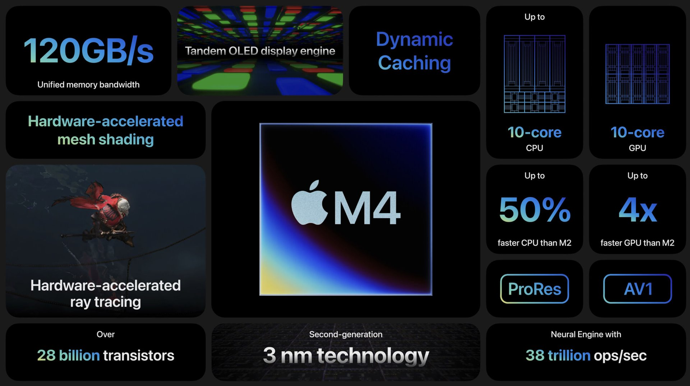
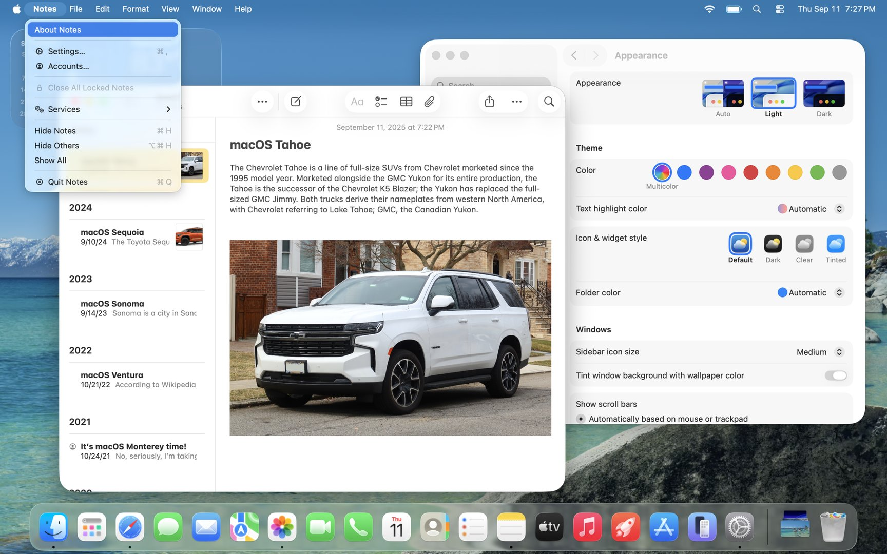
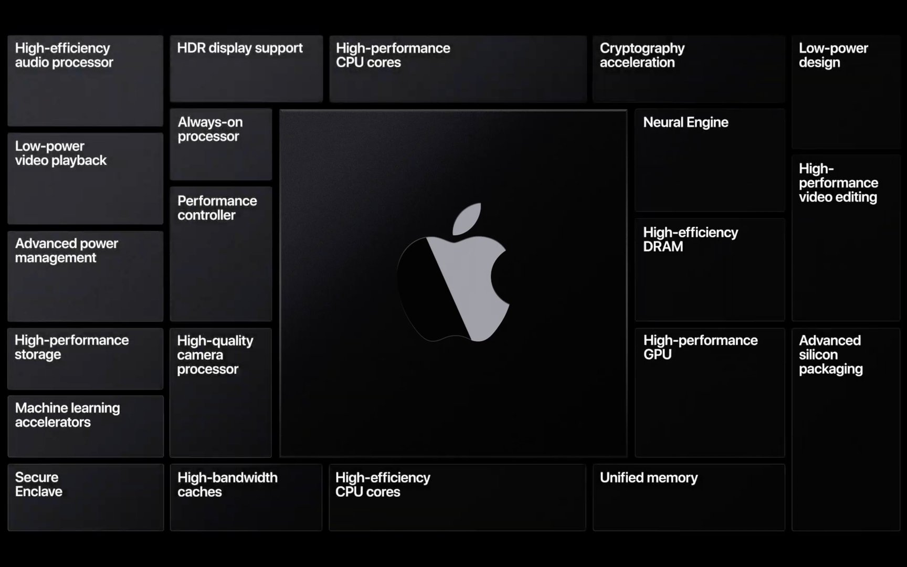

# Lesson 01: Installation, Orientation, and Alignment
**Student Learning Guide**

## Lesson Objectives

* **History and Philosophy** - Evolution from OS X to macOS, the updated Mac lineup for enterprise, and the transition to Apple Silicon.
* **Out-of-Box Experience (OOBE)** - Deep dive into the Setup Assistant.
* **The System, Innovation, and Accessibility** - Navigation, Multi-Touch gestures, the Continuity ecosystem, Apple Intelligence overview, Screen Mirroring, and Accessibility (Videos: Universal Control, Continuity Camera, and "The Greatest").
* **Enterprise Flavor** - What happens when the Remote Management (MDM / ADE) screen interrupts the setup process.

## Overview

<!-- Captivate NotebookLM Podcast -->

<iframe style="width: 100%; height: 200px;" frameborder="no" scrolling="no" allow="clipboard-write" seamless src="https://player.captivate.fm/episode/128517f1-2471-4e85-a0f5-7611f6c30dcb/"></iframe>

## Key Concepts

* **Apple Silicon:** The modern architecture of Mac computers based on Apple's in-house development (M-Series processors with ARM architecture), delivering unprecedented performance-per-watt.
* **System on a Chip (SoC):** A silicon design that integrates the central processing unit (CPU), graphics processing unit (GPU), memory, and security enclaves onto a single chip.
* **Unified Memory:** An innovative architecture in Apple Silicon that integrates both system memory (RAM) and video memory (VRAM) directly onto the chip package. This allows all SoC components to access the same memory pool without copying data back and forth. It eliminates bottlenecks, improves performance, and saves power, but at the cost of non-upgradability (memory is soldered). [Further reading by Howard Oakley](https://eclecticlight.co/2026/06/20/explainer-memory/)
* **Secure Enclave:** An isolated hardware subsystem within the SoC responsible for cryptographic operations, managing encryption keys, and verifying biometric data (Touch ID).
* **Rosetta 2:** A transparent translation environment built into macOS that allows applications written for Intel processors (x86) to run on Apple Silicon Macs. The translation is mostly done Ahead of Time.
* **Setup Assistant:** The initial process that runs when booting a new Mac or after an EACS (Erase All Content and Settings). It handles network configuration, region selection, creating a Local Account, and more.
* **Automated Device Enrollment (ADE):** A deployment and management technology (formerly DEP) that allows organizations to automatically enroll Mac computers into MDM (Zero-Touch Deployment) upon first connecting to the internet, replacing the consumer Setup Assistant with a Remote Management screen.
* **Continuity:** A suite of technologies that allows seamless workflows across Apple devices (e.g., Universal Control, Handoff, Continuity Camera). Mostly relies on Bluetooth proximity detection and Peer-to-Peer Wi-Fi.
* **Apple Intelligence:** An artificial intelligence system integrated into macOS that utilizes the Neural Engine in Apple Silicon to process language models locally, with a strong emphasis on privacy.
* **Background Process:** A system process running in the background without a visible user window, often stored as a LaunchAgent or LaunchDaemon.

## Relevant Commands & Paths

| Path / Command | Description |
| :--- | :--- |
| `uname -m` | Terminal command that returns `arm64` if the Mac is running Apple Silicon, or `x86_64` for Intel processors. |
| `system_profiler SPHardwareDataType` | Command that provides a full hardware overview of the Mac, including core count and memory size. |
| `Setup Assistant` | A one-way initial setup process for configuring system settings and user creation (full resets and Volume Ownership are covered in Lessons 4 and 14). |
| `sudo profiles show -type enrollment` | Command that returns the device's organizational enrollment status (whether it has an active ADE enrollment via Apple Business Manager). |
| `log show --predicate 'process == "Setup Assistant"' --info` | A query to extract specific logs generated by the Out-of-Box setup process. |

## Recommended Links and Further Reading

* [Automated Device Enrollment](https://support.apple.com/guide/deployment/dep24b435f66/web) - Official Apple Deployment guide for Automated Device Enrollment (ADE / ABM).
* [Boot process for a Mac with Apple silicon](https://support.apple.com/guide/security/secc7b34e5b5/web) - Official Apple Security document detailing the boot chain of Apple Silicon processors.
* [Apple Intelligence Overview](https://support.apple.com/apple-intelligence) - Technical overview of AI features and security architecture in macOS.
* [Explainer: Memory](https://eclecticlight.co/2026/06/20/explainer-memory/) - An in-depth article explaining unified memory management in macOS.

## Summary Video

<!-- YouTube Summary Video -->

    <iframe width="100%" height="450" src="https://www.youtube.com/embed/oYxR-HrD0FU" frameborder="0" allow="accelerometer; autoplay; clipboard-write; encrypted-media; gyroscope; picture-in-picture" allowfullscreen></iframe>

!!! tip "Visual Aid (Student Reference)"
    These images illustrate the interface or mechanisms relevant to this lesson's topic.

!!! tip "Visual Aids (Student Guide)"
    These images illustrate the relevant interface or mechanism for this lesson.

