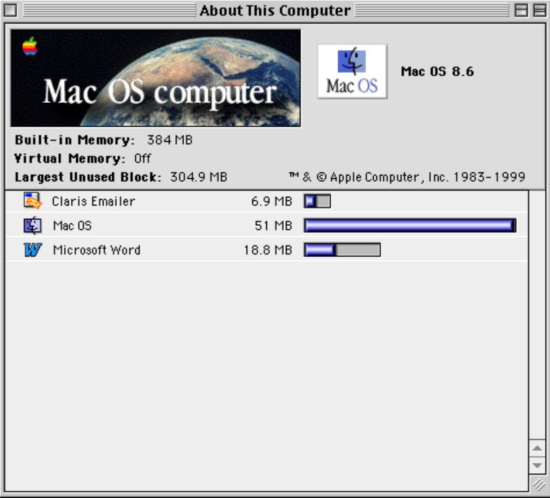
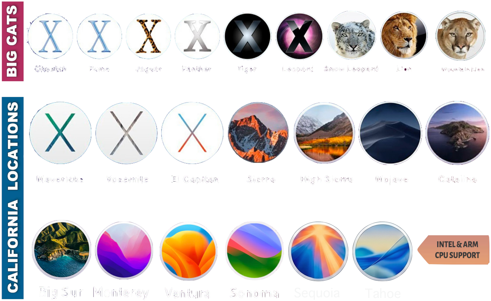
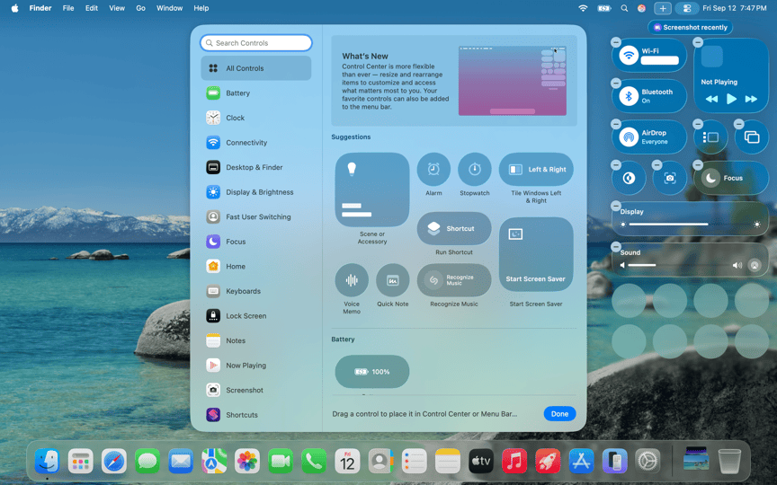
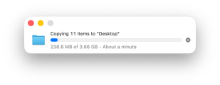
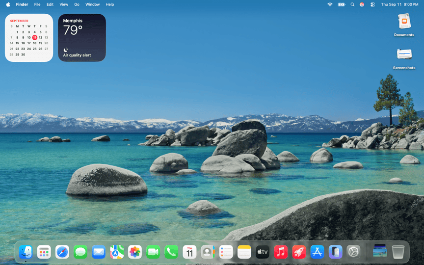
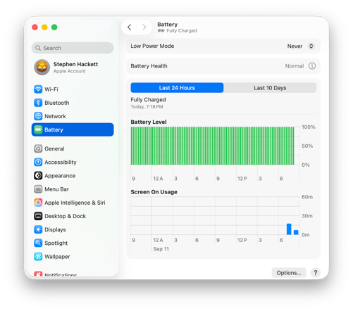
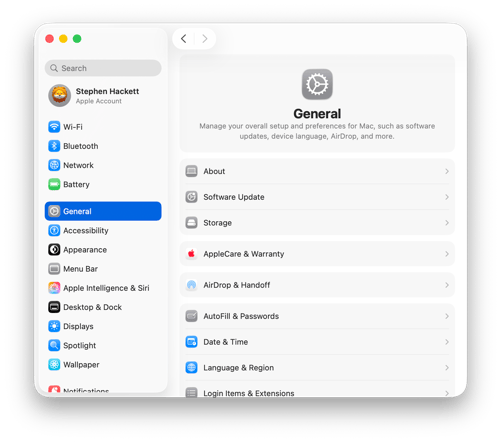

# שיעור 01: התקנה, הכרה ויישור קו
**מדריך עזר לתלמיד**

## מטרות השיעור

* **היסטוריה ופילוסופיה** - אבולוציה מ-OS X ל-macOS, ליין ה-Mac המעודכן לחברות, והמעבר ל-Apple Silicon.
* **חוויית פתיחת הקופסה (OOBE)** - צלילה ל-Setup Assistant.
* **המערכת, חדשנות ונגישות** - ניווט, מחוות Multi-Touch, אקוסיסטם ה-Continuity, סקירת Apple Intelligence, שקוף מסך, ונגישות (סרטונים: Universal Control, Continuity Camera, ו-"The Greatest").
* **תיבול ארגוני** - מה קורה כשמסך ה-Remote Management (MDM / ADE) קוטע את תהליך ההגדרה.

## סקירה

<!-- פודקאסט NotebookLM מתוך Captivate -->

<iframe style="width: 100%; height: 200px;" frameborder="no" scrolling="no" allow="clipboard-write" seamless src="https://player.captivate.fm/episode/332582b3-c603-4af5-a4a2-81be768b38a6/"></iframe>

## מושגי מפתח (Key Concepts)

* **Apple Silicon:** הארכיטקטורה המודרנית של מחשבי ה-Mac המבוססת על פיתוח פנימי של אפל (מעבדי M-Series בתצורת ARM), המספקת יחס ביצועים לצריכת חשמל חסר תקדים.
* **System on a Chip (SoC):** תכנון סיליקון שמאגד את המעבד הראשי (CPU), המעבד הגרפי (GPU), זיכרון, ומנגנוני אבטחה לשבב בודד.
* **Unified Memory:** זיכרון מאוחד. ארכיטקטורה חדשנית ב-Apple Silicon המשלבת את הזיכרון הראשי (RAM) וזיכרון המסך (VRAM) אל תוך תושבת השבב עצמה. הדבר מאפשר לכל רכיבי ה-SoC לגשת לאותו מאגר זיכרון ללא צורך בהעתקת נתונים הלוך ושוב. הארכיטקטורה מבטלת צווארי בקבוק, משפרת ביצועים וחוסכת חשמל, אך במחיר של חוסר יכולת לשדרג את הזיכרון לאחר הרכישה (הזיכרון מולחם). [לקריאה נוספת מאת Howard Oakley](https://eclecticlight.co/2026/06/20/explainer-memory/)
* **Secure Enclave:** תת-מערכת חומרתית מבודדת בתוך ה-SoC האחראית על פעולות קריפטוגרפיות, שמירת מפתחות הצפנה ואימות נתונים ביומטריים (Touch ID).
* **Rosetta 2:** סביבת תרגום שקופה המובנית ב-macOS המאפשרת לאפליקציות שנכתבו עבור מעבדי Intel (x86) לרוץ על מחשבי Apple Silicon. התרגום מבוצע לרוב מראש (Ahead of Time).
* **Setup Assistant:** התהליך הראשוני שמתבצע בהפעלת מק חדש או אחרי EACS. אחראי על הגדרות רשת, אזור, יצירת Local Account, ועוד.
* **Automated Device Enrollment (ADE):** טכנולוגיית פריסה וניהול (לשעבר DEP) המאפשרת לארגונים לחבר מחשבי Mac ל-MDM באופן אוטומטי (Zero-Touch Deployment) מרגע החיבור הראשון לרשת, ולהחליף את ה-Setup Assistant הצרכני במסך Remote Management.
* **Continuity:** אוסף טכנולוגיות המאפשרות רצף עבודה בין מכשירי אפל (כמו Universal Control, Handoff, Continuity Camera). עובד לרוב על בסיס זיהוי קרבה ב-Bluetooth ותקשורת Peer-to-Peer Wi-Fi.
* **Apple Intelligence:** מערכת בינה מלאכותית המובנית ב-macOS המנצלת את ה-Neural Engine שב-Apple Silicon לעיבוד מודלי שפה באופן מקומי, מתוך דגש על פרטיות.
* **Background Process:** תהליך מערכת שרץ ברקע ללא חלון משתמש גלוי, לעיתים קרובות מאוחסן כ-LaunchAgent או LaunchDaemon.

## פקודות ונתיבים רלוונטיים (Commands & Paths)

| נתיב / פקודה | תיאור |
| :--- | :--- |
| `uname -m` | פקודת טרמינל המחזירה `arm64` אם המחשב מריץ Apple Silicon, או `x86_64` למעבדי Intel. |
| `system_profiler SPHardwareDataType` | פקודה המספקת פירוט חומרה מלא של ה-Mac, כולל מספר הליבות והזיכרון. |
| `/var/db/.AppleSetupDone` | קובץ דגל (Flag). כאשר הוא קיים, מערכת ההפעלה "יודעת" ששלב ה-Setup Assistant הושלם, ומדלגת עליו בהדלקות הבאות. |
| `sudo profiles show -type enrollment` | פקודה המחזירה את סטטוס ההרשמה של המכשיר לארגון (האם קיימת הרשמת ADE דרך Apple Business Manager). |
| `log show --predicate 'process == "Setup Assistant"' --info` | שאילתה לשליפת לוגים ספציפיים מתוך התהליך של פתיחת הקופסה. |

## Recommended Reading & Enrichment Links

* **Apple Platform Deployment - Automated Device Enrollment:**

  [https://support.apple.com/guide/deployment/dep24b435f66/web](https://support.apple.com/guide/deployment/dep24b435f66/web)
* **Apple Platform Security - Boot process for a Mac with Apple silicon:**

  [https://support.apple.com/guide/security/secc7b34e5b5/web](https://support.apple.com/guide/security/secc7b34e5b5/web)
* **Apple Support - Apple Intelligence Overview:**

  [https://support.apple.com/apple-intelligence](https://support.apple.com/apple-intelligence)

## קישורים מומלצים ולקריאה נוספת

* [Explainer: Memory](https://eclecticlight.co/2026/06/20/explainer-memory/) - מאמר עומק המסביר את אופן ניהול הזיכרון במערכת ההפעלה.

## סרטון סיכום

<!-- סרטון סיכום מתוך YouTube -->

    <iframe width="100%" height="450" src="https://www.youtube.com/embed/DDXfEIRgAxs" frameborder="0" allow="accelerometer; autoplay; clipboard-write; encrypted-media; gyroscope; picture-in-picture" allowfullscreen></iframe>

!!! tip "המחשה ויזואלית (עזר לתלמיד)"
    תמונות אלו ממחישות את הממשק או המנגנון הרלוונטי לנושא השיעור.

