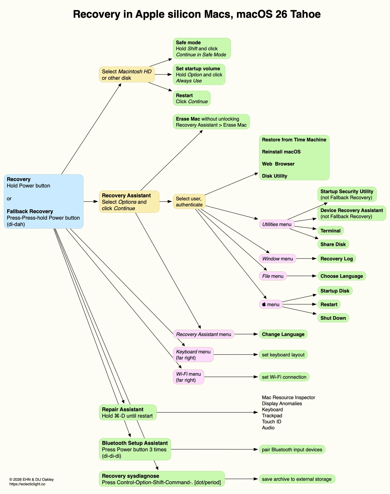
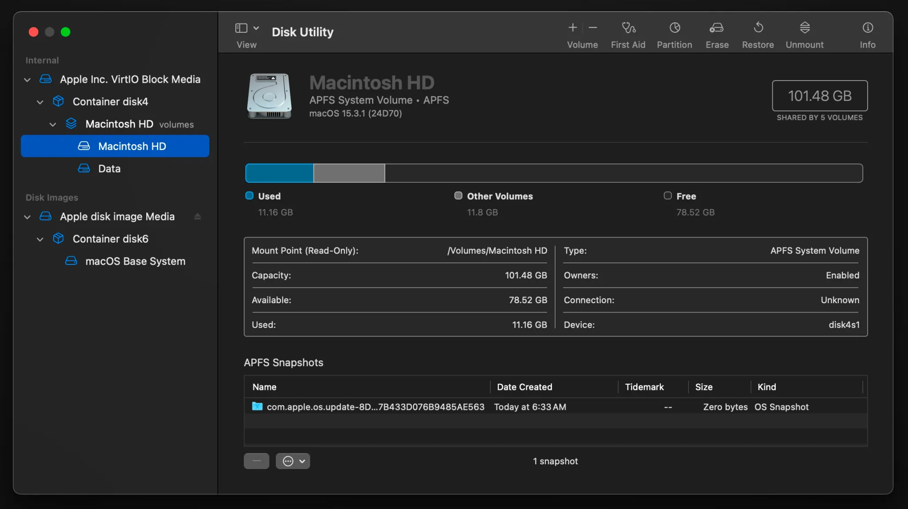

# שיעור 01: יסודות macOS, חוויית משתמש והכנה לארגון
**מדריך עזר (מדריך עזר לתלמיד)**

## נושאי השיעור

* **היסטוריה ופילוסופיה** - אבולוציה מ-OS X ל-macOS, ליין ה-Mac המעודכן לחברות, והמעבר ל-Apple Silicon.
* **חוויית פתיחת הקופסה (OOBE)** - צלילה ל-Setup Assistant.
* **המערכת, חדשנות ונגישות** - ניווט, מחוות Multi-Touch, אקוסיסטם ה-Continuity, סקירת Apple Intelligence, שקוף מסך, ונגישות (סרטונים: Universal Control, Continuity Camera, ו-"The Greatest").
* **תיבול ארגוני** - מה קורה כשמסך ה-Remote Management (MDM / ADE) קוטע את תהליך ההגדרה.

## סקירה

<!-- פודקאסט NotebookLM מתוך Captivate -->

<iframe style="width: 100%; height: 200px;" frameborder="no" scrolling="no" allow="clipboard-write" seamless src="https://player.captivate.fm/episode/332582b3-c603-4af5-a4a2-81be768b38a6/"></iframe>

## מושגי מפתח (Key Concepts)

> **Visual Aid from DeepDive:**
> 

> **Visual Aid from DeepDive:**
> 

* **Apple Silicon:** הארכיטקטורה המודרנית של מחשבי ה-Mac המבוססת על פיתוח פנימי של אפל (מעבדי M-Series בתצורת ARM), המספקת יחס ביצועים לצריכת חשמל חסר תקדים.
* **System on a Chip (SoC):** תכנון סיליקון שמאגד את המעבד הראשי (CPU), המעבד הגרפי (GPU), זיכרון, ומנגנוני אבטחה לשבב בודד.
* **Unified Memory:** זיכרון מאוחד. ארכיטקטורה ב-Apple Silicon המאפשרת לכל רכיבי ה-SoC לגשת לאותו מאגר זיכרון ללא צורך בהעתקת נתונים, מה שמשפר משמעותית ביצועים וחיסכון בחשמל.
* **Secure Enclave:** תת-מערכת חומרתית מבודדת בתוך ה-SoC האחראית על פעולות קריפטוגרפיות, שמירת מפתחות הצפנה ואימות נתונים ביומטריים (Touch ID).
* **Rosetta 2:** סביבת תרגום שקופה המובנית ב-macOS המאפשרת לאפליקציות שנכתבו עבור מעבדי Intel (x86) לרוץ על מחשבי Apple Silicon. התרגום מבוצע לרוב מראש (Ahead of Time).
* **Setup Assistant:** התהליך הראשוני שמתבצע בהפעלת מק חדש או אחרי EACS. אחראי על הגדרות רשת, אזור, יצירת Local Account, ועוד.
* **Automated Device Enrollment (ADE):** טכנולוגיית פריסה וניהול (לשעבר DEP) המאפשרת לארגונים לחבר מחשבי Mac ל-MDM באופן אוטומטי (Zero-Touch Deployment) מרגע החיבור הראשון לרשת, ולהחליף את ה-Setup Assistant הצרכני במסך Remote Management.
* **Continuity:** אוסף טכנולוגיות המאפשרות רצף עבודה בין מכשירי אפל (כמו Universal Control, Handoff, Continuity Camera). עובד לרוב על בסיס זיהוי קרבה ב-Bluetooth ותקשורת Peer-to-Peer Wi-Fi.
* **Apple Intelligence:** מערכת בינה מלאכותית המובנית ב-macOS המנצלת את ה-Neural Engine שב-Apple Silicon לעיבוד מודלי שפה באופן מקומי, מתוך דגש על פרטיות.
* **Background Process:** תהליך מערכת שרץ ברקע ללא חלון משתמש גלוי, לעיתים קרובות מאוחסן כ-LaunchAgent או LaunchDaemon.

## פקודות ונתיבים רלוונטיים (Commands & Paths)

| נתיב / פקודה | תיאור |
| :--- | :--- |
| `uname -m` | פקודת טרמינל המחזירה `arm64` אם המחשב מריץ Apple Silicon, או `x86_64` למעבדי Intel. |
| `system_profiler SPHardwareDataType` | פקודה המספקת פירוט חומרה מלא של ה-Mac, כולל מספר הליבות והזיכרון. |
| `/var/db/.AppleSetupDone` | קובץ דגל (Flag). כאשר הוא קיים, מערכת ההפעלה "יודעת" ששלב ה-Setup Assistant הושלם, ומדלגת עליו בהדלקות הבאות. |
| `sudo profiles show -type enrollment` | פקודה המחזירה את סטטוס ההרשמה של המכשיר לארגון (האם קיימת הרשמת ADE דרך Apple Business Manager). |
| `log show --predicate 'process == "Setup Assistant"' --info` | שאילתה לשליפת לוגים ספציפיים מתוך התהליך של פתיחת הקופסה. |

## Recommended Reading & Enrichment Links

* **Apple Platform Deployment - Automated Device Enrollment:**

  [https://support.apple.com/guide/deployment/dep24b435f66/web](https://support.apple.com/guide/deployment/dep24b435f66/web)
* **Apple Platform Security - Boot process for a Mac with Apple silicon:**

  [https://support.apple.com/guide/security/secc7b34e5b5/web](https://support.apple.com/guide/security/secc7b34e5b5/web)
* **Apple Support - Apple Intelligence Overview:**

  [https://support.apple.com/apple-intelligence](https://support.apple.com/apple-intelligence)

## סרטון סיכום

<!-- סרטון סיכום מתוך YouTube -->

    <iframe width="100%" height="450" src="https://www.youtube.com/embed/DDXfEIRgAxs" frameborder="0" allow="accelerometer; autoplay; clipboard-write; encrypted-media; gyroscope; picture-in-picture" allowfullscreen></iframe>

