# שיעור 01: התקנה, הכרה ויישור קו
**מדריך עזר לתלמיד**

---

## מטרות השיעור

* **היסטוריה ופילוסופיה** - אבולוציה מ-OS X ל-macOS, ליין ה-Mac המעודכן לחברות, והמעבר ל-Apple Silicon (כולל ציון כי macOS 26 Tahoe היא הגרסה האחרונה שתומכת באינטל).
* **חוויית פתיחת הקופסה (OOBE)** - צלילה ל-Setup Assistant.
* **המערכת, חדשנות ונגישות** - ניווט, מחוות Multi-Touch, אקוסיסטם ה-Continuity, סקירת Apple Intelligence (ב-Tahoe 26), שקוף מסך, ונגישות (סרטונים: Universal Control, Continuity Camera, ו-"The Greatest").
* **תיבול ארגוני** - מה קורה כשמסך ה-Remote Management (MDM / ADE) קוטע את תהליך ההגדרה.

---

## 🎧 האזנה לסיכום — לפני או אחרי השיעור

<!-- פודקאסט NotebookLM מתוך Captivate -->

<iframe style="width: 100%; height: 200px;" frameborder="no" scrolling="no" allow="clipboard-write" seamless src="https://player.captivate.fm/episode/128517f1-2471-4e85-a0f5-7611f6c30dcb/"></iframe>

---

## מושגי מפתח (Key Concepts)

* **מעבדי Apple Silicon:** הארכיטקטורה המודרנית של מחשבי ה-Mac המבוססת על פיתוח פנימי של אפל (מעבדי M-Series בתצורת ARM), המספקת יחס ביצועים לצריכת חשמל חסר תקדים.
* **System on a Chip (SoC):** תכנון סיליקון שמאגד את המעבד הראשי (CPU), המעבד הגרפי (GPU), זיכרון, ומנגנוני אבטחה לשבב בודד.
* **זיכרון מאוחד (Unified Memory):** זיכרון מאוחד. ארכיטקטורה חדשנית ב-Apple Silicon המשלבת את הזיכרון הראשי (RAM) וזיכרון המסך (VRAM) אל תוך תושבת השבב עצמה. הדבר מאפשר לכל רכיבי ה-SoC לגשת לאותו מאגר זיכרון ללא צורך בהעתקת נתונים הלוך ושוב. הארכיטקטורה מבטלת צווארי בקבוק, משפרת ביצועים וחוסכת חשמל, אך במחיר של חוסר יכולת לשדרג את הזיכרון לאחר הרכישה (הזיכרון מולחם). [לקריאה נוספת מאת Howard Oakley](https://eclecticlight.co/2026/06/20/explainer-memory/)
* **Secure Enclave:** תת-מערכת חומרתית מבודדת בתוך ה-SoC האחראית על פעולות קריפטוגרפיות, שמירת מפתחות הצפנה ואימות נתונים ביומטריים (Touch ID).
* **Rosetta 2:** סביבת תרגום שקופה המובנית ב-macOS המאפשרת לאפליקציות שנכתבו עבור מעבדי Intel (x86) לרוץ על מחשבי Apple Silicon. התרגום מבוצע לרוב מראש (Ahead of Time).
* **אשף ההגדרות (Setup Assistant):** התהליך הראשוני שמתבצע בהפעלת מק חדש או אחרי EACS. אחראי על הגדרות רשת, אזור, יצירת Local Account, ועוד. ב-macOS 26 Tahoe תהליך זה גם מוריד מאובטחת את מודלי השפה של Apple Intelligence.
* **Automated Device Enrollment (ADE):** טכנולוגיית פריסה וניהול (לשעבר DEP) המאפשרת לארגונים לחבר מחשבי Mac ל-MDM באופן אוטומטי (Zero-Touch Deployment) מרגע החיבור הראשון לרשת, ולהחליף את ה-Setup Assistant הצרכני במסך Remote Management.
* **Continuity:** אוסף טכנולוגיות המאפשרות רצף עבודה בין מכשירי אפל (כמו Universal Control, Handoff, Continuity Camera). עובד לרוב על בסיס זיהוי קרבה ב-Bluetooth ותקשורת Peer-to-Peer Wi-Fi.
* **Apple Intelligence:** מערכת בינה מלאכותית המובנית ב-macOS 26 Tahoe המנצלת את ה-Neural Engine שב-Apple Silicon לעיבוד מודלי שפה באופן מקומי, מתוך דגש על פרטיות. משתמשת ב-Private Cloud Compute עבור משימות מורכבות.

!!! tip "Pro Tip: הגדרות שפה, אזור ובינה מלאכותית בישראל"
    כדי ש-Apple Intelligence יעבוד כשורה, חובה לוודא ששפת המערכת (Primary Language) תואמת בדיוק לשפה של Siri (למשל English US). חוסר התאמה יוביל לכך שחלק מתכונות ה-AI יושבתו. אם בחרתם להשתמש בממשק אנגלי כדי לקבל את תכונות ה-AI, קחו בחשבון שהכתבה קולית (Dictation) ל-Siri בעברית תהיה בעייתית בשל התנגשות זו. בנוסף, אם ברשותכם מספר שפות מקלדת, כדאי לשקול ביטול מעבר שפות דרך מקש הגלובוס (🌐) כדי למנוע מצבים נדירים של הקלדת סיסמה שגויה במסך ההתחברות עקב פריסת מקלדת לא נכונה.

* **Liquid Glass:** שפת העיצוב החדשה שהוצגה ב-macOS 26 Tahoe, המדגישה שקיפות, עומק, ואסתטיקה מודרנית ומשתקפת המנצלת את העוצמה הגרפית של מעבדי M-series.
* **Background Process:** תהליך מערכת שרץ ברקע ללא חלון משתמש גלוי, לעיתים קרובות מאוחסן כ-LaunchAgent או LaunchDaemon.

---

## פקודות ונתיבים רלוונטיים (Commands & Paths)

!!! note "שימוש בטרמינל (שורת הפקודה)"
    מופיעות כאן פקודות טרמינל שאנו מדגימים בשיעור הראשון. אין צורך לזכור את התחביר שלהן בעל פה כעת! ניתן פשוט לבצע העתק-הדבק במעבדה כדי לקבל את התוצאה. הלימוד המעמיק של הטרמינל יתבצע באופן מסודר בשיעור 08, ולאחר מכן נלמד על מערכת הלוגים בשיעור 16. בינתיים, השתמשו בזה ככלי בדיקה מהיר בלבד.

| נתיב / פקודה | תיאור |
| :--- | :--- |
| `uname -m` | פקודת טרמינל המחזירה `arm64` אם המחשב מריץ Apple Silicon, או `x86_64` למעבדי Intel. |
| `system_profiler SPHardwareDataType` | פקודה המספקת פירוט חומרה מלא של ה-Mac, כולל מספר הליבות והזיכרון. |
| `sysctl -n machdep.cpu.brand_string` | פקודה לשליפה מהירה של השם השיווקי של המעבד במחשב. |
| `Setup Assistant (אשף ההגדרה)` | תהליך חד-כיווני בהפעלה הראשונית המנחה את המשתמש בהגדרת המערכת ויצירת החשבון (איפוס מלא ובעלות על הכונן יורחבו בשיעורים 4 ו-14). |
| `sudo profiles show -type enrollment` | פקודה המחזירה את סטטוס ההרשמה של המכשיר לארגון (האם קיימת הרשמת ADE דרך Apple Business Manager). |
| `log show --predicate 'process == "Setup Assistant"' --info` | שאילתה לשליפת לוגים ספציפיים מתוך התהליך של פתיחת הקופסה. |

---

## קישורים מומלצים ולקריאה נוספת

* [Automated Device Enrollment](https://support.apple.com/guide/deployment/dep24b435f66/web) - מדריך פריסה רשמי של אפל לרישום אוטומטי של מכשירים בארגון (ADE / ABM).
* [Boot process for a Mac with Apple silicon](https://support.apple.com/guide/security/secc7b34e5b5/web) - מסמך אבטחה רשמי המפרט את תהליך האתחול של מעבדי Apple Silicon.
* [Apple Intelligence Overview](https://support.apple.com/apple-intelligence) - סקירת היכולות והאבטחה של תכונות ה-AI ב-macOS.
* [Explainer: Memory](https://eclecticlight.co/2026/06/20/explainer-memory/) - מאמר עומק המסביר את אופן ניהול הזיכרון במערכת ההפעלה.

---

## 🎬 סרטון סיכום

<!-- סרטון סיכום מתוך YouTube -->

    <iframe width="100%" height="450" src="https://www.youtube.com/embed/oYxR-HrD0FU" frameborder="0" allow="accelerometer; autoplay; clipboard-write; encrypted-media; gyroscope; picture-in-picture" allowfullscreen></iframe>

---

## עזרים ויזואליים

!!! tip "המחשה ויזואלית (עזר לתלמיד)"
    תמונות אלו ממחישות את הממשק או המנגנון הרלוונטי לנושא השיעור.

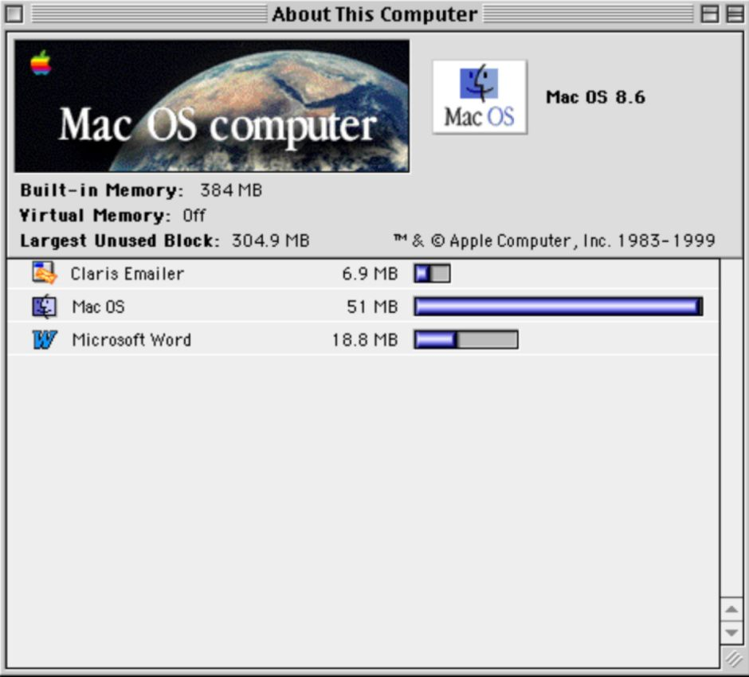
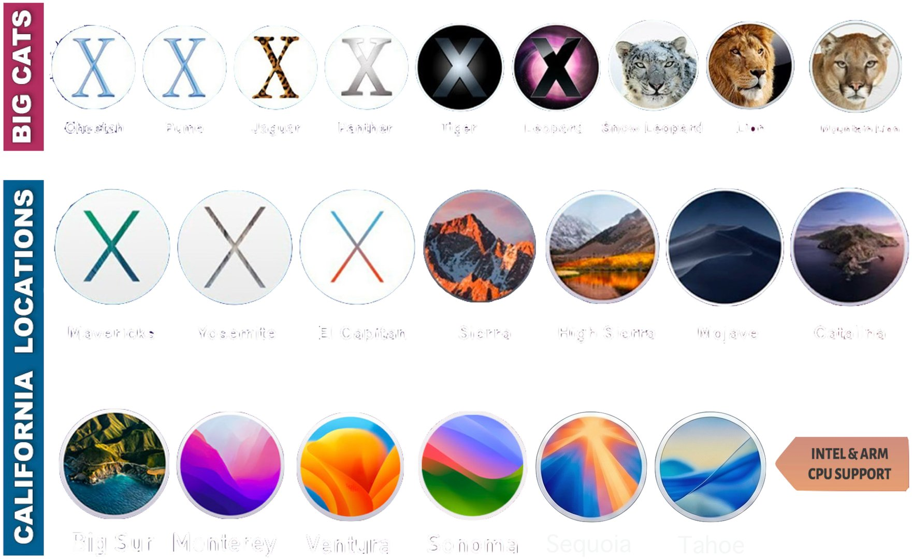
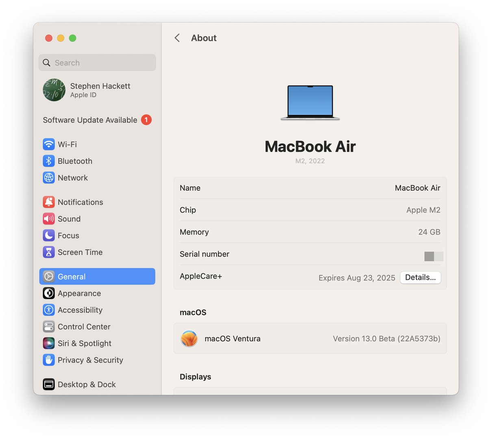

---

## 💡 עזרים ויזואליים להרצאה (Presentation Visuals)

!!! tip "המחשה ויזואלית (עזר לתלמיד)"
    תמונות אלו ממחישות את הממשק או המנגנון הרלוונטי לנושא השיעור.

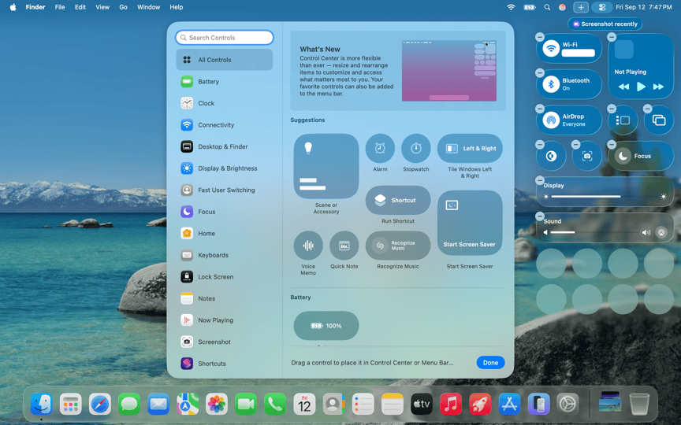
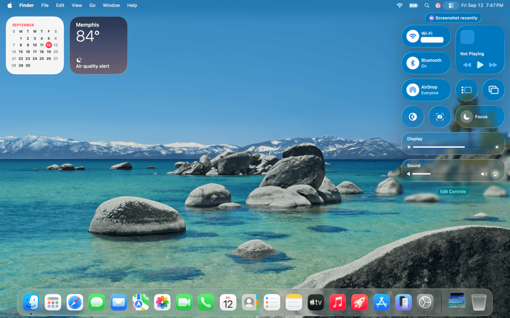
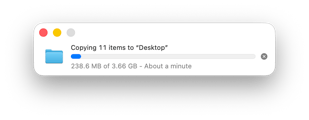
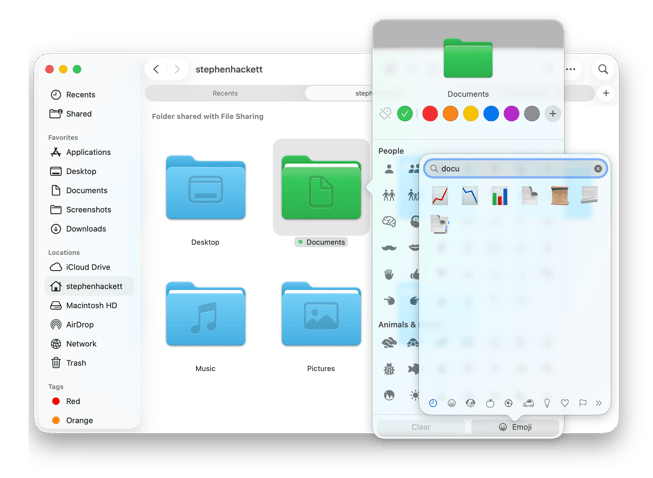
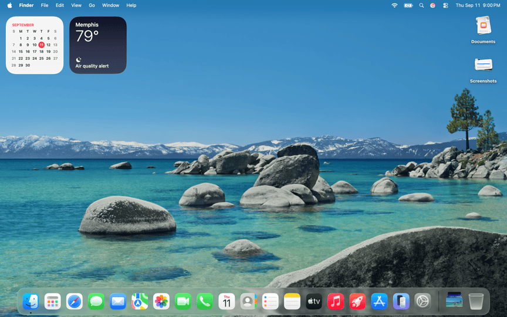
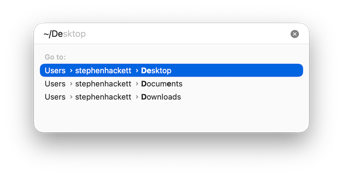
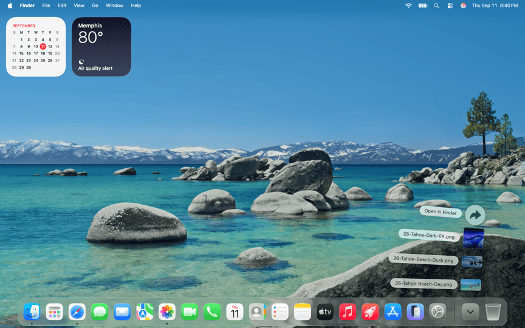
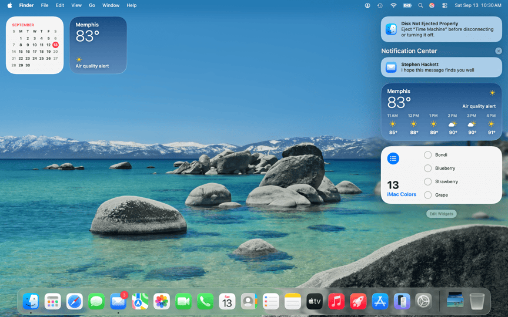
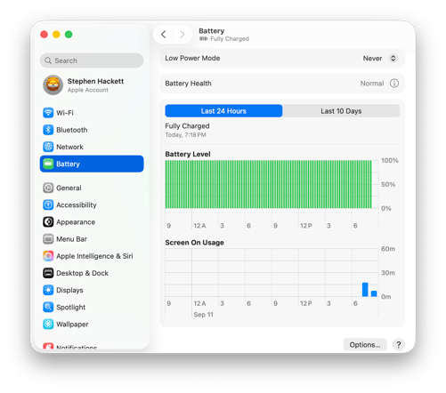
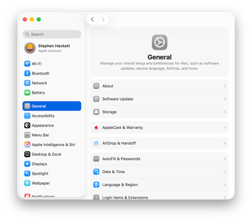

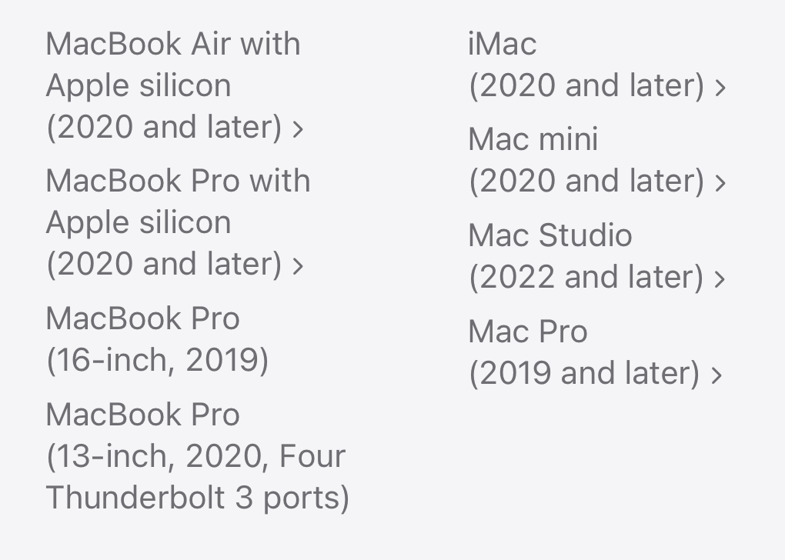
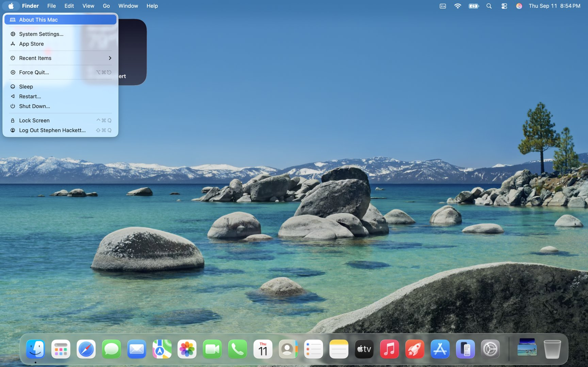
