# שיעור 02: ניהול משתמשים ואבטחת נתונים
**מדריך עזר לתלמיד**

## מטרות השיעור

* **משתמשים ותיקיות** - סוגי חשבונות מקומיים, היררכיית ה-Home Folder ותיקיית Shared.
* **ניהול סודות** - אבולוציית הסיסמאות, Keychain, ואפליקציית Passwords החדשה.
* **העידן ללא סיסמה ואבטחה** - מבוא ל-Passkeys והרשאות קבצים (POSIX/ACL). מעבדה: יצירת Passkey באתר https://webauthn.io/.
* **תיבול ארגוני** - עבודה עם Managed Apple Accounts (MAID) ושילוב Platform SSO לכניסה שקופה בארגון.

## סקירה

<!-- פודקאסט NotebookLM מתוך Captivate -->

<iframe style="width: 100%; height: 200px;" frameborder="no" scrolling="no" allow="clipboard-write" seamless src="https://player.captivate.fm/episode/332582b3-c603-4af5-a4a2-81be768b38a6/"></iframe>

## מושגי מפתח (Terminology)

* **Administrator:** משתמש מנהל המערכת, בעל הרשאות גלובליות לשנות הגדרות ולהתקין תוכנות לכולם.
* **Standard User:** משתמש רגיל, מוגבל לתיקיית הבית שלו (`~`) ולמרחב האישי שלו.
* **Guest User:** משתמש אורח, מוחק את כל תוכן התיקיה שלו בניתוק.
* **Sharing Only:** משתמש נטול תיקיית בית שנועד אך ורק להזדהות מול שיתופי רשת.
* **Home Folder (`/Users/username`):** תיקיית הבית המבודדת של המשתמש. מוגנת בהרשאות קריאה למשתמש בלבד.
* **Shared Folder (`/Users/Shared`):** אזור מפורז ציבורי. מוגן באמצעות Sticky Bit.
* **Sticky Bit:** דגל הרשאה המונע ממשתמשים למחוק קבצים השייכים למשתמשים אחרים באותה תיקיה (כמו בתיקיית Shared).
* **Keychain:** תשתית מחזיק המפתחות של macOS, מורכבת מ-Login Keychain (אישי) ו-System Keychain (מערכתי).
* **Passwords app:** האפליקציה המרכזית ב-macOS 15 לניהול סיסמאות, Passkeys, ואימות דו-שלבי.
* **Passkey (מפתח גישה):** תקן הזדהות (FIDO2) ללא סיסמה. עובד באמצעות צמד מפתחות קריפטוגרפי ומאומת מקומית ב-Secure Enclave.
* **היסטוריית ה-Keychain:** הושק ב-1993, ה-API המודרני נכתב ב-2002, והסנכרון לענן (Data Protection) הצטרף ב-2013 מ-iOS ל-Mac.
* **היסטוריית ה-Secure Enclave:** מנגנון בידוד הנתונים הוקם ב-2013 למכשירי אייפון, ונחת במחשבי ה-Mac עם שבב ה-T2 בשנת 2017.
* **POSIX:** מודל ההרשאות הסטנדרטי של UNIX (Owner, Group, Everyone).
* **ACL (Access Control List):** שכבת הרשאות מתקדמת וגרגולרית המתווספת מעל POSIX.
* **Managed Apple Account (MAID):** חשבון Apple בבעלות הארגון, המגביל שירותים מסוימים (כמו רכישות או iCloud Mail) ומאפשר אימות מול הארגון.
* **Platform SSO:** תשתית ב-macOS המאפשרת התחברות למחשב המקומי (Login Window) ישירות מול שרת זהויות ענן (IdP) כדוגמת Entra ID, ללא צורך ב-Active Directory ישן.
* **Federated Authentication:** מצב בו הזנת אימייל ארגוני מעבירה את המשתמש להזדהות מול שרת החברה, מבלי לדרוש סיסמת Apple חדשה.

## פקודות שימושיות (CLI Commands)
| פקודה | תיאור |
|---|---|
| `dscl . -list /Users` | הצגת רשימת כלל המשתמשים במערכת (לוקאליים) |
| `dscl . -read /Users/username` | קריאת מאפיינים נרחבים של משתמש ספציפי |
| `ls -la /Users` | הצגת הרשאות קבצים, כולל זיהוי ה-Sticky Bit (`t`) |
| `ls -le /path` | הצגת הרשאות קבצים, כולל תצוגת רשומות ACL (המסומנות ב-`+`) |
| `security list-keychains` | הצגת רשימת מחיזיקי המפתחות הפעילים כעת |
| `applesso` | אבחון מצב שירות ה-Platform SSO בארגון (בסביבה נתמכת) |
| `log show --predicate 'subsystem == "com.apple.PlatformSSO"'` | חיפוש שגיאות התחברות מול שרתי SSO בלוגים |

## Recommended Reading & Enrichment Links

* **Apple Platform Support: Intro to user account types**
  [https://support.apple.com/guide/platform-support/sup72e8c67c3/web](https://support.apple.com/guide/platform-support/sup72e8c67c3/web)
* **Apple Platform Deployment: About Managed Apple Accounts**
  [https://support.apple.com/guide/deployment/depdc4ba8d82/web](https://support.apple.com/guide/deployment/depdc4ba8d82/web)
* **The Eclectic Light Company: Explainer: Keychain basics**
  [https://eclecticlight.co/2022/10/15/explainer-keychain-basics/](https://eclecticlight.co/2022/10/15/explainer-keychain-basics/)
* **The Mac Security Blog: Understanding User Accounts in macOS**
  [https://www.intego.com/mac-security-blog/understanding-user-accounts-in-macos/](https://www.intego.com/mac-security-blog/understanding-user-accounts-in-macos/)

## קישורים מומלצים ולקריאה נוספת

## סרטון סיכום

<!-- סרטון סיכום מתוך YouTube -->

    <iframe width="100%" height="450" src="https://www.youtube.com/embed/DDXfEIRgAxs" frameborder="0" allow="accelerometer; autoplay; clipboard-write; encrypted-media; gyroscope; picture-in-picture" allowfullscreen></iframe>

## 💡 עזרים ויזואליים להרצאה (Presentation Visuals)

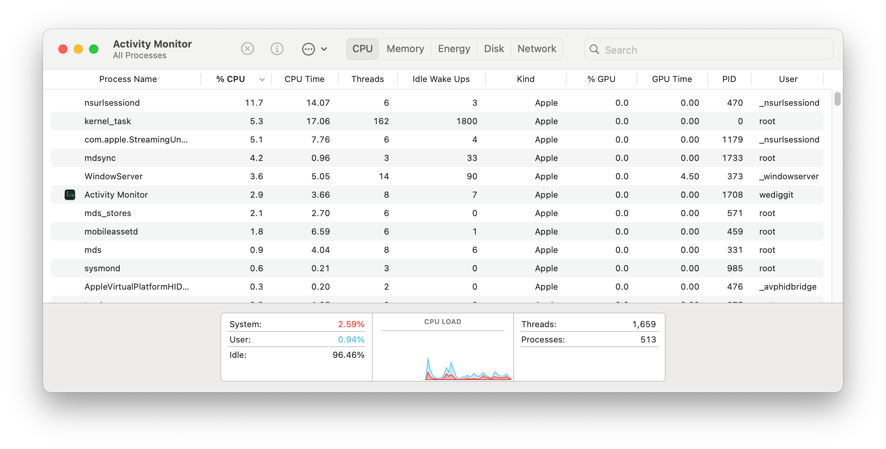
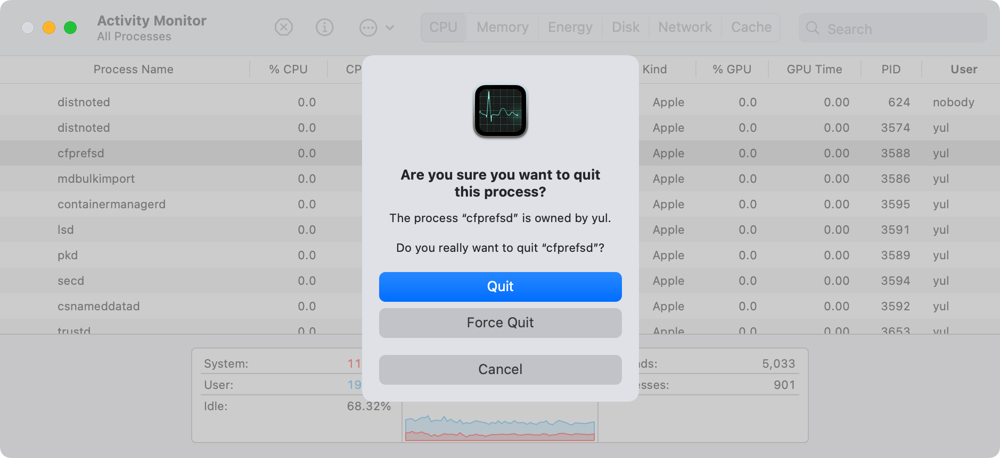
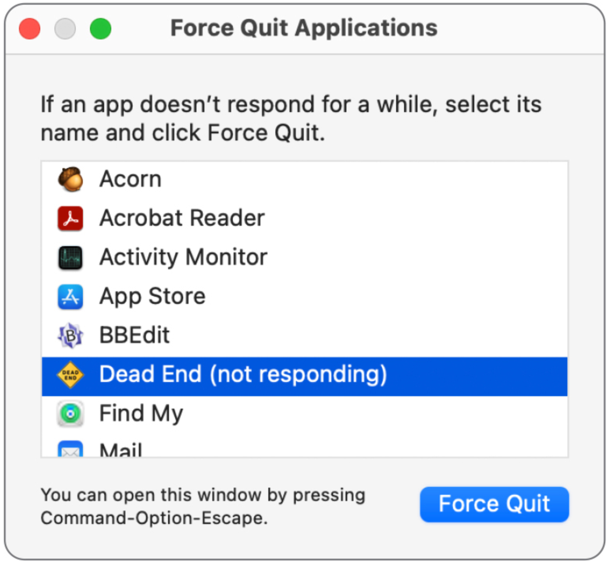
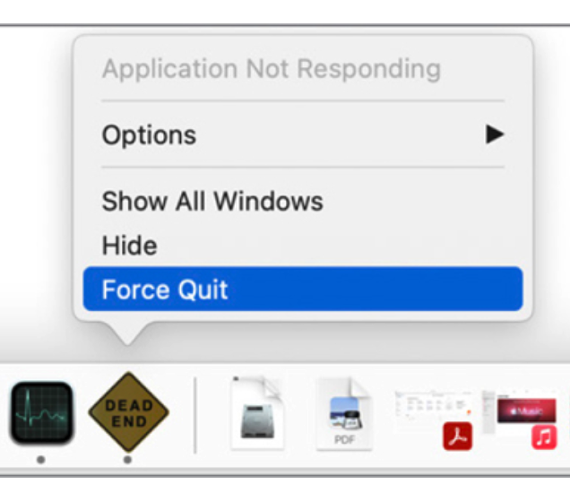
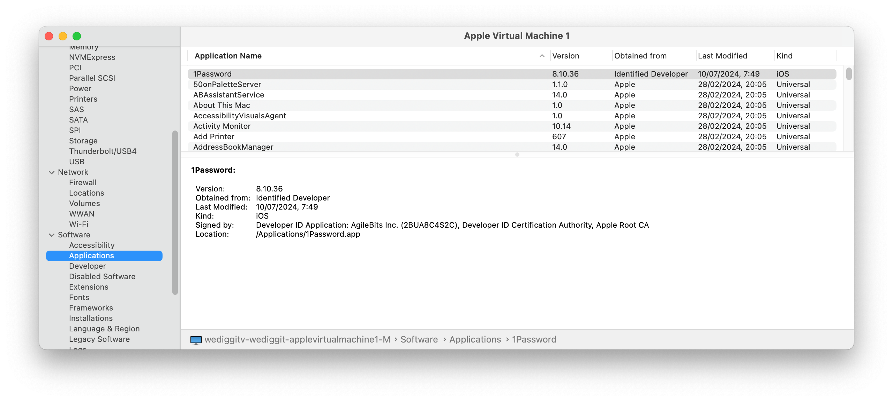
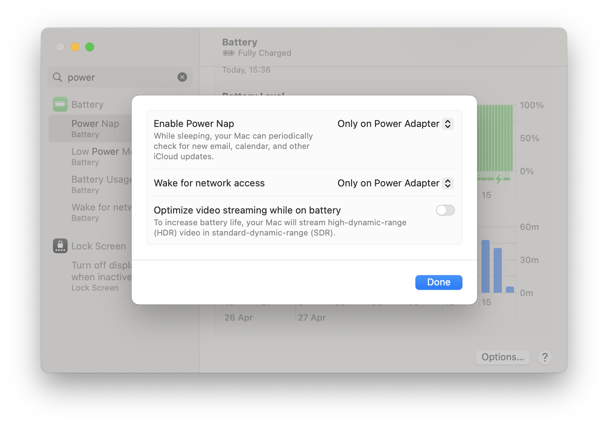
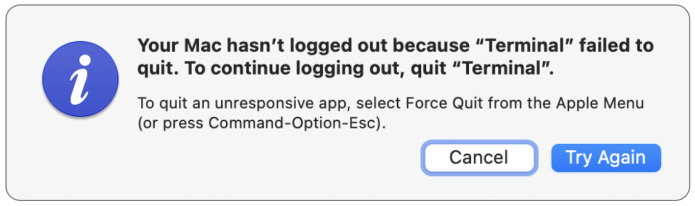
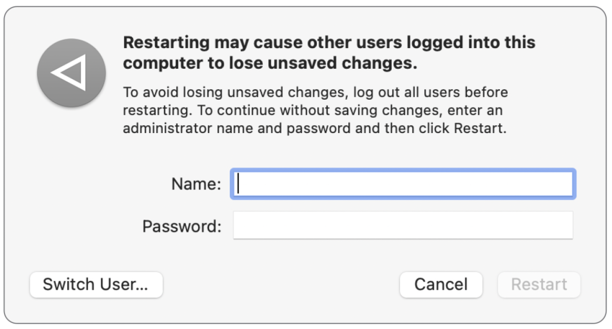
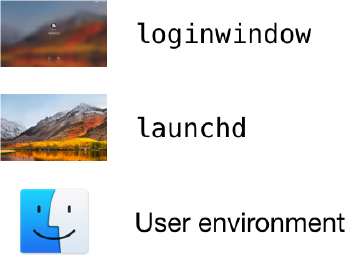

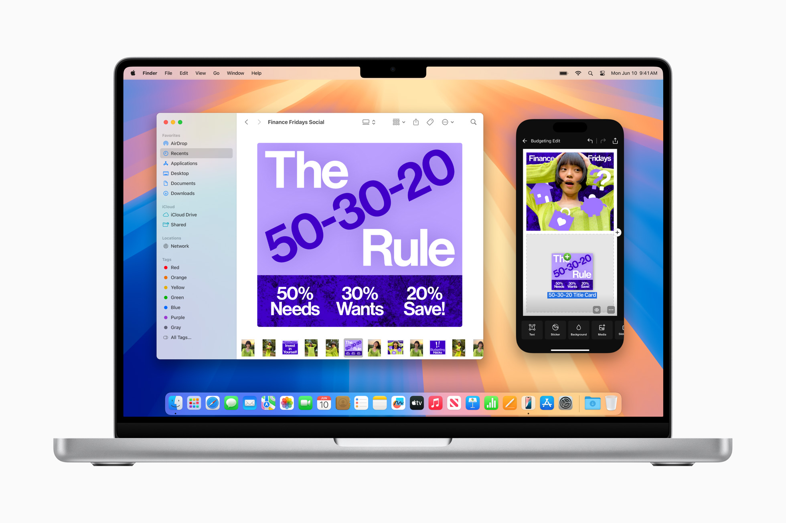

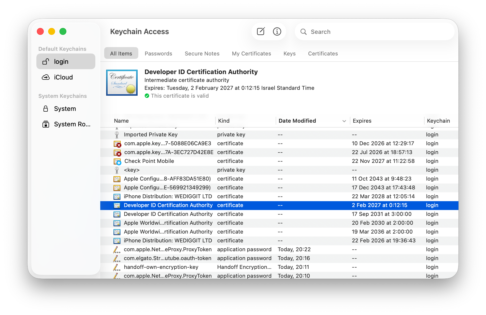
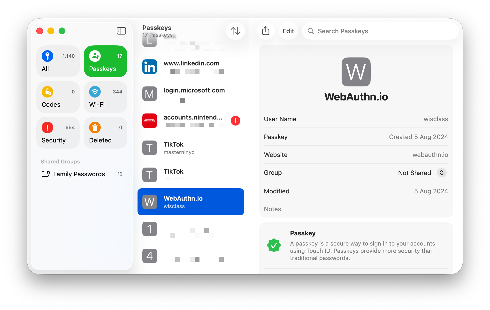
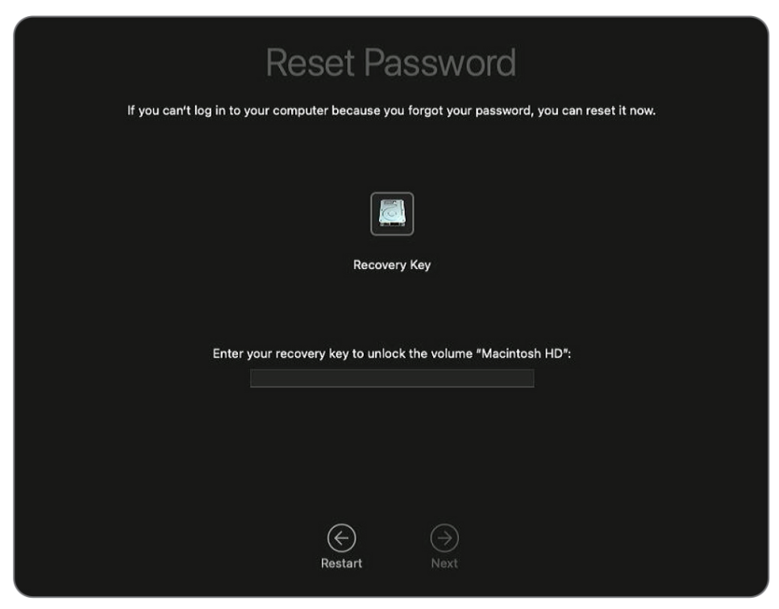
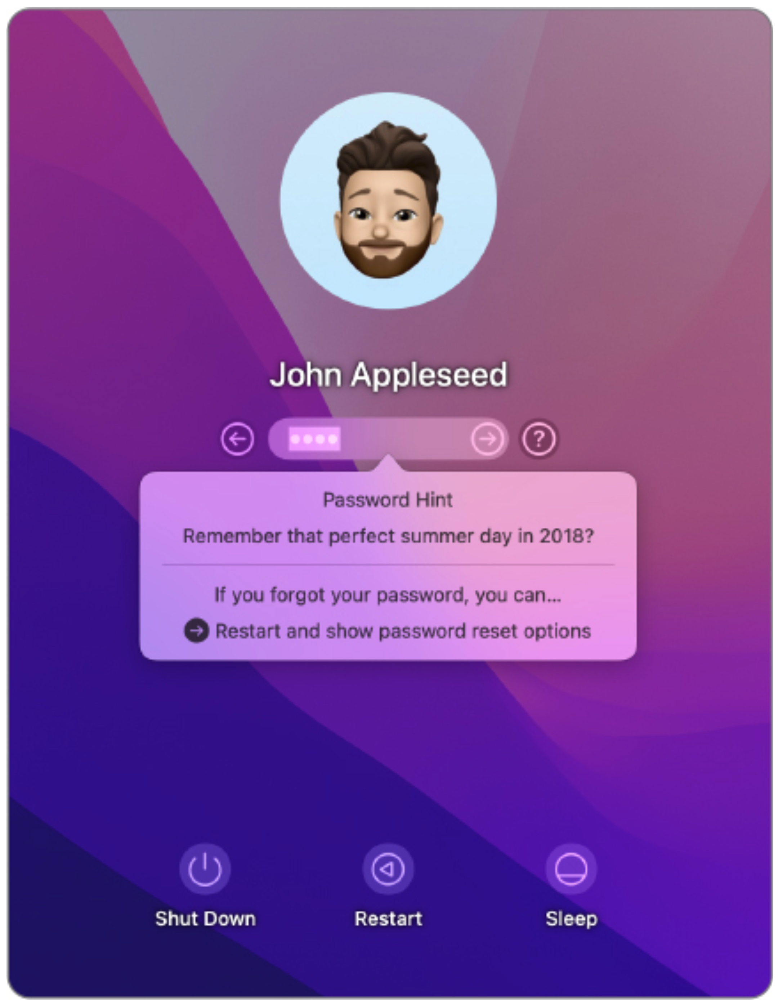

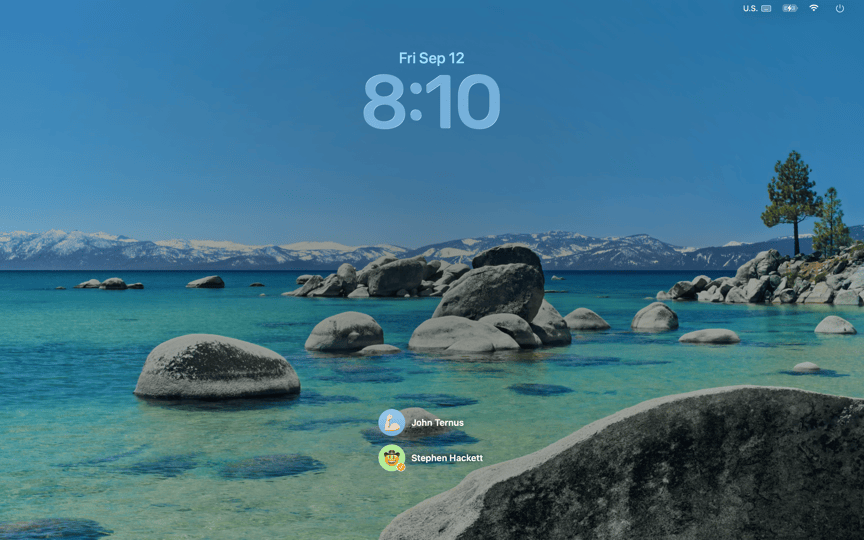
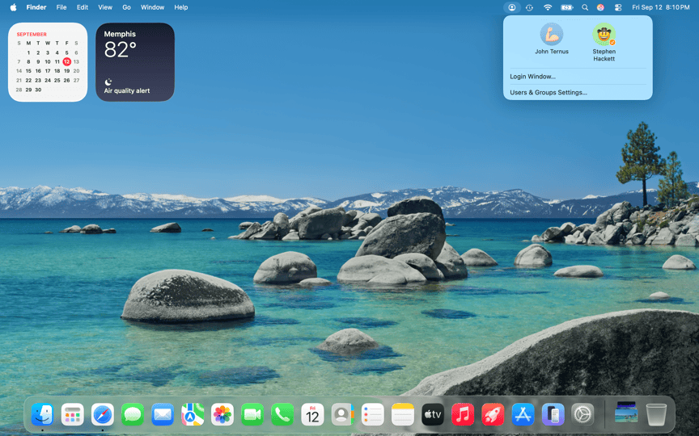
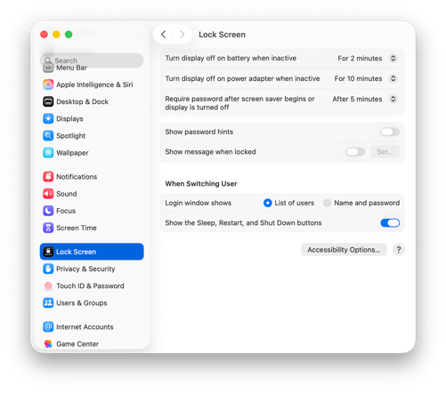
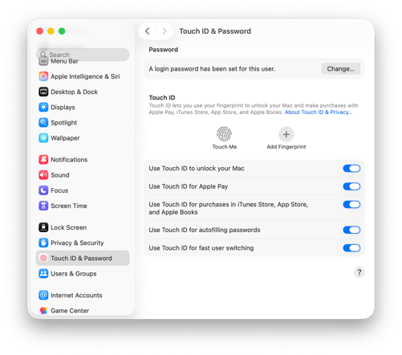
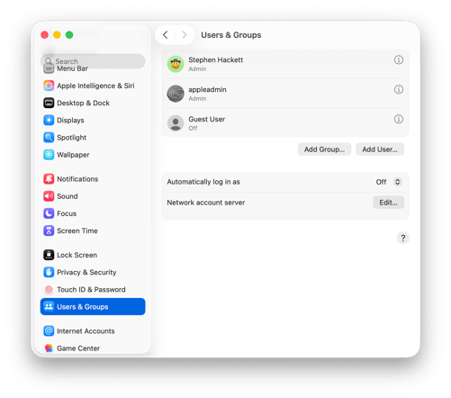

!!! tip "המחשה ויזואלית (עזר לתלמיד)"
    תמונות אלו ממחישות את הממשק או המנגנון הרלוונטי לנושא השיעור.