# שיעור 02: ניהול משתמשים ואבטחת נתונים
**מדריך עזר לתלמיד**

## מטרות השיעור

* **משתמשים ותיקיות** - סוגי חשבונות מקומיים, היררכיית ה-Home Folder ותיקיית Shared.
* **ניהול סודות** - אבולוציית הסיסמאות, Keychain, ואפליקציית Passwords מ-macOS Sequoia ו-Tahoe.
* **העידן ללא סיסמה ואבטחה** - Passkeys והרשאות קבצים (POSIX/ACL), מערכת TCC ו-SIP.
* **תיבול ארגוני** - עבודה עם Managed Apple Accounts (MAID) ושילוב Platform SSO לכניסה שקופה בארגון.

## סקירה

<!-- פודקאסט NotebookLM מתוך Captivate -->

<iframe style="width: 100%; height: 200px;" frameborder="no" scrolling="no" allow="clipboard-write" seamless src="https://player.captivate.fm/episode/4a1fe7a9-1ab4-4499-aada-0e9c8b5d8aec/"></iframe>

## מושגי מפתח (Terminology)

* **מנהל מערכת (Administrator):** משתמש מנהל המערכת, בעל הרשאות גלובליות לשנות הגדרות ולהתקין תוכנות לכולם.
* **משתמש רגיל (Standard) User:** משתמש רגיל, מוגבל לתיקיית הבית שלו (`~`) ולמרחב האישי שלו.
* **Guest User:** משתמש אורח, מוחק את כל תוכן התיקיה שלו בניתוק.
* **Sharing Only:** משתמש נטול תיקיית בית שנועד אך ורק להזדהות מול שיתופי רשת.
* **Home Folder (`/Users/username`):** תיקיית הבית המבודדת של המשתמש.
* **Shared Folder (`/Users/Shared`):** אזור מפורז ציבורי. מוגן באמצעות Sticky Bit.
* **Sticky Bit:** דגל הרשאה המונע ממשתמשים למחוק קבצים השייכים למשתמשים אחרים באותה תיקיה.
* **Keychain:** תשתית מחזיק המפתחות של macOS, מורכבת מ-Login Keychain ו-System Keychain.
* **Passwords app:** האפליקציה המרכזית (מ-macOS 15 ומשופרת ב-macOS 26 Tahoe) לניהול סיסמאות, Passkeys וקודי 2FA.
* **Passkey (מפתח גישה):** תקן הזדהות (FIDO2) ללא סיסמה באמצעות צמד מפתחות קריפטוגרפי ב-Secure Enclave.

!!! info "מודל 5 השלבים להטמעת Passkeys בארגון (Enterprise Passkeys Framework)"
    כאשר ארגון עובר מסיסמאות מסורתיות להזדהות מאובטחת ללא סיסמה (Passkeys), ההטמעה מתבצעת ב-5 שלבים מובנים:
    
    1. **Assessment & Planning (הערכה ותכנון):** מיפוי מערכות ה-IT, דרישות האבטחה והתאימות בארגון.
    2. **Solution Selection (בחירת פתרון):** בחירת מנהל סיסמאות/זהויות (IdP) התומך בתקני FIDO2/WebAuthn.
    3. **Pilot & Testing (פיילוט בדיקות):** ניסוי מבוקר עם קבוצת משתמשי IT ומשתמשי קצה נבחרים.
    4. **Full Deployment (הפצה מלאה):** הרחבת השימוש לכלל עובדי הארגון ודחיפת מדיניות דרך ה-MDM.
    5. **Monitoring & Optimization (ניטור ואופטימיזציה):** סקירת לוגים, ביטול סיסמאות טקסטואליות וצמצום אירועי פישינג.
* **POSIX:** מודל ההרשאות הסטנדרטי של UNIX (Owner, Group, Everyone).
* **ACL (Access Control List):** שכבת הרשאות מתקדמת וגרגולרית המתווספת מעל POSIX.
* **TCC (Transparency, Consent, and Control):** מנגנון פרטיות החוסם גישה של אפליקציות לקבצים אישיים ולחומרה (כמו מצלמה) אלא אם המשתמש נתן אישור מפורש.
* **SIP (System Integrity Protection):** מגן על קבצי ליבה של המערכת מפני שינויים, אפילו עקרונית על ידי ה-root.
* **Managed Apple Account (MAID):** חשבון Apple בבעלות הארגון.
* **Platform SSO:** תשתית ב-macOS המאפשרת התחברות למחשב ישירות מול שרת זהויות ענן (IdP) כדוגמת Entra ID או Okta.
* **Federated Authentication:** מצב בו הזנת אימייל ארגוני מעבירה את המשתמש להזדהות מול שרת החברה, מבלי לדרוש סיסמת Apple.

## פקודות שימושיות (CLI Commands)
| פקודה | תיאור |
|---|---|
| `dscl . -list /Users` | הצגת רשימת כלל המשתמשים במערכת (לוקאליים) |
| `dscl . -read /Users/username` | קריאת מאפיינים נרחבים של משתמש ספציפי |
| `ls -la /Users` | הצגת הרשאות קבצים, כולל זיהוי ה-Sticky Bit (`t`) |
| `ls -le /path` | הצגת הרשאות קבצים, כולל תצוגת רשומות ACL (`+`) |
| `security list-keychains` | הצגת רשימת מחזיקי המפתחות הפעילים כעת |
| `log show --predicate 'subsystem == "com.apple.PlatformSSO"'` | חיפוש שגיאות התחברות מול שרתי SSO בלוגים |

## קישורים מומלצים ולקריאה נוספת

* [Intro to user account types](https://support.apple.com/guide/platform-support/sup72e8c67c3/web) - מדריך תמיכה רשמי של אפל.
* [About Managed Apple Accounts](https://support.apple.com/guide/deployment/depdc4ba8d82/web) - ניהול MAID בארגון.
* [Explainer: Keychain basics](https://eclecticlight.co/2022/10/15/explainer-keychain-basics/) - מאמר עומק על Keychain.

## סרטון סיכום

<!-- סרטון סיכום מתוך YouTube -->

    <iframe width="100%" height="450" src="https://www.youtube.com/embed/S1n1JS-mWTM" frameborder="0" allow="accelerometer; autoplay; clipboard-write; encrypted-media; gyroscope; picture-in-picture" allowfullscreen></iframe>

## 💡 עזרים ויזואליים להרצאה (Presentation Visuals)

> [!NOTE]
> תמונות אלו ניתנות להקרנה בכיתה בעת הסבר על הנושא, או לשילוב במצגות.

!!! tip "המחשה ויזואלית (עזר לתלמיד)"
    תמונות אלו ממחישות את הממשק או המנגנון הרלוונטי לנושא השיעור.

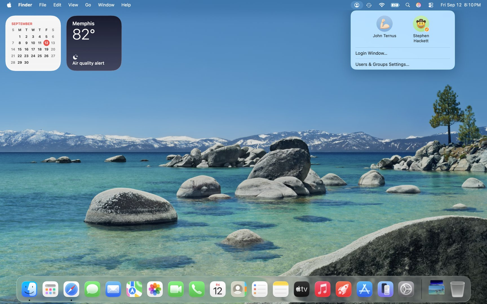
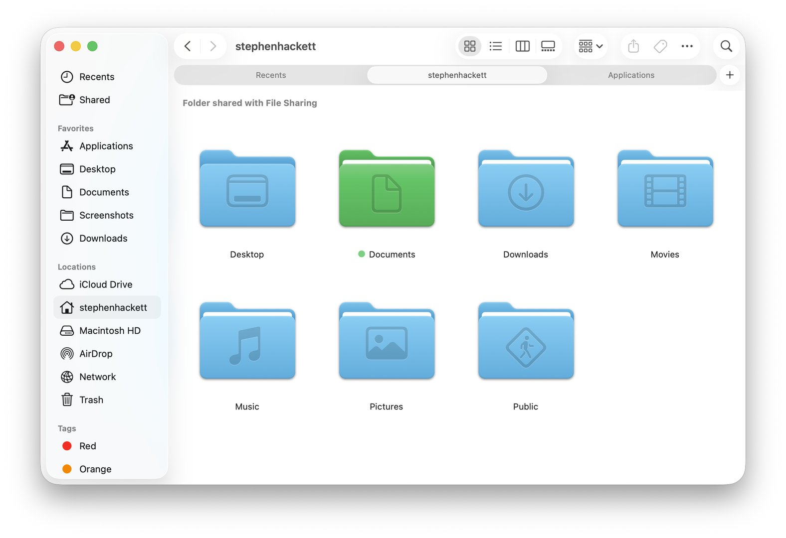
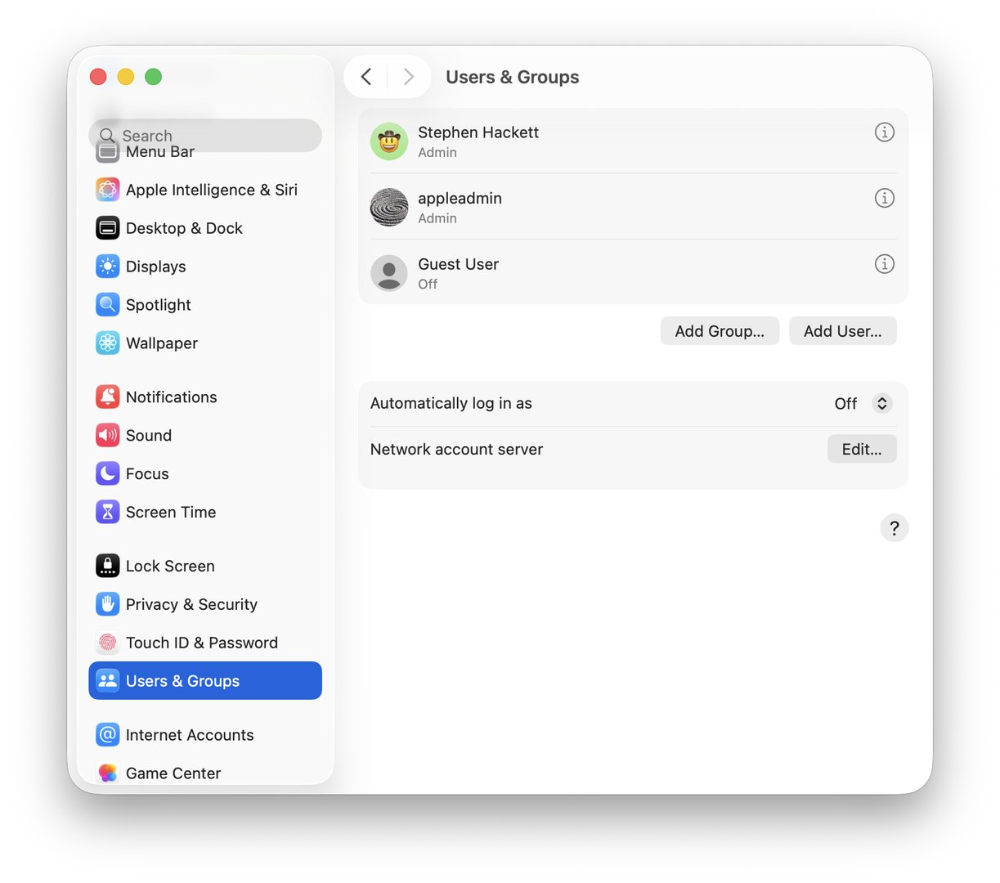
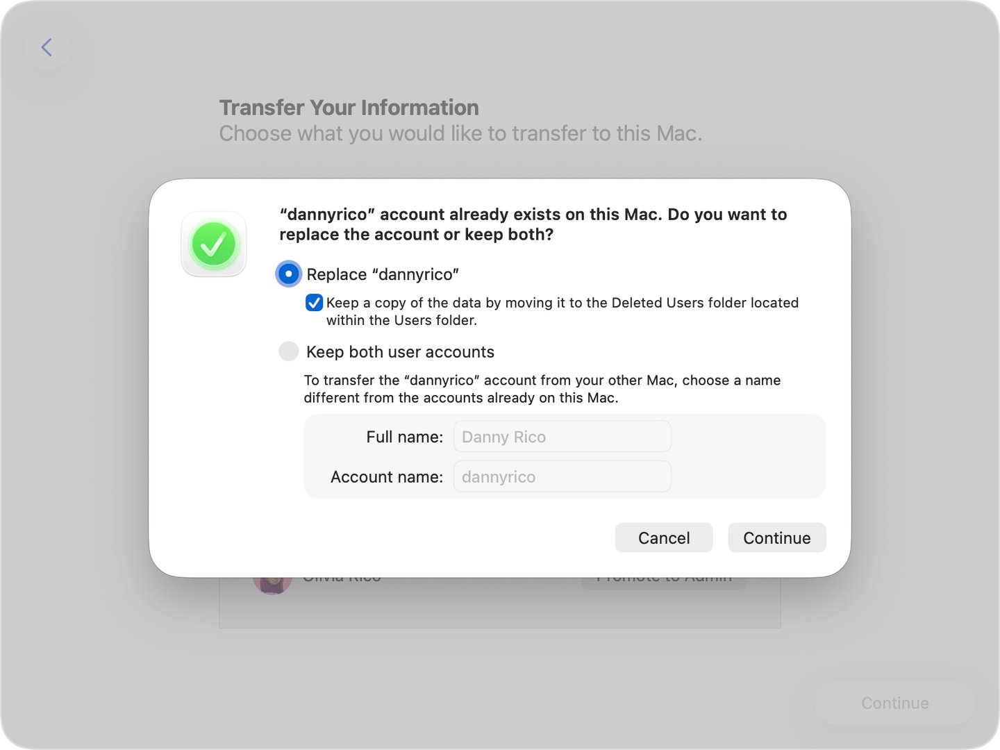
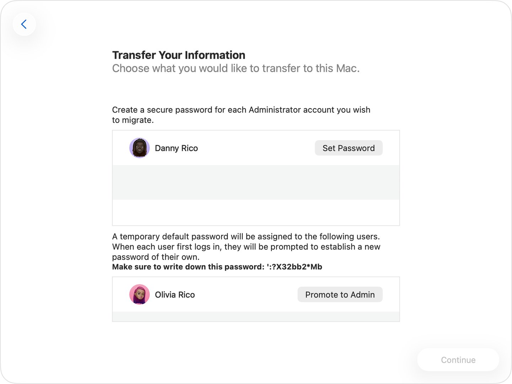
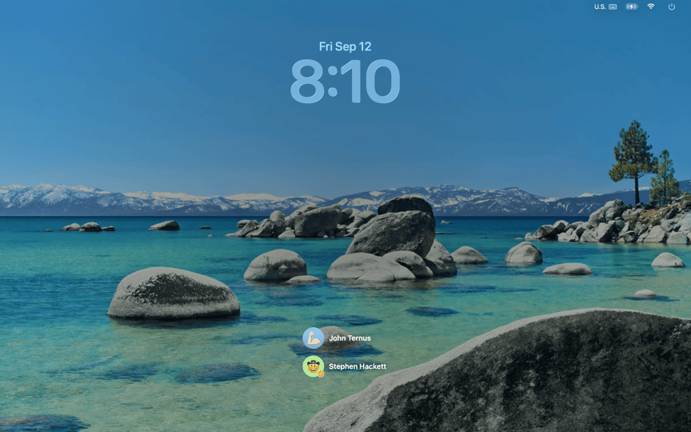
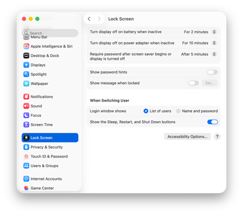
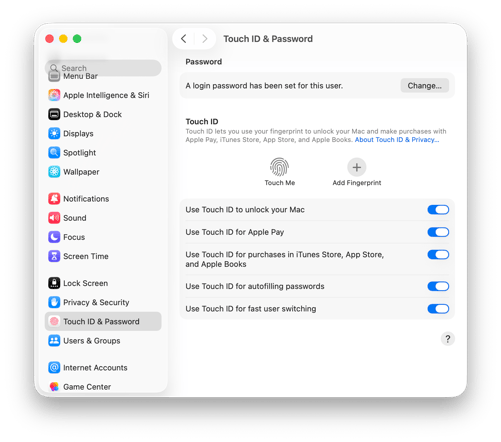
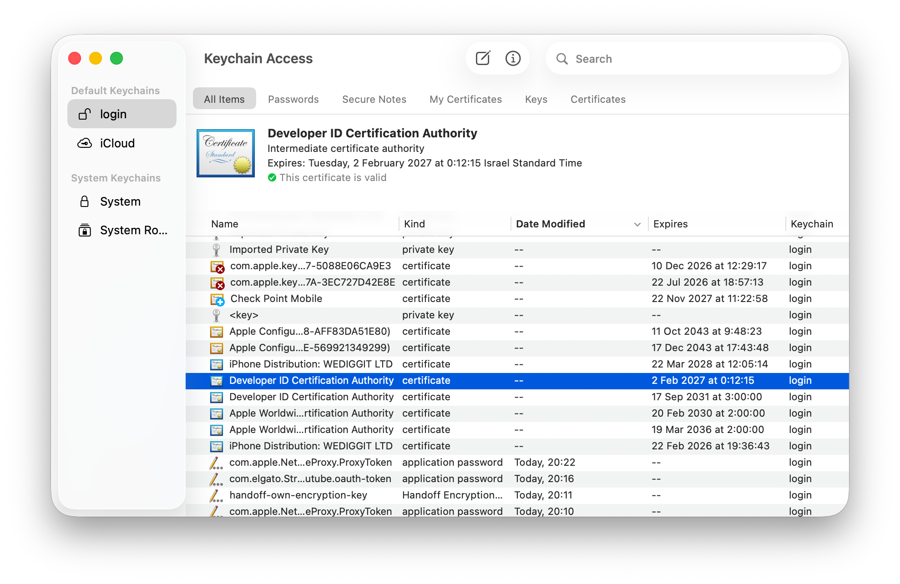
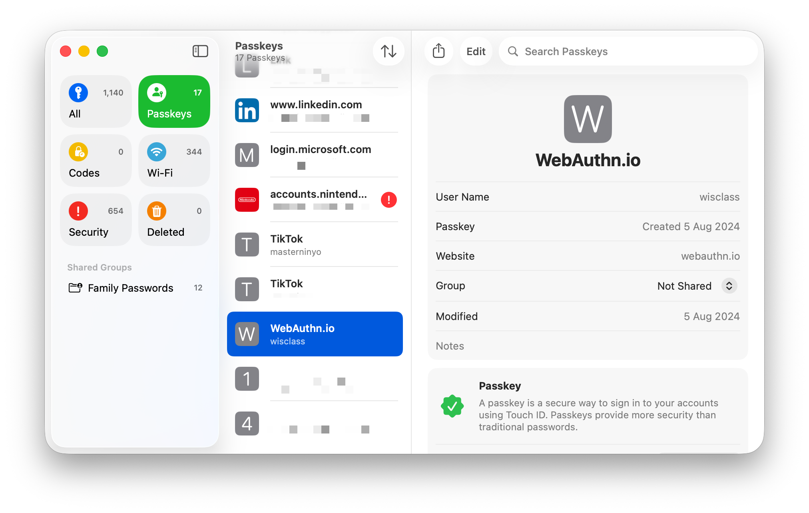
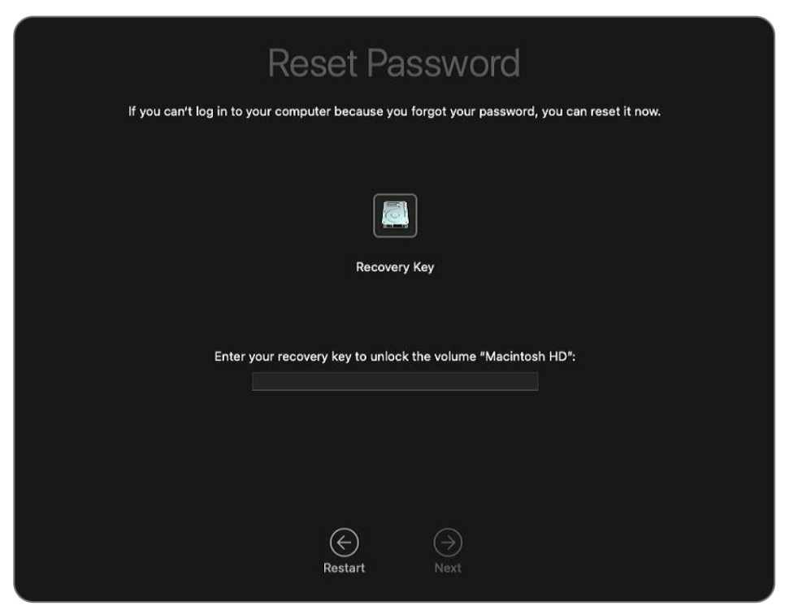
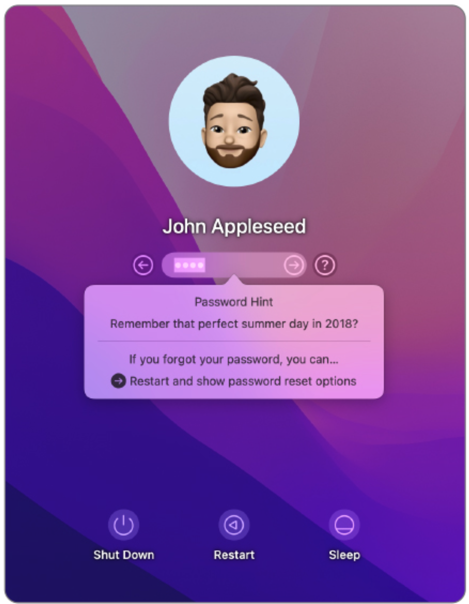
