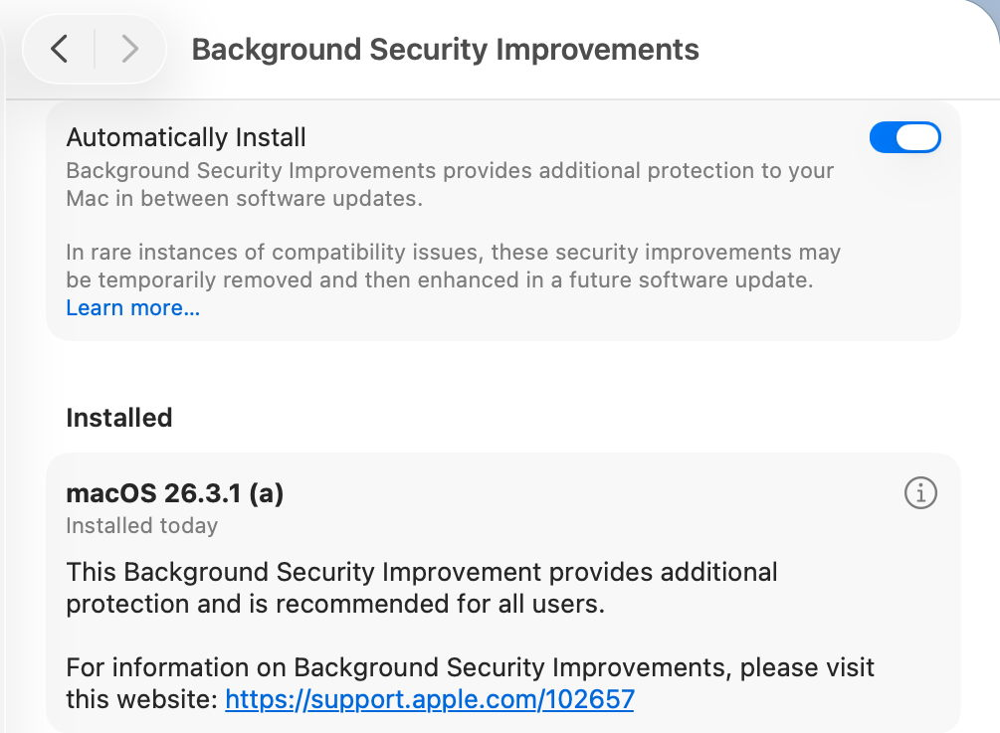
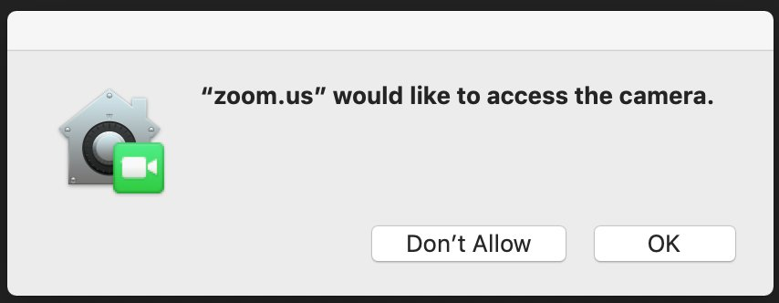
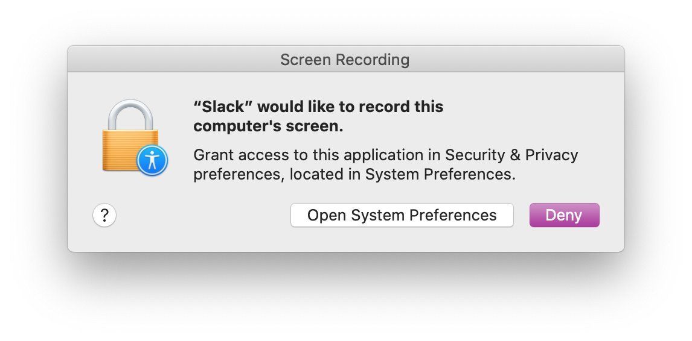

# Lesson 03: Security
**Student Learning Guide**

---

## Objective

* Gatekeeper
* XProtect
* TCC
* PPPC

---

## 🎧 Listen to Summary — Before or After Class

<!-- NotebookLM Podcast from Captivate -->
<div style="width: 100%; height: 200px; margin-bottom: 20px; border-radius: 6px; overflow: hidden;"><iframe style="width: 100%; height: 200px;" frameborder="no" scrolling="no" allow="clipboard-write" seamless src="https://player.captivate.fm/episode/346a4041-217b-46cf-bce2-d08365f74c1f/"></iframe></div>

---

## Core Concepts (Terminology)

* **Gatekeeper:** The macOS security mechanism that ensures only trusted software (from the App Store or identified developers) is allowed to run on the Mac. It verifies the developer signature and Notarization status.
* **Notarization:** An automated Apple process where apps are scanned for known malicious code prior to distribution, before reaching the user. Gatekeeper requires this approval for any software downloaded from the internet.
* **XProtect:** The silent, built-in Anti-Virus system of macOS. It operates in the background, is signature-based (YARA), and blocks the execution of known malware upon the first launch attempt.
* **XProtect Remediator:** An active scanning mechanism that runs in the background (triggered by LaunchDaemons) and performs periodic scans to detect and remediate malware that has already managed to penetrate the system.
* **Transparency, Consent, and Control (TCC):** The macOS privacy framework, requiring the user to actively approve application access requests to sensitive resources (such as the camera, microphone, location, documents folder, or full disk access).
* **Privacy Preferences Policy Control - PPPC:** An organizational Configuration Profile (Payload) deployed by the MDM system. It allows IT administrators to pre-grant (or deny) TCC permissions for applications, thereby preventing users from encountering pop-up prompts that require approval.
* **System Integrity Protection - SIP:** A security feature in macOS that prevents even the root user from modifying sensitive system files, including the TCC databases.
* **Quarantine:** An Extended Attribute attached to files downloaded from the internet by apps like Safari, Mail, or messaging clients. This tag triggers the Gatekeeper check when the file is first opened.

!!! tip "Historical Milestones in macOS Security"
    - **2007 - Code Signing:** First introduced in Leopard, alongside the release of the iPhone.
    - **2012 - Gatekeeper:** Stepped into action to block malicious code execution.
    - **2018 - TCC (Privacy):** Only in Mojave did the system mature, and today it protects dozens of resources (for the first 15 years, privacy was barely managed at the app level).
    - **YARA Rules:** The XProtect engine is based on the YARA language. The name is an inside joke: "YARA: Another Recursive Acronym".

---

## CLI Commands

!!! note "Using the Terminal (Command Line)"
    Advanced Terminal commands for managing security and privacy are provided here. There is no need to memorize their syntax right now! You can simply copy-paste them during the lab (e.g., when resetting Zoom permissions). In-depth Terminal training will be covered comprehensively in Lesson 08.

### Investigating and Managing Gatekeeper (`spctl`)
The `spctl` (SecAssessment system policy security) tool is used to manage and evaluate the Gatekeeper system.

* **Evaluate an App (Check if Gatekeeper approves it to run):**
  ```bash
  spctl -a -vv /Applications/AppName.app
  ```
  *(The `-a` flag performs an Assessment; `-vv` provides verbose output including Notarization info and Developer Identity).*

* **Remove the Quarantine Tag from a file (bypasses the initial execution warning):**
  ```bash
  xattr -d com.apple.quarantine /path/to/AppName.app
  ```

### Investigating and Managing XProtect (`xprotect`)
The `xprotect` tool allows checking and controlling signature updates.

* **Check the currently installed version of XProtect:**
  ```bash
  xprotect version
  ```
* **Force the installation of the latest update from iCloud:**
  ```bash
  sudo xprotect update
  ```

### Managing and Resetting TCC Permissions (`tccutil`)
The `tccutil` tool allows you to reset granted privacy permissions, forcing the system to request them again. You cannot grant permissions through it, only reset them.

* **Reset all TCC permissions for all applications:**
  ```bash
  tccutil reset All
  ```
* **Reset only the Camera permission (for all apps that requested it so far):**
  ```bash
  tccutil reset Camera
  ```
* **Reset the Camera permission for a specific application (e.g., Terminal or Zoom):**
  ```bash
  tccutil reset Camera com.apple.Terminal
  tccutil reset Camera us.zoom.xos
  ```

---

## Critical Paths, Logs, and Databases (Paths & Plists)

### TCC Database Locations
TCC databases are protected by SIP and cannot be edited manually.
* **User Level (Camera, Microphone, Personal Files):** `~/Library/Application Support/com.apple.TCC/TCC.db`
* **System Level (Full Disk Access):** `/Library/Application Support/com.apple.TCC/TCC.db`

### XProtect & Remediator
* **Current location for XProtect updates (starting from Tahoe):** `/var/protected/xprotect/XProtect.bundle`
* **The Application running the Remediator scans:** `/Library/Apple/System/Library/CoreServices/XProtect.app`

### Unified Logging Queries via Terminal

!!! note "The Logging System - Lesson 16"
    The following commands look complex and use the `log show` tool. At this stage, there's no need to understand the Predicates (filtering conditions). Use them strictly for copy-pasting in case of debugging. We will learn how to write advanced log queries in the final lesson of the course!

* **Monitor Gatekeeper activity (investigate app blocks in the last 1h):**
  ```bash
  log show --predicate 'subsystem == "com.apple.syspolicy"' --info --last 1h
  ```
* **Monitor TCC system blocks:**
  ```bash
  log show --predicate 'subsystem == "com.apple.TCC"' --info --last 1h
  ```
* **View XProtect Remediator scan results (was malware detected in the last 24h):**
  ```bash
  log show --predicate 'subsystem == "com.apple.XProtectFramework.PluginAPI"' --info --last 24h
  ```

---

## Recommended Links and Further Reading

* [Gatekeeper and runtime protection in macOS](https://support.apple.com/guide/security/gatekeeper-and-runtime-protection-secbd103561c/web) - In-depth guide on Gatekeeper.
* [Protecting against malware in macOS](https://support.apple.com/guide/security/protecting-against-malware-sec469d47bd8/web) - Apple's overview of XProtect.
* [Control access to your camera on Mac](https://support.apple.com/guide/mac-help/control-access-to-the-camera-mchlf6d108da/mac) - Managing TCC.
* [Safely open apps on your Mac](https://support.apple.com/en-us/HT202491) - App opening warning messages.
* [Privacy Preferences Policy Control payloads](https://support.apple.com/guide/deployment/privacy-preferences-policy-control-payloads-dep38df53c2a/web) - Managing TCC via MDM.

---

## 🎬 Summary Video

<!-- Summary Video from YouTube -->
<div style="margin-bottom: 20px; border-radius: 6px; overflow: hidden; box-shadow: 0 4px 6px rgba(0,0,0,0.1);">
    <iframe width="100%" height="450" src="https://www.youtube.com/embed/D28yJofP3fU" frameborder="0" allow="accelerometer; autoplay; clipboard-write; encrypted-media; gyroscope; picture-in-picture" allowfullscreen></iframe>
</div>

---

## 💡 Presentation Visuals

!!! tip "Visual Demonstration (Student Aid)"
    These images illustrate the relevant interface or mechanism for the lesson topic.







