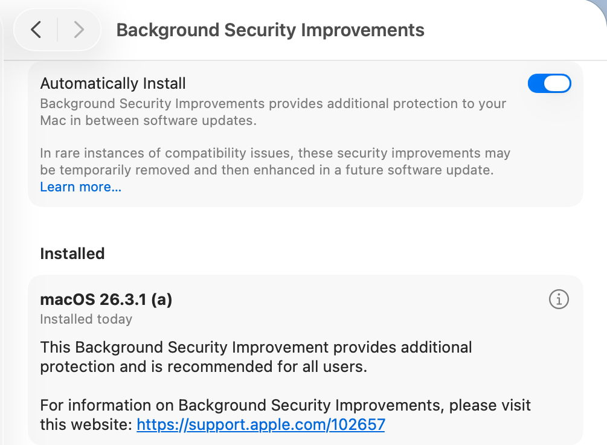
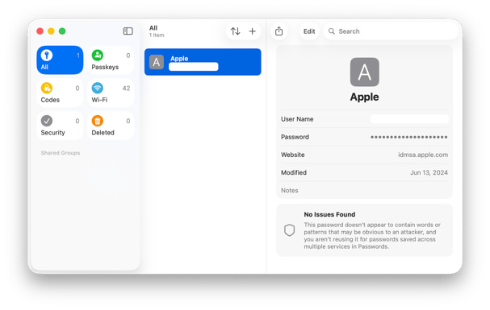
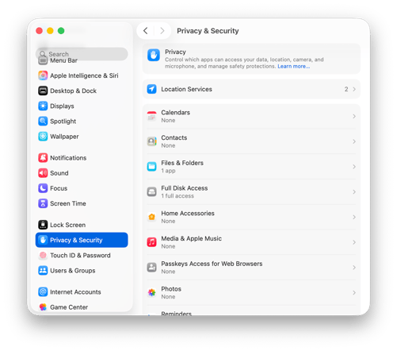

# שיעור 03: אבטחת מידע
**מדריך עזר לתלמיד**


## מטרות השיעור

* Gatekeeper
* XProtect
* TCC
* PPPC
**[Image Recommendation]:** A minimalist vector icon of a lock or shield on a dark background.


## סקירה

<!-- פודקאסט NotebookLM מתוך Captivate -->
<div style="width: 100%; height: 200px; margin-bottom: 20px; border-radius: 6px; overflow: hidden;"><iframe style="width: 100%; height: 200px;" frameborder="no" scrolling="no" allow="clipboard-write" seamless src="https://player.captivate.fm/episode/332582b3-c603-4af5-a4a2-81be768b38a6/"></iframe></div>

## מושגי יסוד (Terminology)

* **Gatekeeper:** מנגנון האבטחה של macOS שמוודא שרק תוכנות ממקור מהימן (App Store או מפתחים מזוהים) מורשות לרוץ על המק. הוא בודק את חתימת המפתח ואת ה-Notarization.
* **Notarization:** תהליך אוטומטי של Apple שבו אפליקציות נסרקות לאיתור קוד זדוני ידוע לפני הפצתן, עוד בטרם הגיעו למשתמש. Gatekeeper דורש אישור זה עבור כל תוכנה המורדת מהאינטרנט.
* **XProtect:** מערכת ה-Anti-Virus השקטה והמובנית של macOS. פועלת ברקע, מבוססת חתימות (YARA) וחוסמת הפעלה של תוכנות זדוניות מוכרות בעת ניסיון ההרצה הראשון.
* **XProtect Remediator:** מנגנון סריקה אקטיבי שרץ ברקע (על ידי LaunchDaemons) ומבצע סריקות תקופתיות לאיתור והסרת נוזקות שכבר הצליחו לחדור למערכת.
* **Transparency, Consent, and Control (TCC):** מנגנון הפרטיות של macOS, הדורש מהמשתמש לאשר באופן אקטיבי בקשות גישה של אפליקציות למשאבים רגישים (כגון מצלמה, מיקרופון, מיקום, תיקיית מסמכים או דיסק מלא).
* **Privacy Preferences Policy Control - PPPC:** Configuration Profile (Payload) ארגוני המופץ על ידי מערכת ה-MDM ומאפשר למנהלי ה-IT להעניק מראש (או למנוע) הרשאות TCC עבור אפליקציות, ובכך למנוע מהמשתמשים לקבל חלוניות קופצות (Pop-ups) הדורשות אישור מנהל.
* **System Integrity Protection - SIP:** מנגנון אבטחה ב-macOS המונע אפילו ממשתמש root לשנות קבצי מערכת רגישים, כולל את מסדי הנתונים של ה-TCC.
* **Quarantine:** תגית (Extended Attribute) המוצמדת לקבצים שהורדו מהאינטרנט על ידי אפליקציות כמו ספארי, דואר או תוכנות מסרים. תגית זו מפעילה את הבדיקה של Gatekeeper עם פתיחת הקובץ.

### אבני דרך היסטוריות באבטחת macOS
| שנה | טכנולוגיה | הערה היסטורית / אנקדוטה |
|---|---|---|
| **2007** | **Code Signing** | הוצג לראשונה ב-Mac OS X 10.5 Leopard, במקביל ליציאת ה-iPhone הראשון. המהנדס הראשי טען בהלצה שהוא אחראי ל"פשיזם של מערכת ההפעלה". |
| **2012** | **Gatekeeper** | נכנס לפעולה במלואו כהמשך טבעי של חתימות הקוד, כדי לחסום הרצת קוד זדוני ללא ידיעת המשתמש. |
| **2018** | **TCC (Privacy)** | ב-15 השנים הראשונות של המק, פרטיות כלל לא הייתה אישיו. רק ב-Mojave צמחה המערכת ל-15 קטגוריות והיום מגינה על עשרות משאבים אישיים. |
| **כללי** | **YARA Rules** | מנוע ה-XProtect מבוסס על שפת YARA, שנוצרה לפני כ-12 שנים. השם הוא הלצה על ראשי תיבות: "YARA: Another Recursive Acronym". |

---

## פקודות טרמינל (CLI Commands)

### חקירה וניהול של Gatekeeper (`spctl`)
הכלי `spctl` (SecAssessment system policy security) משמש לניהול ובדיקת מערכת ה-Gatekeeper.

* **בדיקת הסטטוס של Gatekeeper (האם הוא פעיל):**

  ```bash
  spctl --status
  ```
* **בדיקת אפליקציה - הערכת Gatekeeper (האם היא מאושרת ותרוץ):**

  ```bash
  spctl -a -vv /Applications/AppName.app
  ```
  *(הדגל `-a` מבצע Assessment, `-vv` מציג פלט מפורט כולל מידע על ה-Notarization וזהות המפתח).*

* **עקיפה נקודתית של Gatekeeper עבור אפליקציה ספציפית:**

  ```bash
  sudo spctl --add /path/to/AppName.app
  ```

* **הסרת תגית ההסגר (Quarantine) מקובץ שהורד מהאינטרנט (עוקף את אזהרת ההפעלה הראשונית):**

  ```bash
  xattr -d com.apple.quarantine /path/to/AppName.app
  ```

### ניהול ואיפוס הרשאות TCC (`tccutil`)
הכלי `tccutil` מאפשר לאפס הרשאות פרטיות שהוענקו, מה שמכריח את המערכת לבקש אותן שוב בפעם הבאה שהאפליקציה תיפתח. (שים לב: לא ניתן להעניק הרשאות דרך `tccutil`, אלא רק לאפס אותן לאחור).

* **איפוס כל הרשאות ה-TCC עבור כל האפליקציות (חזרה למצב "מפעל" מבחינת פרטיות):**

  ```bash
  tccutil reset All
  ```
* **איפוס הרשאת מצלמה בלבד (לכל האפליקציות שביקשו עד כה):**

  ```bash
  tccutil reset Camera
  ```
* **איפוס הרשאת מיקרופון בלבד:**

  ```bash
  tccutil reset Microphone
  ```
* **איפוס הרשאת גישה לכל הדיסק (Full Disk Access):**

  ```bash
  tccutil reset SystemPolicyAllFiles
  ```
* **איפוס הרשאת צפייה במסך (Screen Recording):**

  ```bash
  tccutil reset ScreenCapture
  ```
* **איפוס הרשאת מצלמה עבור אפליקציה ספציפית (לדוגמה, Terminal או Zoom), על ידי Bundle ID:**

  ```bash
  tccutil reset Camera com.apple.Terminal
  tccutil reset Camera us.zoom.xos
  ```

---

## נתיבים קריטיים, לוגים ומסדי נתונים (Paths & Plists)

### מיקומי מסדי הנתונים של TCC
מערכת ה-TCC שומרת את ההרשאות בתוך מסדי נתונים מסוג SQLite. מסדים אלו מוגנים על ידי System Integrity Protection (SIP) ולא ניתן לערוך או למחוק אותם ידנית, אלא אם מבטלים SIP.

* **מסד הנתונים ברמת המשתמש (ניהול הרשאות כמו מצלמה, מיקרופון, אנשי קשר ותיקיות מקומיות):**

  ```text
  ~/Library/Application Support/com.apple.TCC/TCC.db
  ```
* **מסד הנתונים ברמת המערכת (ניהול הרשאות קריטיות כמו Full Disk Access):**

  ```text
  /Library/Application Support/com.apple.TCC/TCC.db
  ```

### XProtect & Remediator
מיקומי קבצי החתימות וכלי הסריקה של המנגנון השקט:

* **קובץ החתימות המסורתי של XProtect (רשימת ה-YARA/Blocklist שמתעדכנת ברקע):**

  ```text
  /Library/Apple/System/Library/CoreServices/XProtect.bundle/Contents/Resources/XProtect.plist
  ```
* **האפליקציה המריצה את ה-XProtect Remediator (כלי הסריקות התקופתיות והרמדיאציה):**

  ```text
  /Library/Apple/System/Library/CoreServices/XProtect.app
  ```

### שאילתות לוגים (Unified Logging) דרך הטרמינל
למעקב אחר פעילות של המנגנונים בסביבת הטרמינל:

* **מעקב אחר פעילות Gatekeeper (חקירת חסימות אפליקציות):**

  ```bash
  log show --predicate 'subsystem == "com.apple.syspolicy"' --info --last 1h
  ```
* **מעקב אחר חסימות של מערכת ה-TCC (מי ניסה לגשת למה ומתי נחסם):**

  ```bash
  log show --predicate 'subsystem == "com.apple.TCC"' --info --last 1h
  ```
* **צפייה בתוצאות הסריקה של XProtect Remediator (האם זוהתה נוזקה במערכת):**

  ```bash
  log show --predicate 'subsystem == "com.apple.XProtectFramework.PluginAPI"' --info
  ```

---

## קישורים מומלצים ולקריאה נוספת

* [Gatekeeper and runtime protection in macOS](https://support.apple.com/guide/security/gatekeeper-and-runtime-protection-secbd103561c/web) - מאמר שחופר לעומק על מנגנון Gatekeeper וחתימת אפליקציות.
* [Protecting against malware in macOS](https://support.apple.com/guide/security/protecting-against-malware-sec469d47bd8/web) - סקירה טכנית של אפל על מערכות האנטי-וירוס הפנימיות במק (XProtect).
* [Control access to your camera on Mac](https://support.apple.com/guide/mac-help/control-access-to-the-camera-mchlf6d108da/mac) - מדריך פשוט על ניהול הרשאות פרטיות (TCC) למצלמה ולמיקרופון.
* [Safely open apps on your Mac](https://support.apple.com/en-us/HT202491) - הסבר למשתמש הקצה על הודעות האזהרה כשפותחים אפליקציות חדשות.
* [Privacy Preferences Policy Control payloads for MDM](https://support.apple.com/guide/deployment/privacy-preferences-policy-control-payloads-dep38df53c2a/web) - תיעוד למנהלי מערכת על איך לנהל הרשאות TCC מרחוק.

## סרטון סיכום

<!-- סרטון סיכום מתוך YouTube -->
<div style="margin-bottom: 20px; border-radius: 6px; overflow: hidden; box-shadow: 0 4px 6px rgba(0,0,0,0.1);">
    <iframe width="100%" height="450" src="https://www.youtube.com/embed/DDXfEIRgAxs" frameborder="0" allow="accelerometer; autoplay; clipboard-write; encrypted-media; gyroscope; picture-in-picture" allowfullscreen></iframe>
</div>

## 💡 עזרים ויזואליים להרצאה (Presentation Visuals)






!!! tip "המחשה ויזואלית (עזר לתלמיד)"
    תמונות אלו ממחישות את הממשק או המנגנון הרלוונטי לנושא השיעור.