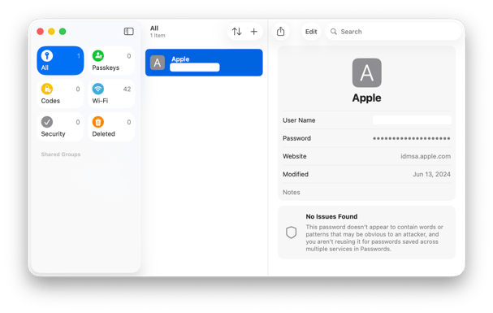
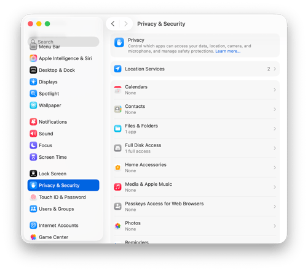

# שיעור 03: אבטחת מידע
**מדריך עזר לתלמיד · גרסת PILOT**

> **📌 פיילוט בלבד** — הקובץ המקורי שמור ללא שינוי: `Lesson_03_Asset_C_LearningGuide_HE.md`

---

## מטרות השיעור

* Gatekeeper
* XProtect
* TCC
* PPPC

---

## 🎧 האזנה לסיכום — לפני או אחרי השיעור

<!-- פודקאסט NotebookLM מתוך Captivate -->
<div style="width: 100%; height: 200px; margin-bottom: 20px; border-radius: 6px; overflow: hidden;"><iframe style="width: 100%; height: 200px;" frameborder="no" scrolling="no" allow="clipboard-write" seamless src="https://player.captivate.fm/episode/346a4041-217b-46cf-bce2-d08365f74c1f/"></iframe></div>

---

## מושגי יסוד (Terminology)

* **Gatekeeper:** מנגנון האבטחה של macOS שמוודא שרק תוכנות ממקור מהימן (App Store או מפתחים מזוהים) מורשות לרוץ על המק. הוא בודק את חתימת המפתח ואת ה-Notarization.
* **Notarization:** תהליך אוטומטי של Apple שבו אפליקציות נסרקות לאיתור קוד זדוני ידוע לפני הפצתן, עוד בטרם הגיע למשתמש. Gatekeeper דורש אישור זה עבור כל תוכנה המורדת מהאינטרנט.
* **XProtect:** מערכת ה-Anti-Virus השקטה והמובנית של macOS. פועלת ברקע, מבוססת חתימות (YARA) וחוסמת הפעלה של תוכנות זדוניות מוכרות בעת ניסיון ההרצה הראשון.
* **XProtect Remediator:** מנגנון סריקה אקטיבי שרץ ברקע (על ידי LaunchDaemons) ומבצע סריקות תקופתיות לאיתור והסרת נוזקות שכבר הצליחו לחדור למערכת.
* **Transparency, Consent, and Control (TCC):** מנגנון הפרטיות של macOS, הדורש מהמשתמש לאשר באופן אקטיבי בקשות גישה של אפליקציות למשאבים רגישים (כגון מצלמה, מיקרופון, מיקום, תיקיית מסמכים או דיסק מלא).
* **Privacy Preferences Policy Control - PPPC:** Configuration Profile (Payload) ארגוני המופץ על ידי מערכת ה-MDM ומאפשר למנהלי ה-IT להעניק מראש (או למנוע) הרשאות TCC עבור אפליקציות, ובכך למנוע מהמשתמשים לקבל חלוניות קופצות (Pop-ups) הדורשות אישור.
* **System Integrity Protection - SIP:** מנגנון אבטחה ב-macOS המונע אפילו ממשתמש root לשנות קבצי מערכת רגישים, כולל את מסדי הנתונים של ה-TCC.
* **Quarantine:** תגית (Extended Attribute) המוצמדת לקבצים שהורדו מהאינטרנט על ידי אפליקציות כמו ספארי, דואר או תוכנות מסרים. תגית זו מפעילה את הבדיקה של Gatekeeper עם פתיחת הקובץ.

> [!TIP]
> **אבני דרך היסטוריות באבטחת macOS**
> - **2007 - Code Signing:** הוצג לראשונה ב-Leopard, במקביל ליציאת ה-iPhone.
> - **2012 - Gatekeeper:** נכנס לפעולה כדי לחסום הרצת קוד זדוני.
> - **2018 - TCC (Privacy):** רק ב-Mojave צמחה המערכת והיום מגנה על עשרות משאבים (ב-15 השנים הראשונות פרטיות כמעט ולא נוהלה ברמת האפליקציה).
> - **YARA Rules:** מנוע ה-XProtect מבוסס על שפת YARA. השם הוא הלצה: "YARA: Another Recursive Acronym".

---

## פקודות טרמינל (CLI Commands)

> [!NOTE]
> **שימוש בטרמינל (שורת הפקודה)**
> מופיעות כאן פקודות טרמינל מתקדמות לניהול אבטחה ופרטיות. אין צורך לזכור את התחביר שלהן בעל פה כעת! ניתן פשוט לבצע העתק-הדבק במעבדה (למשל בתרגיל איפוס הרשאות הזום). הלימוד המעמיק של הטרמינל יתבצע באופן מסודר בשיעור 08.

### חקירה וניהול של Gatekeeper (`spctl`)
הכלי `spctl` (SecAssessment system policy security) משמש לניהול ובדיקת מערכת ה-Gatekeeper.

* **בדיקת אפליקציה - הערכת Gatekeeper (האם היא מאושרת ותרוץ):**
  ```bash
  spctl -a -vv /Applications/AppName.app
  ```
  *(הדגל `-a` מבצע Assessment, `-vv` מציג פלט מפורט כולל מידע על ה-Notarization וזהות המפתח).*

* **הסרת תגית ההסגר (Quarantine) מקובץ (עוקף את אזהרת ההפעלה הראשונית):**
  ```bash
  xattr -d com.apple.quarantine /path/to/AppName.app
  ```

### חקירה וניהול של XProtect (`xprotect`)
הכלי `xprotect` מאפשר בדיקה ושליטה על עדכוני החתימות.

* **בדיקת הגרסה המותקנת כעת של XProtect:**
  ```bash
  xprotect version
  ```
* **כפיית התקנה של העדכון האחרון מ-iCloud:**
  ```bash
  sudo xprotect update
  ```

### ניהול ואיפוס הרשאות TCC (`tccutil`)
הכלי `tccutil` מאפשר לאפס הרשאות פרטיות שהוענקו, מה שמכריח את המערכת לבקש אותן שוב. לא ניתן להעניק הרשאות דרכו, רק לאפס.

* **איפוס כל הרשאות ה-TCC עבור כל האפליקציות:**
  ```bash
  tccutil reset All
  ```
* **איפוס הרשאת מצלמה בלבד (לכל האפליקציות שביקשו עד כה):**
  ```bash
  tccutil reset Camera
  ```
* **איפוס הרשאת מצלמה עבור אפליקציה ספציפית (לדוגמה, Terminal או Zoom):**
  ```bash
  tccutil reset Camera com.apple.Terminal
  tccutil reset Camera us.zoom.xos
  ```

---

## נתיבים קריטיים, לוגים ומסדי נתונים (Paths & Plists)

### מיקומי מסדי הנתונים של TCC
מסדי הנתונים של TCC מוגנים על ידי SIP ולא ניתן לערוך אותם ידנית.
* **רמת המשתמש (מצלמה, מיקרופון, קבצים אישיים):** `~/Library/Application Support/com.apple.TCC/TCC.db`
* **רמת המערכת (Full Disk Access):** `/Library/Application Support/com.apple.TCC/TCC.db`

### XProtect & Remediator
* **מיקום העדכונים העדכני של XProtect (החל מ-Tahoe):** `/var/protected/xprotect/XProtect.bundle`
* **האפליקציה המריצה את הסריקות של Remediator:** `/Library/Apple/System/Library/CoreServices/XProtect.app`

### שאילתות לוגים (Unified Logging) דרך הטרמינל

> [!NOTE]
> **מערכת הלוגים - שיעור 16**
> הפקודות הבאות נראות מורכבות ומשתמשות בכלי `log show`. בשלב זה אין צורך להבין את ה-Predicates (תנאי הסינון). השתמשו בהן רק כהעתק-הדבק במקרה של דיבאג. אנו נלמד לכתוב שאילתות לוגים מתקדמות בשיעור האחרון של הקורס!

* **מעקב אחר פעילות Gatekeeper (חקירת חסימות אפליקציות ב-1h אחרונה):**
  ```bash
  log show --predicate 'subsystem == "com.apple.syspolicy"' --info --last 1h
  ```
* **מעקב אחר חסימות של מערכת ה-TCC:**
  ```bash
  log show --predicate 'subsystem == "com.apple.TCC"' --info --last 1h
  ```
* **צפייה בתוצאות הסריקה של XProtect Remediator (האם זוהתה נוזקה بـ-24h אחרונות):**
  ```bash
  log show --predicate 'subsystem == "com.apple.XProtectFramework.PluginAPI"' --info --last 24h
  ```

---

## קישורים מומלצים ולקריאה נוספת

* [Gatekeeper and runtime protection in macOS](https://support.apple.com/guide/security/gatekeeper-and-runtime-protection-secbd103561c/web) - מדריך מעמיק על Gatekeeper.
* [Protecting against malware in macOS](https://support.apple.com/guide/security/protecting-against-malware-sec469d47bd8/web) - סקירה של אפל על XProtect.
* [Control access to your camera on Mac](https://support.apple.com/guide/mac-help/control-access-to-the-camera-mchlf6d108da/mac) - ניהול TCC.
* [Safely open apps on your Mac](https://support.apple.com/en-us/HT202491) - הודעות אזהרה בפתיחת אפליקציות.
* [Privacy Preferences Policy Control payloads](https://support.apple.com/guide/deployment/privacy-preferences-policy-control-payloads-dep38df53c2a/web) - ניהול TCC דרך MDM.

---

## 🎬 סרטון סיכום

<!-- סרטון סיכום מתוך YouTube -->
<div style="margin-bottom: 20px; border-radius: 6px; overflow: hidden; box-shadow: 0 4px 6px rgba(0,0,0,0.1);">
    <iframe width="100%" height="450" src="https://www.youtube.com/embed/D28yJofP3fU" frameborder="0" allow="accelerometer; autoplay; clipboard-write; encrypted-media; gyroscope; picture-in-picture" allowfullscreen></iframe>
</div>

---

## 💡 עזרים ויזואליים להרצאה (Presentation Visuals)

> [!NOTE]
> תמונות אלו ניתנות להקרנה בכיתה בעת הסבר על הנושא, או לשילוב במצגות.

!!! tip "המחשה ויזואלית (עזר לתלמיד)"
    תמונות אלו ממחישות את הממשק או המנגנון הרלוונטי לנושא השיעור.




