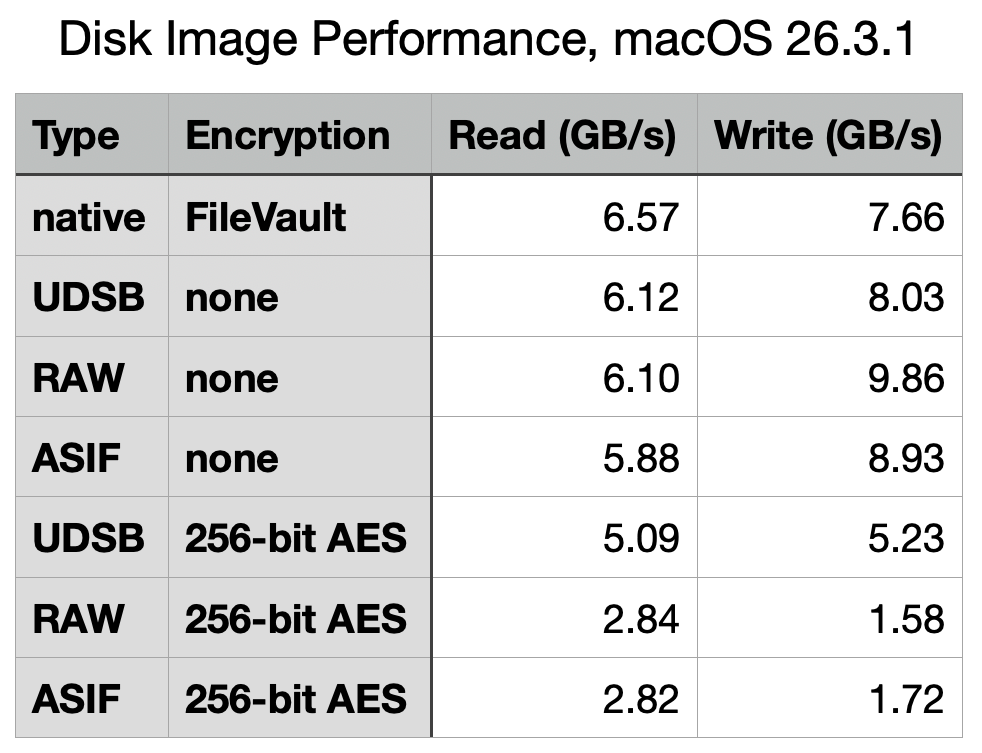
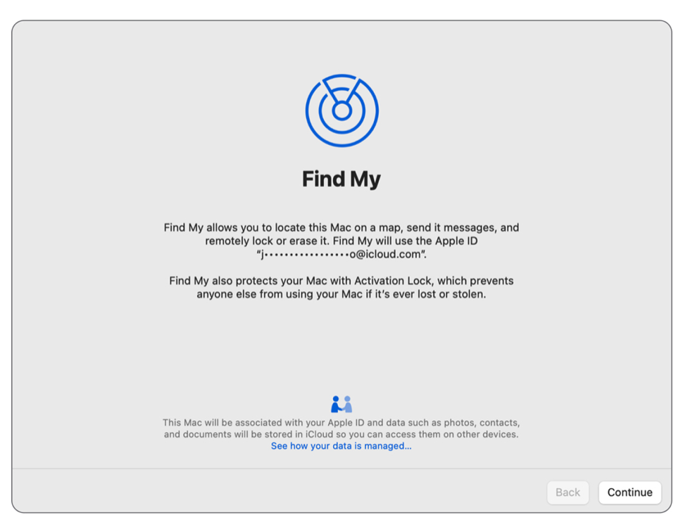
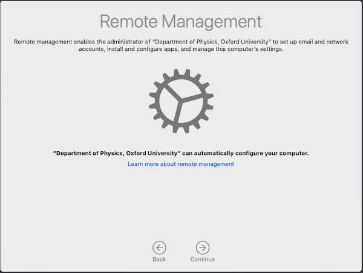
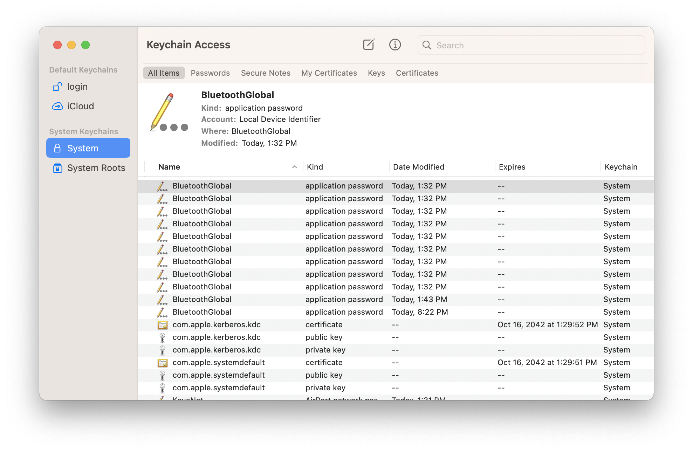
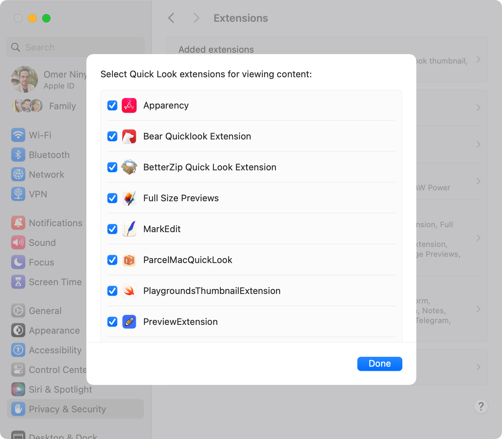
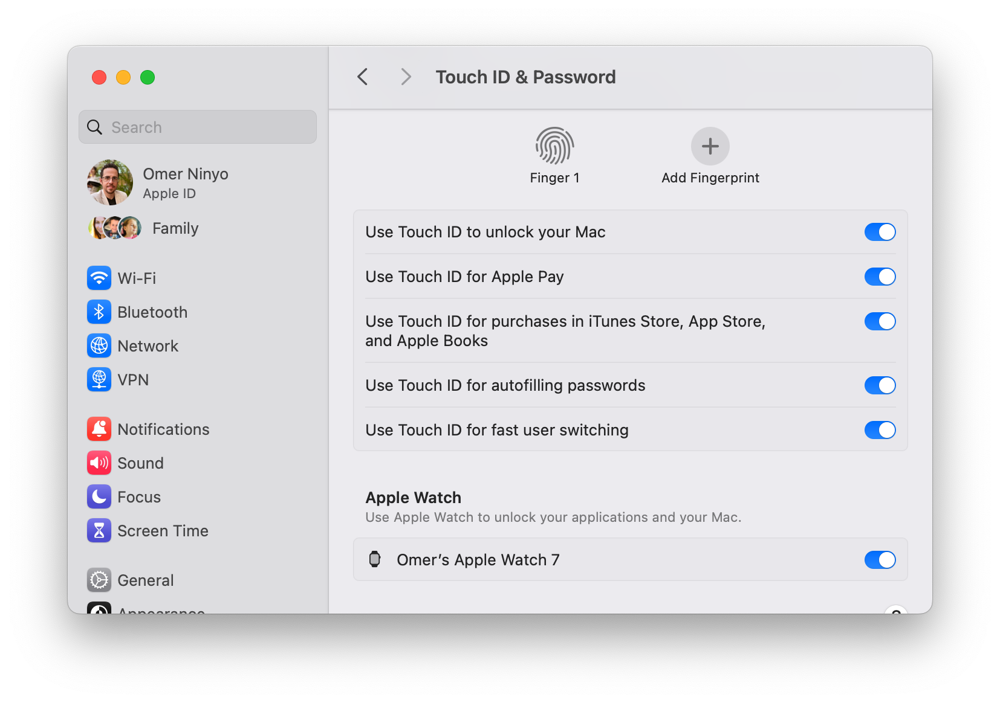
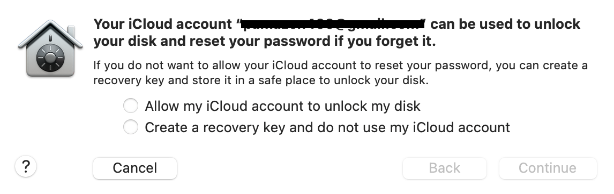
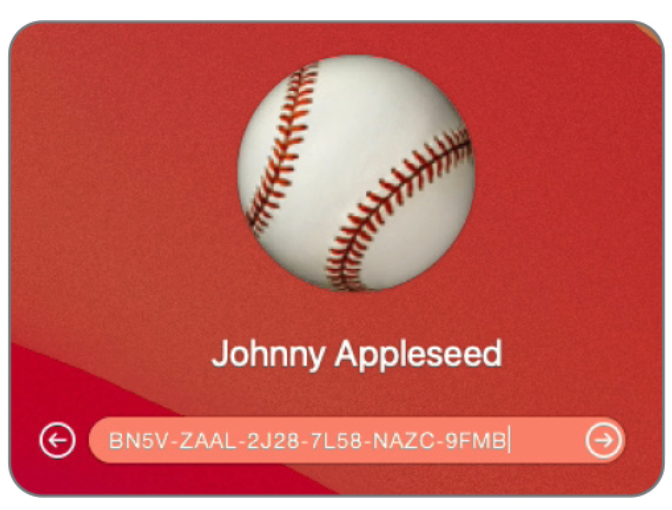

# שיעור 04: הצפנה ומפתחות
**מדריך עזר לתלמיד**


## סקירה

<!-- פודקאסט NotebookLM מתוך Captivate -->
<div style="width: 100%; height: 200px; margin-bottom: 20px; border-radius: 6px; overflow: hidden;"><iframe style="width: 100%; height: 200px;" frameborder="no" scrolling="no" allow="clipboard-write" seamless src="https://player.captivate.fm/episode/332582b3-c603-4af5-a4a2-81be768b38a6/"></iframe></div>

## בעלות מערכת והצפנה (System Ownership & FileVault)

מסמך זה מרכז את כלל המושגים, הפקודות והכלים הרלוונטיים לשיעור 4, העוסק באסימוני אבטחה (Secure Token), מנגנון ההצפנה FileVault, ומנגנוני אסימון האתחול (Bootstrap Token) בסביבות ניהול והפצה (Deployment).

---

### מילון מושגים ומונחי ליבה

* **Secure Token:** שרשרת קריפטוגרפית (עטופה בסיסמת המשתמש) המאפשרת לחשבון המקומי במק לקבל "בעלות" קריפטוגרפית על Volume הנתונים, ולאשר משימות קריטיות כמו הפעלת FileVault או עדכוני תוכנה במחשבי Apple Silicon. המשתמש הראשון שנוצר דרך Setup Assistant מקבל אותו אוטומטית.
* **FileVault:** ההצפנה המובנית ב-macOS המצפינה את Volume הנתונים (Data Volume) באופן מלא באמצעות XTS-AES-128. במחשבי Apple Silicon, הנתונים מוצפנים מובנית ברמת החומרה תמיד, והפעלת FileVault למעשה "עוטפת" את המפתח הקיים בסיסמת המשתמש ללא פגיעה בביצועים.
* **Volume Ownership:** מנגנון במחשבי Apple Silicon שדורש הרשאות מיוחדות כדי לבצע משימות ברמת המערכת כמו מחיקת מק, שינוי הגדרות אתחול או שדרוג מערכת ההפעלה. נגזר ישירות ממשתמשים שיש להם Secure Token.
* **Bootstrap Token:** "מפתח מאסטר" זמני וארגוני הנדחף לשרת ה-MDM בשלב הרישום למערכת (Enrollment). האסימון נשמר ב-MDM (בתהליך Escrow) ויכול להעניק אוטומטית Secure Token למשתמשים קבועים או לחשבונות ענן (כמו Managed Apple Account - MAID) שמתחברים מאוחר יותר, מבלי להזדקק לסיסמה של המשתמש המקורי.
* **Recovery Key - Recovery Key - PRK/IRK:** כאשר מדליקים את מנגנון ההצפנה FileVault, נוצר מפתח גיבוי למקרה שאבדה סיסמת ההתחברות.
* **PRK - Personal Recovery Key:** מפתח אלפאנומרי שמוצג למשתמש כדי לשמור בבטחה, או לחלופין, נשמר בחשבון ה-iCloud.
  * **IRK - Institutional Recovery Key:** מפתח המשמש ארגונים באמצעות MDM, כך שרק מנהלי הארגון יוכלו לשחרר כוננים נעולים באמצעות Payload מיוחד (Configuration Profile - Configuration Profile).

**היסטוריית גרסאות FileVault בקצרה:**

| גרסת FileVault | שנת שחרור (מערכת) | שיטת הצפנה | מאפיינים בולטים |
|---|---|---|---|
| FileVault 1 | 2003 (Panther 10.3) | קובץ תמונת דיסק (DMG) | הצפין רק את תיקיית הבית, נחשב שברירי וקל לפריצה (כלי בשם VileFault הדגים זאת). |
| FileVault 2 | 2011 (Lion 10.7) | תוכנה דרך ה-CPU | הצפנת כלל הדיסק, יצר עומס קל ופגע במעט בביצועים. |
| מודרני | 2017+ (T2 / Apple Silicon) | חומרה (מנוע AES ו-Secure Enclave) | אפס פגיעה בביצועים, הצפנה מובנית ברמת שבב העובדת בשיטת עטיפת מפתחות. |

---

### רשימת פקודות טרמינל (CLI) מאסיבית לניהול הצפנה ואסימונים

ניהול מערך ה-Secure Token וה-FileVault נעשה בעיקר על ידי פקודות `sysadminctl` ו-`fdesetup`. אלה פקודות הליבה שכל תומך או מנהל רשת ב-macOS חייב להכיר לעומק.

#### ניהול אסימוני אבטחה (Secure Token) באמצעות `sysadminctl`

* **בדיקת סטטוס Secure Token למשתמש נוכחי:**

  ```bash
  sysadminctl -secureTokenStatus $USER
  ```
* **בדיקת סטטוס למשתמש ספציפי (לדוגמה `johndoe`):**

  ```bash
  sysadminctl -secureTokenStatus johndoe
  ```
* **הענקת Secure Token למשתמש אחר:** (דורש משתמש אדמין שכבר יש לו Secure Token)
  ```bash
  sysadminctl -secureTokenOn newuser -password newuserpass -adminUser adminname -adminPassword adminpass
  ```
* **הסרת Secure Token ממשתמש:** (זהירות - מחיקת האסימון לכלל המשתמשים עלולה לנעול את המחשב מהרשאות קריטיות!)
  ```bash
  sysadminctl -secureTokenOff otheruser -password userpass -adminUser adminname -adminPassword adminpass
  ```

#### ניהול FileVault באמצעות `fdesetup`

* **בדיקת סטטוס FileVault (האם פעיל או לא ומי מצפין את ה-Volume):**

  ```bash
  fdesetup status
  ```
* **הפעלת FileVault דרך הטרמינל (עבור המשתמש הנוכחי):**

  ```bash
  sudo fdesetup enable
  ```
  *(המערכת תבקש סיסמה ותפיק Personal Recovery Key לטרמינל).*

* **ביטול והסרת ההצפנה (פענוח ה-Volume - Decryption):**

  ```bash
  sudo fdesetup disable
  ```
* **הצגת רשימת המשתמשים המורשים לשחרר את ההצפנה בשלב הבוט:**

  ```bash
  sudo fdesetup list
  ```
* **הסרת משתמש ספציפי (לדוגמה `johndoe`) ממורשי שחרור הדיסק:**

  ```bash
  sudo fdesetup remove -user johndoe
  ```
* **החלפת מפתח השחזור האישי (PRK) ויצירת מפתח חדש:**

  ```bash
  sudo fdesetup changerecovery -personal
  ```
* **סנכרון מיידי של ה-FileVault (בדיקה אם נדרש רענון למפתחות או סיסמאות שהשתנו):**

  ```bash
  sudo fdesetup sync
  ```
* **הפעלת מנגנון הצפנה עם קובץ Plist שקט (אידיאלי להפצה בתהליכי MDM - דורש הרשאות אדמין והגדרת XML):**

  ```bash
  sudo fdesetup enable -inputplist < /path/to/fdesetup.plist
  ```

#### אבחון קריפטוגרפי מתקדם עם `diskutil` ו-`profiles`

* **הצגת כל המשתמשים הקריפטוגרפיים (Cryptographic Users) עבור Container הנתונים ב-APFS:**

  ```bash
  diskutil apfs listcryptousers /
  ```
  *(מציג את ה-UUID של כל ישות קריפטוגרפית שיכולה לפענח את Volume הנתונים, כולל משתמשים עם אסימון, PRK או IRK).*

* **בדיקת הסטטוס של אסימון האתחול (Bootstrap Token) מול שרת ה-MDM:**

  ```bash
  profiles status -type bootstraptoken
  ```
  *(תשובה חיובית, למשל `profiles: Bootstrap Token supported on server` או `escrowed to server`, מעידה שהאסימון נשמר בהצלחה בשרת ומחכה למשוך אסימוני אבטחה עתידיים).*

---

### אבחון תקלות ופתרונות מהירים (Cheat Codes)

1. **בעיה:** "משתמש חסר בהרשאות" – יצרתם Local Account (מנהל - Admin) נוסף, אך הוא אינו יכול לאשר עדכוני מערכת הפעלה במק עם Apple Silicon, או לבטל את ההצפנה FileVault.
   * **הפתרון:** המשתמש חסר ב-Secure Token וכפועל יוצא מכך חסרה לו "בעלות Volume" (Volume Ownership). בדקו בעזרת `sysadminctl -secureTokenStatus`. אם חסר, השתמשו בחשבון המנהל המקורי (שעבר את ה-Setup Assistant) כדי להעניק לו Secure Token בעזרת הפקודה `sysadminctl -secureTokenOn`.

2. **בעיה:** עליכם לסובב (לשנות) Recovery Key שידוע שדלף בארגון.
   * **הפתרון:** השתמשו ב-`sudo fdesetup changerecovery -personal` (למפתח אישי), או ודאו דרך מערכת ה-MDM שהרצתם פקודת `Escrow` מחדש כדי לאלץ יצירת PRK מחודש מול קטלוג הניהול.

3. **בעיה:** FileVault נדלק ופועל, אך משתמש חדש שיצרנו מקומית (בסביבה שאינה מנוהלת MDM עם Bootstrap Token) לא מופיע במסך הלוגין מיד לאחר הפעלה מחדש.
   * **הפתרון:** רק למשתמשים עם Secure Token שמופיעים ברשימת ה-`fdesetup list` יש יכולת לעבור את מנגנון ה-Preboot Authentication שרץ על החומרה עוד לפני שהמערכת עולה. התחברו עם המשתמש הראשי, הוסיפו את המשתמש בעזרת `sysadminctl` וודאו שנוסף לרשימה הקריפטוגרפית.

---

### קישורים מומלצים ולקריאה נוספת

* [Use secure token, bootstrap token, and volume ownership in deployments](https://support.apple.com/guide/deployment/use-secure-token-bootstrap-token-and-volume-dep24dbdcf9e/web) - מאמר טכני למנהלי IT על איך מתבצע אימות הצפנה בארגון.
* [Intro to FileVault for Mac](https://support.apple.com/guide/security/intro-to-filevault-secd73eaebd1/web) - סקירת עומק טכנית של ארכיטקטורת ההצפנה במעבדי Apple Silicon.
* [Manage FileVault with mobile device management](https://support.apple.com/guide/deployment/manage-filevault-with-device-management-depf2a6327b/web) - מדריך לניהול מפתחות שחזור ארגוניים ל-FileVault.
* [Protect data on your Mac with FileVault](https://support.apple.com/en-us/HT204837) - מדריך בסיסי למשתמש איך להדליק את ההצפנה ולהגן על הקבצים.

## סרטון סיכום

<!-- סרטון סיכום מתוך YouTube -->
<div style="margin-bottom: 20px; border-radius: 6px; overflow: hidden; box-shadow: 0 4px 6px rgba(0,0,0,0.1);">
    <iframe width="100%" height="450" src="https://www.youtube.com/embed/DDXfEIRgAxs" frameborder="0" allow="accelerometer; autoplay; clipboard-write; encrypted-media; gyroscope; picture-in-picture" allowfullscreen></iframe>
</div>

## 💡 עזרים ויזואליים להרצאה (Presentation Visuals)

!!! tip "המחשה ויזואלית (עזר לתלמיד)"
    תמונות אלו ממחישות את הממשק או המנגנון הרלוונטי לנושא השיעור.



---
<div dir="rtl" style="text-align: left;">
  <a href="../../Lesson_05/LearningGuide/" style="font-size: 0.95em; color: gray; text-decoration: none;">⏭️ דלג לאותו שלב בשיעור הבא</a>
</div>









