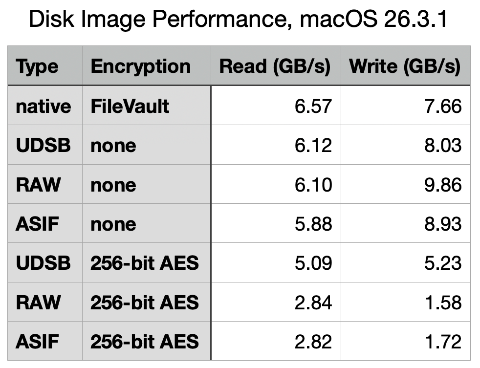
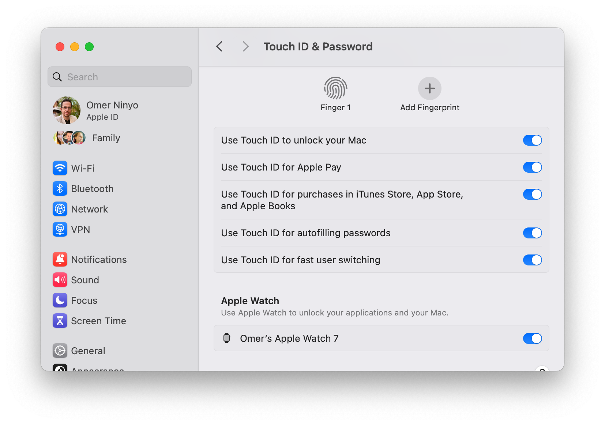
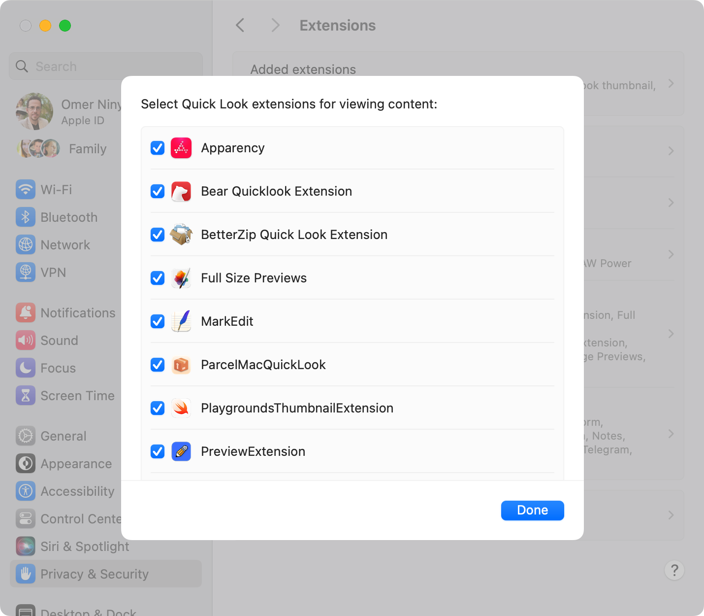
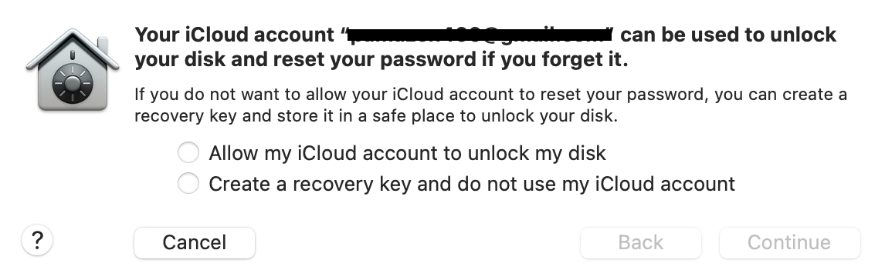
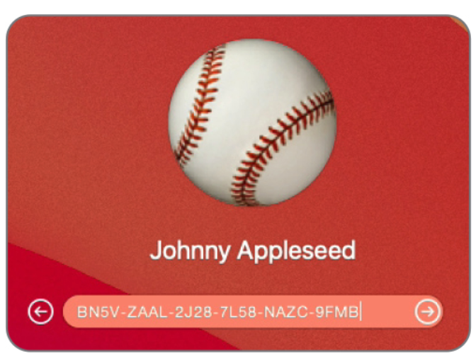
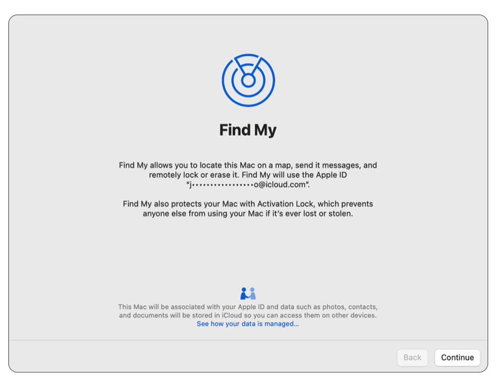
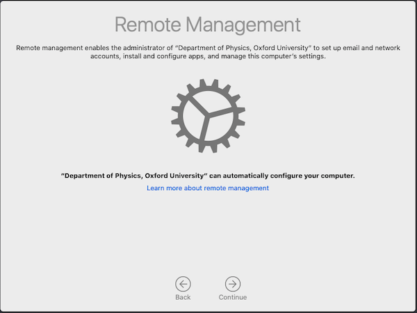
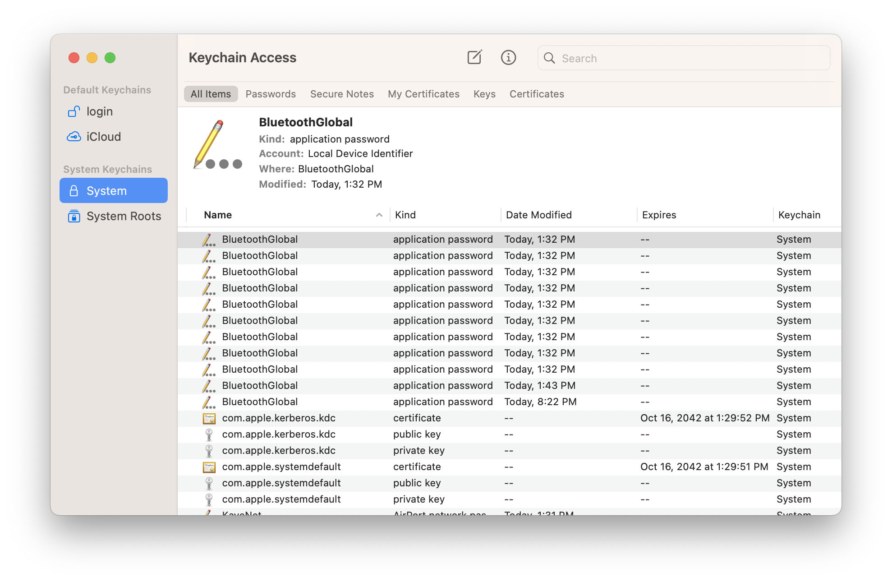
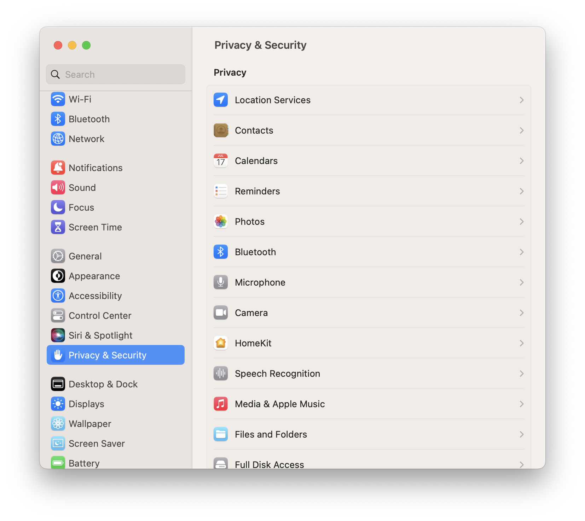

# שיעור 04: הצפנה ומפתחות
**מדריך עזר לתלמיד**

## מטרות השיעור

* הצפנת נתונים
* ניהול הרשאות מודרני
* פתרונות לארגונים

---

## 🎧 האזנה לסיכום — לפני או אחרי השיעור

<!-- פודקאסט NotebookLM מתוך Captivate -->
<div style="width: 100%; height: 200px; margin-bottom: 20px; border-radius: 6px; overflow: hidden;"><iframe style="width: 100%; height: 200px;" frameborder="no" scrolling="no" allow="clipboard-write" seamless src="https://player.captivate.fm/episode/f51cfe24-e5d0-4d6c-ab56-8bbb41c1cc26/"></iframe></div>

---

## בעלות מערכת והצפנה (System Ownership & FileVault)

מסמך זה מרכז את כלל המושגים, הפקודות והכלים הרלוונטיים לשיעור 4, העוסק באסימוני אבטחה (Secure Token), מנגנון ההצפנה FileVault, ומנגנוני אסימון האתחול (Bootstrap Token) בסביבות ניהול והפצה (Deployment).

### מילון מושגים ומונחי ליבה

* **Secure Token:** שרשרת קריפטוגרפית (עטופה בסיסמת המשתמש) המאפשרת לחשבון המקומי במק לקבל "בעלות" קריפטוגרפית על Volume הנתונים, ולאשר משימות קריטיות כמו הפעלת FileVault או עדכוני תוכנה במחשבי Apple Silicon. המשתמש הראשון שנוצר דרך Setup Assistant מקבל אותו אוטומטית.
* **FileVault:** ההצפנה המובנית ב-macOS המצפינה את Volume הנתונים (Data Volume) באופן מלא באמצעות XTS-AES-128. במחשבי Apple Silicon, הנתונים מוצפנים מובנית ברמת החומרה תמיד, והפעלת FileVault למעשה "עוטפת" את המפתח הקיים בסיסמת המשתמש ללא פגיעה בביצועים.
* **Volume Ownership:** מנגנון במחשבי Apple Silicon שדורש הרשאות מיוחדות כדי לבצע משימות ברמת המערכת כמו מחיקת מק, שינוי הגדרות אתחול או שדרוג מערכת ההפעלה. נגזר ישירות ממשתמשים שיש להם Secure Token.
* **Bootstrap Token:** "מפתח מאסטר" זמני וארגוני הנדחף לשרת ה-MDM בשלב הרישום למערכת (Enrollment). האסימון נשמר ב-MDM (בתהליך Escrow) ויכול להעניק אוטומטית Secure Token למשתמשים קבועים או לחשבונות ענן (כמו Managed Apple Account - MAID) שמתחברים מאוחר יותר, מבלי להזדקק לסיסמה של המשתמש המקורי.

!!! tip "עושים סדר במושגי ה-Tokens וה-Certificates בארגון"
    במערכת macOS וסביבות הניהול של אפל קיימים מגוון אסימונים (Tokens) ותעודות (Certificates). להלן סדר במונחים הנפוצים:

    * **APNs Certificate / Token:** מאבטח ומאמת את ערוץ התקשורת המוצפן בין ה-MDM, השרתים של אפל והמכשירים.
    * **Service Token:** מאמת את שרת ה-MDM מול שירות **Apple Business Manager (ABM)**.
    * **Content Token:** מאמת את שרת ה-MDM מול ספריית האפליקציות והספרים **Apps & Books (VPP)**.
    * **Secure Token:** אסימון קריפטוגרפי מקומי ב-macOS המאפשר למשתמש לפתוח דיסק המוצפן ב-FileVault.
    * **Bootstrap Token:** אסימון מוסדי המאפשר ל-MDM להעניק Secure Token למשתמשים ללא מעורבות משתמש קצה.

* **מפתח שחזור (Recovery Key - PRK/IRK):** כאשר מדליקים את מנגנון ההצפנה FileVault, נוצר מפתח גיבוי למקרה שאבדה סיסמת ההתחברות.
  * **PRK - Personal Recovery Key:** מפתח אלפאנומרי שמוצג למשתמש כדי לשמור בבטחה, או לחלופין, נשמר בחשבון ה-iCloud.
  * **IRK - Institutional Recovery Key:** מפתח המשמש ארגונים באמצעות MDM, כך שרק מנהלי הארגון יוכלו לשחרר כוננים נעולים באמצעות Payload מיוחד. (כיום הסטנדרט הוא PRK אישי המגובה ב-MDM).
* **VEK (Volume Encryption Key) & KEK (Key Encryption Key):** VEK הוא מפתח הצפנת החומרה השמור ב-Secure Enclave. KEK הוא המפתח הנגזר מסיסמת המשתמש שלך, המשמש כדי "לעטוף" את ה-VEK ולשחרר את הנעילה שלו באתחול.
* **וירטואליזציה (Exclaves):** ב-macOS 26 Tahoe, הצפנת FileVault נתמכת גם במכונות וירטואליות בזכות טכנולוגיית Exclave המדמה Secure Enclave.
* **SSH Pre-boot:** ב-macOS 26 Tahoe נוספה היכולת להתחבר מרחוק ב-SSH לשרתים נטולי-מסך בשלב ה-Pre-boot כדי לשחרר את FileVault.

---

### רשימת פקודות טרמינל (CLI) מאסיבית לניהול הצפנה ואסימונים

!!! note "שימוש בטרמינל לניהול הצפנה"
    ניהול מערך ה-Secure Token וה-FileVault נעשה בעיקר על ידי פקודות `sysadminctl` ו-`fdesetup`. אלו פקודות חשובות למנהלי רשת ב-macOS, אך בשלב זה של הקורס אין חובה לזכור אותן בעל פה. השתמשו בהן במעבדה על ידי העתק-הדבק. בשיעור 08 נעמיק בשורת הפקודה בצורה מסודרת.

#### ניהול אסימוני אבטחה (Secure Token) באמצעות `sysadminctl`

* **בדיקת סטטוס Secure Token למשתמש נוכחי:**
  ```bash
  sysadminctl -secureTokenStatus $USER
  ```
* **בדיקת סטטוס למשתמש ספציפי (לדוגמה `johndoe`):**
  ```bash
  sysadminctl -secureTokenStatus johndoe
  ```
* **הענקת Secure Token למשתמש אחר:** (דורש משתמש אדמין שכבר יש לו Secure Token)
  ```bash
  sysadminctl -secureTokenOn newuser -password newuserpass -adminUser adminname -adminPassword adminpass
  ```
* **הסרת Secure Token ממשתמש:** (זהירות - מחיקת האסימון לכלל המשתמשים עלולה לנעול את המחשב מהרשאות קריטיות!)
  ```bash
  sysadminctl -secureTokenOff otheruser -password userpass -adminUser adminname -adminPassword adminpass
  ```

#### ניהול FileVault באמצעות `fdesetup`

* **בדיקת סטטוס FileVault (האם פעיל או לא ומי מצפין את ה-Volume):**
  ```bash
  fdesetup status
  ```
* **הפעלת FileVault דרך הטרמינל (עבור המשתמש הנוכחי):**
  ```bash
  sudo fdesetup enable
  ```
  *(המערכת תבקש סיסמה ותפיק Personal Recovery Key לטרמינל).*
* **ביטול והסרת ההצפנה (פענוח ה-Volume - Decryption):**
  ```bash
  sudo fdesetup disable
  ```
* **הצגת רשימת המשתמשים המורשים לשחרר את ההצפנה בשלב הבוט:**
  ```bash
  sudo fdesetup list
  ```
* **הסרת משתמש ספציפי (לדוגמה `johndoe`) ממורשי שחרור הדיסק:**
  ```bash
  sudo fdesetup remove -user johndoe
  ```
* **החלפת מפתח השחזור האישי (PRK) ויצירת מפתח חדש:**
  ```bash
  sudo fdesetup changerecovery -personal
  ```
* **סנכרון מיידי של ה-FileVault (בדיקה אם נדרש רענון למפתחות או סיסמאות שהשתנו):**
  ```bash
  sudo fdesetup sync
  ```
* **הפעלת מנגנון הצפנה עם קובץ Plist שקט (אידיאלי להפצה בתהליכי MDM - דורש הרשאות אדמין והגדרת XML):**
  ```bash
  sudo fdesetup enable -inputplist < /path/to/fdesetup.plist
  ```

#### אבחון קריפטוגרפי מתקדם עם `diskutil` ו-`profiles`

* **הצגת כל המשתמשים הקריפטוגרפיים (Cryptographic Users) עבור Container הנתונים ב-APFS:**
  ```bash
  diskutil apfs listcryptousers /
  ```
  *(מציג את ה-UUID של כל ישות קריפטוגרפית שיכולה לפענח את Volume הנתונים, כולל משתמשים עם אסימון, PRK או IRK).*

* **בדיקת הסטטוס של אסימון האתחול (Bootstrap Token) מול שרת ה-MDM:**
  ```bash
  sudo profiles status -type bootstraptoken
  ```
  *(תשובה חיובית, למשל `profiles: Bootstrap Token supported on server` או `escrowed to server`, מעידה שהאסימון נשמר בהצלחה בשרת ומחכה למשוך אסימוני אבטחה עתידיים).*

* **דחיפה יזומה לשרת הניהול:**
  ```bash
  sudo profiles install -type bootstraptoken
  ```

---

### אבחון תקלות ופתרונות מהירים (Cheat Codes)

1. **בעיה:** "משתמש חסר בהרשאות" – יצרתם Local Account (מנהל - Admin) נוסף, אך הוא אינו יכול לאשר עדכוני מערכת הפעלה במק עם Apple Silicon, או לבטל את ההצפנה FileVault.
   * **הפתרון:** המשתמש חסר ב-Secure Token וכפועל יוצא מכך חסרה לו "בעלות Volume" (Volume Ownership). בדקו בעזרת `sysadminctl -secureTokenStatus`. אם חסר, השתמשו בחשבון המנהל המקורי (שעבר את ה-Setup Assistant) כדי להעניק לו Secure Token בעזרת הפקודה `sysadminctl -secureTokenOn`.

2. **בעיה:** עליכם לסובב (לשנות) Recovery Key שידוע שדלף בארגון.
   * **הפתרון:** השתמשו ב-`sudo fdesetup changerecovery -personal` (למפתח אישי), או ודאו דרך מערכת ה-MDM שהרצתם פקודת `Escrow` מחדש כדי לאלץ יצירת PRK מחודש מול קטלוג הניהול.

3. **בעיה:** FileVault נדלק ופועל, אך משתמש חדש שיצרנו מקומית (בסביבה שאינה מנוהלת MDM עם Bootstrap Token) לא מופיע במסך הלוגין מיד לאחר הפעלה מחדש.
   * **הפתרון:** רק למשתמשים עם Secure Token שמופיעים ברשימת ה-`fdesetup list` יש יכולת לעבור את מנגנון ה-Preboot Authentication שרץ על החומרה עוד לפני שהמערכת עולה. התחברו עם המשתמש הראשי, הוסיפו את המשתמש בעזרת `sysadminctl` וודאו שנוסף לרשימה הקריפטוגרפית.

4. **בעיה:** סיסמה שונתה מחוץ למק, וכעת נדרשת הסיסמה הישנה לפתיחת ה-FileVault.
   * **הפתרון:** ה-KEK עדיין מוגן על ידי הסיסמה הישנה. המשתמש צריך לעדכן את הסיסמה בצורה מוסדרת דרך הגדרות המערכת (System Settings) כדי לסנכרן את המפתח ב-Secure Enclave מחדש.

---

## קישורים מומלצים ולקריאה נוספת

* [Use secure token, bootstrap token, and volume ownership in deployments](https://support.apple.com/guide/deployment/use-secure-token-bootstrap-token-and-volume-dep24dbdcf9e/web) - מאמר טכני למנהלי IT.
* [Intro to FileVault for Mac](https://support.apple.com/guide/security/intro-to-filevault-secd73eaebd1/web) - סקירת עומק של ארכיטקטורת ההצפנה במעבדי Apple Silicon.
* [Manage FileVault with mobile device management](https://support.apple.com/guide/deployment/manage-filevault-with-device-management-depf2a6327b/web) - מדריך לניהול מפתחות שחזור ארגוניים.
* [Protect data on your Mac with FileVault](https://support.apple.com/en-us/HT204837) - מדריך בסיסי למשתמש איך להדליק את ההצפנה.

---

## 🎬 סרטון סיכום

<!-- סרטון סיכום מתוך YouTube -->
<div style="margin-bottom: 20px; border-radius: 6px; overflow: hidden; box-shadow: 0 4px 6px rgba(0,0,0,0.1);">
    <iframe width="100%" height="450" src="https://www.youtube.com/embed/i7byyZYgNUY" frameborder="0" allow="accelerometer; autoplay; clipboard-write; encrypted-media; gyroscope; picture-in-picture" allowfullscreen></iframe>
</div>

---

## עזרים ויזואליים

!!! tip "המחשה ויזואלית (עזר לתלמיד)"
    תמונות אלו ממחישות את הממשק או המנגנון הרלוונטי לנושא השיעור.










