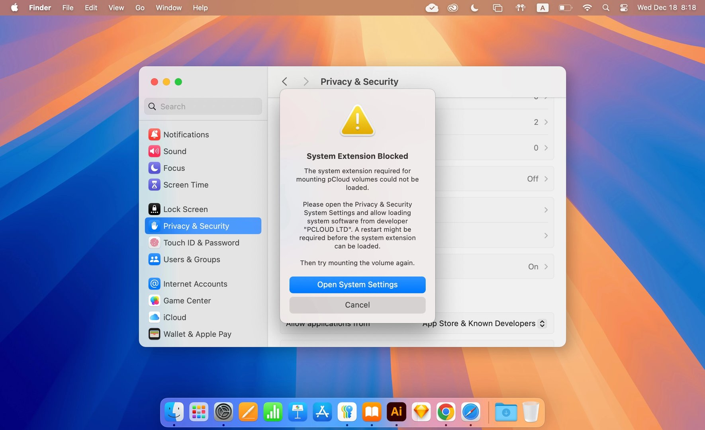
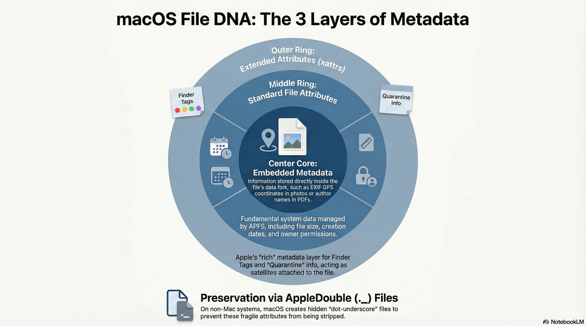
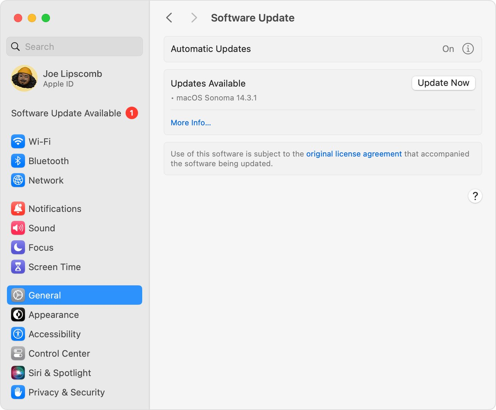
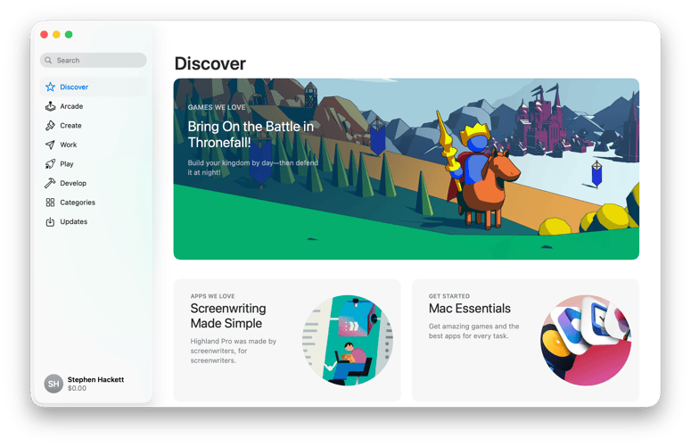
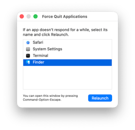

# Lesson 05: Apps and Processes
**Student Reference Guide**

## Lesson Objectives

* Installation processes
* Sandboxing
* Diagnosing and handling freezes
* Enterprise distribution (VPP)
**[Image Recommendation]:** A minimalist vector icon of the App Store "A" logo and an open cardboard box representing packages.

## Overview

<!-- NotebookLM Podcast from Captivate -->

<iframe style="width: 100%; height: 200px;" frameborder="no" scrolling="no" allow="clipboard-write" seamless src="https://player.captivate.fm/episode/57c8a1df-bbc5-4e2e-9986-b6e4b0e04f4e/"></iframe>

## Core Concepts

* **App Store:** Apple's official store for apps. Every app here goes through App Review, cryptographic signing, and Notarization, and operates under "Sandbox" restrictions.
* **Package - PKG:** An installation file containing a bundle of files and instructions (Scripts) for distributing them across the file system. Mostly used for complex installations of enterprise software and command-line tools.
* **Disk Image - DMG / ASIF:** A virtual "disk image". In previous versions, UDZO/UDSP files were common, and in macOS 26 (Tahoe) Apple introduced the highly efficient ASIF (Apple Sparse Image Format) format.
* **Sandboxing - Sandbox:** A macOS security mechanism restricting an app's access (mainly third-party and App Store) to system resources, memory, and files that do not belong to it. Data is kept within a "Container".
* **Group Containers (DeepDive):** A dedicated folder (under `~/Library/Group Containers`) used for different apps from the same developer (e.g., Office suite programs) to share information in the sandbox among themselves.
* **Packages vs Bundles (DeepDive):** Historically there is a subtle distinction: a Bundle is usually an app containing executable code, whereas a Package is a folder presented as a single file but doesn't necessarily contain code (like an RTFD or Pages document).
* **App Translocation - Gatekeeper Path Randomization:** A mechanism preventing malicious apps extracted from a ZIP file, for example, from running out of the Downloads folder while accessing adjacent files. The system runs the app from a random, Read-Only location in memory.
* **Force Quit:** Aggressive closing of an app that is Not Responding without allowing it to save data.
* **Volume Purchase Program - VPP / Apple Business Manager (ABM):** The enterprise purchasing program allowing organizations to centrally purchase app licenses and distribute them to users via MDM.
* **Self Service:** A private App Store equivalent for the organization. Users can install software and profiles approved by the organization without needing an Admin password.

---

## Central Terminal Commands

### Installer and Disk Tools (installer & hdiutil)

* **`sudo installer -pkg /path/to/package.pkg -target /`**
  Installing a PKG package in "Silent" mode directly to the drive's root. The most basic command for installing enterprise software from the terminal or via MDM scripts.

* **`hdiutil attach /path/to/image.dmg`**
  Mounting a virtual disk image. Returns the path of the newly created drive (usually under `/Volumes/Name`).

* **`hdiutil detach /Volumes/ImageName`**
  Safe unmounting of a disk image or external drive.

* **`hdiutil info`**
  Displaying a list of all virtual disks currently mounted on the system.

* **`diskutil image create blank --format ASIF --size 100G --volumeName myVolume imagePath`**
  Creating a blank disk image in Tahoe's new format - ASIF.

### Process Management and Force Quit (killall & kill)

* **`killall "App Name"`**
  Closing an app (sending a gentle Termination command) by process name. For example: `killall Safari`.

* **`kill -9 [PID]`**
  Immediate and violent Force Quit of a process by its Process ID. This command bypasses any normal app saving mechanisms and is exactly identical to the Force Quit button in Activity Monitor.

* **`top`**
  Displaying real-time data of all processes running on the system and the resources they demand (CPU/RAM). Pressing `q` will exit the view.

### Hidden App Preferences (defaults)

* **`defaults read com.apple.Safari`**
  Reading the entire preferences file (Plist) of the Safari app saved in the Preferences folder.

* **`defaults write com.apple.screencapture type -string "png"`**
  Writing a manual preference (for example: changing the screenshot format to PNG).

* **`defaults delete com.apple.Safari`**
  Completely deleting the preferences file. This action reverts the app's settings to factory default (a critical step in fully resetting an app).

### System Updates and Tools (softwareupdate)

* **`softwareupdate --install-rosetta --agree-to-license`**
  Fast and silent installation of the Rosetta 2 translation environment for Apple Silicon computers (often required for older installers).

---

## Sandbox Management and App Reset

**Where do apps save their data?**

1. **Preferences:** Under `~/Library/Preferences/com.domain.appname.plist`
2. **Application Support:** Under `~/Library/Application Support/AppName/`
3. **Containers:** Apps from the App Store, or apps predefined as Sandboxed, do not write to the general folders above. Instead, all their access is routed to: `~/Library/Containers/[Bundle ID]`.

**How to reset a Sandbox app (Absolute Reset):**

1. Ensure the app is completely closed (`killall` or Force Quit).
2. Delete the app's Container folder at the path: `~/Library/Containers/[Bundle ID]`.
3. Delete the saved system preferences (if they exist outside the Sandbox): `defaults delete [Bundle ID]`.
4. Relaunch the app - it will be recreated from scratch, as if run for the first time.

---

## Recommended Links and Further Reading

* [Check app installation and processes on Mac](https://support.apple.com/guide/apple-platform-support/check-app-installation-and-processes-apda5f8a096c/web) - Apple guide explaining how to check which processes and software are running in the background.
* [Learn about App Store security protections](https://support.apple.com/guide/apple-platform-support/learn-about-app-store-security-protections-apd1a7b8e19c/web) - Article on the App Store's security mechanisms and Sandbox.
* [Distribute content with mobile device management](https://support.apple.com/guide/deployment/distribute-content-depe210182ce/web) - Article for administrators on distributing software remotely using MDM.
* [Explainer: the app sandbox](https://eclecticlight.co/2020/09/24/explainer-the-app-sandbox/) - In-depth technical article from an external blog on how the sandbox isolating apps works.
* [Explainer: Disk images](https://eclecticlight.co/2021/11/17/explainer-disk-images/) - Overview of the history and structure of DMG files.
* [macOS Tahoe brings a new disk image format](https://eclecticlight.co/2024/09/16/macos-tahoe-brings-a-new-disk-image-format/) - Technical article explaining the new installer file format in macOS 26.

## Summary Video

<!-- Summary video from YouTube -->

    <iframe width="100%" height="450" src="https://www.youtube.com/embed/DDXfEIRgAxs" frameborder="0" allow="accelerometer; autoplay; clipboard-write; encrypted-media; gyroscope; picture-in-picture" allowfullscreen></iframe>

!!! tip "Visual Illustration (Student Reference)"
    These images illustrate the interface or mechanism relevant to the lesson topic.

<!-- src_hash: 526c54df2685f9bbb96276e5cf714695fcbd0daa7fea27bbd66eb2e30e8426a5 -->
