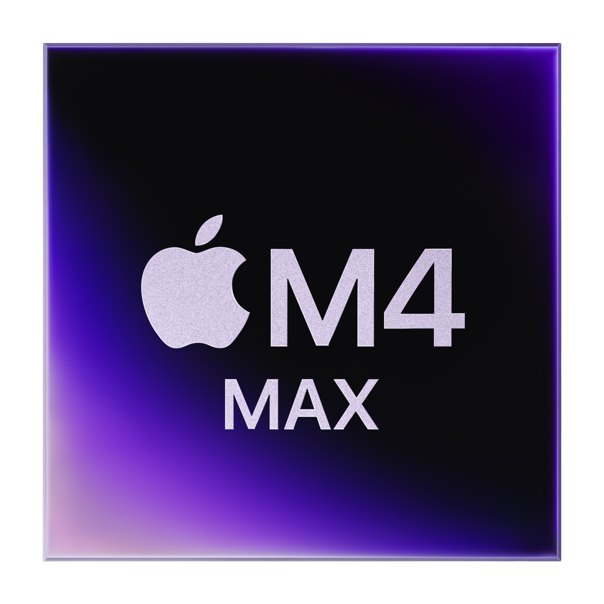
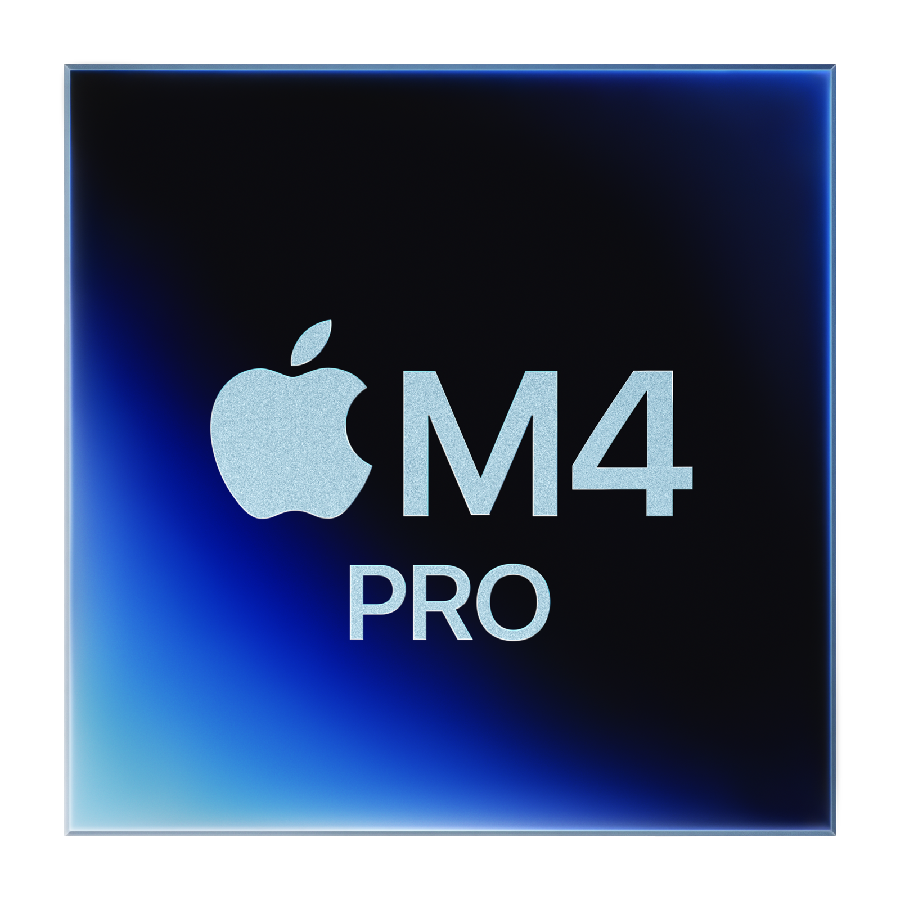
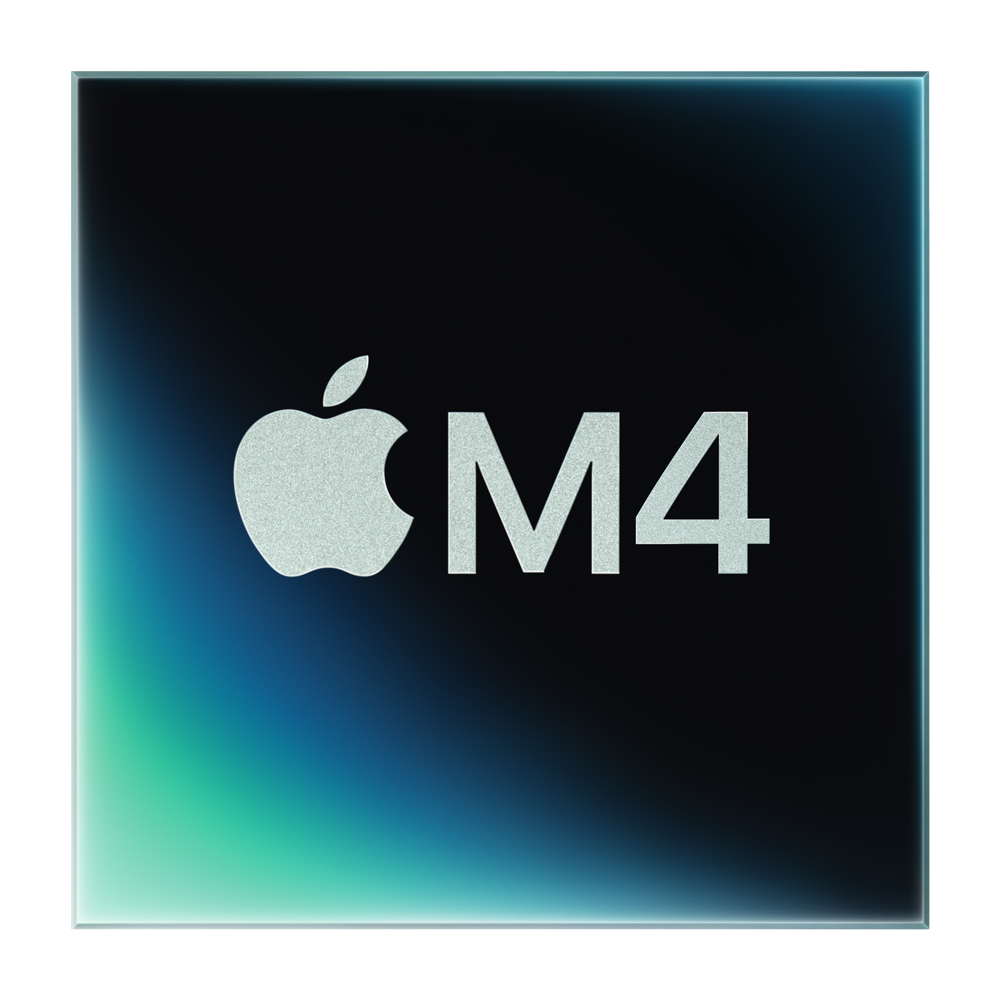
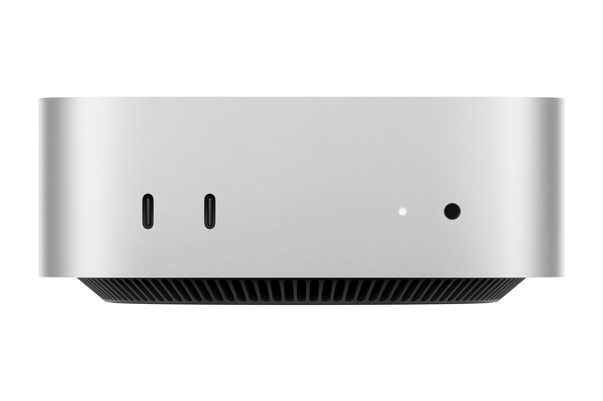
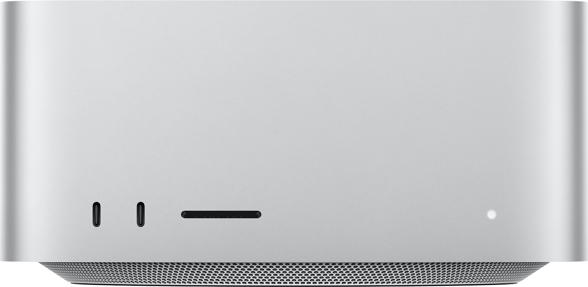
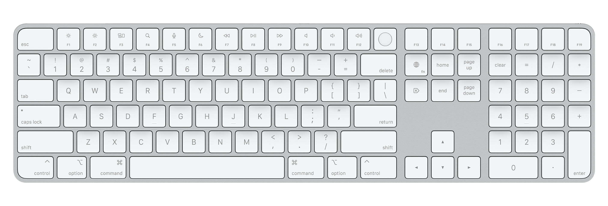

# Lesson 05 — Applications and Processes
## Student Learning Guide

---

## Lesson Objectives

- Master the three primary installation channels in macOS (App Store, DMG, PKG)
- Understand the Sandbox architecture — where applications store their data
- Master tools for diagnosing and force-quitting unresponsive processes
- Understand VPP and Self Service mechanisms in an enterprise environment

---

## 🎧 Audio Summary — Pre or Post Lesson

<!-- NotebookLM podcast from Captivate -->
<div style="width: 100%; height: 200px; margin-bottom: 20px; border-radius: 6px; overflow: hidden;"><iframe style="width: 100%; height: 200px;" frameborder="no" scrolling="no" allow="clipboard-write" seamless src="https://player.captivate.fm/episode/57c8a1df-bbc5-4e2e-9986-b6e4b0e04f4e/"></iframe></div>

---

## Core Concepts

| Concept | Explanation |
|---|---|
| **App Store** | Apple's official storefront. Every application undergoes review, notarization, and operates within a strict Sandbox. |
| **DMG (Disk Image)** | A virtual drive. Double-click = Mount. Drag to Applications = Install. Eject = Mandatory upon completion. |
| **PKG (Package)** | A system-level installer. Deploys files to protected paths → Will always require Admin credentials. |
| **Gatekeeper** | The macOS security enforcer — verifies that every application is signed and approved by Apple. |
| **Notarization** | An automated malware scanning process by Apple required before an application is permitted to run. |
| **Sandbox** | An isolation bubble — applications cannot access files outside their sandbox without explicit permission. |
| **Container** | The home directory of a sandboxed application. Located at `~/Library/Containers/[Bundle ID]`. |
| **Force Quit** | Terminating an unresponsive process without saving (sending a `SIGKILL` signal). |
| **VPP / ABM** | The enterprise volume licensing mechanism. Licenses belong to the organization, not the end user. |
| **Self Service** | The organization's private app store — enables installations without Admin rights and without personal Apple IDs. |

---

## Part 1 — Installation Types

### Where to Find Them in Finder

```text
DMG File:  Downloads → Double-click → Volume in Sidebar → Drag to Applications
PKG File:  Double-click → Installer wizard → Admin required
App Store:  Search, click Download — Fully automated
```

### Critical Change in Tahoe

!!! important
    For unapproved applications — **Right-click → Open is no longer supported in Tahoe**.
    The only method: `System Settings → Privacy & Security → Scroll down → Open Anyway`

---

## Part 2 — Sandbox and Application Reset

### Critical Paths

*(Reminder from Lesson 2: The Library directory in your home folder (`~/`) is the user's personal space. Traditionally, this is where applications save your preferences and data. We will dive deeper into the system's spatial architecture in the next lesson).*

| Application Type | Where are settings and data saved? | Is there unrestricted access to the Mac? |
|---|---|---|
| **"Standard" Application (Non-Sandbox)** | `~/Library/Preferences/` and `~/Library/Application Support/` | **Yes** (Security risk if the app is compromised) |
| **Sandboxed Application** | Confined within `~/Library/Containers/[Bundle ID]/` | **No** (Requires explicit permission via Powerbox/TCC) |

### The Correct Workflow for Resetting an Application

1. Quit completely: `Cmd+Q`
2. Open Finder → Go → Hold `Option` → **Library**
3. Navigate to `Containers/` → Locate the application's folder
4. Move to Trash and empty the Trash
5. Relaunch the application → Seeing the "Welcome" screen indicates a successful reset

!!! note
    Deleting an application from `/Applications/` **does not** delete its Container!
    The Container must be deleted separately.

---

## Part 3 — Force Quit

### The 4 Methods

| Method | How-To |
|---|---|
| **The Fastest** | `Cmd + Option + Esc` |
| **The Dock** | Right-click the icon + Hold `Option` → Force Quit |
| **Diagnosis and Termination** | Activity Monitor → Check CPU/RAM resources and Open Files before clicking `X` |
| **Terminal (CLI)** | Use `killall AppName` for immediate remote termination or when the GUI is unresponsive |

### Quit vs. Force Quit

| Action | Signal Sent | Result |
|---|---|---|
| Standard Quit | `SIGTERM` | The application saves data and gracefully shuts down |
| Force Quit | `SIGKILL` | The kernel terminates the process immediately — **no saving** |

---

## Part 4 — VPP and Self Service

### The Enterprise Flow

```text
Apple Business Manager (ABM)
        ↓ Licenses
   Enterprise MDM Server
        ↓ Silent Install
     Employee's Mac
        ↓ 
  Self Service (Private employee catalog)
```

**The Result:** The employee clicks "Install" — the MDM installs it in the background — **zero Admin rights, zero personal Apple IDs required.**

---

## Terminal Commands — Appendix

!!! note
    The Terminal is not required for the lesson's exercises. These commands are provided as an extension for advanced users.

```bash
# Manually mount a DMG
hdiutil attach /path/to/image.dmg

# Unmount a DMG
hdiutil detach /Volumes/ImageName

# Silent PKG installation (for IT scripting)
sudo installer -pkg /path/to/file.pkg -target /

# Reset application preferences (Preferences only, not the Container)
defaults delete com.apple.Safari

# Flush preferences cache (after deleting a Container)
killall cfprefsd

# Verify PKG signature
pkgutil --check-signature /path/to/file.pkg

# Silent Rosetta 2 installation
softwareupdate --install-rosetta --agree-to-license
```

---

## Links and Further Reading

- [Check app installation and processes on Mac — Apple Support](https://support.apple.com/guide/apple-platform-support/check-app-installation-and-processes-apda5f8a096c/web)
- [Learn about App Store security protections](https://support.apple.com/guide/apple-platform-support/learn-about-app-store-security-protections-apd1a7b8e19c/web)
- [Distribute content with mobile device management](https://support.apple.com/guide/deployment/distribute-content-depe210182ce/web)
- [Explainer: the app sandbox — Eclectic Light](https://eclecticlight.co/2020/09/24/explainer-the-app-sandbox/)

---

## 🎬 Video Summary

<div style="margin-bottom: 20px; border-radius: 6px; overflow: hidden; box-shadow: 0 4px 6px rgba(0,0,0,0.1);">
    <iframe width="100%" height="450" src="https://www.youtube.com/embed/z_52E-9epcY" frameborder="0" allow="accelerometer; autoplay; clipboard-write; encrypted-media; gyroscope; picture-in-picture" allowfullscreen></iframe>
</div>

---

## Images from the Guide and Presentation

!!! tip "Visual Aids"
    These images illustrate the interfaces covered in the lesson.


---

## Visual Aids

!!! tip "Visual Demonstration (Student Aid)"
    These images illustrate the relevant interface or mechanism for the lesson topic.











