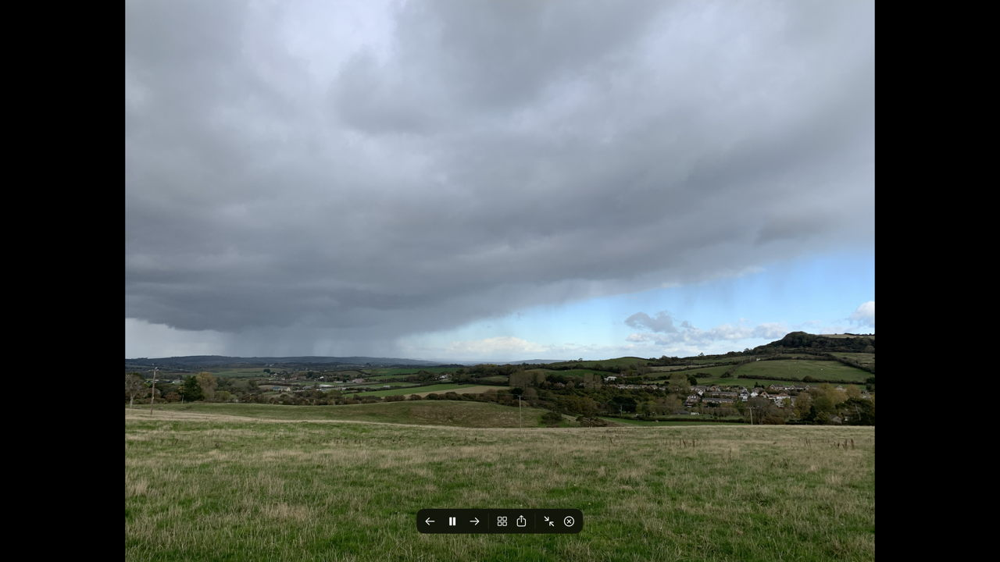
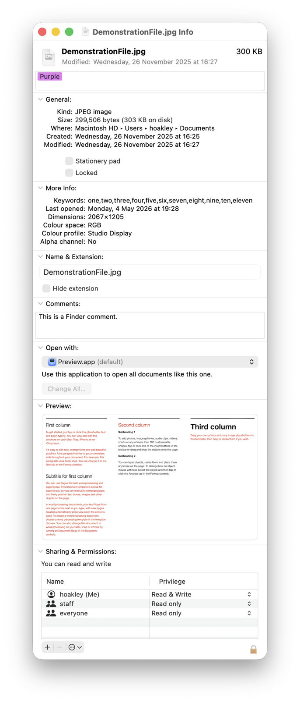
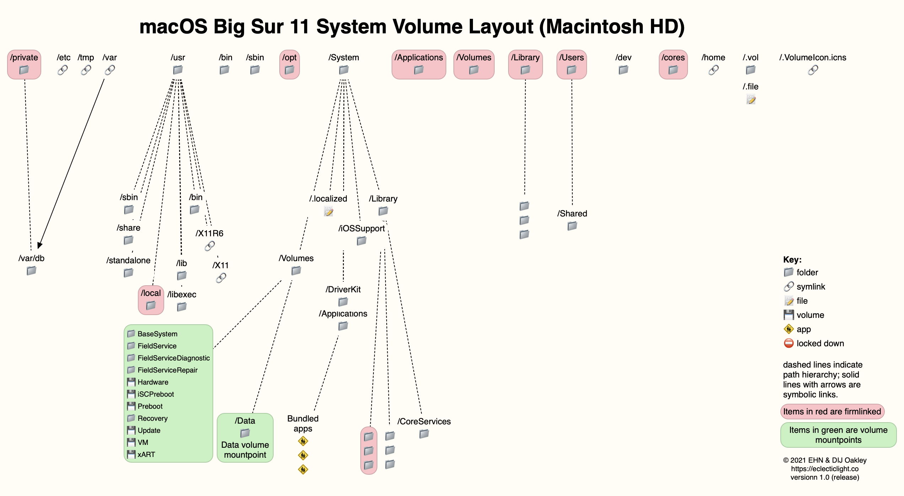
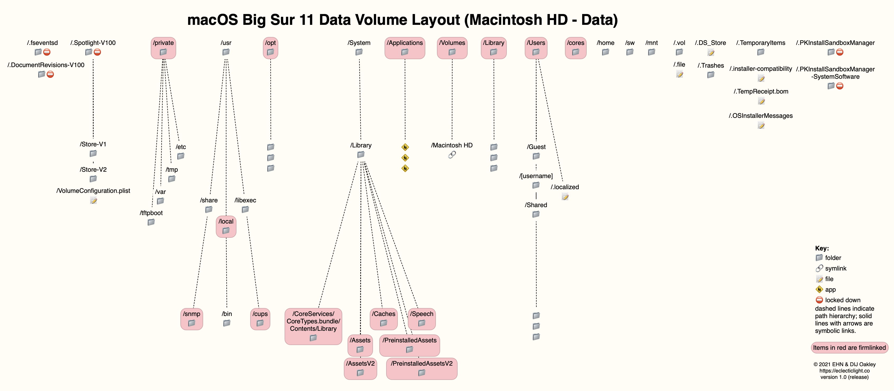
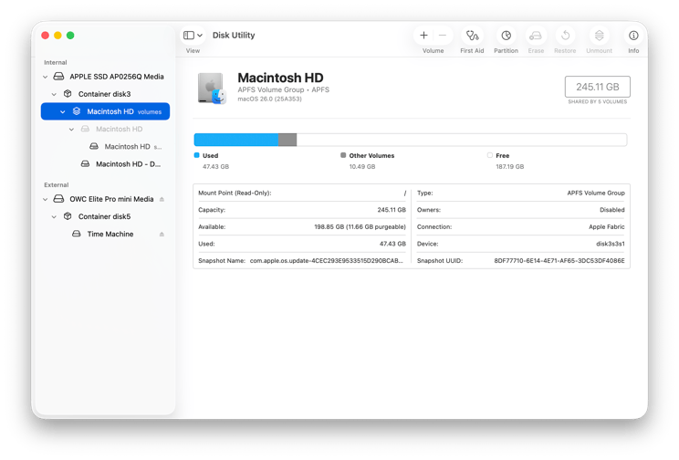
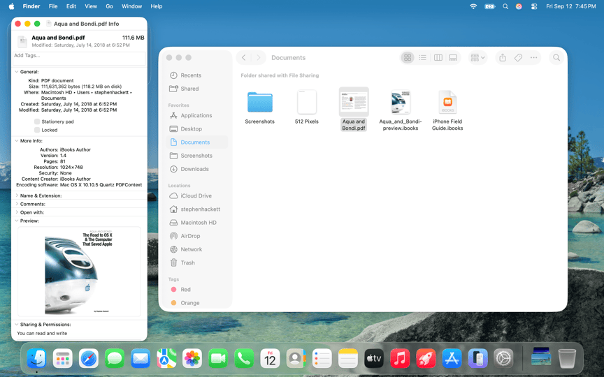
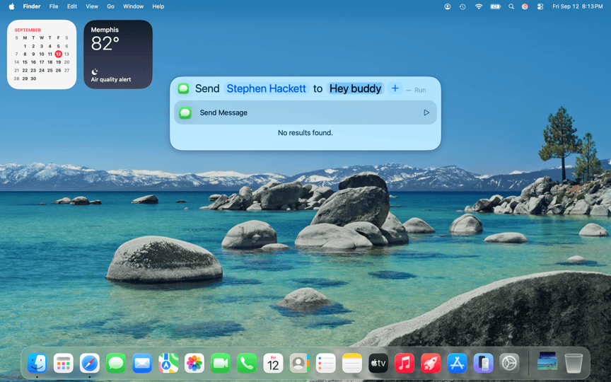
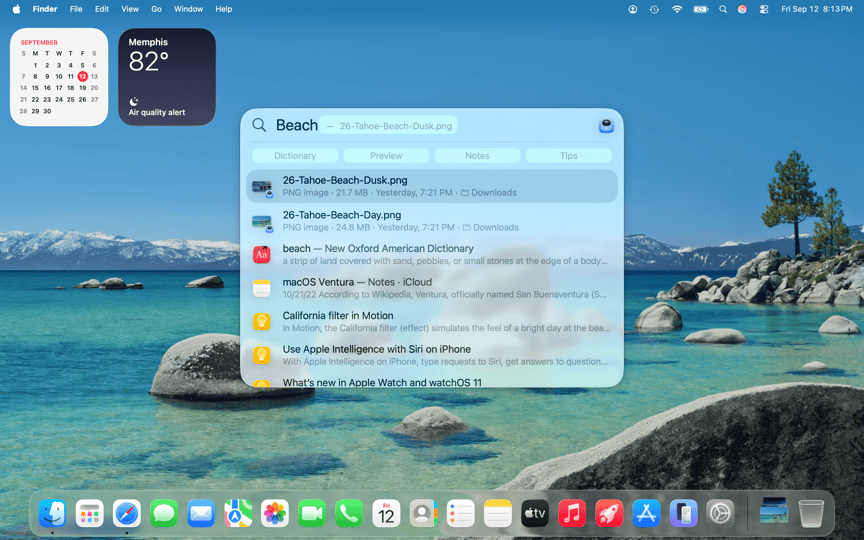

# Lesson 06: The File System (APFS)
**Student Reference Guide**

## Lesson Objectives

*   APFS Architecture
*   System Volume Group (SVG)
*   Firmlinks
*   Spotlight Indexing
**[Image Recommendation]:** A super minimalist abstract vector diagram showing a glowing data core (representing APFS) splitting into two interconnected hemispheres (System and Data).

## Overview

<!-- פודקאסט NotebookLM מתוך Captivate -->
<div style="width: 100%; height: 200px; margin-bottom: 20px; border-radius: 6px; overflow: hidden;"><iframe style="width: 100%; height: 200px;" frameborder="no" scrolling="no" allow="clipboard-write" seamless src="https://player.captivate.fm/episode/9f334406-f88d-4a75-9797-47bfdc6a6767/"></iframe></div>

## Key Concepts

*   **APFS (Apple File System):** Apple's modern file system, replacing HFS+. Built for high performance on flash storage, encryption, dynamic space sharing, and data protection.
*   **Container:** The primary layer in APFS that manages all free space on the disk. Effectively replaces the rigid partitions of the past.
*   **Volume:** A logical storage unit within the Container. Volumes share free space with other volumes in the container and grow as needed without prior configuration (Dynamic Space Sharing).
*   **Copy-on-Write (CoW):** A critical mechanism in APFS that prevents data corruption by writing new information to empty blocks before the pointer is updated. Prevents half-write situations.
*   **Clones:** A prominent APFS feature that allows for the immediate creation of exact copies of files and folders within the same volume. These clones share the same physical blocks and therefore **do not occupy additional disk space** until one of them changes. Finder performs this automatically. It can be forced with the `cp -c` command.
*   **SVG (System Volume Group):** A logical combination of the System volume and the Data volume into a single group that behaves like a regular, classic drive (like Macintosh HD).
*   **SSV (Signed System Volume):** The System partition, which is read-only and cryptographically signed for complete protection against malicious or erroneous changes.
*   **Firmlinks:** Active, bidirectional links (a kind of "wormhole") that connect directories on the System volume to directories on the Data volume, making it appear to the user as a single partition.
*   **Spotlight Index:** A hidden database (`.Spotlight-V100`) that contains the content of most files on the disk to enable instant, global searching.
*   **mdworker / mds / mds_stores:** The background processes responsible for extracting data from files and updating the Spotlight index.
*   **Get Info and Contextual Menu:** The Finder's information and options interface. The Get Info window (Cmd+I) allows critical data about files to be diagnosed (e.g., whether they reside in the logical or physical location in Firmlinks, and system permissions). Using the contextual menu (right-click) combined with the Option key on the keyboard reveals advanced management options (such as revealing full paths for copying). [Recommended Reading 1](https://eclecticlight.co/2026/06/09/reading-the-finders-get-info-dialog/) | [Recommended Reading 2](https://eclecticlight.co/2026/06/05/get-more-from-get-info-and-the-finders-contextual-menu/)
*   **User Domain:** The user's personal space (Home Directory), often identified by the tilde symbol (`~`). The user is allowed to modify and delete files in this space without requiring administrator permissions.
*   **Local Domain:** The space shared by all users on the computer (e.g., the `/Applications` folder). Modifying files here requires an administrator password.
*   **System Domain:** The core operating system file space. Completely closed for writing.

## Cheat Commands

### Domains Navigation
```bash
# Quickly return to the home directory (User Domain) from anywhere in the system
cd ~

# Navigate to the shared library folder for all users (Local Domain)
cd /Library

# Navigate to the hidden personal library folder (User Domain)
cd ~/Library
```

### APFS and Volumes Diagnostics
```bash
# Display a list of disks, containers, and volumes in the system
diskutil list

# In-depth display of APFS configuration (volume groups, encryption status, volume role)
diskutil apfs list

# Add a new Volume dynamically without formatting
diskutil apfs addVolume diskX APFS "NewVolumeName"

# Clone a file immediately without occupying space (APFS Clone)
cp -c /path/to/original /path/to/clone

# Compare the "logical" size of files versus the "physical" space they actually occupy
ls -lh /path/to/clone
du -h /path/to/clone

# Display the system's Firmlink paths
cat /usr/share/firmlinks

# Check the status of the authenticated system partition signature
csrutil authenticated-root status
```

### Spotlight Management and Diagnostics
```bash
# Check if Spotlight is enabled on the Root volume
sudo mdutil -s /

# Erase and rebuild the Spotlight index (to resolve unusual "System Data" issues)
sudo mdutil -E /

# List all installed plugins (MDImporters) in the system
mdimport -L

# Scan and output metadata for a specific file (for debugging search issues)
mdimport -t -d3 /path/to/specific/file.pdf
```

## Recommended Reading & Enrichment Links

*   **Apple Platform Support:** Use Disk Utility - [Link](https://support.apple.com/en-il/guide/platform-support/sup9e89abfd4/web)
*   **The Eclectic Light Company:** A brief history of APFS in honour of its fifth birthday - [Link](https://eclecticlight.co/2022/04/01/a-brief-history-of-apfs-in-honour-of-its-fifth-birthday/)
*   **The Eclectic Light Company:** How macOS depends on firmlinks - [Link](https://eclecticlight.co/2023/07/22/how-macos-depends-on-firmlinks/)
*   **The Eclectic Light Company:** Using and troubleshooting Spotlight in Sequoia: summary - [Link](https://eclecticlight.co/2024/11/29/using-and-troubleshooting-spotlight-in-sequoia-summary/)

## Recommended Links and Further Reading

* [Use Disk Utility to repair a storage device](https://support.apple.com/en-il/guide/platform-support/sup9e89abfd4/web) - Official guide for using Disk Utility First Aid to inspect and repair storage.
* [A brief history of APFS in honour of its fifth birthday](https://eclecticlight.co/2022/04/01/a-brief-history-of-apfs-in-honour-of-its-fifth-birthday/) - Historical and architectural deep-dive into the Apple File System.
* [How macOS depends on firmlinks](https://eclecticlight.co/2023/07/22/how-macos-depends-on-firmlinks/) - In-depth article explaining how macOS uses Firmlinks to link System and Data volumes.
* [Using and troubleshooting Spotlight in Sequoia: summary](https://eclecticlight.co/2024/11/29/using-and-troubleshooting-spotlight-in-sequoia-summary/) - Troubleshooting guide for Spotlight indexing and metadata search.
* [Reading the Finder Get Info dialog](https://eclecticlight.co/2026/06/09/reading-the-finders-get-info-dialog/) - Guide to reading and understanding Get Info window metadata in macOS.
* [Get more from Get Info and the Finder contextual menu](https://eclecticlight.co/2026/06/05/get-more-from-get-info-and-the-finders-contextual-menu/) - Deep dive into Finder contextual menus and advanced Get Info features.

## Summary Video

<!-- סרטון סיכום מתוך YouTube -->
<div style="margin-bottom: 20px; border-radius: 6px; overflow: hidden; box-shadow: 0 4px 6px rgba(0,0,0,0.1);">
    <iframe width="100%" height="450" src="https://www.youtube.com/embed/DDXfEIRgAxs" frameborder="0" allow="accelerometer; autoplay; clipboard-write; encrypted-media; gyroscope; picture-in-picture" allowfullscreen></iframe>
</div>












!!! tip "Visual Illustration (Student Aid)"
    These images illustrate the interface or mechanism relevant to the lesson topic.


<!-- src_hash: e4750e9796b2c2656b621b2305fa12c72cb5ec3c4074abe033c80cb32362a90c -->
