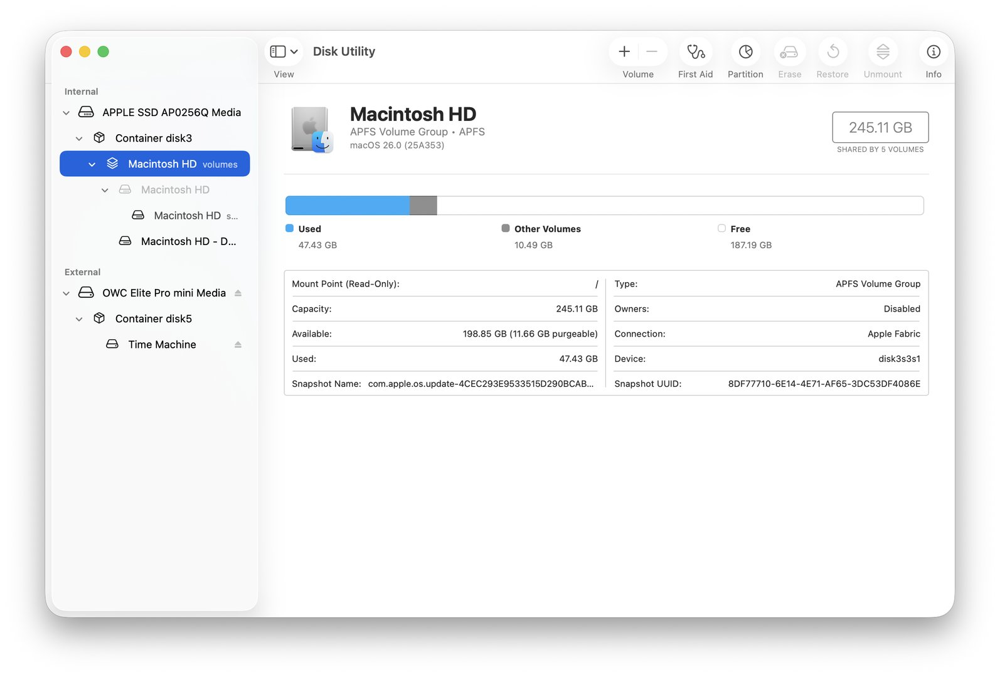
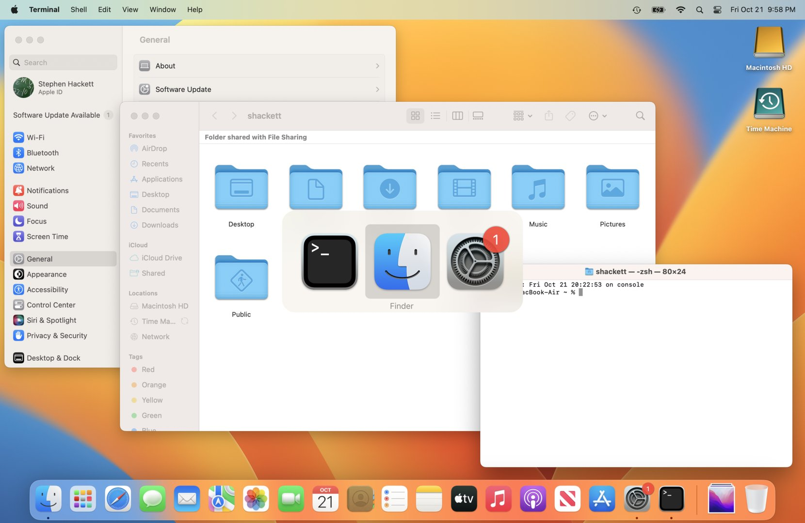
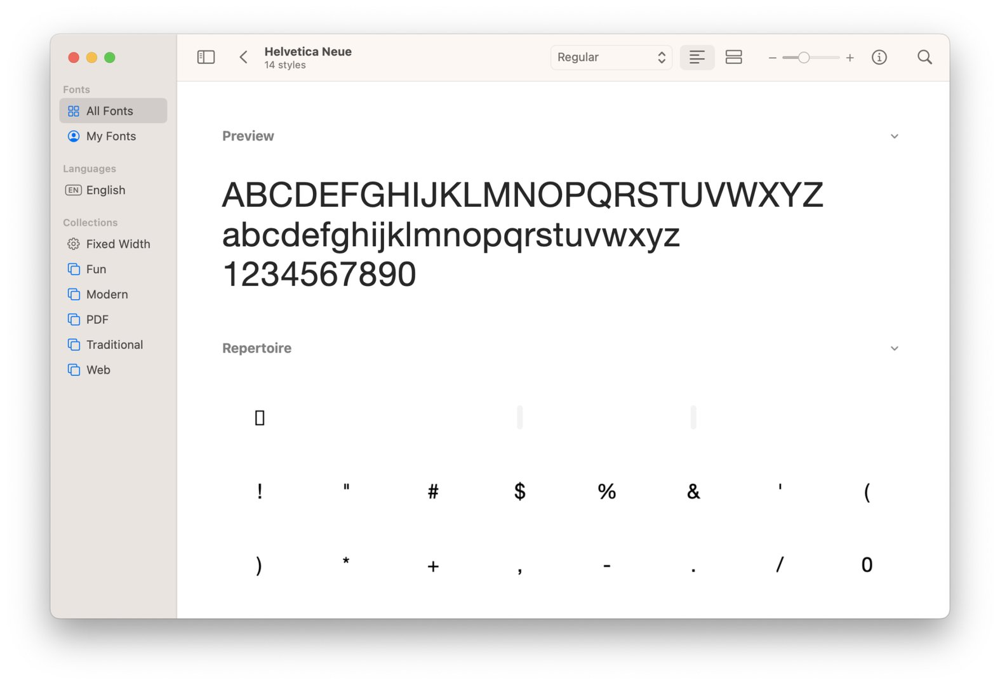
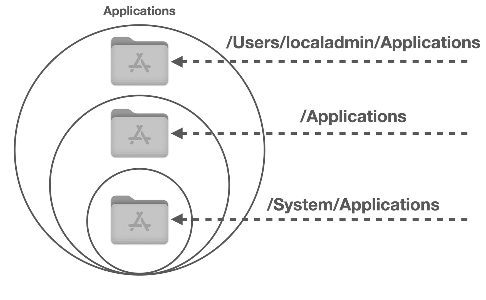
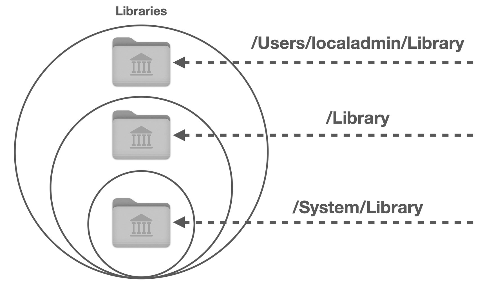

# Lesson 06: File System (APFS)
**Student Reference Guide**

---

## Lesson Objectives

* APFS Architecture & Dynamic Space Sharing
* System Volume Group (SVG) & Orphaned Volumes
* Firmlinks
* Spotlight Indexing & Live Text

---

## 🎧 Listen to the Recap — Pre or Post Lesson

<!-- NotebookLM Podcast from Captivate -->
<div style="width: 100%; height: 200px; margin-bottom: 20px; border-radius: 6px; overflow: hidden;"><iframe style="width: 100%; height: 200px;" frameborder="no" scrolling="no" allow="clipboard-write" seamless src="https://player.captivate.fm/episode/9f334406-f88d-4a75-9797-47bfdc6a6767/"></iframe></div>

---

## Key Concepts

| Concept | Explanation |
|---|---|
| **APFS** | Apple's modern File System. Engineered for high performance, dynamic space allocation, and robust data protection. |
| **Container** | The primary storage pool in APFS that manages the free space for all underlying volumes. Replaces rigid, legacy partitions. |
| **Volume** | A logical storage unit. Volumes dynamically share free space across the container without requiring pre-allocated sizing (Dynamic Space Sharing). |
| **Copy-on-Write (CoW)** | A critical data integrity mechanism that prevents data corruption by writing changes to new blocks before updating the reference pointer. |
| **Clones** | Creating exact copies on the same volume in a fraction of a second with **zero-storage overhead** until a modification occurs. The Finder handles this automatically behind the scenes. |
| **SVG (System Volume Group)** | The structural envelope that merges the System and Data volumes into what appears to the end-user as a single, unified drive. |
| **SSV (Signed System Volume)** | The cryptographically signed, read-only System partition. macOS boots from a verified snapshot, ensuring that no software or Admin can tamper with core system files. |
| **Firmlinks** | "Wormholes" — bi-directional links that seamlessly connect directories from the read-only System volume to the read-write Data volume for a transparent user experience. |
| **Orphaned Data Volume** | An edge case where the System and Data volumes become decoupled (often following a flawed restoration), leaving a stranded `Macintosh HD - Data` volume consuming unnecessary space. |
| **Spotlight Index & Live Text** | A hidden database (`.Spotlight-V100`) facilitating global search. In modern macOS versions, this process includes optical character recognition (OCR) on images, which can occasionally trigger prolonged background processing (Runaway Indexing). |
| **User / Local / Network / System Domains** | The architectural segregation defining data placement and permissions. Essential knowledge for troubleshooting configuration and resource access in multi-user enterprise environments. |
| **Enterprise Security** | Thanks to the SSV, there is no need for traditional AV suites to scan the System volume. It is crucial to exclude system paths to prevent Firmlink loops that can trigger system crashes. |

---

## Part 1 — APFS: Container, Volume, Clone

### Practical APFS Architecture

```text
Physical Disk
└── Container (disk3) ← The Shared Storage Pool
    ├── Volume: Macintosh HD (System) ← Read-Only, Cryptographically Signed
    ├── Volume: Macintosh HD - Data   ← Read-Write, User Data
    ├── Volume: Preboot
    ├── Volume: Recovery
    └── Volume: VM (Swap)
```

!!! important
    All volumes within a Container share the **exact same free space**. There is no need to define sizes in advance for each volume — macOS dynamically manages the allocation.

### Diagnostic Commands

```bash
# View APFS hierarchy
diskutil list
diskutil apfs list

# Add a volume with a specific Quota
diskutil apfs addVolume diskX APFS "NewVolumeName" -quota 50g

# Manually create a Clone (Zero-storage overhead)
cp -c /path/to/original /path/to/clone
```

---

## Part 2 — SSV and Firmlinks

### System Volume Group Structure

```text
"Macintosh HD" (How the Finder presents it)
        ↕ Firmlinks (Bi-directional seams)
┌─────────────────────┐    ┌─────────────────────┐
│   System Volume      │    │    Data Volume       │
│   (Read-Only)        │    │    (Read-Write)      │
│   Signed & Secured   │    │   User Data          │
└─────────────────────┘    └─────────────────────┘
```

!!! note
    Executing `sudo touch /System/test.txt` will return **"Read-only file system"** — this is not an error, it is the SSV security protection in action.

### SSV and Firmlinks Commands

```bash
# Verify the SSV is signed and sealed (Critical before enterprise AV deployment)
csrutil authenticated-root status

# View Firmlinks (The seams bridging System and Data)
cat /usr/share/firmlinks

# View Mount points (Identify the read-only volume)
mount
```

---

## Part 3 — File System Domains

### The Four Domains

| Domain | Path | Access | Usage |
|---|---|---|---|
| **User** | `~/Library/` | User Only | Preferences, Containers, Local Caches |
| **Local** | `/Library/` | All Users (Admin required for changes) | Shared Fonts, Daemons, Frameworks |
| **Network** | `/Network/Library/` | Enterprise Network | IT-provisioned resources |
| **System** | `/System/Library/` | Locked (SSV) | Core System Files — No Entry |

!!! tip "Common Field Scenario"
    A user installs a font via the GUI but only they can see it in applications. Why? The font was installed into the User Domain (`~/Library/Fonts`). To make it available to all users across the Mac, an Admin must move it to the Local Domain (`/Library/Fonts`).

### Accessing the User Library in the Finder

1. Open **Finder** → navigate to the **Go** menu in the menu bar.
2. Hold down the **Option (⌥)** key → the **Library** option will dynamically appear.
3. Click it → You are now inside your `~/Library`.

---

## Part 4 — Spotlight

### How Spotlight Works

```text
New File Created / Modified
        ↓
mdworker (Background Process)
        ↓
mdimporter plugin (Tailored to file type)
        ↓
.Spotlight-V100 (Database)
        ↓
Spotlight Search / Finder / "About This Mac"
```

### Spotlight Troubleshooting

```bash
# Check indexing status
sudo mdutil -s /

# Erase and rebuild index (Fixes inflated "System Data" storage reporting)
sudo mdutil -E /

# Check metadata of a specific file
mdimport -t -d3 /path/to/file.pdf
```

!!! note
    Following `sudo mdutil -E /`, you will observe the `mds_stores` and `photoanalysisd` processes spiking in Activity Monitor. This is expected behavior — the system is rebuilding the index, which may take hours or even days depending on the data volume.

---

## Part 5 — Enterprise Security

### What IT Professionals Need to Know

!!! important "Before deploying Enterprise AV/DLP on a Mac"
    1. Run `csrutil authenticated-root status` — if `enabled`, the System volume is **cryptographically signed and protected**. There is zero need to scan it.
    2. Configure Exclusions for system paths: `/System/`, `/usr/bin/`, `/usr/lib/`.
    3. Utilize `/usr/local/` (writable) for custom scripts — avoid `/usr/bin/` (locked).

!!! caution
    Legacy AV agents scanning without proper exclusions on a Mac with Firmlinks can enter an infinite loop, resulting in a **Kernel Panic**. Always ensure security agents are updated to versions officially supporting macOS Tahoe/Sequoia.

---

## Links and Further Reading

* [Use Disk Utility to repair a storage device](https://support.apple.com/en-il/guide/platform-support/sup9e89abfd4/web) — Official Apple Guide
* [How macOS depends on firmlinks](https://eclecticlight.co/2023/07/22/how-macos-depends-on-firmlinks/) — Deep dive into Firmlinks
* [Using and troubleshooting Spotlight in Sequoia](https://eclecticlight.co/2024/11/29/using-and-troubleshooting-spotlight-in-sequoia-summary/) — Spotlight Troubleshooting

---

## 🎬 Recap Video

<!-- YouTube Recap Video -->
<div style="margin-bottom: 20px; border-radius: 6px; overflow: hidden; box-shadow: 0 4px 6px rgba(0,0,0,0.1);">
    <iframe width="100%" height="450" src="https://www.youtube.com/embed/cBSnmMtt9ho" frameborder="0" allow="accelerometer; autoplay; clipboard-write; encrypted-media; gyroscope; picture-in-picture" allowfullscreen></iframe>
</div>

---

## Visual Aids

!!! tip "Visual Aids"
    These images illustrate the interfaces covered in this lesson.









---

## 💡 Presentation Visuals

!!! tip "Visual Demonstration (Student Aid)"
    These images illustrate the relevant interface or mechanism for the lesson topic.


