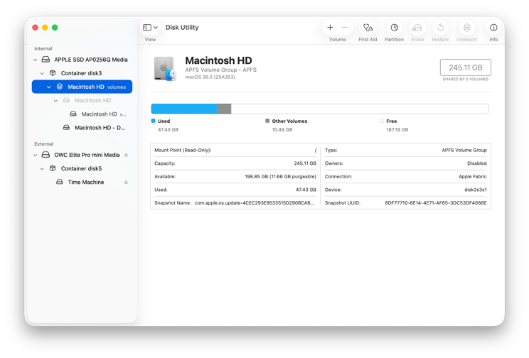
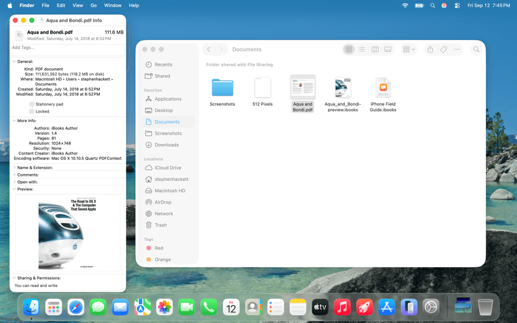

# שיעור 06 - חלק ג\': מדריך עזר לתלמיד

## מושגי מפתח (Key Concepts)


* **APFS (Apple File System):** מערכת הקבצים המודרנית של Apple המחליפה את HFS+. בנויה לביצועים גבוהים על כונני פלאש, הצפנה, שיתוף מקום דינמי והגנה על נתונים.
* **Container (מכולה):** השכבה הראשית ב-APFS שמנהלת את כל המקום הפנוי בדיסק. מחליפה למעשה את המחיצות (Partitions) הקשיחות של העבר.
* **Volume (כרך):** יחידת אחסון לוגית בתוך ה-Container. כרכים חולקים את המקום הפנוי עם שאר הכרכים במכולה וגדלים לפי הצורך ללא צורך בהגדרה מראש (Dynamic Space Sharing).
* **Copy-on-Write (CoW):** מנגנון קריטי ב-APFS המונע שחיתות נתונים בכך שמידע חדש נכתב לבלוקים ריקים לפני שהמצביע מתעדכן. מונע מצב של חצי-כתיבה.
* **Clones (שכפולים):** תכונה בולטת של APFS המאפשרת יצירת עותקים מדויקים של קבצים ותיקיות בתוך אותו כרך באופן מיידי. עותקים אלו (Clones) חולקים את אותם הבלוקים הפיזיים ולכן **אינם תופסים מקום נוסף בדיסק** עד שאחד מהם משתנה. Finder מבצע זאת אוטומטית. ניתן לכפות זאת עם הפקודה `cp -c`.
* **SVG (System Volume Group):** שילוב לוגי של כונן המערכת וכונן המידע לקבוצה אחת שמתנהגת ככונן רגיל וקלאסי (כמו Macintosh HD).
* **SSV (Signed System Volume):** מחיצת המערכת (System) שנעולה לקריאה בלבד וחתומה קריפטוגרפית להגנה מוחלטת מפני שינויים זדוניים או שגויים.
* **Firmlinks:** קישורים אקטיביים דו-כיווניים (מעין "חורי תולעת") שמחברים ספריות בכונן ה-System לספריות בכונן ה-Data, כך שעבור המשתמש נראה שמדובר במחיצה אחת.
* **Spotlight Index:** מסד נתונים סמוי (`.Spotlight-V100`) שמכיל את התוכן של רוב הקבצים בדיסק כדי לאפשר חיפוש מיידי וגלובלי.
* **mdworker / mds / mds_stores:** התהליכים ברקע שאחראים על כריית הנתונים מהקבצים ועדכון האינדקס של Spotlight.
* **User Domain:** המרחב האישי של המשתמש (Home Directory), מזוהה לרוב עם סימן הטילדה (`~`). המשתמש רשאי לשנות ולמחוק קבצים במרחב זה ללא צורך בהרשאות מנהל.
* **Local Domain:** המרחב המשותף לכלל המשתמשים במחשב (למשל תיקיית `/Applications`). שינוי קבצים כאן דורש סיסמת מנהל.
* **System Domain:** מרחב קבצי הליבה של מערכת ההפעלה. סגור לחלוטין לכתיבה.

## פקודות שימושיות (Cheat Commands)

### ניווט במרחבי המערכת (Domains Navigation)
```bash
# חזרה מהירה לתיקיית הבית (User Domain) מכל מקום במערכת
cd ~

# מעבר לתיקיית הספריה המשותפת לכלל המשתמשים (Local Domain)
cd /Library

# מעבר לתיקיית הספריה האישית המוסתרת (User Domain)
cd ~/Library
```

### אבחון APFS ו-Volumes
```bash
# הצגת רשימת הדיסקים, המכולות והכרכים במערכת
diskutil list

# הצגה מעמיקה של תצורת APFS (קבוצות כרכים, סטטוס הצפנה, תפקיד הכרך)
diskutil apfs list

# הוספת כרך חדש (Volume) בצורה דינמית מבלי לפרמט
diskutil apfs addVolume diskX APFS "NewVolumeName"

# שכפול קובץ כ-Clone באופן מיידי ללא תפיסת מקום (APFS Clone)
cp -c /path/to/original /path/to/clone

# השוואת הגודל "הלוגי" של הקבצים מול המקום "הפיזי" שהם תופסים באמת
ls -lh /path/to/clone
du -h /path/to/clone

# הצגת נתיבי ה-Firmlinks במערכת
cat /usr/share/firmlinks

# בדיקת סטאטוס חתימת מחיצת המערכת המאומתת
csrutil authenticated-root status
```

### ניהול ואבחון Spotlight
```bash
# בדיקה האם Spotlight מופעל על כונן ה-Root
sudo mdutil -s /

# מחיקה ובנייה מחדש של אינדקס ה-Spotlight (לפתרון תקלות "System Data" חריג)
sudo mdutil -E /

# רשימת כל הפלאגינים (MDImporters) המותקנים במערכת
mdimport -L

# סריקה ופליטת נתוני המטא-דאטה של קובץ ספציפי (לאיתור באגים בחיפוש)
mdimport -t -d3 /path/to/specific/file.pdf
```

## Recommended Reading & Enrichment Links

* **Apple Platform Support:** Use Disk Utility - [Link](https://support.apple.com/en-il/guide/platform-support/sup9e89abfd4/web)
* **The Eclectic Light Company:** A brief history of APFS in honour of its fifth birthday - [Link](https://eclecticlight.co/2022/04/01/a-brief-history-of-apfs-in-honour-of-its-fifth-birthday/)
* **The Eclectic Light Company:** How macOS depends on firmlinks - [Link](https://eclecticlight.co/2023/07/22/how-macos-depends-on-firmlinks/)
* **The Eclectic Light Company:** Using and troubleshooting Spotlight in Sequoia: summary - [Link](https://eclecticlight.co/2024/11/29/using-and-troubleshooting-spotlight-in-sequoia-summary/)


## 💡 עזרים ויזואליים להרצאה (Presentation Visuals)

!!! tip "שימוש למדריך"
    תמונות אלו ניתנות להקרנה בכיתה בעת הסבר על הנושא, או לשילוב במצגות.





