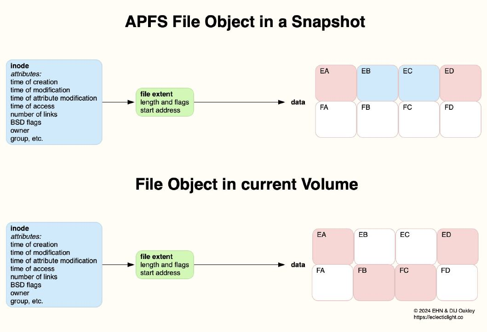

# Lesson 07 Asset C: סיכום שיעור (Time Machine & Snapshots)

## 1. נושאי השיעור

*   **1.** **תמונות מצב (Snapshots):** גיבוי מקומי ב-APFS וחזרה מהירה לנקודות זמן קודמות.
*   **2.** **Time Machine:** לוגיקת הגיבוי והארכיטקטורה מול כוננים חיצוניים.
*   **3.** **שחזור קבצים:** תרגול חילוץ מידע מגיבוי קיים במקרי אסון (Disaster Recovery).
*   **4.** **תיבול ארגוני:** האם נדרש Time Machine בסביבה עננית מודרנית?

## 2. מושגי יסוד (Core Concepts)

**השוואה: אבולוציית הגיבוי של Time Machine**
| תכונה | Time Machine קלאסי (HFS+) | Time Machine מודרני (APFS) |
| :--- | :--- | :--- |
| **בסיס טכנולוגי** | Directory Hard Links (יצירת אשליה של גיבוי מלא) | Synthetic APFS Snapshots |
| **מערכת קבצים ביעד** | HFS+ | APFS |
| **יעילות העתקה** | יצירת מיליוני קישורים קשיחים לקבצים שלא השתנו | מסתמך על Delta-copying ברמת הבלוק (מהיר וחוסך מקום) |
| **אמינות לטווח ארוך** | קריסה שכיחה תחת עומס ה-Hard Links | יציבות גבוהה בזכות תמונות מצב טבעיות של המערכת |

* **Time Machine:** מנגנון הגיבוי המובנה של macOS. שומר עותקים היסטוריים של קבצים, מאפשר שחזור קבצים בודדים או מערכת שלמה.
* **APFS Snapshots:** הקפאה של מצב מערכת הקבצים בנקודת זמן מסוימת ב-APFS. מאפשר שחזור מיידי (Rollback) ללא צורך בהעתקת נתונים ארוכה. 
* **Local Snapshots:** Snapshots הנשמרות על הכונן המקומי עצמו (ה-Data Volume). נוצרות אוטומטית כגיבוי ביניים או לפני עדכוני מערכת. הן נמחקות אוטומטית כשהמקום בדיסק אוזל.
* **Backup Destination:** הכונן החיצוני (כונן USB, Thunderbolt, NAS, או שרת SMB תואם Time Machine) שמוגדר לאחסון הגיבוי. החל מ-macOS Big Sur, יעדי הגיבוי מפורמטים אוטומטית למערכת הקבצים APFS.
* **Mobile Time Machine:** התנהגות שבה ה-Mac ממשיך ליצור ולשמור Local Snapshots גם כשהכונן החיצוני מנותק, כדי לשמור על רצף היסטורי שאותו יסנכרן מול כונן היעד ברגע שיחובר.
* **Rollback:** פעולת החזרה אחורה בזמן ל-Snapshot קודם. במערכת APFS הפעולה קורית כמעט במיידית בגלל תכונות שיתוף הבלוקים של המערכת (Copy-on-Write).
* **Migration Assistant:** כלי שירות להעברת נתונים, חשבונות משתמשים והגדרות מ-Mac ישן, מגיבוי Time Machine, או מ-PC (במהלך OOBE או לאחריו).
* **Erase Assistant / Erase All Content and Settings (EACS):** כלי מובנה ב-System Settings (תחת General -> Transfer or Reset) שמאפשר למחוק את ה-Data Volume ואת המפתחות הקריפטוגרפיים במהירות כדי להחזיר את ה-Mac למצב יצרן - ללא צורך בהתקנה מחדש של ה-OS.

## 3. מילון פקודות טרמינל מתקדם (`tmutil`)

כלי שורת הפקודה `tmutil` (Time Machine Utility) הוא דרך רבת-עוצמה לניהול, אבחון ושליטה על גיבויי Time Machine ותמונות מצב של APFS.
*(שימו לב: חלק מהפקודות המחוללות שינוי דורשות הרשאות `sudo`)*.

### ניהול בסיסי וסטטוס (Basic Management)
* `tmutil status`
  * מציג את הסטטוס הנוכחי של הגיבוי בזמן אמת (מראה אם גיבוי רץ כרגע, אחוזי ההתקדמות, והנתיב של היעד).
* `tmutil startbackup`
  * מתחיל מיד גיבוי Time Machine ליעד המוגדר. הוספת דגל `--block` תריץ את הגיבוי בחזית והפקודה תסתיים רק כאשר הגיבוי יושלם. הדגל `--auto` ידמה הפעלה אוטומטית של המערכת (שכוללת גם דלדול Snapshots לפי הצורך).
* `tmutil stopbackup`
  * עוצר גיבוי שנמצא כרגע בתהליך ריצה.
* `tmutil listbackups`
  * מדפיס רשימה מסודרת של כל הגיבויים הקיימים והמוכרים למערכת (שמורים ביעד הגיבוי).
* `tmutil latestbackup`
  * מדפיס את הנתיב המלא של הגיבוי האחרון שהסתיים בהצלחה.
* `tmutil destinationinfo`
  * מציג מידע ונתונים על כל כונני היעד שמוגדרים כעת לגיבוי Time Machine (כולל מזהים של היעדים).

### החרגות מגיבוי (Exclusions)
* `tmutil addexclusion /path/to/folder_or_file`
  * מחריג באופן קבוע קובץ או תיקייה מגיבוי. הפקודה מטמיעה Extended Attribute שמסמן ל-backupd לדלג על נתיב זה. (כדי להחריג קבצי מערכת חובה להשתמש ב-`sudo`).
* `tmutil removeexclusion /path/to/folder_or_file`
  * מסיר את תגית ההחרגה של הקובץ או התיקייה, כך שהם יגובו שוב בגיבוי הבא.
* `tmutil isexcluded /path/to/folder_or_file`
  * בודק ומחזיר פלט שמציין האם נתיב ספציפי מוחרג כרגע מגיבוי.

### Snapshots מקומיות (Local Snapshots)
* `tmutil listlocalsnapshots /`
  * מציג רשימה של כל ה-Local Snapshots השמורים על כונן המערכת הנוכחי (ה-Root - `/`).
* `tmutil localsnapshot`
  * יוצר Snapshot מקומית באופן מיידי (שימושי לפני ביצוע שינוי מהותי במערכת כרשת ביטחון).
* `sudo tmutil deletelocalsnapshots <date>`
  * מוחק Snapshot ספציפית על בסיס תאריך שהתקבל בפקודת הרשימה (לדוגמה `2026-05-10-153020`).
* `tmutil thinlocalsnapshots / <purge_amount_bytes> <urgency_1_to_4>`
  * אילוץ המערכת לדלל Snapshots כדי לפנות מקום בכונן (דחיפות 4 היא המהירה ביותר לעצירת תהליכים נלווים).

### אבחון וניתוח נתונים (Diagnostics & Analysis)
* `tmutil calculatedrift /path/to/backup1 /path/to/backup2`
  * מחשב מה השתנה (נוסף, הוסר, השתנה) בין שני גיבויים שונים במטרה להבין מדוע גיבוי אחרון תופס הרבה מקום.
* `tmutil compare`
  * מבצע השוואה מלאה בין המצב הנוכחי של המערכת (הדיסק) לבין הגיבוי האחרון שבוצע.

## 4. כלים ותהליכי רקע רלוונטיים במערכת (Daemons & Tools)

* `backupd`: תהליך הרקע המרכזי והפנימי של Time Machine שמנהל את פעולות ההעתקה והניהול מול יעדי הגיבוי.
* `diskutil apfs listSnapshots /`: פקודת `diskutil` המשמשת ככלי אבחון ברמת ה-APFS להצגת Snapshots על הדיסק ברמה הטכנית והעמוקה ביותר.
* `System Settings -> General -> Time Machine`: ממשק המשתמש הגרפי (GUI) להגדרת התדירות, הוספת החרגות וניהול כוננים בארגון פשוט.

## 5. זווית ארגונית (Enterprise Seasoning)

* **הימנעות מגיבויים מקומיים:** בארגונים מודרניים קיימת נטייה לוותר על Time Machine למשתמשי קצה בגלל עלויות חומרה והקושי לאבטח כוננים ניידים שעלולים להיאבד או להיגנב.
* **גיבוי ענן כחלופה (Cloud Storage):** שימוש בשירותים מבוססי סנכרון כגון OneDrive, Google Drive או Box מועדף ומפוקח באמצעות פרופילי MDM, כאשר הנתונים תמיד מסונכרנים והשחזור למחשב חלופי מתבצע ברגע שמחברים חשבון MAID.
* **מגבלות פרופיל ע"י MDM:** ניתן דרך MDM להגביל משתמשים מלבצע שחזורים, לשלוט על יכולות Erase Assistant כדי למנוע מחיקת מחשבים לפני מסירתם למחלקת IT, או לכפות על המערכת שלא להחריג נתיבים רגישים שמנהל הרשת רוצה לגבות בהכרח אם עדיין נעשה שימוש ב-Time Machine או בכונני רשת כגיבוי.

## קישורים מומלצים ולקריאה נוספת
* [Back up your Mac with Time Machine](https://support.apple.com/en-us/HT201250) - מדריך בסיסי למשתמש על הפעלת מערכת הגיבויים טיים משין.
* [Restore your Mac from a backup](https://support.apple.com/en-us/HT203981) - מדריך למשתמש איך לשחזר קבצים מגיבוי קודם.
* [About Time Machine local snapshots](https://support.apple.com/en-us/HT204015) - הסבר קצר על מנגנון הסנאפשוטים המקומיים כשכונן הגיבוי לא מחובר.
* [Mac backups (Apple Platform Support)](https://support.apple.com/guide/platform-support/mac-backups-supc05405716/web) - מאמר למנהלי מערכת על מדיניות גיבוי בארגון.
* [Erase Apple devices](https://support.apple.com/guide/deployment/erase-apple-devices-dep8bb2f3590/web) - תיעוד ארגוני על מחיקה ואיפוס מאובטח של מחשבים מרחוק.
* [A brief history of Time Machine](https://eclecticlight.co/2021/04/19/a-brief-history-of-time-machine/) - סקירה היסטורית על התפתחות הטיים משין לאורך השנים.
* [Snapshots aren't backups](https://eclecticlight.co/2021/02/16/snapshots-arent-backups/) - מאמר דעה טכני שמסביר למה אסור להסתמך על סנאפשוטים כתחליף לגיבוי אמיתי.
* [Understand and check Time Machine backups to APFS](https://eclecticlight.co/2021/03/25/understand-and-check-time-machine-backups-to-apfs/) - מאמר עומק טכני על איך טיים משין מנצל את מנגנוני APFS לגיבוי מהיר.

> **Visual Aid from DeepDive:**
> 

