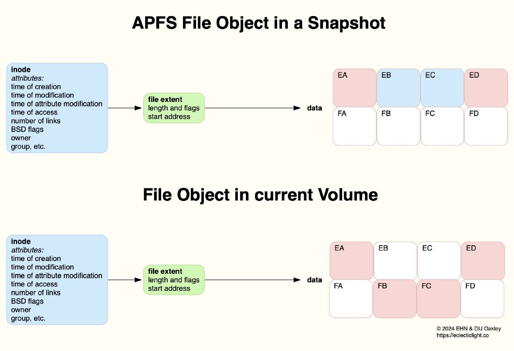
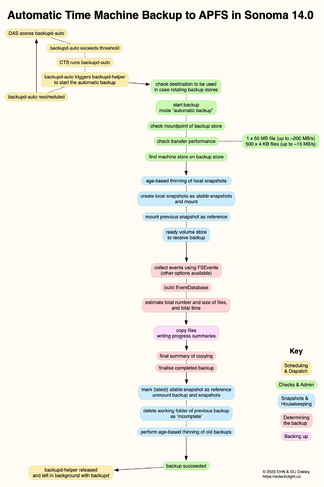
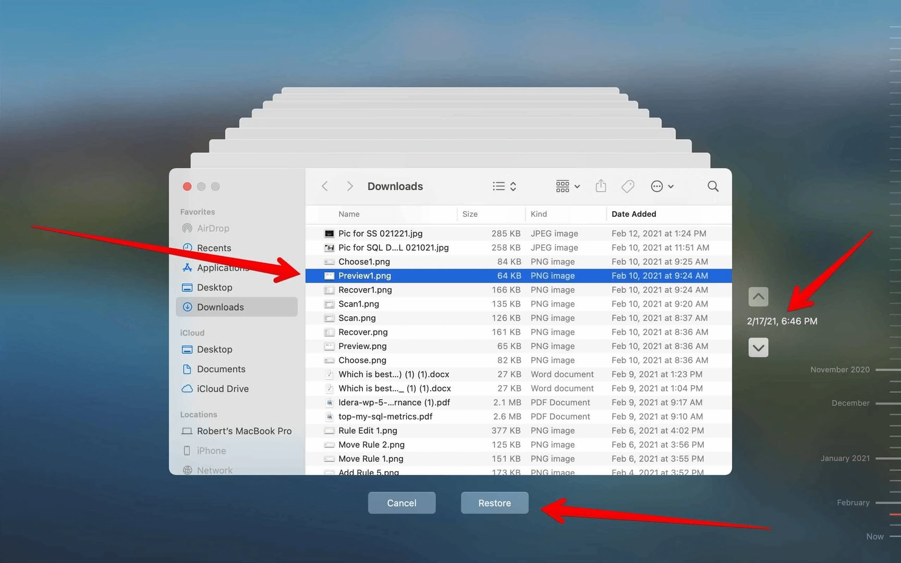
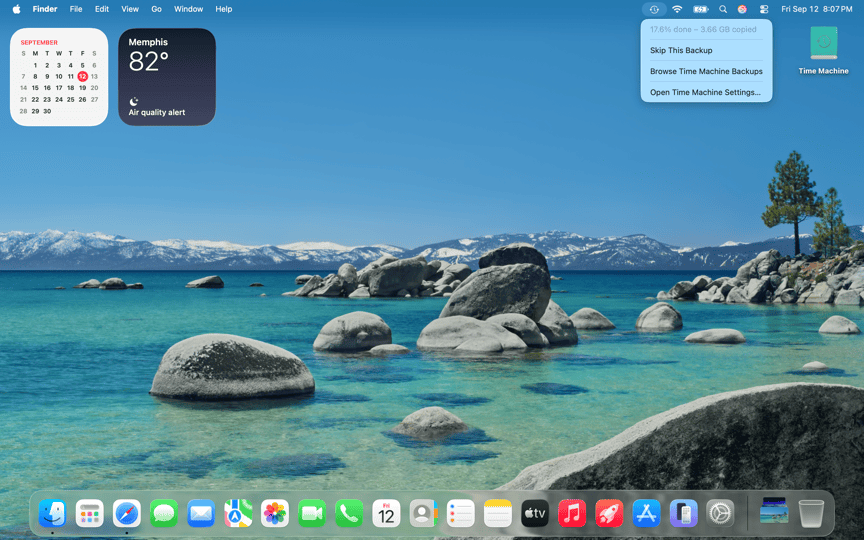
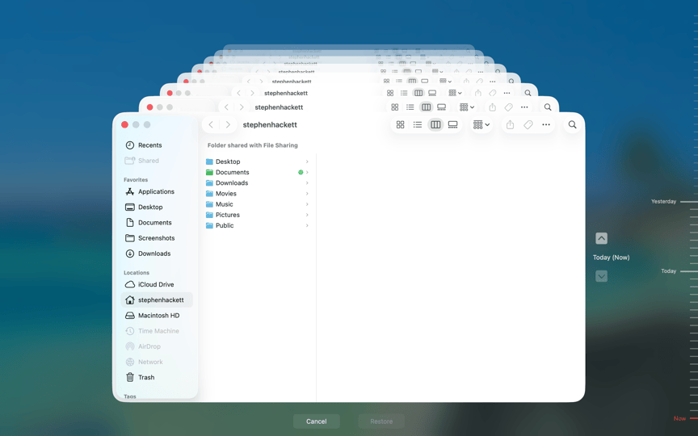

# שיעור 07: גיבוי ושחזור
**מדריך עזר לתלמיד**

## מטרות השיעור

* תמונות מצב (Snapshots)
* גיבוי Time Machine
* שחזור קבצים והתאוששות
* גיבוי בסביבה ארגונית

## 🎧 האזנה לסיכום

<!-- פודקאסט NotebookLM מתוך Captivate -->
<div style="width: 100%; height: 200px; margin-bottom: 20px; border-radius: 6px; overflow: hidden;"><iframe style="width: 100%; height: 200px;" frameborder="no" scrolling="no" allow="clipboard-write" seamless src="https://player.captivate.fm/episode/5ae70462-ee1b-458a-b1f0-967157554d1f/"></iframe></div>

## מושגי מפתח

| מושג | הסבר |
|---|---|
| **מכונת הזמן (Time Machine)** | מנגנון הגיבוי המובנה של macOS. שומר עותקים היסטוריים של קבצים, מאפשר שחזור קבצים בודדים או מערכת שלמה. |
| **APFS Snapshots** | הקפאה של מצב מערכת הקבצים בנקודת זמן מסוימת ב-APFS. מאפשר שחזור מיידי (Rollback) ללא צורך בהעתקת נתונים ארוכה. |
| **Local Snapshots** | Snapshots הנשמרות על הכונן המקומי עצמו (ה-Data Volume). נוצרות אוטומטית כגיבוי ביניים או לפני עדכוני מערכת. הן נמחקות אוטומטית כשהמקום בדיסק אוזל. |
| **Synthetic Snapshots** | תמונות המצב שנבנות בסוף תהליך הגיבוי על הכונן החיצוני, כחיבור של הבלוקים שהשתנו. |
| **Migration Assistant** | כלי שירות להעברת נתונים, חשבונות משתמשים והגדרות מ-Mac ישן, מגיבוי Time Machine (באמצעות Synthetic Snapshot), או מ-PC. |
| **FileProvider Framework** | מנגנון המערכת (API) המאפשר לשירותי ענן כמו OneDrive להציג קבצים שקיימים רק בענן ("Dataless files") ולהורידם רק בעת הצורך. |
| **backupd** | תהליך הרקע המרכזי של Time Machine המנהל את העתקות הדלתא והגיבויים. |

## חלק 1 — Snapshots (תמונות מצב): איך פועל הגיבוי המקומי ב-APFS (Rollbacks)

!!! note
    מנגנון ה-Snapshots מנקה את עצמו אוטומטית (Purgeable Space). אם הכונן מגיע ל-80% תפוסה (או מעט מקום פנוי), המערכת תמחק Snapshots ישנים.

    *← המנגנון הפנימי של APFS Snapshots נלמד לעומק בשיעור 06 (FileSystem) — כאן רואים איך Time Machine סומך על אותו מנגנון כדי לשמור גיבויים מקומיים.*

### פקודות לניהול Local Snapshots

```bash
# הצגת רשימה של כל ה-Local Snapshots השמורים על כונן המערכת
tmutil listlocalsnapshots /

# יצירת Snapshot מקומית באופן מיידי (שימושי לפני שינוי מהותי במערכת)
tmutil localsnapshot

# אילוץ המערכת לדלל Snapshots כדי לפנות מקום בכונן (דוגמה זו מפנה כ-10GB בדחיפות 4 המהירה ביותר)
tmutil thinlocalsnapshots / 10000000000 4

# הצגת Snapshots ברמה נמוכה (diskutil)
diskutil apfs listSnapshots /
```

## חלק 2 — Time Machine: לוגיקת הגיבוי למקור חיצון

**השוואה: אבולוציית הגיבוי של Time Machine**
| תכונה | Time Machine קלאסי (HFS+) | Time Machine מודרני (APFS) |
| :--- | :--- | :--- |
| **בסיס טכנולוגי** | Directory Hard Links (יצירת אשליה של גיבוי מלא) | Synthetic APFS Snapshots |
| **מערכת קבצים ביעד** | HFS+ | APFS |
| **יעילות העתקה** | יצירת מיליוני קישורים קשיחים לקבצים שלא השתנו | מסתמך על Delta-copying ברמת הבלוק (מהיר וחוסך מקום) |
| **אמינות לטווח ארוך** | קריסה שכיחה תחת עומס ה-Hard Links | יציבות גבוהה בזכות תמונות מצב טבעיות של המערכת |

!!! important "הצפנת כונן הגיבוי"
    כונן לא מוצפן שנישא בתיק מהווה פרצת אבטחה אדירה. לעולם אל תגבו לאמצעי חיצוני ללא הפעלת Encrypt Backup!

    *← הצפנת הכונן מבוססת על אותו VEK/AES-XTS שנלמד בשיעור 04 (הצפנה/FileVault) — ההבדל: בגיבוי חיצוני אתם מגדירים סיסמא נפרדת לפתיחת הכונן בעתיד.*

### ניהול Time Machine דרך הטרמינל (חלק מהפקודות דורשות `sudo`)

```bash
# הסטטוס הנוכחי של הגיבוי בזמן אמת
tmutil status

# התחלת גיבוי והשהיית הטרמינל עד להשלמתו
tmutil startbackup --block

# רשימה מסודרת של כל הגיבויים הקיימים המוכרים למערכת ביעד
tmutil listbackups

# מידע ונתונים על כונני היעד המוגדרים כעת
tmutil destinationinfo

# החריגו באופן קבוע קובץ או תיקייה מגיבוי
tmutil addexclusion /path/to/folder_or_file

# הסירו את תגית ההחרגה
tmutil removeexclusion /path/to/folder_or_file

# חילצו לוגים מדויקים כדי להבין עיכובים כמו Deep Traversal Scans
log show --predicate 'subsystem == "com.apple.TimeMachine"' --info --last 4h
```

## חלק 3 — שחזור קבצים: חילוץ קבצים ספציפיים או שחזור מערכת כולל

!!! caution "שמות חשבונות (Account Names)"
    אסור ליצור חשבון זמני (למשל, בשם "john") במחשב החדש, ואז לנסות להגר את החשבון המקורי "john" מגיבוי ה-Time Machine שלכם (בעזרת Migration Assistant). זה ייצור התנגשות מערכתית נוראית.

## חלק 4 — תיבול ארגוני: האם בכלל צריך Time Machine בסביבה ארגונית מנוהלת ענן?

!!! tip "המחשב בר-החלוף (Ephemeral Device)"
    בארגונים מודרניים תחת Zero-Trust, נמנעים מכוננים ניידים ועוברים לשימוש מוחלט בשירותי סנכרון ענן (OneDrive, Google Drive). הגישה היא גיבוי בענן והתקנה מרחוק (Zero-Touch) אם המחשב נהרס.

    **ההתנגשות (FileProvider Clash):** קבצים בענן (Dataless) עלולים ליצור עומס קריטי אם Time Machine ינסה לגבות אותם ויכריח את ה-Mac להוריד טרה-בייטים של נתונים מהענן. לכן לרוב אוכפים דרך ה-MDM פרופיל עם `restrictTimeMachine`.

## קישורים ולקריאה נוספת

* [Back up your Mac with Time Machine](https://support.apple.com/en-us/HT201250)
* [Restore your Mac from a backup](https://support.apple.com/en-us/HT203981)
* [About Time Machine local snapshots](https://support.apple.com/en-us/HT204015)
* [Mac backups (Apple Platform Support)](https://support.apple.com/guide/platform-support/mac-backups-supc05405716/web)
* [Erase Apple devices](https://support.apple.com/guide/deployment/erase-apple-devices-dep8bb2f3590/web)
* [A brief history of Time Machine](https://eclecticlight.co/2021/04/19/a-brief-history-of-time-machine/)

## 🎬 סרטון סיכום

<!-- סרטון סיכום מתוך YouTube -->
<div style="margin-bottom: 20px; border-radius: 6px; overflow: hidden; box-shadow: 0 4px 6px rgba(0,0,0,0.1);">
    <iframe width="100%" height="450" src="https://www.youtube.com/embed/OXYBpCK91Lg" frameborder="0" allow="accelerometer; autoplay; clipboard-write; encrypted-media; gyroscope; picture-in-picture" allowfullscreen></iframe>
</div>

---

## עזרים ויזואליים

!!! tip "המחשה ויזואלית (עזר לתלמיד)"
    תמונות אלו ממחישות את הממשק או המנגנון הרלוונטי לנושא השיעור.






