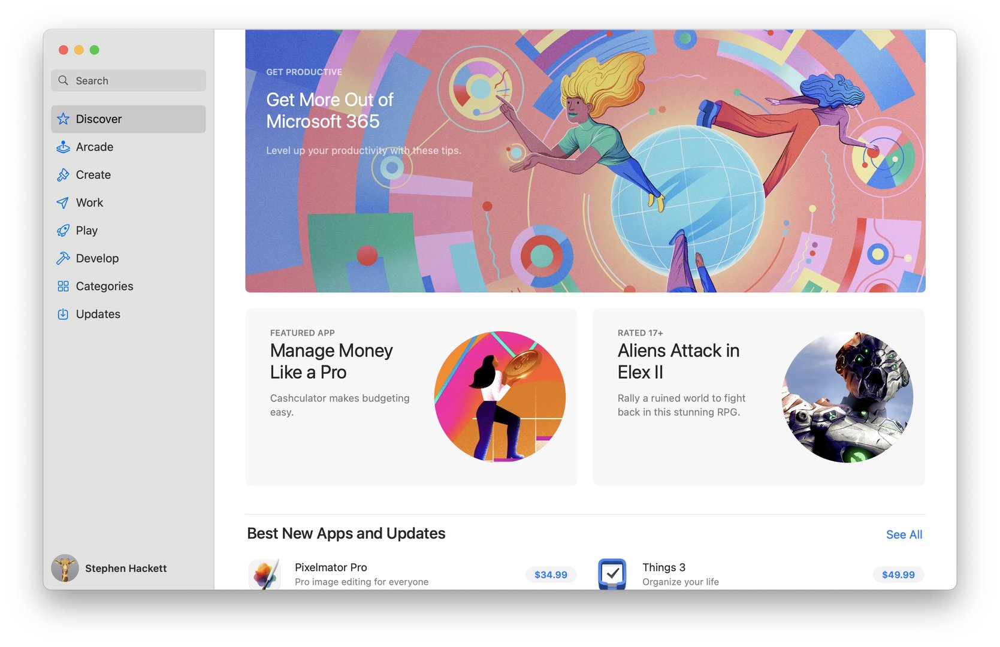
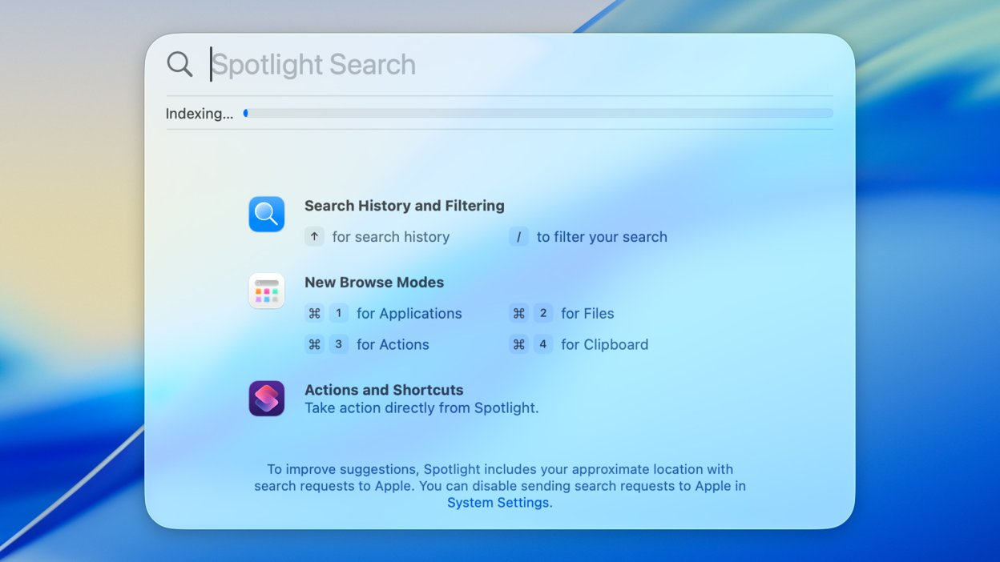
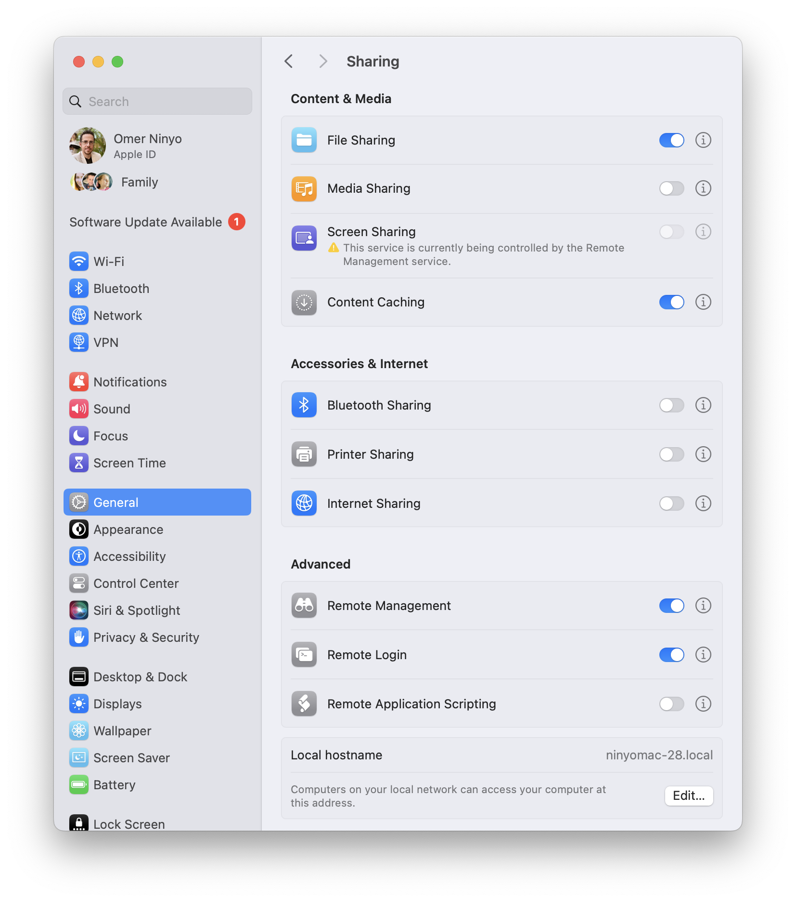

# שיעור 07: גיבוי ושחזור
**מדריך עזר לתלמיד (vEXP)**

## מטרות השיעור

* תמונות מצב (Snapshots)
* גיבוי Time Machine
* שחזור קבצים והתאוששות
* גיבוי בסביבה ארגונית
**[Image Recommendation]:** A minimalist vector clock face rotating backwards with a hard drive symbol in the background.

## סקירה

<!-- פודקאסט NotebookLM מתוך Captivate -->

<iframe style="width: 100%; height: 200px;" frameborder="no" scrolling="no" allow="clipboard-write" seamless src="https://player.captivate.fm/episode/5ae70462-ee1b-458a-b1f0-967157554d1f/"></iframe>

## מושגי יסוד (Core Concepts)

**השוואה: אבולוציית הגיבוי של Time Machine**
| תכונה | Time Machine קלאסי (HFS+) | Time Machine מודרני (APFS) |
| :--- | :--- | :--- |
| **בסיס טכנולוגי** | Directory Hard Links (יצירת אשליה של גיבוי מלא) | Synthetic APFS Snapshots |
| **מערכת קבצים ביעד** | HFS+ | APFS |
| **יעילות העתקה** | יצירת מיליוני קישורים קשיחים לקבצים שלא השתנו | מסתמך על Delta-copying ברמת הבלוק (מהיר וחוסך מקום) |
| **אמינות לטווח ארוך** | קריסה שכיחה תחת עומס ה-Hard Links | יציבות גבוהה בזכות תמונות מצב טבעיות של המערכת |

* **מכונת הזמן (Time Machine):** מנגנון הגיבוי המובנה של macOS. שומר עותקים היסטוריים של קבצים, מאפשר שחזור קבצים בודדים או מערכת שלמה.
* **APFS Snapshots:** הקפאה של מצב מערכת הקבצים בנקודת זמן מסוימת ב-APFS. מאפשר שחזור מיידי (Rollback) ללא צורך בהעתקת נתונים ארוכה.
* **Local Snapshots:** Snapshots הנשמרות על הכונן המקומי עצמו (ה-Data Volume). נוצרות אוטומטית כגיבוי ביניים או לפני עדכוני מערכת. הן נמחקות אוטומטית כשהמקום בדיסק אוזל.
* **Synthetic Snapshots:** תמונות המצב שנבנות בסוף תהליך הגיבוי על הכונן החיצוני, כחיבור של הבלוקים שהשתנו.
* **Migration Assistant:** כלי שירות להעברת נתונים, חשבונות משתמשים והגדרות מ-Mac ישן, מגיבוי Time Machine (באמצעות Synthetic Snapshot), או מ-PC.
* **FileProvider Framework:** מנגנון המערכת (API) המאפשר לשירותי ענן כמו OneDrive להציג קבצים שקיימים רק בענן ("Dataless files") ולהורידם רק בעת הצורך.

## מילון פקודות טרמינל מתקדם (`tmutil`)

כלי שורת הפקודה `tmutil` (Time Machine Utility) הוא דרך רבת-עוצמה לניהול, אבחון ושליטה על גיבויי Time Machine ותמונות מצב של APFS. *(שימו לב: חלק מהפקודות דורשות הרשאות `sudo`)*.

### ניהול בסיסי וסטטוס (Basic Management)
* `tmutil status`: מציג את הסטטוס הנוכחי של הגיבוי בזמן אמת.
* `tmutil startbackup --block`: מתחיל מיד גיבוי ומשהה (Blocks) את הטרמינל עד להשלמתו.
* `tmutil listbackups`: מדפיס רשימה מסודרת של כל הגיבויים הקיימים המוכרים למערכת ביעד.
* `tmutil destinationinfo`: מציג מידע ונתונים על כונני היעד המוגדרים כעת.

### החרגות מגיבוי (Exclusions)
* `tmutil addexclusion /path/to/folder_or_file`: מחריג באופן קבוע קובץ או תיקייה מגיבוי.
* `tmutil removeexclusion /path/to/folder_or_file`: מסיר את תגית ההחרגה כך שהקובץ יגובה שוב.

### Snapshots מקומיות (Local Snapshots)
* `tmutil listlocalsnapshots /`: מציג רשימה של כל ה-Local Snapshots השמורים על כונן המערכת הנוכחי.
* `tmutil localsnapshot`: יוצר Snapshot מקומית באופן מיידי (שימושי לפני שינוי מהותי במערכת).
* `tmutil thinlocalsnapshots / 10000000000 4`: אילוץ המערכת לדלל Snapshots כדי לפנות מקום בכונן (דוגמה זו מפנה כ-10GB בדחיפות 4 המהירה ביותר).

### אבחון וניתוח (Diagnostics)
* `log show --predicate 'subsystem == "com.apple.TimeMachine"' --info --last 4h`: מחלץ לוגים מדויקים כדי להבין עיכובים כמו Deep Traversal Scans.

## כלים ותהליכי רקע רלוונטיים במערכת (Daemons & Tools)

* `backupd`: תהליך הרקע המרכזי של Time Machine המנהל את העתקות הדלתא והגיבויים.
* `diskutil apfs listSnapshots /`: פקודת `diskutil` המשמשת כאבחון ברמת ה-APFS להצגת Snapshots ברמה נמוכה.
* **System Settings -> General -> Time Machine**: ממשק המשתמש הגרפי להגדרת גיבויים.

## זווית ארגונית (Enterprise Seasoning)

* **המחשב בר-החלוף (Ephemeral Device):** בארגונים מודרניים תחת Zero-Trust, נמנעים מכוננים ניידים ועוברים לשימוש מוחלט בשירותי סנכרון ענן (OneDrive, Google Drive). הגישה היא גיבוי בענן והתקנה מרחוק (Zero-Touch) אם המחשב נהרס.
* **ההתנגשות (FileProvider Clash):** קבצים בענן (Dataless) עלולים ליצור עומס קריטי אם Time Machine ינסה לגבות אותם ויכריח את ה-Mac להוריד טרה-בייטים של נתונים מהענן.
* **הגבלות MDM:** מנהלי רשת לרוב פורסים פרופיל עם הערך `restrictTimeMachine` כדי לנטרל את היכולת לגבות מקומית, או לחלופין כופים בעזרת `forceEncryptedTimeMachineBackups` שהגיבויים יבוצעו להצפנה בלבד עבור משתמשים כבדים שחייבים אותם.

## קישורים מומלצים ולקריאה נוספת

* [Back up your Mac with Time Machine](https://support.apple.com/en-us/HT201250)
* [Restore your Mac from a backup](https://support.apple.com/en-us/HT203981)
* [About Time Machine local snapshots](https://support.apple.com/en-us/HT204015)
* [Mac backups (Apple Platform Support)](https://support.apple.com/guide/platform-support/mac-backups-supc05405716/web)
* [Erase Apple devices](https://support.apple.com/guide/deployment/erase-apple-devices-dep8bb2f3590/web)
* [A brief history of Time Machine](https://eclecticlight.co/2021/04/19/a-brief-history-of-time-machine/)

## סרטון סיכום

<!-- סרטון סיכום מתוך YouTube -->

    <iframe width="100%" height="450" src="https://www.youtube.com/embed/OXYBpCK91Lg" frameborder="0" allow="accelerometer; autoplay; clipboard-write; encrypted-media; gyroscope; picture-in-picture" allowfullscreen></iframe>

!!! tip "המחשה ויזואלית (עזר לתלמיד)"
    תמונות אלו ממחישות את הממשק או המנגנון הרלוונטי לנושא השיעור.

