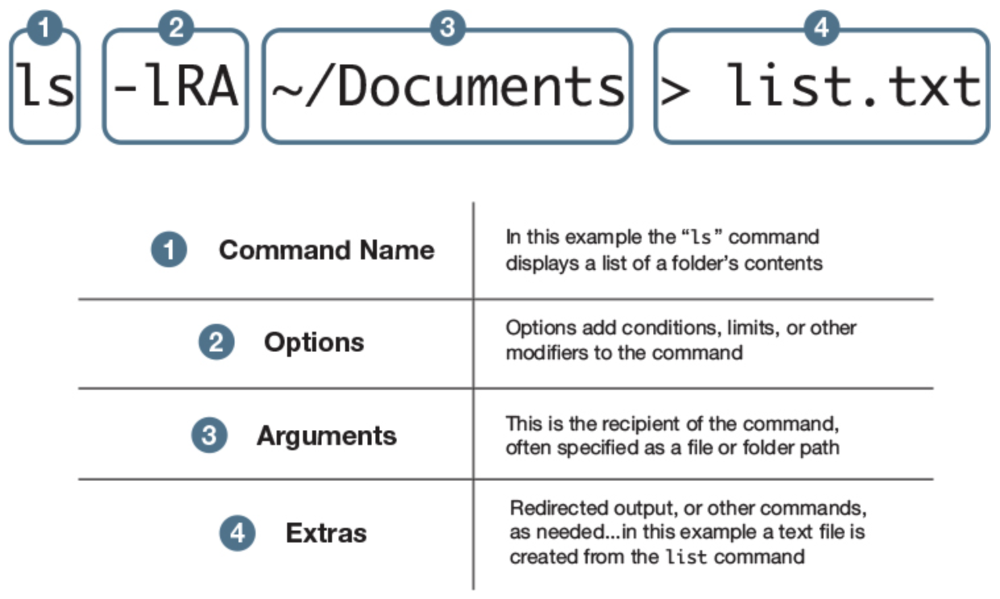
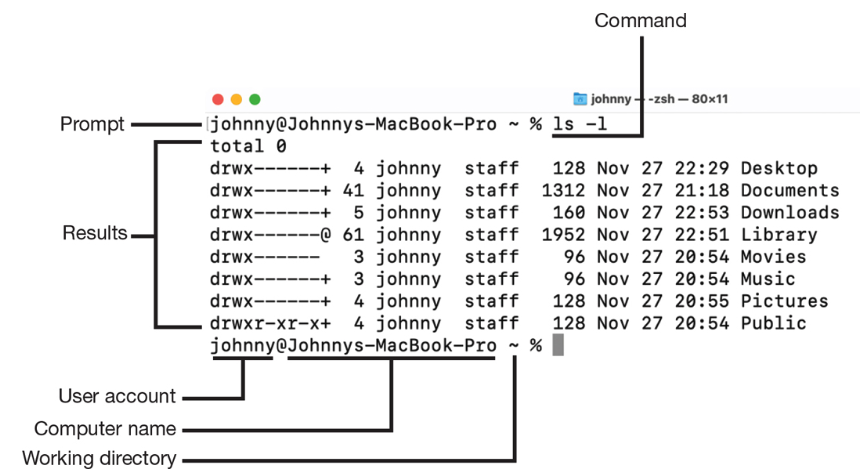
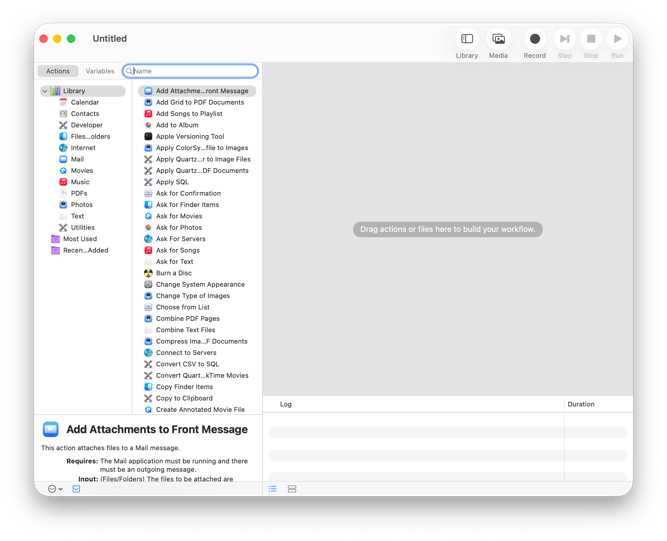
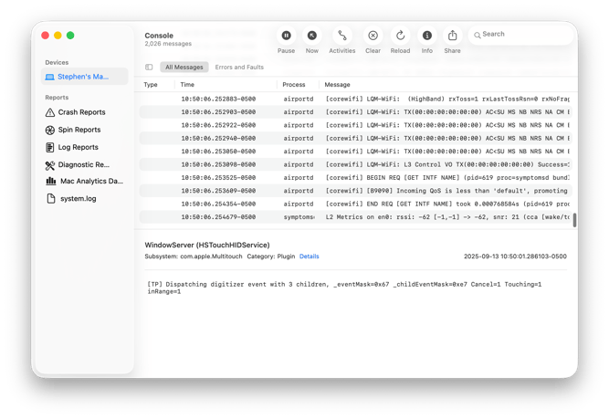
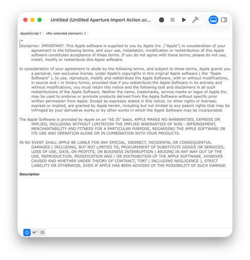
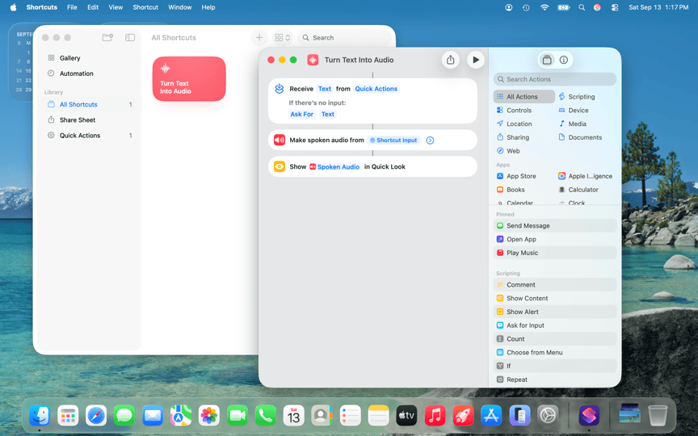

# Lesson 08: Terminal and System Services
**Student Learning Guide**

---

## Lesson Objectives

* **Introduction to the Terminal (CLI)** - Why the CLI is critical for IT administrators, key keyboard shortcuts, and establishing a solid baseline before advanced troubleshooting.
* **The Heart of the System** - The `launchd` process architecture (understanding the differences between LaunchDaemons, LaunchAgents, and LaunchAngels).
* **Deep Diagnostics** - Interpreting memory metrics in Activity Monitor, and reading/diagnosing macOS Property List (`.plist` XML/binary) files.
* **Enterprise Spice** - Locating the built-in MDM Agent (`mdmclient`), understanding its sync status, and diagnosing communication failures.

---

## 🎧 Audio Summary — Before or After Class

<!-- NotebookLM Podcast from Captivate -->
<div style="width: 100%; height: 200px; margin-bottom: 20px; border-radius: 6px; overflow: hidden;"><iframe style="width: 100%; height: 200px;" frameborder="no" scrolling="no" allow="clipboard-write" seamless src="https://player.captivate.fm/episode/d1656076-9c58-4f49-be91-863f210a4214/"></iframe></div>

---

## Core Concepts & Terminology

| Concept | Explanation |
|---|---|
| **CLI / Terminal** | The command-line interface in macOS (originated from NeXTSTEP in 2001). A direct management gateway bypassing the graphical user interface. |
| **Zsh (Z Shell)** | The modern default shell for macOS, standard since macOS Catalina. |
| **PID (Process ID)** | A unique numeric identifier assigned to every running process or service. |
| **launchd** | The supreme userland process manager (PID 1). The first process spawned after the Kernel. Responsible for bootstrapping services and applications. |
| **LaunchDaemon** | An infrastructure background service running as `root` (even without a logged-in user). Common for MDM agents, security daemons, and system daemons. |
| **LaunchAgent** | A user-scoped background agent, loaded exclusively when a user logs in. |
| **LaunchAngels (Tahoe)** | Modern internal Apple system services managed under the `RunningBoard` framework, fully protected in the Signed System Volume (SSV). |
| **Plist (Property List)** | Apple's structured configuration file format (XML or binary). Stores application preferences, launch configs, and scheduling parameters. |
| **Memory Pressure** | The authoritative metric in Activity Monitor indicating real memory strain (Green, Yellow, Red) based on paging algorithms. |
| **Swap** | Paging active memory pages from RAM onto disk storage. High swap activity indicates memory starvation and performance degradation. |
| **mdmclient** | Apple's built-in Daemon responsible for communicating with MDM servers and enforcing management profiles. |
| **TCC & PPPC** | Transparency, Consent, and Control protecting sensitive privacy domains; pre-approved across the enterprise via PPPC configuration profiles. |
| **BTM (Background Task Mgt)** | The security subsystem overseeing Login Items and background persistence, inspected via the `sfltool` utility. |

> *→ LaunchAngels and the initialization lifecycle of launchd via the Kernel (XNU) are covered in Lesson 13 (Boot Process) — here launchd acts as PID 1, starting immediately after the Kernel to bootstrap the entire userland.*

> *→ BTM and sfltool are also explored as diagnostic stages in Lesson 15 (Diagnostics) — add them here to your core IT troubleshooting toolkit.*

---

## Part 1 — Terminal Keyboard Shortcuts

| Shortcut | Action |
|---|---|
| `Ctrl + C` | **Cancel & Interrupt:** Immediately stops an active or hanging foreground process. |
| `Ctrl + L` | **Clear Screen:** Clears terminal buffer clutter and brings the prompt to the top (equivalent to `clear`). |
| `Ctrl + A` | Move cursor to the **beginning** of the command line. |
| `Ctrl + E` | Move cursor to the **end** of the command line. |
| `Tab` | **Auto-complete:** Automatically completes file paths, directories, and commands (press twice to list suggestions). |

---

## Part 2 — Critical Paths

| Content Description | Full Path | Ownership / Context |
|---|---|---|
| **User Application Preferences** | `~/Library/Preferences/` | Current User |
| **User-Scoped LaunchAgents** | `~/Library/LaunchAgents/` | Current User |
| **Enterprise / Third-Party LaunchDaemons** | `/Library/LaunchDaemons/` | Administrator (Root) |
| **macOS Native Daemons (SSV - Sealed)** | `/System/Library/LaunchDaemons/` | System (Read-Only) |
| **Tahoe Native Angels (RunningBoard)** | `/System/Library/LaunchAngels/` | System (Read-Only) |

---

## Appendix — Important System Commands

> [!NOTE]
> It is highly recommended to keep these commands handy in an administrative Cheat Sheet or MDM script repository for rapid troubleshooting.

### Basic Process Control & Monitoring
```bash
# Execute a command with elevated administrator privileges
sudo [command]

# Forcefully terminate a non-responsive process
kill -9 <PID>

# Live CPU/Resource monitor sorted by utilization (press 'q' to exit)
top -u

# List all active system processes with detailed flags
ps -ax
```

### Service Management (`launchctl` and BTM)
```bash
# Print status of all system-level background services
sudo launchctl print system

# Restart (Unload and Reload) a misbehaving LaunchDaemon:
sudo launchctl bootout system /Library/LaunchDaemons/com.example.plist
sudo launchctl bootstrap system /Library/LaunchDaemons/com.example.plist

# Dump Background Task Management (BTM) database to a text file
sudo sfltool dumpbtm > ~/Documents/btmdump.txt

# Reset BTM registration database (Last resort for persistent Login Item glitches)
sudo sfltool resetbtm
```

> [!IMPORTANT]
> `sfltool resetbtm` resets the Background Task Management database — all installed applications requiring Login Items (Agents, Helper Tools) must re-register. Use this solely as a deep diagnostic step for intractable Login Item issues.

### Reading and Validating Plists (`plutil`)
```bash
# Print plist contents in human-readable form (even if binary format)
plutil -p /path/to/file.plist

# Validate plist syntax (Syntax linting - essential before deployment)
plutil -lint /path/to/file.plist

# Convert a binary plist to editable XML format
sudo plutil -convert xml1 /path/to/file.plist

# Convert an XML plist back into optimized binary format
sudo plutil -convert binary1 /path/to/file.plist
```

### MDM Diagnostics
```bash
# Stream live logs for the MDM client daemon in real time
log stream --predicate 'process == "mdmclient"' --info

# Force an MDM enrollment check-in and profile synchronization
sudo profiles renew -type enrollment
```

---

## Recommended Reading & Resources

* [Explainer: % CPU in Activity Monitor](https://eclecticlight.co/2026/02/14/explainer-cpu-in-activity-monitor/) - Understanding why CPU percentages can be misleading and how to interpret Performance vs Efficiency cores.
* [A brief history of XML and property lists](https://eclecticlight.co/2025/08/16/a-brief-history-of-xml-and-property-lists/) - Why Apple relies so heavily on Plist files.
* [View Memory Usage in Activity Monitor](https://support.apple.com/guide/activity-monitor/view-memory-usage-actmntr1004/mac) - The official Apple guide to reading Memory Pressure.

---

## 🎬 Video Summary

<!-- YouTube Summary Video -->
<div style="margin-bottom: 20px; border-radius: 6px; overflow: hidden; box-shadow: 0 4px 6px rgba(0,0,0,0.1);">
    <iframe width="100%" height="450" src="https://www.youtube.com/embed/UPIUNoYIGPo" frameborder="0" allow="accelerometer; autoplay; clipboard-write; encrypted-media; gyroscope; picture-in-picture" allowfullscreen></iframe>
</div>

---

## Presentation Visuals

!!! tip "Presentation Visuals"
    These images illustrate the interfaces covered in this lesson.







