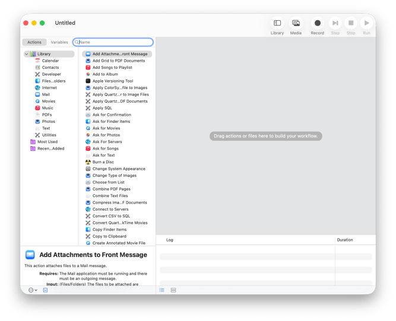
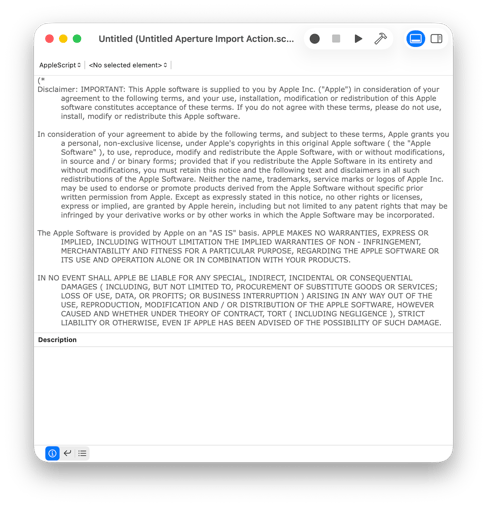
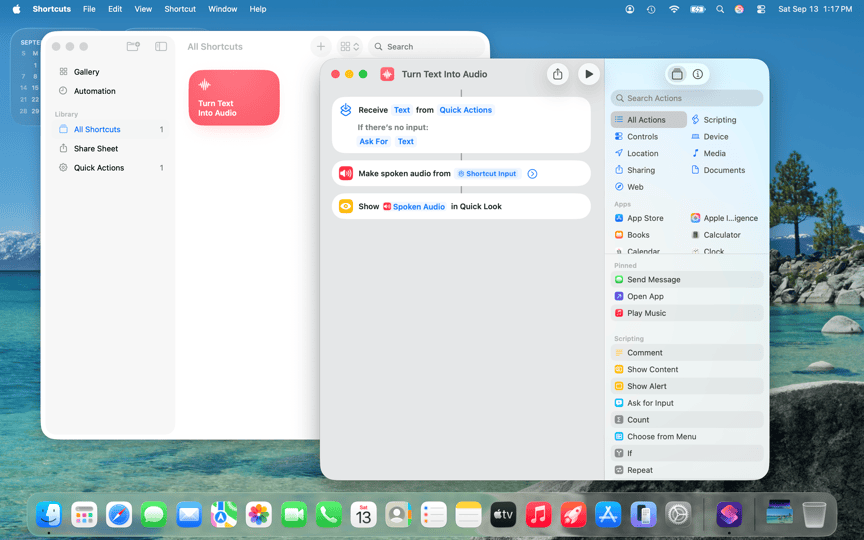
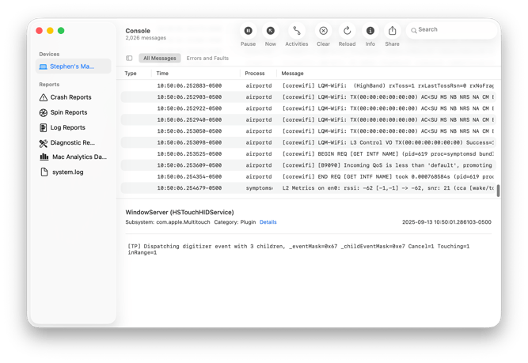

# שיעור 08: Terminal, launchd & Background Processes - Learning Guide (Asset C)

**מדריך עזר (מדריך עזר לתלמיד)**

## נושאי השיעור

* **מבוא לטרמינל (Terminal)** - למה ה-CLI קריטי לטכנאים, קיצורי מקלדת, ויישור קו לפני עבודה מתקדמת.
* **הלב של המערכת** - תהליך `launchd` (הבדל בין LaunchDaemons ל-Agents).
* **אבחון עמוק** - קריאת זיכרון ב-Activity Monitor, וקריאה/אבחון של קבצי Plist (XML).
* **תיבול ארגוני** - איתור ה-Agent של מערכת ה-MDM, הבנת ססטוס הסנכרון שלו ומה עושים כשהוא קורס.

## 1. מושגי יסוד וטרמינולוגיה

* **CLI (Command Line Interface):** ממשק שורת פקודה. כלי הגישה הישיר למערכת ההפעלה שמעקף את הממשק הגרפי (GUI). ב-macOS הכלי המובנה הוא Terminal (אשר הגיע בירושה ממערכת NeXTSTEP ב-2001).
* **Zsh (Z Shell):** מעטפת פקודות מודרנית המהווה את ברירת המחדל ב-macOS החל מגרסת Catalina, מחליפה את Bash הישן. מספקת יכולות אוטומציה וסקריפטים מתקדמות יותר.
* **Process ID (PID):** מזהה תהליך ייחודי (מספר) שמערכת ההפעלה מעניקה לכל תוכנה או שירות שרצים בזיכרון באותו רגע.
* **launchd:** "מנהל התהליכים" העליון (תמיד מקבל PID 1). אחראי להעלות את המערכת, לנהל שירותי רקע ולהפעיל אפליקציות לפי דרישה. מחליף מנגנוני Unix ישנים כמו `init` ו-`cron` (פותח ב-2005 ומאוחר יותר הורחב עם מערכות DAS ו-CTS לתזמון משימות גמיש).
* **LaunchDaemon:** שירות מערכת (Daemon) שרץ ברקע תחת הרשאות משתמש העל (`root`), ללא תלות באף משתמש מחובר. סוכני MDM, תוכנות אנטיווירוס ארגוניות ושירותי מערכת קריטיים רצים בצורה זו.
* **LaunchAgent:** שירות משתמש שרץ ברקע עם ההרשאות של המשתמש שהתחבר למערכת. נטען רק לאחר תהליך ה-Login.
* **Plist (Property List):** פורמט לשמירת קבצי תצורה ב-macOS, מבוסס XML או בינארי. משמש לשמירת העדפות של אפליקציות ולהגדרת הפעולות של Daemons ו-Agents. התבסס במקור על שפת SGML מ-1969, והפורמט הבינארי שלו התווסף ב-2002 כדי לייעל קריאה ולחסוך במקום.
* **Activity Monitor:** תוכנת הניטור המובנית המציגה עומסי מעבד, שימוש בזיכרון, פעילות כונן ותעבורת רשת. נוצרה בשנת 2003 מאיחוד התוכנות הישנות Process Viewer ו-CPU Monitor.
* **Memory Pressure:** מדד הזיכרון החשוב ביותר ב-Activity Monitor. מייצג את "מאמץ" המערכת בניהול הזיכרון הפיזי וכולל דחיסת זיכרון (Compression) ושימוש ב-Swap (כתיבה לכונן).
* **Swap:** מנגנון מערכתי שבו כאשר נגמר הזיכרון הפיזי (RAM), המערכת מעבירה מידע פחות שימושי לכונן ה-SSD. שימוש יתר ב-Swap יגרום לירידה דרסטית בביצועים.
* **mdmclient:** תהליך מערכת (Daemon) מובנה של אפל, האחראי על קבלת פקודות שרת ה-MDM דרך APNs והחלת הפרופילים במערכת ההפעלה.
* **TCC (Transparency, Consent, and Control):** מנגנון אבטחה ב-macOS החוסם גישה של תוכנות וסקריפטים לאזורים רגישים (כגון קבצי משתמש) ללא אישור מפורש מהמשתמש או מפרופיל ארגוני (PPPC).

## 2. קיצורי מקלדת בטרמינל (Terminal Shortcuts)

* `Ctrl + C`: עצירת ריצה של פקודה או תהליך נוכחי (Interrupt).
* `Ctrl + L`: ניקוי המסך (שקול לפקודת `clear`).
* `Ctrl + A`: קפיצה לתחילת השורה.
* `Ctrl + E`: קפיצה לסוף השורה.
* `Tab`: השלמה אוטומטית של שם קובץ, נתיב או פקודה.

## 3. פקודות מערכת חשובות

* `sudo`: הרצת פקודה יחידה עם הרשאות מנהל רשת/Root. דורש הזנת סיסמת אדמין.
* `kill -9 <PID>`: "חיסול" מיידי ואלים של תהליך שנתקע לפי המזהה שלו, ללא המתנה לסגירה מסודרת.
* `top -u`: צפייה בזמן אמת בצריכת משאבי המערכת עם מיון לפי שימוש במעבד (CPU). לחץ על `q` ליציאה.
* `ps -ax`: הדפסת רשימת כל התהליכים שרצים כעת במערכת.

### פקודת העל `launchctl`

* `launchctl list`: רשימת התהליכים תחת מנהל התהליכים הנוכחי.
* `sudo launchctl print system`: הדפסת מצב כל שירותי המערכת (Daemons).
* `sudo launchctl bootstrap system /Library/LaunchDaemons/com.example.plist`: טעינת/הפעלת שירות מערכת מקובץ plist ספציפי.
* `sudo launchctl bootout system /Library/LaunchDaemons/com.example.plist`: פריקת/השעיית שירות מערכת.

### קריאה וניהול של Plists (`plutil`)

* `plutil -lint /path/to/file.plist`: בדיקת תקינות הקובץ (Syntax Check) בחיפוש אחר שגיאות תחביר או תגיות חסרות.
* `plutil -p /path/to/file.plist`: הדפסה פשוטה (Human Readable) של התוכן, עוקף קבצים בינאריים.
* `sudo plutil -convert xml1 /path/to/file.plist`: המרת קובץ plist מפורמט בינארי ל-XML כדי לאפשר עריכה.
* `sudo plutil -convert binary1 /path/to/file.plist`: החזרת הקובץ לפורמט בינארי לאחר עריכה.

### אבחון ה-MDM

* `log stream --predicate 'process == "mdmclient"' --info`: פקודה המציגה בזמן אמת כל פעולה וסנכרון שסוכן ה-MDM המובנה מבצע. חובה לאיתור שגיאות רשת וחיבורים חסומים.
* `sudo profiles renew -type enrollment`: כפיית סנכרון מיידי אל מול שרת ה-MDM מצידו של הלקוח.

## 4. נתיבים קריטיים

* `~/Library/Preferences/`: התיקייה בה נשמרים קבצי ה-Plist האישיים של משתמש.
* `/System/Library/LaunchDaemons/`: ספריית שירותי הליבה של macOS, מוגנת תחת ה-SSV ולא ניתנת לשינוי.
* `/Library/LaunchDaemons/`: ספרייה המיועדת לסוכני מערכת (Daemons) של צד שלישי (אנטי-וירוס, MDM). דורשת הרשאות מנהל לעריכה.
* `~/Library/LaunchAgents/`: ספרייה המיועדת לסוכנים ברמת משתמש הספציפי שנטענים עם ביצוע ה-Login.

---

## Recommended Reading & Enrichment Links

* [Explainer: % CPU in Activity Monitor (Eclectic Light Company)](https://eclecticlight.co/) - הסבר לעומק למה אחוזי מעבד במק לפעמים מטעים ואיך לקרוא אותם נכון (התייחסות ל-Performance vs Efficiency Cores).
* [A brief history of XML and property lists (Eclectic Light Company)](https://eclecticlight.co/) - רקע היסטורי מעניין המסביר מדוע אפל נשענת כל כך חזק על קבצי Plist מבוססי XML ופורמטים בינאריים לכל הגדרות המערכת.
* [View Memory Usage in Activity Monitor (Apple Support)](https://support.apple.com/guide/activity-monitor/view-memory-usage-actmntr1004/mac) - המדריך הרשמי של אפל לקריאת "לחץ זיכרון" בכלי ה-Activity Monitor.

## 💡 עזרים ויזואליים להרצאה (Presentation Visuals)

!!! tip "המחשה ויזואלית (עזר לתלמיד)"
    תמונות אלו ממחישות את הממשק או המנגנון הרלוונטי לנושא השיעור.

