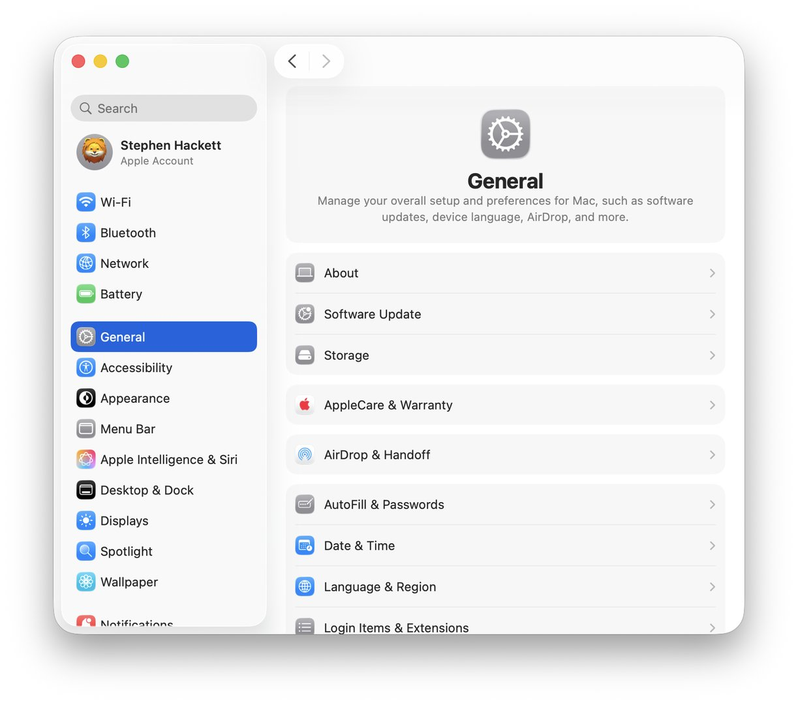

# Lesson 09: Networking
**Student Learning Guide**

---

## Lesson Objectives

* **Interfaces and Priorities** - Managing Network Locations and Service Order.
* **Diagnostic Tools** - Ping, Traceroute, and getting to know the omnipotent `networksetup` command.
* **Firewall** - The built-in macOS Application Layer Firewall and how it operates.
* **Enterprise Spice** - Troubleshooting 802.1X enterprise Wi-Fi profiles and remotely deployed VPN/Proxy connections.

---

## 🎧 Overview (Podcast)

<!-- NotebookLM Podcast from Captivate -->
<div style="width: 100%; height: 200px; margin-bottom: 20px; border-radius: 6px; overflow: hidden;"><iframe style="width: 100%; height: 200px;" frameborder="no" scrolling="no" allow="clipboard-write" seamless src="https://player.captivate.fm/episode/67a8f7c6-ffba-4387-824a-b30a7eeef5ae/"></iframe></div>

---

## Terms & Concepts

| Concept | Explanation |
|---|---|
| **Network Location** | A profile that encapsulates all network settings (IP addresses, DNS servers, and proxy). Allows quick switching between "Home", "Office", etc. configurations, without altering settings in another profile. |
| **Service Order** | The order in which the Mac searches for and connects to available networks. You can drag a service (e.g., Ethernet above Wi-Fi) to prioritize a wired connection. |
| **Firewall (ALF)** | The macOS firewall operates at the Application Layer. It controls which applications are allowed to receive inbound connections. |
| **Stealth Mode** | Prevents the Mac from responding to network scanning requests (like ICMP Ping). The Mac becomes "invisible" to other computers on the network. |
| **802.1X Profile** | An advanced authentication mechanism for enterprises (WPA-Enterprise). Typically provided as a Configuration Profile (Payload from MDM) that automatically configures Certificates. |
| **Proxy and VPN** | Tools for routing or encrypting traffic. On a managed Mac (MDM), these settings are usually deployed as an unmodifiable Payload by the user. |

> *→ Certificates required for 802.1X were covered in depth in Lesson 04 (Security & MDM) — here we see how MDM pushes them automatically to the employee's Mac.*

!!! important "Stealth Mode in Enterprise Environments"
    Enabling Stealth Mode can disrupt network monitoring tools that monitor the Mac via Ping. If Ping fails — it does not mean the Mac is offline; first verify that the Mac is reachable via Bonjour / `dns-sd -B`. In enterprise environments, enforce via MDM.

!!! note "Historical Note"
    The `ifconfig` command is currently considered deprecated in most Linux distributions (replaced by `ip`), but in macOS, it remains fully supported and highly effective for diagnosing interfaces at the kernel level.

---

## Advanced Terminal Commands & Tools

!!! warning
    The `networksetup` command is the "Swiss Army Knife" for network management. Most commands that alter configuration require administrator privileges (`sudo`).

    *→ The Firewall is managed by `socketfilterfw` running as a Daemon under launchd — covered in Lesson 08 (Terminal / System Services). You can monitor it in Console just like any other Daemon.*

### 1. Displaying Information (No privileges required)
```bash
# List all network services (a service with an * is disabled)
networksetup -listallnetworkservices

# Display IP/Subnet settings for a specific service
networksetup -getinfo "Wi-Fi"

# Retrieve the physical MAC address
networksetup -getmacaddress "Ethernet"

# View manually configured DNS servers
networksetup -getdnsservers "Wi-Fi"

# Display all network locations on the system and the active location
networksetup -listlocations
networksetup -getcurrentlocation
```

### 2. Changing Configuration (Requires sudo)
```bash
# Configure the network adapter to fetch IP from DHCP
sudo networksetup -setdhcp "Ethernet"

# Set a static IP, Subnet, and Router
sudo networksetup -setmanual "Ethernet" 192.168.1.100 255.255.255.0 192.168.1.1

# Configure DNS servers (to revert to automatic use 'empty' instead of addresses)
sudo networksetup -setdnsservers "Wi-Fi" 8.8.8.8 8.8.4.4

# Switch rapidly to another network location (applies everything immediately)
sudo networksetup -switchtolocation "Office"
```

### 3. Diagnostics and Testing Tools
| Tool / Command | Purpose |
|---|---|
| `ping -c 4 apple.com` | Sends 4 ICMP requests to check availability and response time (Latency). |
| `traceroute google.com` | Displays all routers/hops on the way to the destination to locate routing disconnections. |
| `nslookup apple.com` | A simple DNS query to translate a name to an IP address. |
| `dig apple.com` | A professional and detailed DNS query for response times and record types. |
| `netstat -rn` | Displays the system's internal Routing Table. |
| `lsof -i :80` | Displays which apps and processes are listening on a specific port (e.g., 80). |

---

## Useful Files and Paths

| Path | File Description |
|---|---|
| `/Library/Preferences/SystemConfiguration/preferences.plist` | The main configuration file for locations and network. Administrators delete it to completely reset the network in case of malfunction. |
| `/Library/Preferences/com.apple.alf.plist` | The preferences file for the Application Layer Firewall (ALF). |

---

## Recommended Links and Further Reading

* [Use network locations on Mac](https://support.apple.com/en-us/105129) - Using network locations in macOS.
* [Change Firewall settings on Mac](https://support.apple.com/guide/mac-help/change-firewall-settings-on-mac-mh34041/mac) - The built-in firewall.
* [Connect to an 802.1X network](https://support.apple.com/guide/mac-help/connect-to-an-8021x-network-on-mac-mchlp1094/mac) - Connecting to an enterprise network.
* [Deploy Wi-Fi payload settings for Apple devices](https://support.apple.com/guide/deployment/wi-fi-payload-settings-dep40eb424c/web) - Deploying MDM network settings.

---

## 🎬 Summary Video

<!-- Summary Video from YouTube -->
<div style="margin-bottom: 20px; border-radius: 6px; overflow: hidden; box-shadow: 0 4px 6px rgba(0,0,0,0.1);">
    <iframe width="100%" height="450" src="https://www.youtube.com/embed/5uY9kabOEXE" frameborder="0" allow="accelerometer; autoplay; clipboard-write; encrypted-media; gyroscope; picture-in-picture" allowfullscreen></iframe>
</div>

---

## 💡 Lecture Visual Aids

!!! tip "Visual Aids"
    These images illustrate the relevant interface or mechanism for the lesson topic.





