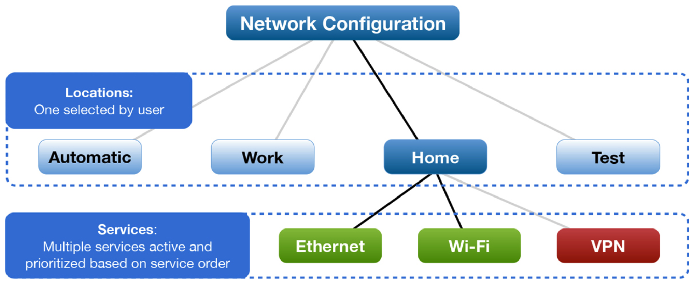
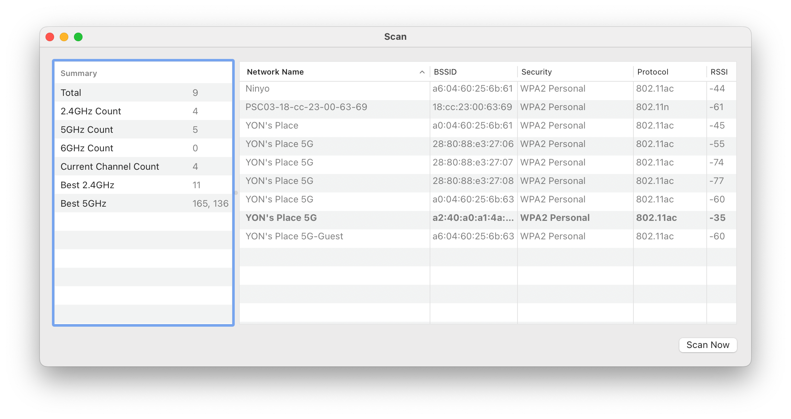
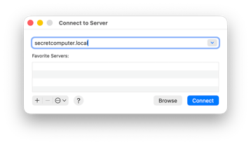
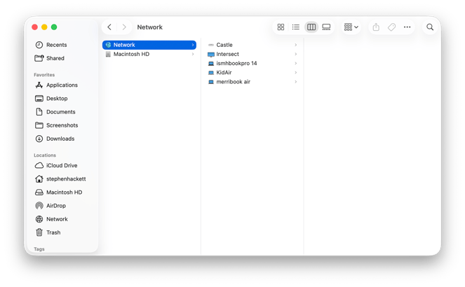
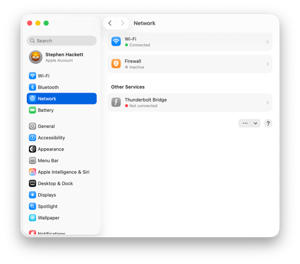
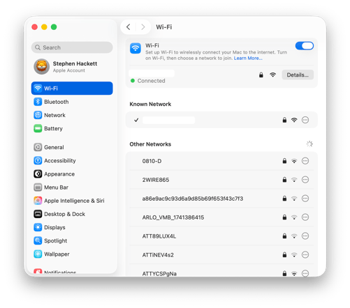

# Lesson 09: Networking
**Student Reference Guide**

## Lesson Objectives

*   **Interfaces and Priorities** - Managing Network Locations and Service Order.
*   **Diagnostic Tools** - Ping, Traceroute, and an introduction to the powerful `networksetup` command.
*   **The Firewall** - The built-in macOS Firewall and how it operates.
*   **Enterprise Flavor** - Diagnosing enterprise 802.1X Wi-Fi profiles and remotely deployed VPN proxy connections.

## Overview

<!-- NotebookLM Podcast from Captivate -->

<iframe style="width: 100%; height: 200px;" frameborder="no" scrolling="no" allow="clipboard-write" seamless src="https://player.captivate.fm/episode/67a8f7c6-ffba-4387-824a-b30a7eeef5ae/"></iframe>

## Terms & Concepts

*   **Network Location:** A profile that consolidates all of the Mac's network settings (active network services, IP addresses, DNS servers, and proxy settings). Multiple locations can be created to quickly switch between "Home," "Office," and other configurations.
*   **Service Order:** The order in which the Mac searches for and connects to available networks. Services can be dragged (e.g., Ethernet above Wi-Fi) to ensure the Mac prioritizes a wired connection when available.
*   **Firewall:** The built-in macOS Firewall operates at the Application Layer (Application Layer Firewall - ALF). It allows the user to control which applications or services are permitted to receive incoming connections from the network.
*   **Stealth Mode:** A setting within the Firewall that prevents the Mac from responding to network scan requests (such as ICMP Ping or discovery attempts), making it "invisible" to other computers.
*   **802.1X Profile:** An advanced network-level authentication mechanism. In enterprise environments, a Configuration Profile is typically provided to automatically configure connection credentials and certificates, enabling the Mac to securely and transparently connect to the corporate network.
*   **Proxy and VPN:** Communication tools used to route or encrypt traffic through an enterprise server. On a managed Mac (MDM), these settings are typically locked and deployed remotely (e.g., Global HTTP Proxy).
*   **ifconfig vs. ip:** While the `ifconfig` command is now considered legacy in most modern Linux distributions that have transitioned to the `ip` command, in macOS, the command remains a supported, fully usable, and highly effective tool for core-level network diagnostics.

---

## Terminal Commands & Tools

### The Powerful `networksetup` Command
The `networksetup` command is the "Swiss Army knife" for network management on a Mac from the Terminal. Most configuration-changing commands must be run with administrator privileges (`sudo`).

**Displaying Information (sudo not required):**

*   `networksetup -listallnetworkservices`
    > Displays a list of all network services (Wi-Fi, Ethernet, etc.). A service marked with an asterisk (*) next to it is disabled.
*   `networksetup -getinfo "Wi-Fi"`
    > Displays the current IP, Subnet, and Router settings for the specified service.
*   `networksetup -getmacaddress "Ethernet"`
    > Retrieves the physical MAC address (Hardware Address) of the specific network adapter.
*   `networksetup -getdnsservers "Wi-Fi"`
    > Displays the list of DNS servers currently manually configured for the Wi-Fi service.
*   `networksetup -listlocations`
    > Displays all Network Locations currently existing on the system.
*   `networksetup -getcurrentlocation`
    > Displays the currently active Network Location.

**Changing Configuration and IP/DNS Settings (requires privileges):**

*   `sudo networksetup -setdhcp "Ethernet"`
    > Configures the Ethernet adapter to automatically obtain an IP address from the DHCP server.
*   `sudo networksetup -setmanual "Ethernet" 192.168.1.100 255.255.255.0 192.168.1.1`
    > Configures a static IP address, along with Subnet Mask and Router.
*   `sudo networksetup -setdnsservers "Wi-Fi" 8.8.8.8 8.8.4.4`
    > Manually configures DNS servers (to delete manual servers and revert to DHCP, use the value `empty`).

**Managing Services and Locations:**

*   `sudo networksetup -setnetworkserviceenabled "Bluetooth PAN" off`
    > Completely disables the specified network service.
*   `sudo networksetup -createlocation "Office" populate`
    > Creates a new network location named "Office" and automatically populates it with the Mac's existing hardware services.
*   `sudo networksetup -switchtolocation "Office"`
    > Switches the system to another network location and immediately applies all relevant network settings for that location.

### General Diagnostic and Testing Tools (Diagnostics)

*   `ping -c 4 apple.com`
    > Sends 4 ICMP Echo Requests to a server to check its availability and response time (Latency). The command will stop automatically after 4 attempts.
*   `traceroute google.com`
    > Displays all the "hops" (routers/Hops) that data traverses until it reaches its destination. An excellent tool for diagnosing exactly where a network disconnection occurs.
*   `nslookup apple.com`
    > Performs a simple DNS query and displays which IP address the server resolves the domain name to.
*   `dig apple.com`
    > A more professional and detailed tool for checking DNS records, displaying server response times and precise record types.
*   `ifconfig`
    > An older UNIX command that displays core-level (Interface Level) information about all network adapters and virtual networks. More suited for investigating physical status or Container environments.
*   `netstat -rn`
    > Displays the Mac's internal Routing Table.
*   `lsof -i :80`
    > Displays which processes and applications are currently open on the Mac and listening or connected to a specific port (in this example - port 80).

---

## Useful Paths

*   `/Library/Preferences/SystemConfiguration/preferences.plist`
    > The main configuration file containing all of the Mac's network interface and location settings. Administrators sometimes delete this file to completely reset the system's network in case of severe issues.
*   `/Library/Preferences/com.apple.alf.plist`
    > The Firewall (ALF) configuration file.

---

## Recommended Links and Further Reading

*   [Use network locations on Mac](https://support.apple.com/en-us/105129) - Basic explanation on how to configure different network locations for quick transitions between home and office.
*   [Change Firewall settings on Mac](https://support.apple.com/guide/mac-help/change-firewall-settings-on-mac-mh34041/mac) - A simple user guide on enabling the built-in Firewall.
*   [Connect to an 802.1X network on Mac](https://support.apple.com/guide/mac-help/connect-to-an-8021x-network-on-mac-mchlp1094/mac) - A guide for connecting to enterprise wireless networks that require special authentication.
*   [Deploy Wi-Fi payload settings for Apple devices](https://support.apple.com/guide/deployment/wi-fi-payload-settings-dep40eb424c/web) - An enterprise article on deploying network settings using an MDM server.

## Summary Video

<!-- Summary video from YouTube -->

    <iframe width="100%" height="450" src="https://www.youtube.com/embed/DDXfEIRgAxs" frameborder="0" allow="accelerometer; autoplay; clipboard-write; encrypted-media; gyroscope; picture-in-picture" allowfullscreen></iframe>

!!! tip "Visual Illustration (Student Aid)"
    These images illustrate the interface or mechanism relevant to the lesson topic.

<!-- src_hash: 90cea568ee29427912bc3e86e73800face4e6eec1e135f49ab26ec3e65f89b64 -->
