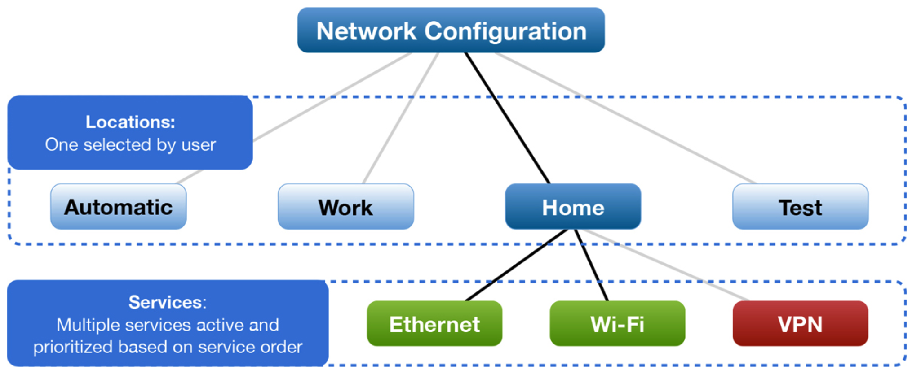
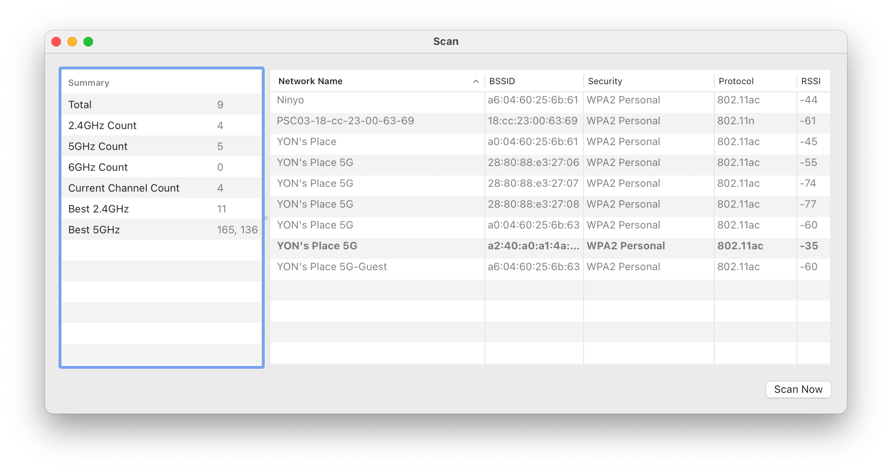
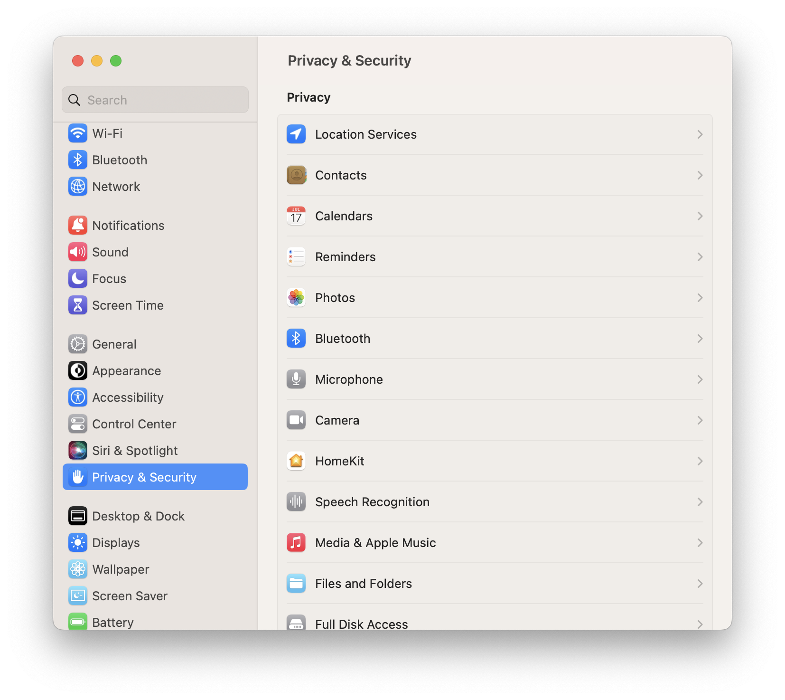
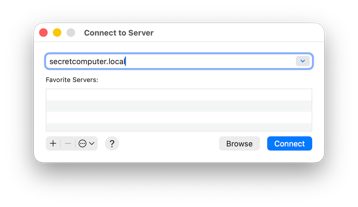
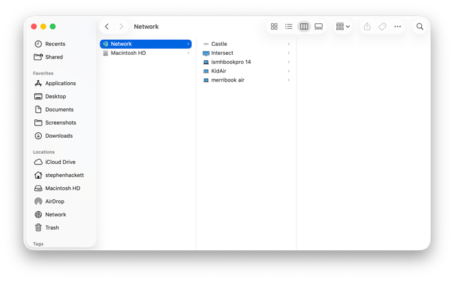
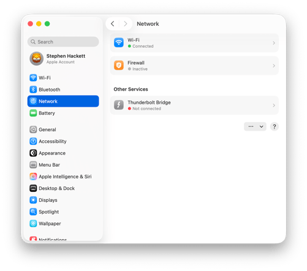
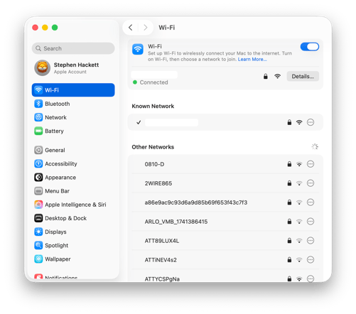

# שיעור 09: רשתות
**מדריך עזר לתלמיד**

## מטרות השיעור

* **ממשקים וסדרי עדיפויות** - ניהול מיקומי רשת (Network Locations) ו-Service Order.
* **כלי אבחון** - Ping, Traceroute והיכרות עם פקודת העל `networksetup`.
* **חומת האש** - ה-Firewall המובנה של macOS וכיצד הוא פועל.
* **תיבול ארגוני** - אבחון פרופילי Wi-Fi מסוג 802.1X ארגוני וחיבורי VPN פרוקסי פרוסים מרחוק.

## סקירה

<!-- פודקאסט NotebookLM מתוך Captivate -->

<iframe style="width: 100%; height: 200px;" frameborder="no" scrolling="no" allow="clipboard-write" seamless src="https://player.captivate.fm/episode/332582b3-c603-4af5-a4a2-81be768b38a6/"></iframe>

## מושגים ומונחי יסוד (Terms & Concepts)

* **מיקום רשת (Network Location):** פרופיל המאגד בתוכו את כלל הגדרות הרשת של המק (שירותי רשת פעילים, כתובות IP, שרתי DNS, ופרוקסי). ניתן ליצור מספר מיקומים כדי לעבור במהירות בין תצורת "בית", "משרד" ועוד.
* **סדר עדיפויות של שירותים (Service Order):** הסדר שבו המק מחפש ומתחבר לרשתות פנויות. ניתן לגרור שירות (למשל Ethernet מעל Wi-Fi) כדי להבטיח שהמק יעדיף חיבור קווי כשהוא זמין.
* **חומת אש (Firewall):** חומת האש המובנית ב-macOS פועלת ברמת האפליקציה (Application Layer Firewall - ALF). היא מאפשרת למשתמש לשלוט אילו אפליקציות או שירותים רשאים לקבל חיבורים נכנסים מהרשת (Incoming Connections).
* **מצב "חמקן" (Stealth Mode):** מצב בתוך הגדרות חומת האש שמונע מהמק להגיב לבקשות סריקה ברשת (כגון ICMP Ping או נסיונות גילוי), מה שהופך אותו ל"רואה ואינו נראה" עבור מחשבים אחרים.
* **פרופיל 802.1X:** מנגנון הזדהות מתקדם ברמת הרשת (Network Authentication). לרוב, בסביבות ארגוניות יסופק Configuration Profile המגדיר אוטומטית את אישורי ההתחברות (Credentials) והתעודות (Certificates) כדי לאפשר למק להתחבר מאובטחות לרשת הארגונית בצורה שקופה.
* **פרוקסי (Proxy) ו-VPN:** כלי תקשורת המשמשים לניתוב או הצפנת התעבורה דרך שרת ארגוני. במק מנוהל (MDM), לרוב הגדרות אלו יהיו נעולות ונפרסות מרחוק (למשל Global HTTP Proxy).
* **ifconfig לעומת ip:** בעוד שפקודת `ifconfig` נחשבת כיום למיושנת (Legacy) ברוב הפצות הלינוקס המודרניות שחצו אל עבר פקודת ה-`ip`, ב-macOS הפקודה נותרה כלי נתמך, שמיש לחלוטין ויעיל מאוד לאבחון רשתות ברמת הליבה.

---

## פקודות טרמינל מתקדמות וכלים (Terminal Commands & Tools)

### הפקודה העוצמתית `networksetup`
הפקודה `networksetup` היא ה"אולר השוויצרי" לניהול רשת במק מהטרמינל. יש להריץ את רוב הפקודות המשנות תצורה עם הרשאות מנהל (`sudo`).

**הצגת מידע (אין חובה ב-sudo):**

* `networksetup -listallnetworkservices`
  > מציג רשימה של כל שירותי הרשת (Wi-Fi, Ethernet וכו'). שירות המופיע עם כוכבית (*) בסמוך אליו הוא שירות מושבת.
* `networksetup -getinfo "Wi-Fi"`
  > מציג את הגדרות ה-IP, ה-Subnet וה-Router הנוכחיות עבור השירות שצוין.
* `networksetup -getmacaddress "Ethernet"`
  > מאחזר את כתובת ה-MAC הפיזית (Hardware Address) של כרטיס הרשת המסוים.
* `networksetup -getdnsservers "Wi-Fi"`
  > מציג את רשימת שרתי ה-DNS המוגדרים כעת ידנית עבור שירות ה-Wi-Fi.
* `networksetup -listlocations`
  > מציג את כל מיקומי הרשת (Network Locations) שקיימים כרגע במערכת.
* `networksetup -getcurrentlocation`
  > מציג מהו מיקום הרשת הפעיל כעת.

**שינוי תצורה והגדרות IP/DNS (מחייב הרשאות):**

* `sudo networksetup -setdhcp "Ethernet"`
  > מגדיר את כרטיס ה-Ethernet למשוך כתובת IP באופן אוטומטי משרת ה-DHCP.
* `sudo networksetup -setmanual "Ethernet" 192.168.1.100 255.255.255.0 192.168.1.1`
  > מגדיר כתובת IP סטטית, יחד עם Subnet Mask ו-Router.
* `sudo networksetup -setdnsservers "Wi-Fi" 8.8.8.8 8.8.4.4`
  > מגדיר שרתי DNS באופן ידני (על מנת למחוק את השרתים הידניים ולחזור ל-DHCP, יש להשתמש בערך `empty`).

**ניהול שירותים ומיקומים:**

* `sudo networksetup -setnetworkserviceenabled "Bluetooth PAN" off`
  > מכבה לחלוטין את שירות הרשת שצוין.
* `sudo networksetup -createlocation "Office" populate`
  > יוצר מיקום רשת חדש בשם "Office" ומאכלס אותו אוטומטית בשירותי החומרה הקיימים במק.
* `sudo networksetup -switchtolocation "Office"`
  > מחליף את המערכת למיקום רשת אחר ומחיל את כל הגדרות הרשת הרלוונטיות של אותו המיקום באופן מיידי.

### כלי אבחון ובדיקה כלליים (Diagnostics)

* `ping -c 4 apple.com`
  > שולח 4 בקשות אקו (ICMP Echo Request) לשרת כדי לבדוק האם הוא זמין ומה זמן התגובה (Latency). הפקודה תעצור אוטומטית לאחר 4 נסיונות.
* `traceroute google.com`
  > מציג את כל ה"תחנות" (הראוטרים/Hops) שהמידע עובר דרכן עד הגעתו ליעד. כלי מעולה לאבחון היכן בדיוק מתרחש ניתוק ברשת.
* `nslookup apple.com`
  > מבצע שאילתת DNS פשוטה ומציג לאיזו כתובת IP השרת מתרגם את שם המתחם.
* `dig apple.com`
  > כלי מקצועי ומפורט יותר לבדיקת רשומות DNS, המציג את זמני המענה מהשרת ואת סוגי הרשומות המדויקים.
* `ifconfig`
  > פקודת UNIX וותיקה המציגה מידע ברמת הליבה (Interface Level) על כל כרטיסי הרשת והרשתות הווירטואליות. מיועדת יותר לחקירת המצב הפיזי או סביבות Containers.
* `netstat -rn`
  > מציג את טבלת הניתוב (Routing Table) הפנימית של המק.
* `lsof -i :80`
  > מציג אילו תהליכים ואפליקציות פתוחים כרגע במק ומאזינים או מקושרים לפורט ספציפי (בדוגמה זו - פורט 80).

---

## קבצים ונתיבים שימושיים (Useful Paths)

* `/Library/Preferences/SystemConfiguration/preferences.plist`
  > קובץ התצורה הראשי המכיל את כל הגדרות ממשקי הרשת והמיקומים של המק. אדמיניסטרטורים לעיתים מוחקים קובץ זה כדי לאפס לחלוטין את הרשת במערכת במקרה של תקלות חמורות.
* `/Library/Preferences/com.apple.alf.plist`
  > קובץ התצורה של חומת האש (ALF).

---

## קישורים מומלצים ולקריאה נוספת

* [Use network locations on Mac](https://support.apple.com/en-us/105129) - הסבר בסיסי איך להגדיר מיקומי רשת שונים למעברים מהירים בין הבית למשרד.
* [Change Firewall settings on Mac](https://support.apple.com/guide/mac-help/change-firewall-settings-on-mac-mh34041/mac) - מדריך פשוט למשתמש על הפעלת חומת האש המובנית.
* [Connect to an 802.1X network on Mac](https://support.apple.com/guide/mac-help/connect-to-an-8021x-network-on-mac-mchlp1094/mac) - מדריך להתחברות לרשתות אלחוטיות ארגוניות שדורשות אימות מיוחד.
* [Deploy Wi-Fi payload settings for Apple devices](https://support.apple.com/guide/deployment/wi-fi-payload-settings-dep40eb424c/web) - מאמר ארגוני על הפצת הגדרות רשת באמצעות שרת MDM.

## סרטון סיכום

<!-- סרטון סיכום מתוך YouTube -->

    <iframe width="100%" height="450" src="https://www.youtube.com/embed/DDXfEIRgAxs" frameborder="0" allow="accelerometer; autoplay; clipboard-write; encrypted-media; gyroscope; picture-in-picture" allowfullscreen></iframe>

!!! tip "המחשה ויזואלית (עזר לתלמיד)"
    תמונות אלו ממחישות את הממשק או המנגנון הרלוונטי לנושא השיעור.

