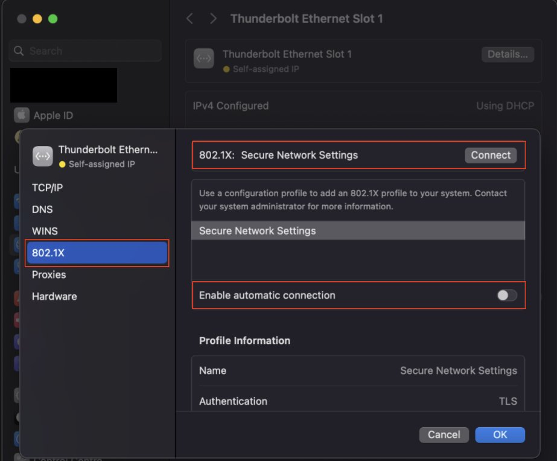

# שיעור 09: רשתות
**מדריך עזר לתלמיד**

---

## מטרות השיעור

* **ממשקים וסדרי עדיפויות** - ניהול מיקומי רשת (Network Locations) ו-Service Order.
* **אבחון Wi-Fi מתקדם** - שימוש ב-`Option + Click` ובכלי ה-Power Tools של Wireless Diagnostics (`Scan`, `Performance`, `Sniffer`).
* **כלי אבחון בסיסיים וטרמינל** - Ping, Traceroute, DNS Flush והיכרות עם פקודת העל `networksetup`.
* **חומת האש (ALF) והדילמה הארגונית** - מנגנון ה-Application Firewall, מצב Stealth Mode, ומדוע ארגוני Enterprise עם EDR מנטרלים אותו.
* **תיבול ארגוני** - אבחון פרופילי Wi-Fi מסוג 802.1X ארגוני וחיבורי VPN פרוקסי פרוסים מרחוק.

---

## 🎧 סקירה (פודקאסט)

<!-- פודקאסט NotebookLM מתוך Captivate -->
<div style="width: 100%; height: 200px; margin-bottom: 20px; border-radius: 6px; overflow: hidden;"><iframe style="width: 100%; height: 200px;" frameborder="no" scrolling="no" allow="clipboard-write" seamless src="https://player.captivate.fm/episode/67a8f7c6-ffba-4387-824a-b30a7eeef5ae/"></iframe></div>

---

## מושגים ומונחי יסוד (Terms & Concepts)

| מושג | הסבר |
|---|---|
| **מיקום רשת (Network Location)** | פרופיל המאגד בתוכו את כלל הגדרות הרשת (כתובות IP, שרתי DNS, ופרוקסי). מאפשר לעבור במהירות בין תצורת "בית", "משרד" ועוד, ללא שינוי ההגדרות בפרופיל אחר. |
| **סדר עדיפויות (Service Order)** | הסדר שבו המק מחפש ומתחבר לרשתות פנויות. ניתן לגרור שירות (למשל Ethernet מעל Wi-Fi) להעדפת חיבור קווי. |
| **Wireless Diagnostics** | אפליקציית אבחון אלחוטי מובנית ב-macOS הכוללת כלי עומק (Scan, Performance, Sniffer) לניתוח ערוצים, הפרעות RF ולכידת פקטות. |
| **RSSI (Received Signal Strength)** | עוצמת האות האלחוטי ב-dBm (סקאלה שלילית: `30- dBm` מעולה, `67- dBm` סף מומלץ לארגונים/VoIP, `80- dBm` ומטה חלש מאוד). |
| **Noise (רעש רקע)** | עוצמת רעשי הרקע האלקטרומגנטיים ב-dBm (`90- dBm` ומטה מצוין; `75- dBm` ומעלה מעיד על הפרעה קשה, למשל מ-USB 3.0 לא מסוכך). |
| **SNR (Signal-to-Noise Ratio)** | יחס אות לרעש: חישוב של `Signal - Noise` (למשל `40dB = (90-) - 50-`). מעל 25dB נחשב לחיבור יציב ואיכותי. |
| **BSSID (Basic Service Set ID)** | כתובת ה-MAC הפיזית של ה-Access Point / ראוטר הספציפי שאליו המק משודר כרגע. |
| **Tx Rate** | קצב השידור המקסימלי בפועל (ב-Mbps) המושג כרגע בין כרטיס הרשת במק לנקודת הגישה. |
| **חומת אש (Firewall - ALF)** | חומת האש המובנית ב-macOS הפועלת ברמת האפליקציה (Application Layer, שכבה 7). שולטת אילו אפליקציות רשאיות לקבל חיבורים נכנסים (Inbound). |
| **מצב "חמקן" (Stealth Mode)** | מונע מהמק להגיב לבקשות סריקה ברשת (כמו ICMP Ping). המק הופך "רואה ואינו נראה" עבור מחשבים אחרים ברשת. |
| **Network Extension Framework** | התשתית המודרנית של אפל (מחליפת ה-KEXTs) המאפשרת לתוכנות אבטחה (EDR, VPN, ZTNA) לסנן ולנטר תעבורת רשת נכנסת ויוצאת. |
| **פרופיל 802.1X** | מנגנון אימות מתקדם לארגונים (WPA-Enterprise). מסופק לרוב כ-Configuration Profile (פיילוד מה-MDM) המגדיר אוטומטית תעודות (Certificates). |
| **Proxy ו-VPN** | כלים לניתוב או הצפנת התעבורה. במחשב מנוהל (MDM), הגדרות אלו לרוב נפרסות כ-Payload שאינו ניתן לשינוי על ידי המשתמש. |

---

## חלק 1 — ממשקים, סדרי עדיפויות (Service Order) ומיקומי רשת

* **מיקומי רשת (Network Locations):** פרופילים מבודדים המאפשרים להחליף את כל מערך הגדרות הרשת (DNS, IP, פקדי פרוקסי) בלחיצת כפתור אחת (למשל מעבר מ"משרד" ל"בית").
* **סדר עדיפויות (Service Order):** המערכת מנתבת תמיד את תעבורת ברירת המחדל דרך הממשק הפעיל שנמצא בראש הרשימה. אם מחוברים גם ל-Ethernet וגם ל-Wi-Fi — יש לוודא שהממשק הרצוי (לרוב החיבור הקווי) גורר לראש הרשימה תחת `System Settings > Network > ... > Set Service Order`.

---

## חלק 2 — אבחון רשת אלחוטית מתקדם (Wireless Diagnostics)

אפליקציית **Wireless Diagnostics** (הממוקמת ב-`/System/Library/CoreServices/Applications/`) היא אחת מנקודות העוצמה הנסתרות של macOS. מעבר לאשף האוטומטי, כוחה האמיתי טמון בכלים המקצועיים הזמינים בתפריט **Window** העליון.

### 📶 קיצור העל: `Option + Click` על סמל ה-Wi-Fi
החזקת מקש `Option` (⌥) ולחיצה על סמל ה-Wi-Fi בשורת התפריטים חושפת תמונת מצב חיה ללא פתיחת שום תוכנה:
* **IP Address & Router:** כתובת ה-IP המקומית וכתובת ה-Default Gateway.
* **BSSID:** כתובת ה-MAC הפיזית של ה-Access Point הספציפי שאליו המק מחובר כרגע.
* **Channel:** הערוץ, התדר (2.4GHz, 5GHz, 6GHz) ורוחב הפס (20/40/80/160 MHz).
* **RSSI (עוצמת אות):** סקאלה שלילית ב-dBm (`30- dBm` מעולה, `67- dBm` סף מומלץ לארגון, `80- dBm` ומטה חלש מאוד).
* **Noise (רעש רקע):** סקאלה שלילית עמוקה יותר (`90- dBm` ומטה מעולה; `75- dBm` מעיד על הפרעה קשה).
* **Tx Rate:** קצב השידור המקסימלי בפועל (ב-Mbps) מול הראוטר.

### 🪟 כלי העזר בתפריט Window ב-Wireless Diagnostics
כאשר פותחים את `Wireless Diagnostics`, התעלמו מהאשף הרגיל וגשו ישירות לתפריט **Window**:

| חלון עזר | קיצור | שימוש מעשי ותועלת לטכנאי |
|---|---|---|
| **Scan (סריקה)** | `Cmd + 4` | סורק את כל נקודות הגישה בסביבה ומציג טבלה מפורטת (SSID, BSSID, ערוץ, רוחב פס, הצפנה ועוצמה). **בסרגל הצד מוצגות המלצות חכמות (Best Channels)** לערוצים הפנויים והמומלצים ביותר ב-2.4GHz וב-5GHz! |
| **Performance (ביצועים)** | `Cmd + 5` | **גרף ויזואלי המתעדכן בזמן אמת** ומציג שלושה מדדים במקביל: Rate (קצב ב-Mbps), Signal (אות ב-dBm) ו-Noise (רעש). מושלם להליכה במשרד לאיתור שטחים מתים (Dead Zones) ובדיקת נדידה (Roaming). |
| **Sniffer (רחרחן אלחוטי)** | `Cmd + 6` | לוכד את כל הפקטות האלחוטיות (Over-The-Air) בערוץ וברוחב פס נבחרים ישירות לקובץ `.pcap` (לניתוח מעמיק ב-Wireshark). |
| **Info (מידע)** | `Cmd + 1` | תצוגה מרוכזת של החיבור הנוכחי, מהירות, מצב אבטחה וחישוב SNR (`Signal - Noise`). |

---

## חלק 3 — חומת האש (ALF) והדילמה הארגונית

חומת האש המובנית של macOS פועלת בשכבת האפליקציה (**Application Layer Firewall - ALF**) ומנוהלת על ידי התהליך `socketfilterfw`.

### 🛡️ עקרונות פעולת ה-ALF:
1. **חסימה נכנסת בלבד (Inbound Only):** ה-ALF שולט אך ורק על תוכנות המבקשות לפתוח Listening Sockets ולקבל חיבורים מבחוץ. הוא **אינו** מנטר או חוסם תעבורה יוצאת (Outbound).
2. **חתימות קוד אוטומטיות:** אפליקציות חתומות כדין על ידי מפתח מורשה של אפל מאושרות אוטומטית ללא פופ-אפים מיותרים.
3. **מצב חמקן (Stealth Mode):** מונע מהמק להגיב לבקשות ICMP (Ping) וסריקות פורטים, מה שהופך את המק ל"בלתי נראה" ברשתות ציבוריות.

### 🏢 הדילמה הארגונית: ALF מובנה מול תוכנות אבטחה ו-EDR צד-שלישי

!!! important "ארכיטקטורת אבטחה בארגון: להפעיל או לנטרל את ה-ALF?"
    בסביבות ארגוניות מתקדמות המריצות כלי EDR / SASE / ZTNA מודרניים (כגון **Microsoft Defender for Endpoint**, **CrowdStrike Falcon**, **Palo Alto GlobalProtect**, **Cisco Secure Client**, או **Zscaler**), ההמלצה הרשמית של היצרניות היא **לנטרל את ה-Firewall המובנה של אפל דרך ה-MDM**.
    
    **הסיבות לנטרול ה-ALF בארגוני Enterprise:**
    1. **מניעת התנגשויות ב-Network Extension Framework:** סוכני האבטחה המודרניים יושבים באותה נקודת סינון בדיוק כמו `socketfilterfw`. הרצה כפולה יוצרת מאבק על ה-Sockets (Stack Contention), עכבת כפולה (Double-Inspection Latency), איבודי פקטות (Packet Drops) וניתוקי VPN אקראיים.
    2. **מקור אמת יחיד (Single Source of Truth) ל-SIEM:** ה-ALF המובנה אינו מעביר דיווחים מרכזיים (Syslog/SIEM) על חסימות. צוותי ה-SOC והאבטחה מעדיפים שסוכן ה-EDR ינהל 100% מתעבורת הרשת (הן Inbound והן Outbound) עם טלמטריה מלאה.
    3. **בארגונים קטנים ללא EDR ייעודי:** ה-ALF הוא קו ההגנה הבסיסי ויש להשאירו **מופעל** (יחד עם Stealth Mode) כדי להגן על המק ברשתות ציבוריות.

---

## חלק 4 — פקודות טרמינל מתקדמות וכלים (Terminal Commands)

!!! warning
    הפקודה `networksetup` היא ה"אולר השוויצרי" לניהול רשת. רוב הפקודות המשנות תצורה דורשות הרשאות מנהל (`sudo`).

    *← ה-Firewall מתנהל על ידי `socketfilterfw` שרץ כ-Daemon תחת launchd — נלמד בשיעור 08 (Terminal). אפשר לעקוב אחריו ב-Console בדיוק כמו אחרי כל Daemon אחר.*

### 1. הצגת מידע (ללא צורך בהרשאות)
```bash
# רשימת כל שירותי הרשת (שירות עם * מושבת)
networksetup -listallnetworkservices

# הצגת הגדרות IP/Subnet לשירות ספציפי
networksetup -getinfo "Wi-Fi"

# אחזור כתובת ה-MAC הפיזית
networksetup -getmacaddress "Ethernet"

# צפייה בשרתי DNS מוגדרים ידנית
networksetup -getdnsservers "Wi-Fi"

# הצגת כל מיקומי הרשת במערכת והמיקום הפעיל
networksetup -listlocations
networksetup -getcurrentlocation
```

### 2. שינוי תצורה ואיפוס (מחייב sudo)
```bash
# הגדרת כרטיס למשיכת IP מ-DHCP
sudo networksetup -setdhcp "Ethernet"

# הגדרת IP סטטי, Subnet, ו-Router
sudo networksetup -setmanual "Ethernet" 192.168.1.100 255.255.255.0 192.168.1.1

# הגדרת שרתי DNS (להחזרה לאוטומטי השתמש ב-empty במקום כתובות)
sudo networksetup -setdnsservers "Wi-Fi" 8.8.8.8 8.8.4.4

# מעבר מהיר למיקום רשת אחר (מחיל הכל מיידית)
sudo networksetup -switchtolocation "Office"

# איפוס וניקוי מלא של מטמון ה-DNS (DNS Flush)
sudo dscacheutil -flushcache; sudo killall -HUP mDNSResponder
```

### 3. כלי אבחון ובדיקה (Diagnostics)
| כלי / פקודה | ייעוד |
|---|---|
| `ping -c 4 apple.com` | שולח 4 בקשות ICMP לבדיקת זמינות וזמן תגובה (Latency). |
| `traceroute google.com` | מציג את כל הראוטרים/Hops בדרך ליעד לאיתור ניתוקים בניתוב. |
| `nslookup apple.com` | שאילתת DNS פשוטה לתרגום שם לכתובת IP. |
| `dig apple.com` | שאילתת DNS מקצועית ומפורטת לזמני מענה וסוגי רשומות. |
| `netstat -rn` | מציג את טבלת הניתוב (Routing Table) הפנימית של המערכת. |
| `lsof -i :80` | מציג אילו אפליקציות ותהליכים מאזינים לפורט מסוים (למשל 80). |

---

## קבצים ונתיבים שימושיים

| הנתיב | תיאור הקובץ |
|---|---|
| `/Library/Preferences/SystemConfiguration/preferences.plist` | קובץ התצורה הראשי של המיקומים והרשת. אדמינים מוחקים אותו לאיפוס מוחלט של הרשת במקרה תקלה. |
| `/Library/Preferences/com.apple.alf.plist` | קובץ ההעדפות של ה-Application Layer Firewall (ALF). |

---

## קישורים מומלצים ולקריאה נוספת

* [Use network locations on Mac](https://support.apple.com/en-us/105129) - שימוש במיקומי רשת ב-macOS.
* [Change Firewall settings on Mac](https://support.apple.com/guide/mac-help/change-firewall-settings-on-mac-mh34041/mac) - חומת האש המובנית.
* [Connect to an 802.1X network](https://support.apple.com/guide/mac-help/connect-to-an-8021x-network-on-mac-mchlp1094/mac) - התחברות לרשת ארגונית.
* [Deploy Wi-Fi payload settings for Apple devices](https://support.apple.com/guide/deployment/wi-fi-payload-settings-dep40eb424c/web) - פריסת הגדרות MDM לרשתות.

---

## 🎬 סרטון סיכום

<!-- סרטון סיכום מתוך YouTube -->
<div style="margin-bottom: 20px; border-radius: 6px; overflow: hidden; box-shadow: 0 4px 6px rgba(0,0,0,0.1);">
    <iframe width="100%" height="450" src="https://www.youtube.com/embed/5uY9kabOEXE" frameborder="0" allow="accelerometer; autoplay; clipboard-write; encrypted-media; gyroscope; picture-in-picture" allowfullscreen></iframe>
</div>

---

## עזרים ויזואליים

!!! tip "המחשה ויזואלית (עזר לתלמיד)"
    תמונות אלו ממחישות את הממשק או המנגנון הרלוונטי לנושא השיעור.





