# Lesson 11: Peripherals
**Student Learning Guide (vEXP)**

## Overview

<!-- NotebookLM Podcast from Captivate -->

<iframe style="width: 100%; height: 200px;" frameborder="no" scrolling="no" allow="clipboard-write" seamless src="https://player.captivate.fm/episode/fd31f0d4-5f45-4a2f-acea-e9d8ba503f57/"></iframe>

## Core Terms and Concepts

* **Accessory Security:** A security mechanism on Macs with Apple Silicon that requires explicit user approval before USB or Thunderbolt accessories (or SD cards) are allowed to communicate with the system. It can be managed via System Settings -> Privacy & Security or through MDM profiles.
* **Thunderbolt vs. USB-C:** The physical connection shape (Type-C) is often identical, but the protocol differs. Thunderbolt 3/4 ports and cables support significantly higher data transfer speeds (up to 40Gbps) and device daisy chaining compared to standard USB cables. Thunderbolt 5 increases this up to 80Gbps (Symmetric) and 120Gbps (Asymmetric mode downstream).
* **DFU Port:** A specific USB-C port on the Mac (especially on Apple Silicon) designed for entering DFU mode for firmware recovery (Revive/Restore) via Apple Configurator. On laptops, this is usually the left port closest to the user.
* **CUPS - Common Unix Printing System:** The built-in printing engine in macOS. An open-source system (originally developed by Apple) that manages all print queues, drivers, and network protocols for printers.
* **The Chooser (History):** An early Apple network printer management tool that started as Choose Printer in 1984 and became the legendary Chooser in 1991 (System 7).
* **AirPrint:** Apple's wireless protocol that allows printing without the need to install dedicated drivers. Supported by most modern printers.
* **Printing Payload:** An MDM Configuration Payload that allows network administrators to remotely configure printers, printer lists, and default printers.
* **AirPrint Payload:** An MDM Payload that allows silent distribution of IP addresses and routing of AirPrint-supported printers to enterprise users.
* **PPD - PostScript Printer Description:** A configuration file used by CUPS to understand the capabilities of the specific printer (paper sizes, trays, color printing).
* **Declarative Device Management (DDM) Storage Management:** A declarative configuration in macOS 15+ that allows administrators to define explicit mount policies for external and network storage (e.g., Read-only or Disallowed) replacing older script-based methods.

## Terminal (CLI) Commands List

### Printing Management and Diagnostics (CUPS)
The printing system in macOS can be fully managed quickly from the command line.

* `lpstat -p` - Shows a list of all installed printers on the Mac and their current status.
* `lpstat -a` - Checks whether printers are accepting new print jobs.
* `lpstat -o` - Shows the current print job queue.
* `lpstat -t` - The ultimate diagnostic command for CUPS: prints all possible information regarding the print system status, printers, queues, and service availability.
* `cancel -a` - Cancels and deletes all print jobs in all queues (very useful for clearing a "stuck" queue that prevents further printing).
* `cancel <job_id>` - Cancels a specific print job (the ID can be obtained from the `lpstat -o` command).
* `cupsctl WebInterface=yes` - Enables the CUPS web administration interface. After running this, you can access an advanced graphical interface via the browser at `http://localhost:631`. (Change to `no` to disable).
* `lpinfo -m` - Shows all available drivers (PPDs) in the system.
* `lpinfo -v` - Shows all devices (printers physically connected via USB or available on the network) that the CUPS system currently detects.

### System Profiler Tool for Peripheral Diagnostics
The `system_profiler` command allows you to retrieve detailed information about hardware components directly in the terminal, just as it appears in the System Information app.

* `system_profiler SPUSBDataType` - Displays a detailed list of all currently connected USB devices (including hubs, keyboards, disks, and adapters).
* `system_profiler SPThunderboltDataType` - Displays details on the Mac's Thunderbolt ports, Link Status, and connected devices. Useful for diagnosing equipment that isn't utilizing its full speed.
* `system_profiler SPPrintersDataType` - Retrieves detailed information about every printer configured in the system, including driver version, exact PPD path, and its URI.
* `system_profiler SPBluetoothDataType` - Displays the status of Bluetooth devices, including battery levels and MAC addresses.

### Network and Services

* `networksetup -listallhardwareports` - Displays all network interfaces on the Mac. Sometimes network printers are configured with their own virtual interface, or it's important to verify an external network adapter (USB to Ethernet) is properly recognized by the system at the hardware level.

## Relevant Paths and Files

* `/etc/cups/` - The directory containing the internal configuration files of the CUPS engine (e.g., `cupsd.conf` and `printers.conf`). Changes to these files require root permissions.
* `/Library/Printers/` - The directory where drivers, plugins, and third-party PPD files are installed.
* `/var/spool/cups/` - The temporary spool directory where the CUPS system stores files waiting to be printed.
* `/Library/Managed Preferences/` - The path where configuration profiles (like Printing Payload or Accessory Security restrictions) pushed by the enterprise MDM system are stored.

## Recommended Links and Further Reading

* [Troubleshoot peripheral connections on Mac](https://support.apple.com/guide/apple-platform-support/troubleshoot-peripheral-connections-aps3b8ff2373/web) - The official guide for network administrators for troubleshooting peripheral issues.
* [Allow accessories to connect to Mac](https://support.apple.com/guide/mac-help/allow-accessories-to-connect-mchlf779ae93/mac) - A user explanation of the new accessory security mechanism that blocks unknown USB connections.
* [Manage printer profiles in Apple devices](https://support.apple.com/guide/apple-platform-deployment/printing-payload-settings-apdeb12df380/web) - Enterprise documentation on configuring printers remotely using MDM.
* [Thunderbolt ports aren’t all the same](https://eclecticlight.co/2025/01/14/thunderbolt-ports-arent-all-the-same/) - An in-depth technical review of the differences between various Thunderbolt and USB-C ports on Macs.
* [A brief history of the Chooser and printer support](https://eclecticlight.co/2024/10/12/a-brief-history-of-the-chooser-and-printer-support/) - A historical article on the evolution of adding printers in the Mac environment from its inception to today.

## Summary Video

<!-- Summary Video from YouTube -->

    <iframe width="100%" height="450" src="https://www.youtube.com/embed/DDXfEIRgAxs" frameborder="0" allow="accelerometer; autoplay; clipboard-write; encrypted-media; gyroscope; picture-in-picture" allowfullscreen></iframe>

!!! tip "Visual Aid (Student Reference)"
    These images illustrate the interface or mechanism relevant to the lesson topic.

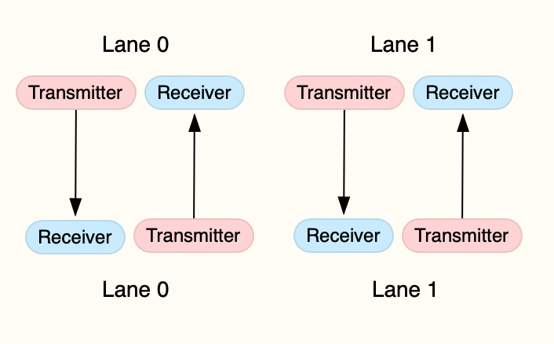
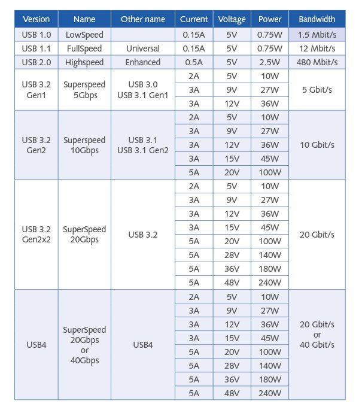
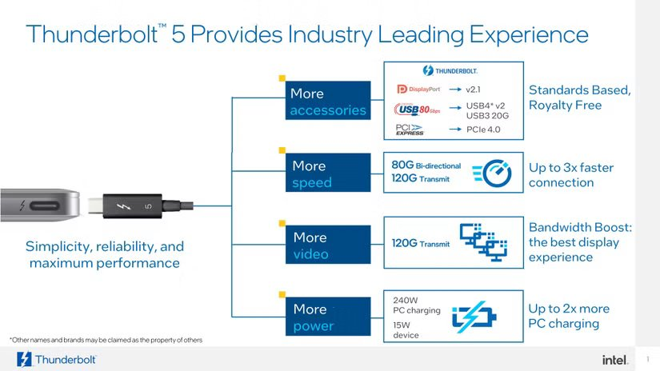
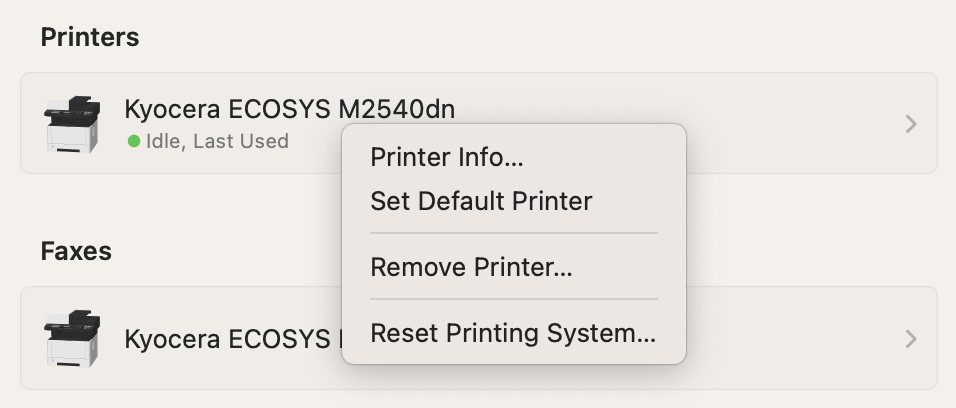

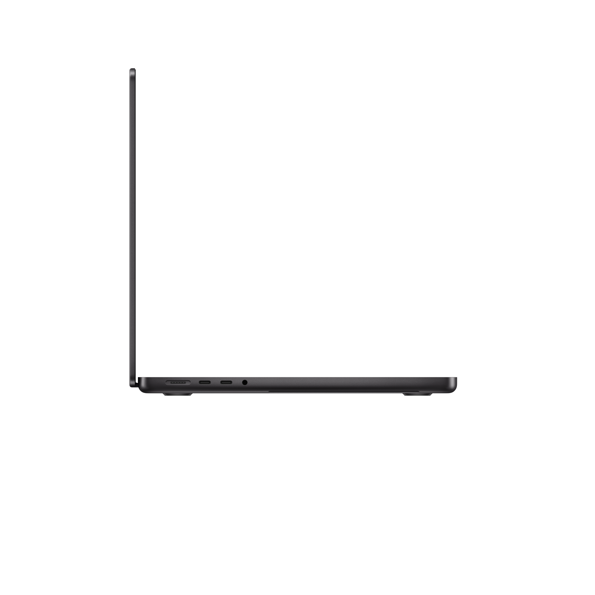
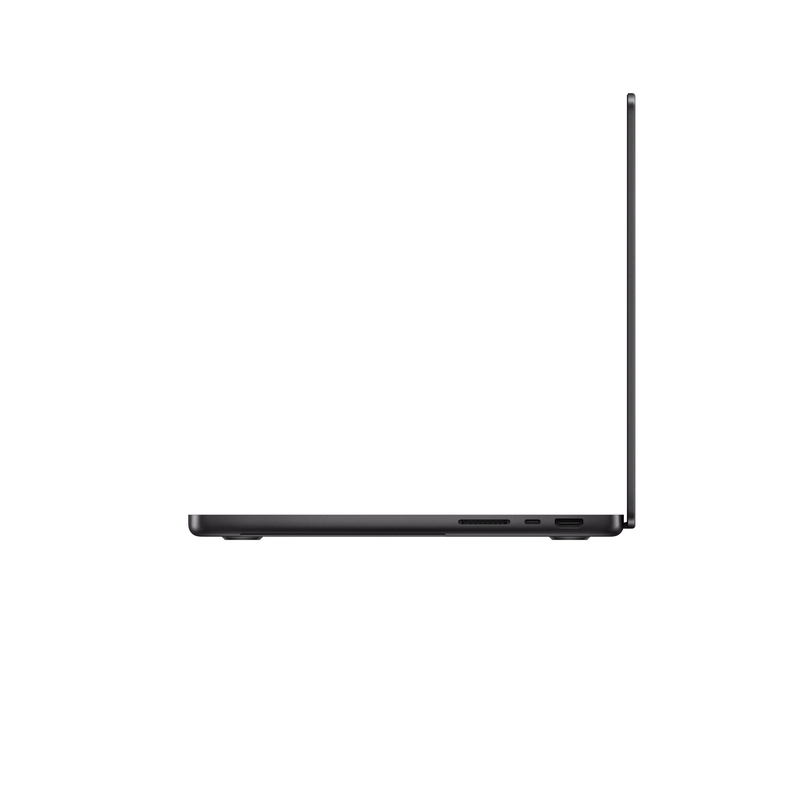
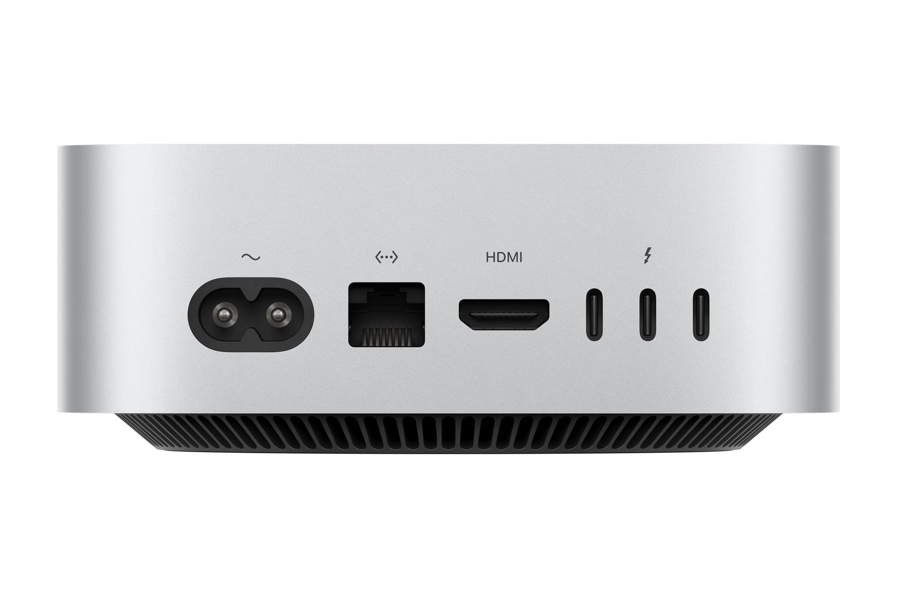
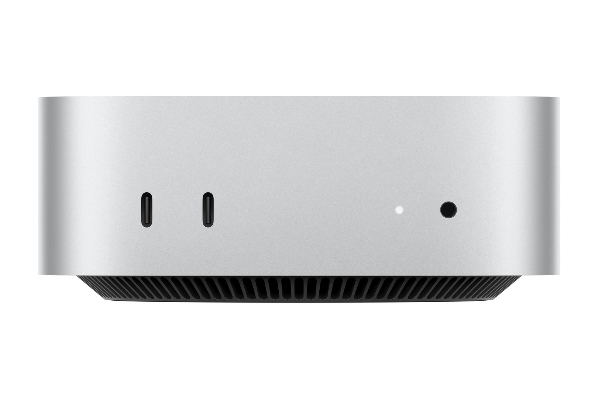
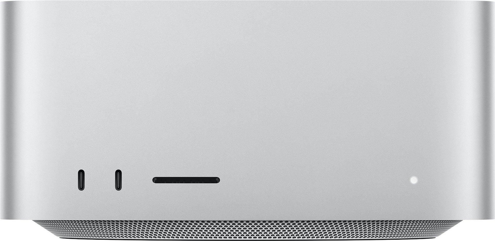
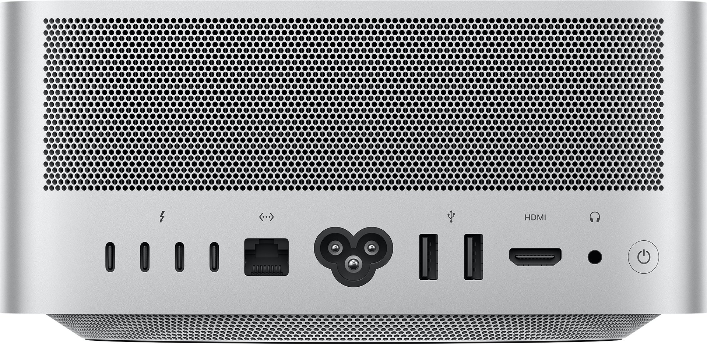

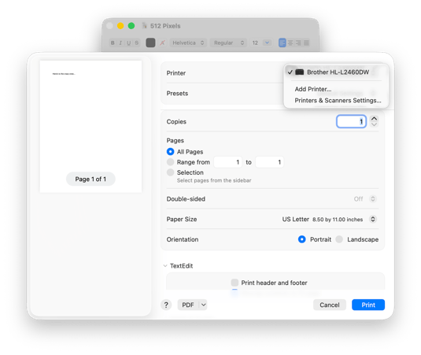
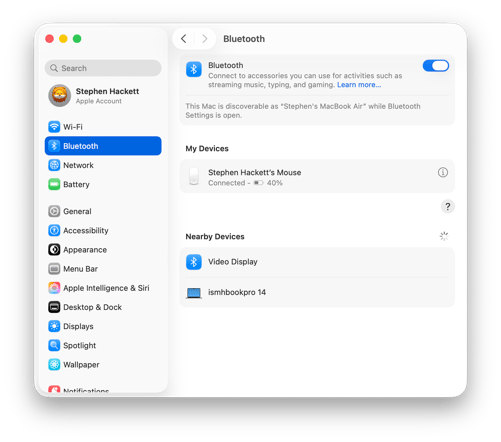
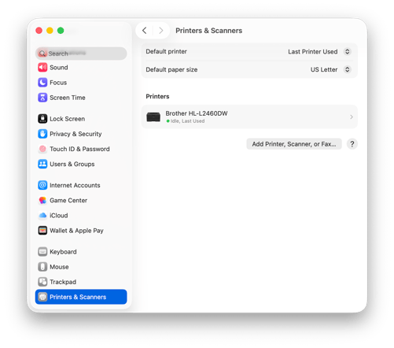
