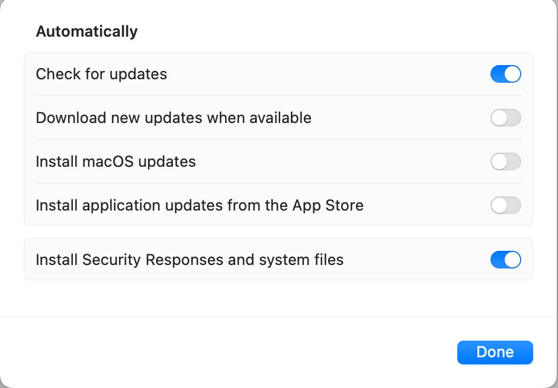
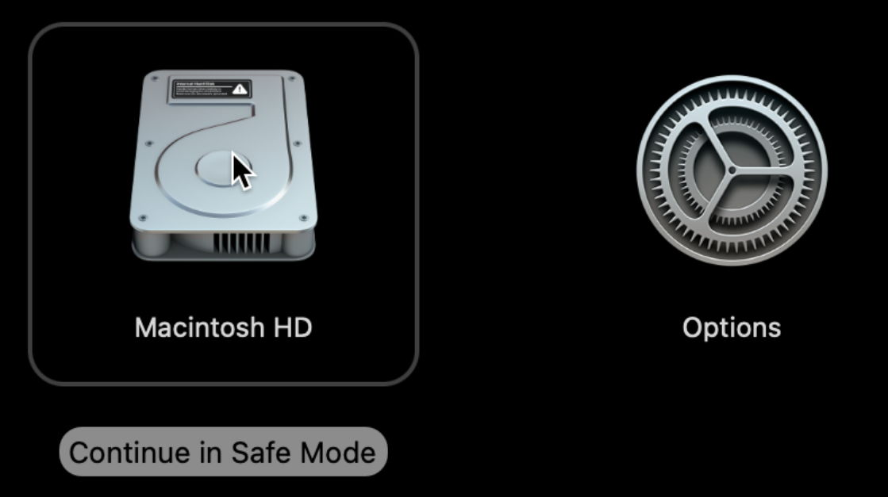
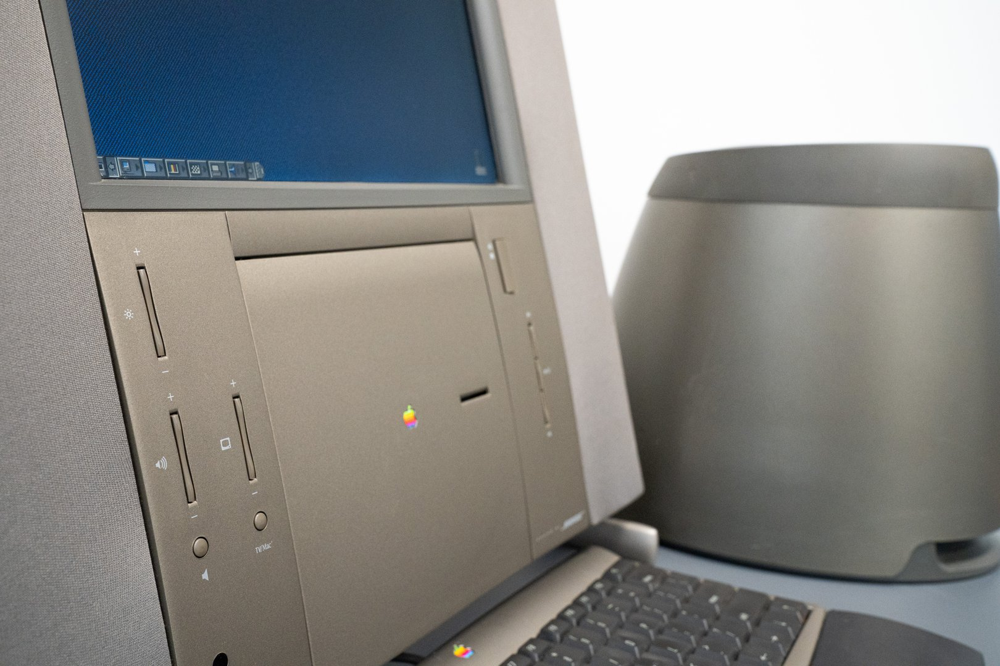
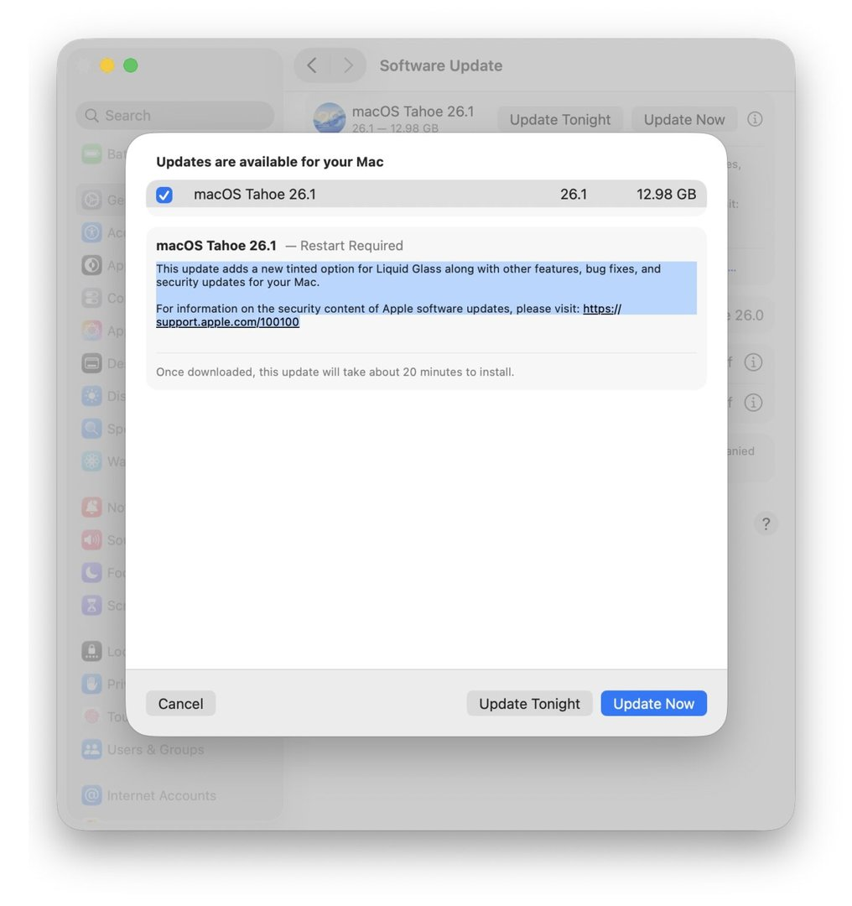
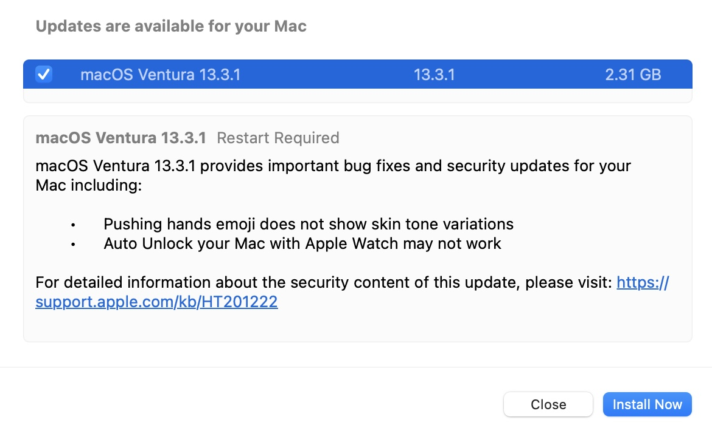
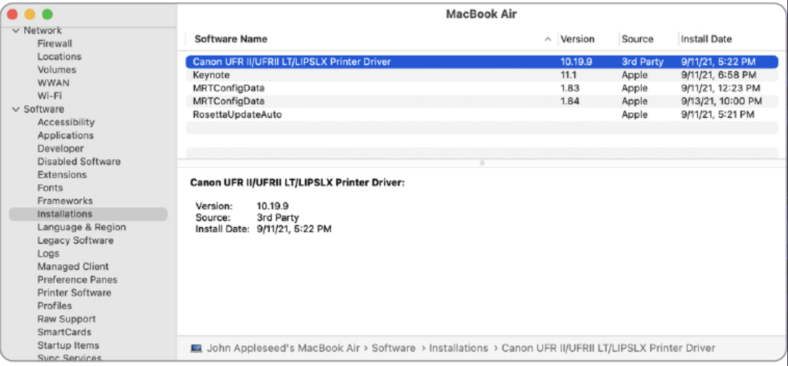
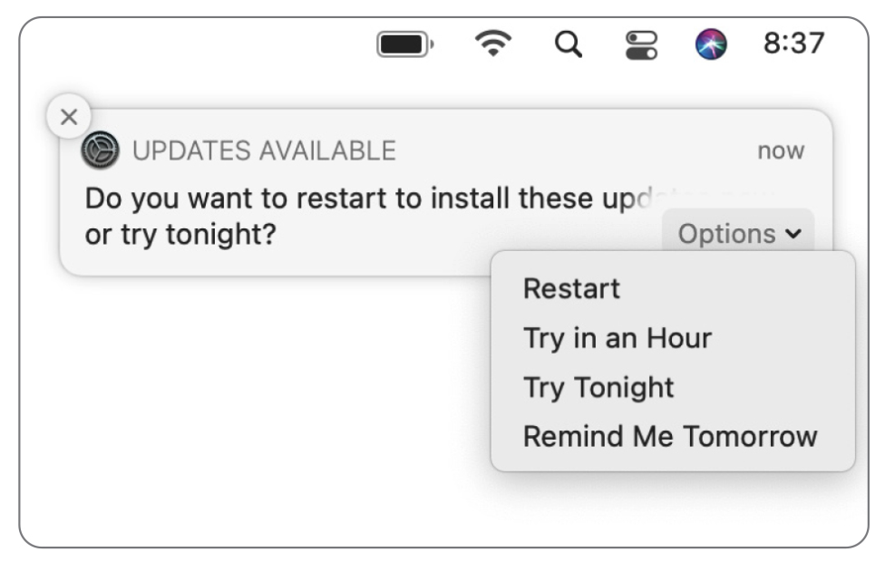
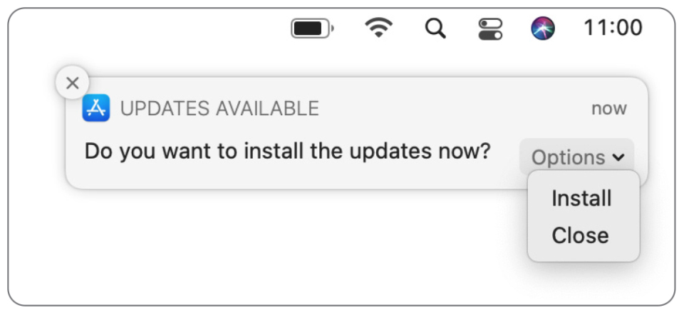
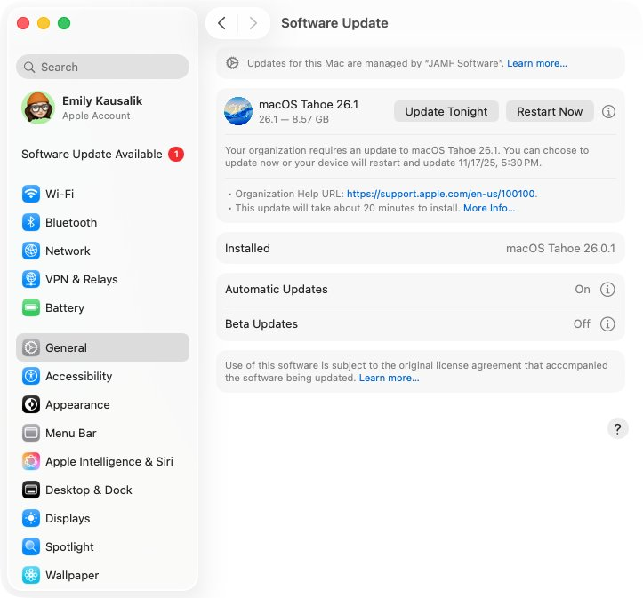

# Lesson 12: Updates and Upgrades
**Student Reference Guide**


## Overview

<!-- פודקאסט NotebookLM מתוך Captivate -->
<div style="width: 100%; height: 200px; margin-bottom: 20px; border-radius: 6px; overflow: hidden;"><iframe style="width: 100%; height: 200px;" frameborder="no" scrolling="no" allow="clipboard-write" seamless src="https://player.captivate.fm/episode/d74f76f7-4640-4f79-beb9-48a4b3de0ed3/"></iframe></div>

## Core Concepts: Terminology and Strategy

*   **Update:** A minor update or software patch released by Apple for the current operating system version (e.g., moving from macOS 26.1 to macOS 26.2).
*   **Upgrade:** A major upgrade to an entirely new operating system version (e.g., moving from macOS 25 to macOS 26).
*   **Combo Update (Historical):** A term from the past (up to Big Sur) describing a large update file containing all changes from the base version, used to bypass issues with partial installations. This has now been replaced by the SSV mechanism.
*   **Rapid Security Response (RSR):** A mechanism for distributing critical and rapid security patches without requiring a full system update installation. These updates are identified by letters in parentheses, e.g., `macOS 26.2.1 (a)`.
*   **Deferral:** A management capability (via an MDM Configuration Profile) to defer the appearance of software updates or upgrades to users for a period of up to 90 days, for compatibility testing.
*   **Declarative Device Management (DDM):** The modern generation of device management. Instead of sending a forced MDM command to update (which often fails or is poorly timed), IT defines a "Declaration" with an update deadline, and the operating system manages the preparations, notifications, and scheduling itself.
*   **Migration Assistant:** The built-in macOS tool used to transfer user profiles, data, and settings between different Mac computers.

---

## Terminal Command Repository: Managing Updates (`softwareupdate`)

The primary CLI tool in macOS for managing, downloading, and installing system updates is the `softwareupdate` command. This tool is essential for IT professionals for troubleshooting or automation.

### Search and Download:

*   **`softwareupdate -l`** or **`softwareupdate --list`**
    Scans and displays a list of all software updates currently available for the specific computer.

*   **`softwareupdate -d -a`** or **`softwareupdate --download --all`**
    Downloads all available updates to the system cache, but does **not** install them (allows for pre-preparation to save time).

*   **`softwareupdate -d "Name of Update"`**
    Downloads a specific update by its exact label as it appeared in the list command.

### Installation:

*   **`sudo softwareupdate -i -a`** or **`sudo softwareupdate --install --all`**
    Installs all available system updates at once (requires administrator privileges). On Apple Silicon Macs, a Secure Token may be required to approve a kernel update.

*   **`sudo softwareupdate -i -a -R`**
    Installs all available updates and automatically restarts the computer upon completion.

### Downloading Full Installers:

*   **`softwareupdate --fetch-full-installer`**
    Downloads the full installer file (the Install macOS.app file, approximately 12GB+) of the latest version directly to the `/Applications` folder.

*   **`softwareupdate --fetch-full-installer --full-installer-version 14.5`**
    Downloads an installer file for a specific older version, provided it is still supported and digitally signed by Apple.

### Cleanup and History:

*   **`softwareupdate --clear-catalog`**
    Resets the system's update cache (excellent for troubleshooting when the Software Update system gets stuck or doesn't show new updates).

*   **`softwareupdate --history`**
    Prints a formatted table in the terminal with the history of all updates installed on the computer to date, including versions and installation dates.

*   **`softwareupdate --install-rosetta --agree-to-license`**
    Installs the Rosetta 2 translation environment silently, without prompting the user for confirmation (ideal for pre-deployment scripts).

---

## Architecture, Background Processes, and Logs

To debug update issues, it's important to understand the system's background players.

*   **`softwareupdated`**: The main background process (Daemon) responsible for searching, authenticating with Apple servers, and installing updates.
*   **`/Library/Preferences/com.apple.SoftwareUpdate.plist`**: The system-level configuration file that stores automatic update scheduling settings and mechanism behavior.
*   **Searching for Update Errors in the Unified Logging System:**

    To find out why an update failed in an enterprise environment (e.g., network issues or server blocking), live data can be pulled from the Console:
    ```bash
    log show --predicate 'subsystem == "com.apple.SoftwareUpdate"' --info
    ```
*   **Checking Extended Installation History:**

    ```bash
    system_profiler SPInstallHistoryDataType
    ```

---

## IT Recommendations for Migrations (Migration Assistant)

Using Migration Assistant is a powerful tool, but in organizational environments, it can lead to copying problems from an old computer to a new one.

*   **Isolating Data for Transfer:** It is highly recommended *not* to transfer the Applications and Other files and folders, but only the user account (Home Folder). Transferring applications brings with it old MDM configuration files, outdated kernel extensions (Kexts), and software errors from the previous computer.
*   **Physical Connection:** For the fastest performance, connect both computers directly with a Thunderbolt cable and enable **Mac Sharing Mode** on the old computer (via Recovery Mode on Apple Silicon Macs). If no cable is available, the system will create a closed Peer-to-Peer Wi-Fi network between them.
*   **User Overlap:** Do not import a user to a new Mac if you have already created a user with the exact same name on it. Migration Assistant will stop you and require you to change the name of the imported account or replace the existing one (which could destroy admin permissions granted by the MDM).

---

## Recommended Links and Further Reading

*   [Manage software updates in Apple Platform Deployment](https://support.apple.com/guide/deployment/manage-software-updates-depc4c80847a/web) - The official guide for system administrators on controlling and deferring updates in an organization.
*   [Install software updates for Mac](https://support.apple.com/guide/mac-help/get-macos-updates-mchlpx1065/mac) - A simple guide for end-users on how to download and install system updates.
*   [Transfer to a new Mac with Migration Assistant](https://support.apple.com/en-us/102613) - A guide explaining how to transfer data and information from an old Mac to a new Mac using the Migration Assistant.
*   [Taking manual control of macOS updates with softwareupdate](https://eclecticlight.co/2023/09/06/taking-manual-control-of-macos-updates-with-softwareupdate/) - A deep dive into the terminal for advanced use of the system's update command.

## Summary Video

<!-- סרטון סיכום מתוך YouTube -->
<div style="margin-bottom: 20px; border-radius: 6px; overflow: hidden; box-shadow: 0 4px 6px rgba(0,0,0,0.1);">
    <iframe width="100%" height="450" src="https://www.youtube.com/embed/DDXfEIRgAxs" frameborder="0" allow="accelerometer; autoplay; clipboard-write; encrypted-media; gyroscope; picture-in-picture" allowfullscreen></iframe>
</div>














!!! tip "Visual Illustration (Student Aid)"
    These images illustrate the relevant interface or mechanism for the lesson topic.


<!-- src_hash: 2f435d75583553d5df9c67165c8cda23c2ca80a87361d529f07c1246ebc7f872 -->
