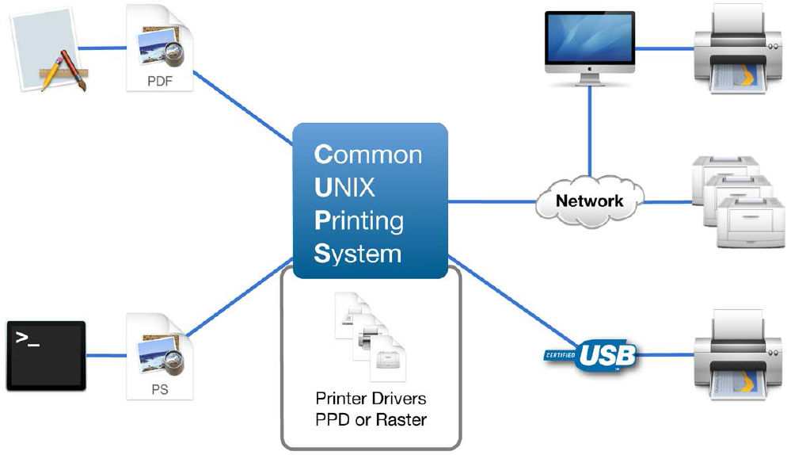
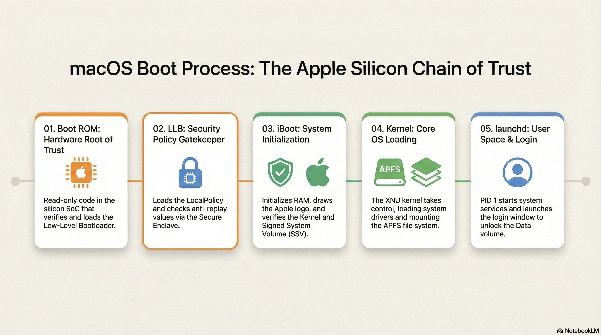
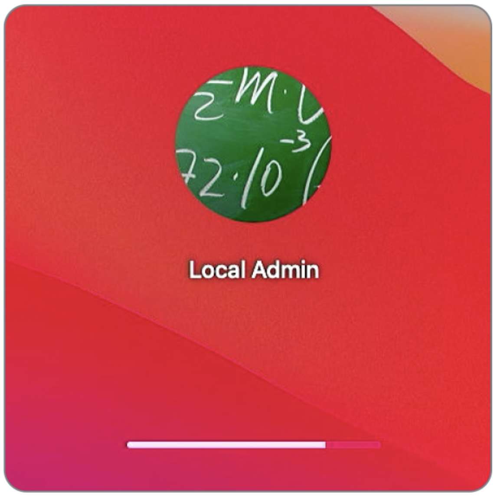
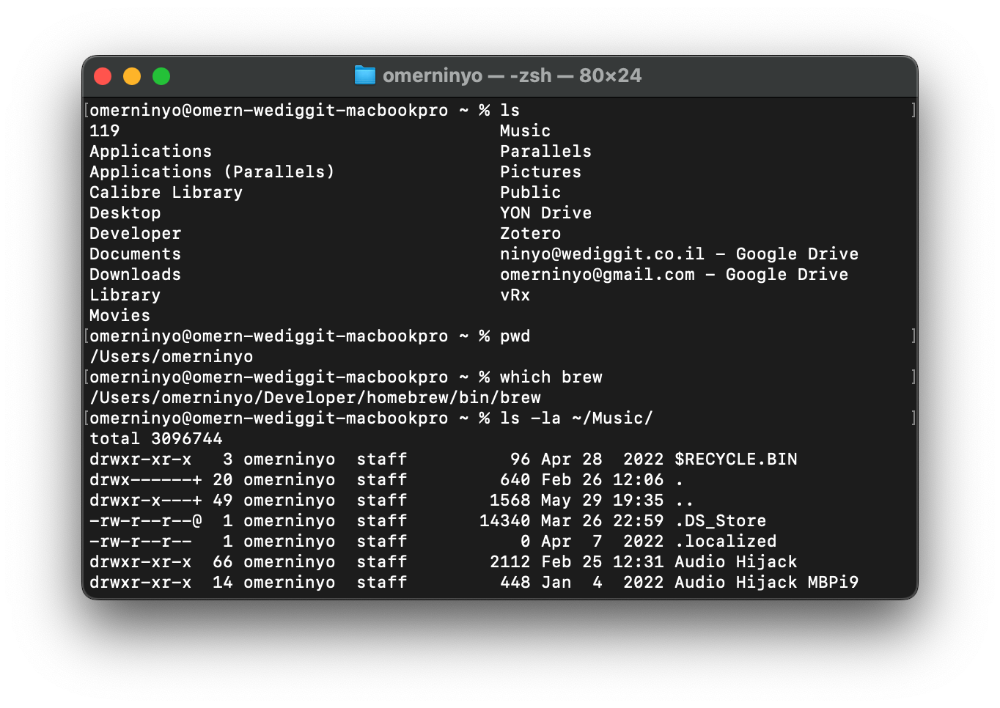
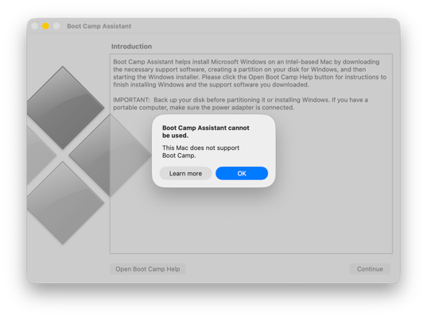

# Lesson 13: The Boot Process
**Student Reference Guide**

## Overview

<!-- NotebookLM Podcast from Captivate -->

<iframe style="width: 100%; height: 200px;" frameborder="no" scrolling="no" allow="clipboard-write" seamless src="https://player.captivate.fm/episode/332582b3-c603-4af5-a4a2-81be768b38a6/"></iframe>

## Terminology & Concepts

### The Boot Architecture in Apple Silicon

*   **Boot ROM - Stage 0:** The very first code that runs when turning on the Mac, burned into hardware (Read-Only) and cannot be modified. Its role is to verify (according to Apple's hardware signatures) and load the next stage (LLB). In the event of a severe failure, this is the component that puts the Mac into DFU mode.
*   **Low-Level Bootloader / LLB (Stage 1):** The low-level boot manager. Its primary role is to find and figure out which Volume the Mac is supposed to boot from, and verify its LocalPolicy against the Secure Enclave.
*   **iBoot - Stage 2:** The high-level boot manager (formerly known as "Firmware"). Verifies the hashes of the SSV (Signed System Volume) and loads the system kernel securely.
*   **Kernel - XNU:** The macOS operating system kernel. Takes control from iBoot, detects the full hardware, initializes system services and file systems (APFS).
*   **DFU Mode - Device Firmware Update:** An extreme emergency mode (at the Boot ROM level) that allows connecting a malfunctioning Mac to a healthy Mac with a USB-C cable and Apple Configurator to restore Firmware (Revive / Restore) when the Mac is completely unable to boot.

### Boot Security and Local Policy

*   **Startup Security Utility:** The graphical interface available only through macOS Recovery. Used to configure the security policy of the startup disk.
*   **Full Security:** The full security level (default). Allows running only macOS versions that are signed and recognized as trusted at the time of installation.
*   **Reduced Security:** Reduced security. Allows the installation of previous versions of macOS, and is a prerequisite to authorize loading third-party Kernel Extensions (Kexts) (with user or MDM system approval).
*   **Permissive Security:** Permissive security (for developers only). Allows booting a custom kernel not signed by Apple (requires complete SIP disablement).
*   **LocalPolicy:** A collection of Secure Boot settings per-Volume. It is an encrypted file signed in the SEP that ensures the system boots with a policy set and approved specifically by an admin (or MDM).

### Extensions and Kernel

*   **Kernel Extensions - Kexts:** Software that runs in the system's kernel space (Ring 0 / Kernel Space). Apple is gradually phasing out support for them, as a Kext crash brings down the entire computer (Kernel Panic). Loading them requires moving to Reduced Security.
*   **System Extensions:** The modern replacement for Kexts. These extensions run as User Space Processes (inside a "Sandbox"), so they are much safer. If they crash, the Mac continues to operate. (Common types: Network Extensions for VPN/Firewall, Endpoint Security for Antivirus).
*   **RecoveryOS Password:** In the past (on Intel) we used a Firmware Password. On Apple Silicon, via an MDM system (`SetRecoveryLock` command), you can remotely lock the ability to access the recovery mode (Recovery / Startup Options) without a password.
*   **1TR (One True Recovery):** The dedicated, unified recovery environment for Apple Silicon Macs that consolidates all boot options into one place, triggered by a long press on the power button.
*   **Fallback Recovery (frOS):** The backup (Resiliency) mechanism for the primary Recovery environment on Apple Silicon. Triggered by a double press (short then long) on the power button. Provides recovery tools in case the primary 1TR environment is damaged, but does not allow changing the security level (Startup Security Utility).

---

## Key Terminal Commands (Terminal Commands & CLI Tools)

### `system_profiler` - Exploring System Environment and Security
Commands that output data also accessible in System Information, in a quick CLI format.

*   **`system_profiler SPiBridgeDataType`**
    *   **Action:** Displays information about the security and boot component. On Apple Silicon Macs (or Intel with T2), it will show the current security level (Full / Reduced) under `Secure Boot`.
*   **`system_profiler SPSoftwareDataType`**
    *   **Action:** Displays the overall boot state. Here you can see the `Boot Mode` (Normal or Safe) and the status of `System Integrity Protection` (Enabled or Disabled).

### `bputil` - Advanced Boot Policy Management

> **Warning:** The `bputil` command runs from within macOS Recovery only (or as root in an active system to display information) and allows modification of the deep internals of LocalPolicy without utilizing the graphical interface. Incorrect usage might render the Mac unbootable.

*   **`sudo bputil -d`** or **`bputil --display-policy`**
    *   **Action:** Displays the contents of the LocalPolicy (encryptions, Kexts status, MDM approval, etc.) of the local startup disk.
*   **`sudo bputil -e`**
    *   **Action:** Displays policy for all existing installations on the Mac (if multiple operating systems are present).
*   **`bputil -f`** or **`bputil --full-security`**
    *   **Action:** Forces a transition to Full Security (revokes all security reductions across the board).
*   **`bputil -g`** or **`bputil --reduced-security`**
    *   **Action:** Changes the security level to Reduced Security only.
*   **`bputil -k`** or **`bputil --enable-kexts`**
    *   **Action:** Enables support for third-party kernel extensions (automatically shifts to Reduced Security if necessary).
*   **`bputil -m`** or **`bputil --enable-mdm`**
    *   **Action:** Authorizes the MDM to manage software updates and kernel extension updates without requiring local user intervention (puts the LocalPolicy into a state that acknowledges the MDM's authority to intervene in Boot).

*(Note: Modification commands in `bputil` usually require an admin password or exact disk selection, by specifying a UUID using the `diskutil apfs listVolumeGroups` command)*.

### `kmutil` - Kernel Management Utility

*   **`kmutil showloaded`**
    *   **Action:** Displays a comprehensive list of all kernel extensions actually loaded at runtime (replaces the deprecated `kextstat` command).
*   **`kmutil trigger-panic-medic`**
    *   **Action:** A dedicated emergency command for Recovery Mode. Intended for cases where a third-party extension traps the Mac in a crash loop (Boot Loop). It performs a formal override disabling the dependency on the Kexts and allows the Mac to boot safely. (You must specify the disk path, for example: `kmutil trigger-panic-medic --volume-root /Volumes/Macintosh\ HD`).

### `csrutil` - System Integrity Protection Management
Run from Terminal in recovery mode only to make changes.

*   **`csrutil status`** - Check the current status (enabled/disabled). Can be run in the active system.
*   **`csrutil disable`** - Completely turns off SIP protections (not recommended except for development and clinical investigation purposes).
*   **`csrutil enable`** - Restores protection to active status.

---

## Frequently Asked Questions from Students (FAQ)

*   **Q: Can you put a Firmware Password on Apple Silicon Macs to prevent booting from an external drive?**
    *   **A:** No. Apple removed support for the firmware password on Apple Silicon because the security is built into the SoC itself and requires user authentication (Volume Ownership) prior to any security change. In an enterprise, the solution is setting a `RecoveryOS Password` via the MDM to lock access to the Startup Options menu itself.
*   **Q: A corporate sync app (like Google Drive or OneDrive) requests installing a Kernel Extension. Should I allow it?**
    *   **A:** Since macOS Monterey/Ventura there's no need! File sync apps have transitioned to using the File Provider API which is a System Extension that runs in User Space and does not mandate a switch to Reduced Security. It's recommended to demand the updated version from the vendor.
*   **Q: What to do when the computer continuously crashes right at boot (Boot Loop / Kernel Panic) and fails to reach the system?**
    *   **A:** The first step is to boot into Safe Mode, which prevents third-party Kexts from loading (in addition to clearing caches). If the issue indeed lies with an outdated Kext, the Mac will boot. A more advanced solution would be entering recovery mode and running the `kmutil trigger-panic-medic` command in Terminal.

---

## Recommended Links and Further Reading

* [Startup Disk security policy control for a Mac](https://support.apple.com/guide/security/startup-disk-security-policy-control-secc7b34e5b5/web) - A technical article explaining why and how security levels are reduced on the Mac to load hardware extensions (Kexts).
* [Boot process for a Mac with Apple silicon](https://support.apple.com/guide/security/boot-process-for-a-mac-with-apple-silicon-sec5d3013d28/web) - An official in-depth document on the boot process chain of Apple Silicon processors.
* [Booting an M1 Mac from hardware to kexts: 1 Hardware](https://eclecticlight.co/2022/01/04/booting-an-m1-mac-from-hardware-to-kexts-1-hardware/) - An article digging into the earliest stages of hardware activation during the boot process.
* [Booting an M1 Mac from hardware to kexts: 2 LLB and iBoot](https://eclecticlight.co/2022/01/05/booting-an-m1-mac-from-hardware-to-kexts-2-llb-and-iboot/) - The second part of the article reviewing the process of loading the operating system from storage.

## Summary Video

<!-- Summary video from YouTube -->

    <iframe width="100%" height="450" src="https://www.youtube.com/embed/DDXfEIRgAxs" frameborder="0" allow="accelerometer; autoplay; clipboard-write; encrypted-media; gyroscope; picture-in-picture" allowfullscreen></iframe>

!!! tip "Visual Aid (Student Reference)"
    These images illustrate the interface or mechanism relevant to the lesson topic.

<!-- src_hash: 61b575ed0cf0bc53e1c3ab93bf5ec4c3e58067cb0a055d9937c63684445b9590 -->
