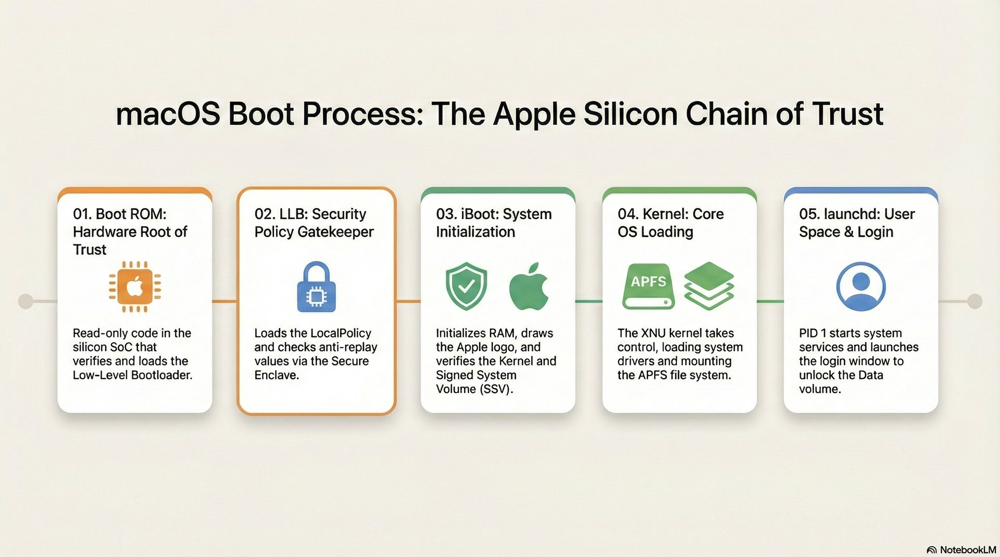
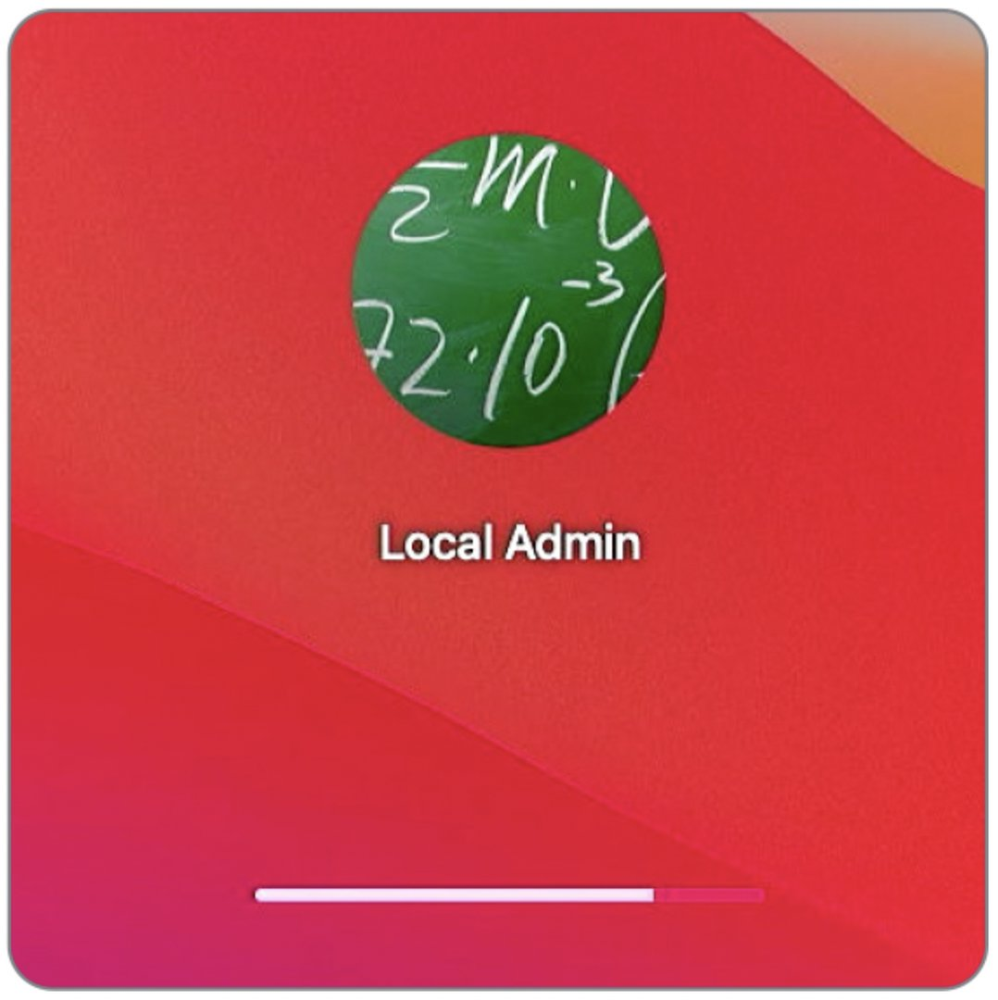
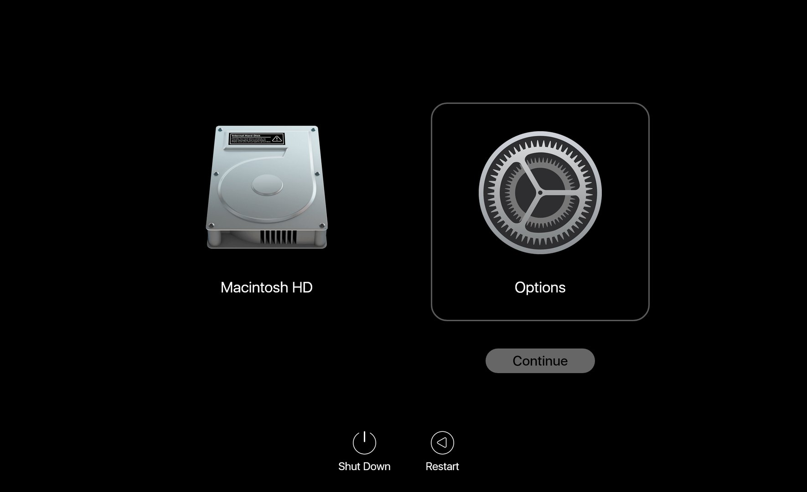

# Lesson 13: The Boot Process
**Part C: Student Learning Guide (vEXP)**

## Overview

<!-- NotebookLM Podcast from Captivate -->

<iframe style="width: 100%; height: 200px;" frameborder="no" scrolling="no" allow="clipboard-write" seamless src="https://player.captivate.fm/episode/8a8c1088-1f17-49f9-bb6d-e8b34a2f904f/"></iframe>

## Terminology & Core Concepts

### The Boot Architecture in Apple Silicon

*   **Boot ROM - Stage 0:** The first code that runs when turning on the Mac, burned into hardware (Read-Only) and unalterable. Its role is to verify (according to Apple's hardware signatures) and load the next stage (LLB). In case of a severe failure, this component puts the Mac into DFU mode.
*   **Low-Level Bootloader / LLB (Stage 1):** The low-level bootloader. Its main role is to find and understand which Volume the Mac is supposed to Boot from, and verify its LocalPolicy against the Secure Enclave.
*   **iBoot - Stage 2:** The high-level bootloader (formerly known as "Firmware"). Verifies the hashes of the SSV (Signed System Volume) and securely loads the System Kernel.
*   **Kernel - XNU:** The macOS kernel. Takes control from iBoot, identifies all hardware, starts system services and file systems (APFS).
*   **DFU Mode - Device Firmware Update:** An extreme emergency state (at the Boot ROM level) that allows connecting a malfunctioning Mac to a working Mac with a USB-C cable and Apple Configurator to restore Firmware (Revive / Restore) when the Mac cannot boot at all.

### Boot Security and Local Policy

*   **Startup Security Utility:** The graphical interface available only through macOS Recovery. Used to configure the security policy of the startup disk.
*   **Full Security:** The full security level (default). Allows running only macOS versions that are signed and recognized as safe at the time of installation.
*   **Reduced Security:** Allows the installation of older macOS versions, and is a prerequisite for authorizing the loading of third-party Kernel Extensions (Kexts) (either by user approval or an MDM system).
*   **Permissive Security:** (For developers only). Allows booting a custom kernel that is not signed by Apple (requires disabling SIP completely).
*   **LocalPolicy:** A collection of Secure Boot settings per Volume. This is an encrypted file signed in the SEP ensuring the system boots with a policy specifically set and approved by an administrator (or MDM).

### Extensions and Kernel

*   **Kernel Extensions - Kexts:** Software that runs in the kernel space (Ring 0). Apple is gradually phasing out support for them, as a Kext crash brings down the whole computer (Kernel Panic). Loading them requires switching to Reduced Security.
*   **System Extensions:** The modern replacement for Kexts. These extensions run as User Space Processes (inside a "Sandbox"), making them much safer. If they crash, the Mac continues to work. (Common types: Network Extensions for VPN/Firewall, Endpoint Security for Antivirus).
*   **RecoveryOS Password:** In the past (on Intel) we used a Firmware Password. On Apple Silicon, an MDM system (via the `SetRecoveryLock` command) can remotely lock the ability to enter the Recovery / Startup Options menu without a password.
*   **1TR (One True Recovery):** The dedicated, unified recovery environment for Apple Silicon Macs that consolidates all boot options into one place, activated by long-pressing the power button.
*   **Fallback Recovery (frOS):** The backup (Resiliency) mechanism for the primary Recovery environment on Apple Silicon. Activated by a double-press (short then long) on the power button. Provides recovery tools in case the primary 1TR is corrupted, but does not allow changing the security level (Startup Security Utility).

---

## Key Terminal Commands & CLI Tools

### `system_profiler` - System and Security Environment Investigation
Commands that display data accessible in System Information, formatted quickly for the CLI.

*   **`system_profiler SPiBridgeDataType`**
    *   **Action:** Displays info about the security and boot component. On Apple Silicon (or Intel with T2), it will show under `Secure Boot` the current security level (Full / Reduced).
*   **`system_profiler SPSoftwareDataType`**
    *   **Action:** Displays the general boot state. Here you can see the `Boot Mode` (Normal or Safe) and the status of `System Integrity Protection` (Enabled or Disabled).

### `bputil` - Advanced Boot Policy Management

> **Warning:** The `bputil` command operates only from within macOS Recovery (or as root in a live system for viewing info) and allows deep modifications to the LocalPolicy without the GUI. Misuse can render the Mac Unbootable.

*   **`sudo bputil -d`** or **`bputil --display-policy`**
    *   **Action:** Displays the contents of the LocalPolicy (encryptions, Kexts status, MDM approval, etc.) for the local startup disk.
*   **`sudo bputil -e`**
    *   **Action:** Displays policies for all existing installations on the Mac (if multiple OSes are present).
*   **`bputil -f`** or **`bputil --full-security`**
    *   **Action:** Forces a switch to Full Security (revokes all security reductions universally).
*   **`bputil -g`** or **`bputil --reduced-security`**
    *   **Action:** Changes the security level to Reduced Security only.
*   **`bputil -k`** or **`bputil --enable-kexts`**
    *   **Action:** Enables support for third-party kernel extensions (automatically switches to Reduced Security if needed).
*   **`bputil -m`** or **`bputil --enable-mdm`**
    *   **Action:** Authorizes MDM to manage software updates and kernel extension updates without local user involvement (puts the LocalPolicy in a state recognizing MDM's authority to intervene in Boot).

*(Note: Modification commands in `bputil` usually require an admin password or specifying the exact disk by noting the UUID with the `diskutil apfs listVolumeGroups` command).*

### `kmutil` - Kernel Management Utility

*   **`kmutil showloaded`**
    *   **Action:** Displays a complete list of all kernel extensions actually loaded at runtime (replaces the obsolete `kextstat` command).
*   **`kmutil trigger-panic-medic`**
    *   **Action:** A dedicated emergency command for Recovery Mode. Used in cases where a third-party extension traps the Mac in a Boot Loop. It overrides the formal deletion of dependent Kexts and allows the Mac to boot safely. (You must specify the disk path, e.g.: `kmutil trigger-panic-medic --volume-root /Volumes/Macintosh\ HD`).

### `csrutil` - System Integrity Protection Management
Run from Terminal in Recovery Mode only to make changes.

*   **`csrutil status`** - Check current status (enabled/disabled). Can be run in the live system.
*   **`csrutil disable`** - Completely disables SIP protections (not recommended except for development and clinical investigation purposes).
*   **`csrutil enable`** - Restores protection.

---

## Common Student FAQs

*   **Q: Can I set a Firmware Password on Apple Silicon Macs to prevent booting from an external disk?**
    *   **A:** No. Apple removed firmware password support in Apple Silicon because security is built into the SoC itself and requires user authentication (Volume Ownership) before any security change. In an enterprise, the solution is setting a `RecoveryOS Password` via MDM to lock access to the Startup Options menu.
*   **Q: An enterprise sync app (like Google Drive or OneDrive) asks to install a Kernel Extension. Should I allow it?**
    *   **A:** Since macOS Monterey/Ventura, this is unnecessary! File sync apps have moved to use the File Provider API, which is a System Extension running in User Space and does not require switching to Reduced Security. You should request the updated version from the vendor.
*   **Q: What do I do when the computer constantly crashes right at boot (Boot Loop / Kernel Panic) and fails to load the system?**
    *   **A:** The first step is to boot into Safe Mode, which prevents third-party Kexts from loading (in addition to clearing caches). If the issue is indeed an old Kext, the Mac will boot. A more advanced solution would be to enter Recovery Mode and run the `kmutil trigger-panic-medic` command in Terminal.

---

## Recommended Reading & Links

* [Startup Disk security policy control for a Mac](https://support.apple.com/guide/security/startup-disk-security-policy-control-secc7b34e5b5/web) - A technical article explaining why and how to lower security levels on a Mac to load hardware extensions (Kexts).
* [Boot process for a Mac with Apple silicon](https://support.apple.com/guide/security/boot-process-for-a-mac-with-apple-silicon-sec5d3013d28/web) - An official deep dive document on the Boot process for Apple Silicon processors.
* [Booting an M1 Mac from hardware to kexts: 1 Hardware](https://eclecticlight.co/2022/01/04/booting-an-m1-mac-from-hardware-to-kexts-1-hardware/) - An article digging into the earliest stages of hardware initialization in the boot process.
* [Booting an M1 Mac from hardware to kexts: 2 LLB and iBoot](https://eclecticlight.co/2022/01/05/booting-an-m1-mac-from-hardware-to-kexts-2-llb-and-iboot/) - The second part of the article reviewing the OS loading process from storage.

## Summary Video

<!-- Summary Video from YouTube -->

    <iframe width="100%" height="450" src="https://www.youtube.com/embed/DDXfEIRgAxs" frameborder="0" allow="accelerometer; autoplay; clipboard-write; encrypted-media; gyroscope; picture-in-picture" allowfullscreen></iframe>

## 💡 Presentation Visuals

> [!NOTE]
> These images can be projected in the classroom during the explanation of the topic, or integrated into presentations.

!!! tip "Visual Aid (Student Reference)"
    These images illustrate the relevant interface or mechanism for the lesson topic.

