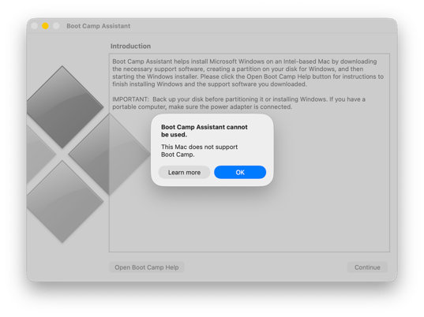

# שיעור 13: תהליך האתחול
**מדריך עזר (מדריך עזר לתלמיד)**

## סקירה

<!-- פודקאסט NotebookLM מתוך Captivate -->

<iframe style="width: 100%; height: 200px;" frameborder="no" scrolling="no" allow="clipboard-write" seamless src="https://player.captivate.fm/episode/332582b3-c603-4af5-a4a2-81be768b38a6/"></iframe>

## מילון מונחים והגדרות יסוד (Terminology & Concepts)

### ארכיטקטורת האתחול ב-Apple Silicon

*   **Boot ROM - Stage 0:** הקוד הראשון שרץ בהדלקת המק, צרוב בחומרה (Read-Only) ולא ניתן לשינוי. תפקידו לאמת (לפי חתימות חומרה של Apple) ולטעון את השלב הבא (LLB). במקרה של תקלה חמורה, זהו הרכיב שמכניס את המק למצב DFU.
*   **Low-Level Bootloader / LLB (Stage 1):** מנהל האתחול ברמה הנמוכה. תפקידו העיקרי הוא לחפש ולהבין מאיזה Volume  המק אמור לבצע Boot, ולאמת את ה-LocalPolicy שלו מול ה-Secure Enclave.
*   **iBoot - Stage 2:** מנהל האתחול ברמה הגבוהה (מה שבעבר כונה "Firmware"). מאמת את ההאשים של ה-SSV (Signed System Volume) ומעלה את ליבת המערכת (Kernel) בצורה בטוחה.
*   **Kernel - XNU:** ליבת מערכת ההפעלה macOS. לוקחת שליטה מ-iBoot, מזהה את החומרה המלאה, מפעילה שירותי מערכת ומערכות קבצים (APFS).
*   **DFU Mode - Device Firmware Update:** מצב חירום קיצוני (ברמת Boot ROM) המאפשר לחבר מק תקול למק תקין עם כבל USB-C ו-Apple Configurator כדי לשחזר Firmware (Revive / Restore) כשהמק לא מסוגל לאתחל כלל.

### אבטחת האתחול ומדיניות מקומית

*   **Startup Security Utility:** הממשק הגרפי הזמין רק דרך macOS Recovery. משמש להגדרת מדיניות האבטחה של דיסק ההפעלה.
*   **Full Security:** רמת האבטחה המלאה (ברירת המחדל). מאפשרת להריץ רק גרסאות macOS שחתומות ומוכרות כבטוחות בזמן ההתקנה.
*   **Reduced Security:** אבטחה מופחתת. מאפשרת התקנת גרסאות קודמות של macOS, ומהווה תנאי סף כדי לאשר טעינת הרחבות קרנל (Kexts) של חברות צד שלישי (באישור המשתמש או מערכת ה-MDM).
*   **Permissive Security:** אבטחה מתירנית (למפתחים בלבד). מאפשרת להעלות קרנל מותאם אישית שאינו חתום על ידי אפל (מחייב ביטול SIP מוחלט).
*   **LocalPolicy:** אוסף של הגדרות אבטחת האתחול (Secure Boot settings) פר-Volume. זהו קובץ מוצפן וחתום ב-SEP המבטיח שהמערכת עולה עם מדיניות שנקבעה ואושרה ספציפית על ידי מנהל (או MDM).

### הרחבות וקרנל

*   **Kernel Extensions - Kexts:** תוכנות שרצות במרחב הליבה של המערכת (Ring 0 / Kernel Space). אפל מסיימת את תמיכתה בהן בהדרגה, מאחר וקריסה של Kext מפילה את כל המחשב (Kernel Panic). טעינתן מחייבת מעבר ל-Reduced Security.
*   **System Extensions:** המחליף המודרני ל-Kexts. הרחבות אלו רצות כ-User Space Processes (בתוך "Sandbox"), ולכן הן בטוחות בהרבה. אם הן קורסות, המק ממשיך לעבוד. (סוגים נפוצים: Network Extensions ל-VPN/Firewall, Endpoint Security לאנטי וירוס).
*   **RecoveryOS Password:** בעבר (ב-Intel) השתמשנו ב-Firmware Password. ב-Apple Silicon, ניתן דרך מערכת MDM (פקודת `SetRecoveryLock`) לנעול את היכולת להיכנס למצב השחזור (Recovery / Startup Options) ללא ססמה מרחוק.
*   **1TR (One True Recovery):** סביבת השחזור הייעודית והאחידה של מחשבי Apple Silicon המאחדת את כלל אפשרויות האתחול למקום אחד, ומופעלת באמצעות לחיצה ארוכה על כפתור ההפעלה.
*   **Fallback Recovery (frOS):** מנגנון הגיבוי (Resiliency) לסביבת ה-Recovery הראשית ב-Apple Silicon. מופעל על ידי לחיצה כפולה (קצרה ואז ארוכה) על כפתור ההפעלה. מספק כלי התאוששות למקרה שסביבת ה-1TR הראשית נפגמת, אך אינו מאפשר שינוי של רמת האבטחה (Startup Security Utility).

---

## פקודות טרמינל מרכזיות (Terminal Commands & CLI Tools)

### `system_profiler` - חקירת סביבת המערכת והאבטחה
פקודות המציגות נתונים הנגישים גם ב-System Information, בתצורה מהירה ל-CLI.

*   **`system_profiler SPiBridgeDataType`**
    *   **פעולה:** מציג מידע על רכיב האבטחה והאתחול. במחשבי Apple Silicon (או Intel עם T2), יציג תחת `Secure Boot` את רמת האבטחה הנוכחית (Full / Reduced).
*   **`system_profiler SPSoftwareDataType`**
    *   **פעולה:** מציג את מצב ההפעלה הכללי. כאן תוכלו לראות את ה-`Boot Mode` (Normal או Safe) ואת הסטטוס של ה-`System Integrity Protection` (Enabled או Disabled).

### `bputil` - ניהול מדיניות אתחול (Boot Policy) מתקדם

> **אזהרה:** פקודת `bputil` פועלת מתוך macOS Recovery בלבד (או כ-root במערכת פעילה להצגת מידע) ומאפשרת שינוי קרביים עמוקים של ה-LocalPolicy מבלי להיעזר בממשק הגרפי. שימוש שגוי עלול להפוך את המק ללא זמין לאתחול (Unbootable).

*   **`sudo bputil -d`** או **`bputil --display-policy`**
    *   **פעולה:** מציג את תוכן ה-LocalPolicy (הצפנות, סטטוס Kexts, אישור MDM וכו') של דיסק ההפעלה המקומי.
*   **`sudo bputil -e`**
    *   **פעולה:** הצגת מדיניות לכל ההתקנות הקיימות על המק (אם יש מספר מערכות הפעלה).
*   **`bputil -f`** או **`bputil --full-security`**
    *   **פעולה:** כופה מעבר ל-Full Security (מבטל את כל הנמכות האבטחה באופן גורף).
*   **`bputil -g`** או **`bputil --reduced-security`**
    *   **פעולה:** משנה את רמת האבטחה ל-Reduced Security בלבד.
*   **`bputil -k`** או **`bputil --enable-kexts`**
    *   **פעולה:** מפעיל תמיכה בהרחבות קרנל של צד-שלישי (משנה אוטומטית ל-Reduced Security במידת הצורך).
*   **`bputil -m`** או **`bputil --enable-mdm`**
    *   **פעולה:** מאשר ל-MDM לנהל עדכוני תוכנה ועדכוני הרחבות קרנל ללא צורך במעורבות המשתמש המקומי (מכניס את ה-LocalPolicy למצב המכיר בסמכות ה-MDM להתערב ב-Boot).

*(הערה: פקודות שינוי ב-`bputil` דורשות לרוב מתן ססמת אדמין או בחירת דיסק מדויקת, ע"י ציון UUID בעזרת פקודת `diskutil apfs listVolumeGroups`)*.

### `kmutil` - ניהול הרחבות קרנל (Kernel Management Utility)

*   **`kmutil showloaded`**
    *   **פעולה:** מציג רשימה מלאה של כל הרחבות הליבה שנטענו בפועל בזמן הריצה (מחליף את הפקודה המיושנת `kextstat`).
*   **`kmutil trigger-panic-medic`**
    *   **פעולה:** פקודת חרום ייעודית למצב שחזור (Recovery Mode). מיועדת למקרים שבהם הרחבת צד-שלישי תוקעת את המק בלולאת קריסות (Boot Loop). היא מבטלת מחיקה רשמית של ה-Kexts התלויים ומאפשרת למק לאתחל בבטחה. (יש לציין את נתיב הדיסק, למשל: `kmutil trigger-panic-medic --volume-root /Volumes/Macintosh\ HD`).

### `csrutil` - ניהול הגנת המערכת (System Integrity Protection)
מופעלת מ-Terminal במצב שחזור בלבד לביצוע שינויים.

*   **`csrutil status`** - בדיקת סטטוס נוכחי (מופעל/כבוי). מותר להרצה במערכת הפעילה.
*   **`csrutil disable`** - מבטל כליל את הגנות ה-SIP (לא מומלץ למעט מטרות פיתוח וחקירה קלינית).
*   **`csrutil enable`** - החזרת ההגנה לפעילות.

---

## שאלות ותשובות נפוצות מסטודנטים (FAQ)

*   **ש: האם אפשר לשים Firmware Password במחשבי Apple Silicon כדי למנוע אתחול מדיסק חיצוני?**
    *   **ת:** לא. אפל הסירה את תמיכת סיסמת הקושחה ב-Apple Silicon משום שהאבטחה בנויה בתוך ה-SoC עצמו ויש צורך באימות משתמש (Volume Ownership) לפני כל שינוי אבטחתי. בארגון, הפתרון הוא הגדרת `RecoveryOS Password` דרך ה-MDM כדי לנעול את עצם הגישה לתפריט ה-Startup Options.
*   **ש: אפליקציית סנכרון ארגונית (כמו Google Drive או OneDrive) מבקשת להתקין Kernel Extension. האם לאפשר?**
    *   **ת:** מאז macOS Monterey/Ventura אין בזה צורך! אפליקציות סנכרון קבצים עברו להשתמש ב-File Provider API שהוא System Extension שרץ במרחב המשתמש (User Space) ולא מחייב מעבר ל-Reduced Security. מומלץ לדרוש מהיצרן את הגרסה המעודכנת.
*   **ש: מה עושים כאשר המחשב כל הזמן קורס מיד באתחול (Boot Loop / Kernel Panic) ולא מצליח לעלות למערכת?**
    *   **ת:** הצעד הראשון הוא לאתחל ב-Safe Mode, מה שמונע טעינת Kexts צד שלישי (בנוסף לניקוי קאשים). אם הבעיה היא אכן ב-Kext ישן, המק יעלה. פתרון מתקדם יותר יהיה להכנס למצב התאוששות ולהריץ בטרמינל את פקודת `kmutil trigger-panic-medic`.

---

## קישורים מומלצים ולקריאה נוספת

* [Startup Disk security policy control for a Mac](https://support.apple.com/guide/security/startup-disk-security-policy-control-secc7b34e5b5/web) - מאמר טכני המסביר למה ואיך מנמיכים את רמות האבטחה במק כדי לטעון תוספי חומרה (Kexts).
* [Boot process for a Mac with Apple silicon](https://support.apple.com/guide/security/boot-process-for-a-mac-with-apple-silicon-sec5d3013d28/web) - מסמך עומק רשמי על שרשרת ההפעלה (Boot process) של מעבדי Apple Silicon.
* [Booting an M1 Mac from hardware to kexts: 1 Hardware](https://eclecticlight.co/2022/01/04/booting-an-m1-mac-from-hardware-to-kexts-1-hardware/) - מאמר שחופר על השלבים המוקדמים ביותר של הפעלת החומרה בתהליך האתחול.
* [Booting an M1 Mac from hardware to kexts: 2 LLB and iBoot](https://eclecticlight.co/2022/01/05/booting-an-m1-mac-from-hardware-to-kexts-2-llb-and-iboot/) - החלק השני במאמר שסוקר את תהליך טעינת מערכת ההפעלה מהאחסון.

## סרטון סיכום

<!-- סרטון סיכום מתוך YouTube -->

    <iframe width="100%" height="450" src="https://www.youtube.com/embed/DDXfEIRgAxs" frameborder="0" allow="accelerometer; autoplay; clipboard-write; encrypted-media; gyroscope; picture-in-picture" allowfullscreen></iframe>

## 💡 עזרים ויזואליים להרצאה (Presentation Visuals)

!!! tip "המחשה ויזואלית (עזר לתלמיד)"
    תמונות אלו ממחישות את הממשק או המנגנון הרלוונטי לנושא השיעור.

---

  <a href="../../Lesson_14/LearningGuide/" style="font-size: 0.95em; color: gray; text-decoration: none;">⏭️ דלג לאותו שלב בשיעור הבא</a>

