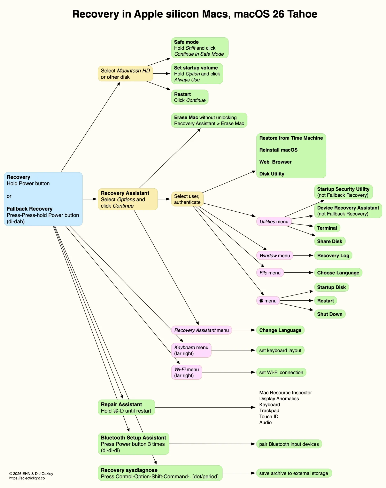

# Lesson 14: Recovery and Erase Environment
**Student Reference Guide**

## Overview

<!-- NotebookLM Podcast from Captivate -->

<iframe style="width: 100%; height: 200px;" frameborder="no" scrolling="no" allow="clipboard-write" seamless src="https://player.captivate.fm/episode/332582b3-c603-4af5-a4a2-81be768b38a6/"></iframe>

## Core Recovery Concepts

- **Single User Mode (SUM):** The historical command-line only recovery mechanism used by technicians for the first 27 years of the Mac, before the introduction of the Recovery partition in Lion (2011).
- **1TR - One True Recovery:** On Apple Silicon Macs, the RecoveryOS is completely separated from the regular operating system (macOS) and stored in a dedicated container. It was designed to be "bulletproof" - even if you completely erase the disk (including system partitions), the 1TR survives and allows downloading and reinstalling the system, without needing the classic Internet Recovery (as was the case on Intel).
- **Fallback Recovery - frOS:** A "backup plan" mechanism on Apple Silicon. If the 1TR crashes or gets corrupted, the Mac will boot a recovery environment from the previous operating system update. Activated by a fast double-press and hold of the power button.
- **DFU Mode - Device Firmware Update:** A hardware recovery mode at the lowest level. In this state, the Mac does not load any operating system and functions as a "dumb device" waiting to receive Firmware and recoveryOS anew from another Mac via a cable and the Apple Configurator app.
- **EACS - Erase All Content and Settings:** A built-in tool for secure and instant erasure. Instead of a slow physical wipe process, the mechanism "throws away" the encryption keys (Crypto-Erase) that protect the Data Volume. Once the keys are destroyed, the information becomes scrambled and the computer formats itself in seconds. Requires a Mac with Apple Silicon or a T2 chip.
- **Activation Lock:** An anti-theft locking mechanism. When the Find My service is activated, the Mac is tied to the user's Apple Account at the Apple server level. Even if the computer undergoes an Erase, it will be impossible to reinstall or activate it again without entering the password of that Apple Account or the Passcode.
- **Recovery Assistant:** The first graphical interface that loads in recovery mode. Its role is to verify the user's identity: you must enter an Admin password or a Recovery Key to "unlock" the encrypted Volume, before you can use Disk Utility or change security settings.
- **Mac Sharing Mode / Target Disk Mode:** A state where the Mac acts as an external drive connected to another Mac to extract data (called Target Disk Mode on Intel Macs, and Mac Sharing Mode on Apple Silicon via the recovery environment).

---

## Terminal Commands in Recovery

In recovery mode, the Terminal is a powerful tool for diagnostics, troubleshooting, and executing actions that cannot be performed from the graphical interface (Disk Utility).

### Disk and File System Management – `diskutil`
*The ultimate command for managing partitions, errors, and disk structure changes.*

- `diskutil list`: Displays all physical and logical drives on the system, including hidden partitions and containers.
- `diskutil info /dev/diskXsY`: Shows detailed information about a specific partition, including the file system format, its UUID, and whether it is encrypted.
- `diskutil verifyDisk /dev/diskX`: Performs a Verification check on the Partition Map of an entire physical drive.
- `diskutil repairDisk /dev/diskX`: Fixes errors in the Partition Map if found during verification (equivalent to First Aid at the high disk level).

#### APFS (Apple File System) Management
*Managing APFS Containers and Volumes. Replaces the older HFS+ mechanisms.*

- `diskutil apfs list`: Displays an in-depth breakdown of every APFS Container. Details the Volumes existing within it, their type (Data, System, Preboot), encryption status (FileVault), and what Snapshots exist.
- `diskutil apfs deleteVolume diskXsY`: Deletes a specific Volume from within the Container.
- `diskutil apfs addVolume diskX APFS "NewVolume"`: Creates a new Volume inside an existing Container that dynamically shares the same disk space.
- `diskutil apfs eraseVolume APFS "Macintosh HD" diskXsY`: Deletes and recreates a specific Volume. Useful for a partial format.
- `diskutil apfs listSnapshots /dev/diskXsY`: Displays a list of all the Snapshots saved on the Volume. Useful for finding local backups for quick restoration.

#### CoreStorage Management (Older Intel Macs / Fusion Drive)
*Although this is a legacy mechanism replaced by APFS, it is essential to know in case you handle very old Intel Macs with Fusion Drive or complex configurations of older FileVault 2.*

- `diskutil cs list`: Shows the full tree of the CoreStorage mechanism, including the LVG (Logical Volume Group) and the LV (Logical Volume). A vital command to find the UUID.
- `diskutil cs delete LVG_UUID`: Completely deletes the Logical Volume Group. This command "breaks" the Fusion Drive and reverts the physical drives (SSD and HDD) back to separate disks.
- `diskutil cs create "GroupName" diskX diskY`: Groups several physical disks into a single CoreStorage group (for manually rebuilding a unified drive).
- `diskutil cs createVolume LVG_UUID jhfs+ "Macintosh HD" 100%`: The final step in manual rebuilding – actually creating the logical Volume out of the LVG space.

### Password Recovery and Reset from Recovery

- `resetpassword`: A simple Terminal command that launches the graphical Reset Password Assistant to reset the Admin password, assuming you have an Apple Account linked to the computer or a Recovery Key.
- `resetpassword -eraseMac`: A trick for emergencies. Opens a small window that allows you to "destroy" the Mac and wipe it even if you have no permissions, password, or access to an Admin user. **Note:** This will lock the computer with Activation Lock if it was enabled.

### Network Health (For Extraction and Installation)

- `networksetup -listallhardwareports`: Shows which network interfaces (Wi-Fi, Ethernet) exist and are currently active in the recovery environment.
- `ping -c 4 8.8.8.8`: Verifies external connectivity. 1TR needs the Internet to check eligibility (Activation Lock) and download the operating system.

---

## Activation Lock and Enterprise Context (Enterprise & MDM Context)

- **Activation Lock Bypass Code:** On devices enrolled via MDM under Apple School Manager / Apple Business Manager, the Activation Lock can be removed without the original user. The organization stores a Bypass Code in the MDM system. If a technician encounters the lock screen, they leave the username field *empty* and type the bypass code into the password field to unlock the computer.
- **MDM Remote Wipe - Lock & Erase:** An IT administrator can send a remote wipe command through the MDM to the device, which triggers the EACS mechanism. Additionally, there is a Remote Lock command that locks the Mac at the firmware level, demanding a 6-digit PIN. The Mac will not boot and usually won't enter recovery mode without this code.
- **Escrow / Managing Recovery Keys:** Instead of asking the user to write down a FileVault Recovery Key (PRK) on a note, the MDM Escrows this key on its server. If a user loses access and IT support doesn't have authorization in the Recovery Assistant, the technician will ask to "release" the key via the MDM console, enter it in Recovery, and gain full access to continue diagnostics.

---

## Recommended Links and Further Reading

* [Use macOS Recovery on a Mac with Apple silicon](https://support.apple.com/guide/mac-help/use-macos-recovery-on-a-mac-with-apple-silicon-mchl82829c17/mac) - A simple user guide on entering and using macOS Recovery.
* [Revive or restore a Mac with Apple silicon using Apple Configurator](https://support.apple.com/guide/apple-configurator-mac/revive-or-restore-a-mac-with-apple-silicon-apdd5f3c75ad/mac) - A technical article on how to rescue a "dead" Mac using a cable connection to a second Mac (DFU Mode).
* [Activation Lock for Mac](https://support.apple.com/en-us/102541) - A brief explanation of the Activation Lock mechanism that prevents theft.
* [Manage Activation Lock with a device management service](https://support.apple.com/guide/deployment/manage-activation-lock-depf4aba89d5/web) - An enterprise guide on how to remotely bypass Activation Lock when an employee has left.
* [An illustrated guide to Recovery on Apple silicon Macs](https://eclecticlight.co/2026/02/16/an-illustrated-guide-to-recovery-on-apple-silicon-macs-2-0/) - A visual guide digging into recovery processes and how they look behind the scenes.
* [Erase All Content and Settings does what it says](https://eclecticlight.co/?s=Erase+All+Content+and+Settings) - A technical explanation of how the Mac is capable of wiping all its data in a matter of seconds at the push of a button.
* [How to recover Recovery](https://eclecticlight.co/2024/03/21/how-to-recover-recovery/) - An advanced technical article on restoring a corrupted recovery partition on macOS.
* [A short history of Recovery in macOS](https://eclecticlight.co/2023/11/25/a-short-history-of-recovery-in-macos/) - A historical review of the evolution of the recovery environment from the beginning.

## Summary Video

<!-- Summary video from YouTube -->

    <iframe width="100%" height="450" src="https://www.youtube.com/embed/DDXfEIRgAxs" frameborder="0" allow="accelerometer; autoplay; clipboard-write; encrypted-media; gyroscope; picture-in-picture" allowfullscreen></iframe>

!!! tip "Visual Aid (Student Reference)"
    These images illustrate the interface or mechanism relevant to the lesson topic.

<!-- src_hash: f4b4284d1a9ae543bca6b23737bf9cc0918c750e8395dfeccade3dd16a97f8b5 -->
