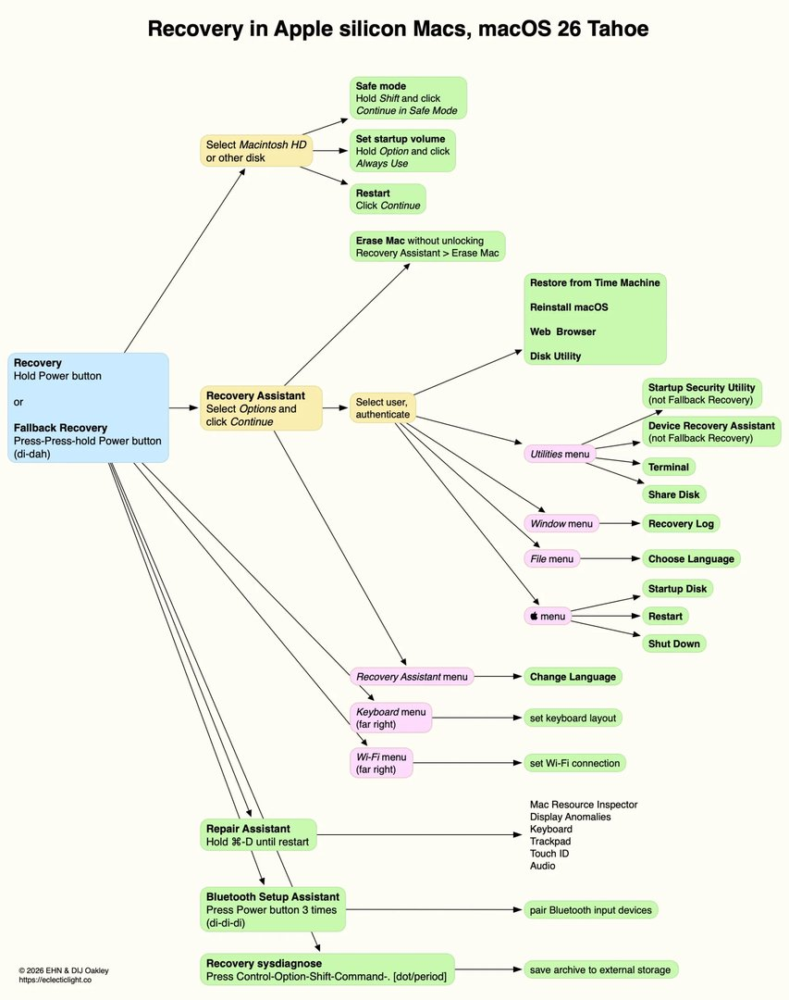
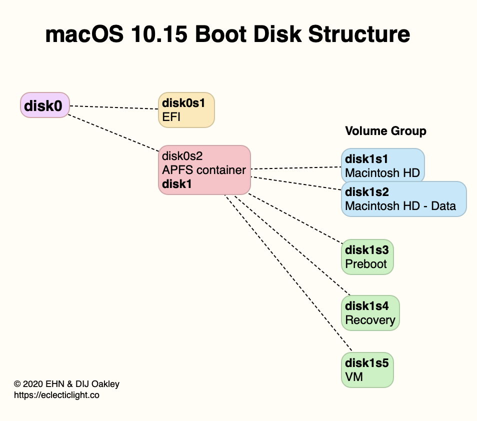
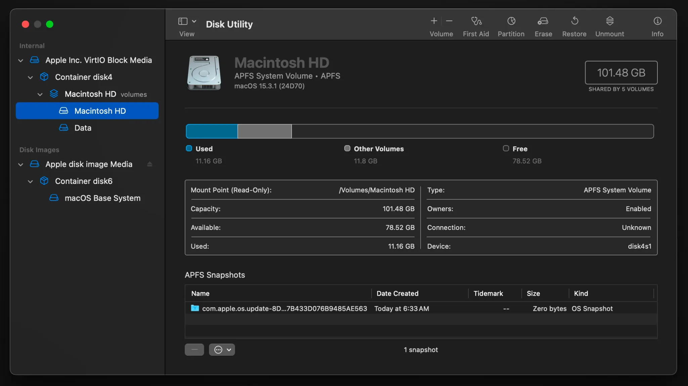
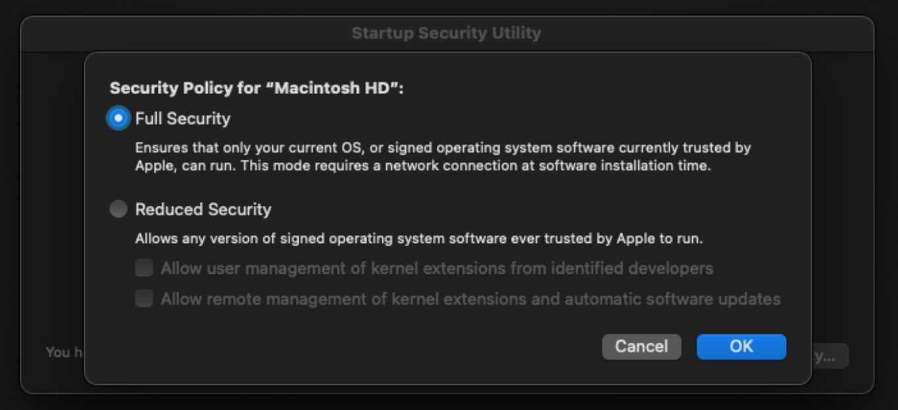

# שיעור 14: סביבת שחזור ומחיקה
**מדריך עזר לתלמיד**

## סקירה

<!-- פודקאסט NotebookLM מתוך Captivate -->

<iframe style="width: 100%; height: 200px;" frameborder="no" scrolling="no" allow="clipboard-write" seamless src="https://player.captivate.fm/episode/0b72cae7-af65-4c30-bf48-1086a4744e98/"></iframe>

## מושגי יסוד באדריכלות שחזור (Core Recovery Concepts)

- **1TR (One True Recovery):** במחשבי Apple Silicon, סביבת ההתאוששות (RecoveryOS) מופרדת לחלוטין ממערכת ההפעלה הרגילה ומאוחסנת בקונטיינר ייעודי. היא תוכננה להיות חסינה – גם אם תמחקו את הדיסק במלואו, ה-1TR שורד ומאפשר התקנה מחדש.
- **Fallback Recovery (frOS):** מנגנון "תוכנית גיבוי" ב-Apple Silicon. אם ה-1TR קורס, המק יעלה סביבת שחזור מינימלית יותר. מופעל על ידי לחיצה כפולה מהירה והחזקה (Di-dah) של כפתור ההפעלה.
- **Device Recovery Assistant (DRA) [חידוש ב-Tahoe]:** כלי אוטומטי המזוהה עם סמל חילוץ (⊕) שעולה עצמאית בעת כשלי Boot. הוא מבצע פתיחה של FileVault ותיקוני מערכת קבצים באופן אוטומטי לחלוטין.
- **DFU Mode (Device Firmware Update):** Recovery Mode חומרה ברמה הנמוכה ביותר למקרי קריסה מוחלטים. דורש Mac תקין נוסף, כבל USB-C, ו-Apple Configurator כדי לבצע החייאה (Revive) או שחזור (Restore).
- **EACS (Erase All Content and Settings):** כלי למחיקה מאובטחת ומיידית באמצעות "השמדה קריפטוגרפית" (Crypto-shredding). השמדת מפתח ה-VEK ב-Secure Enclave הופכת את המידע לרעש בלתי קריא בשניות, ללא דריסת תאים.
- **Activation Lock:** מנגנון נעילה נוגד גניבות (Find My). מקשר את ה-Mac ל-Apple Account. לאחר מחיקה, לא ניתן יהיה להפעיל את המק ללא אימות החשבון המקורי או קוד מעקף (Bypass Code).
- **סביבת השחזור (Recovery) Assistant:** הממשק הראשון שפוגשים ב-Recovery. תפקידו לאמת את זהותכם מול ה-Secure Enclave (סיסמת משתמש) כדי לפתוח את הנעילה של כונן הנתונים.
- **שיתוף כונן (Share Disk):** מחליף את Target Disk Mode בארכיטקטורת Apple Silicon. מאפשר לשתף את כונן המק ברשת או בכבל פיזי באמצעות פרוטוקול SMB.

---

## פקודות Terminal במצב שחזור (Terminal Commands in Recovery)

במצב שחזור, ה-Terminal הוא כלי אבחון עוצמתי.

### ניהול דיסקים ומערכת הקבצים – `diskutil`
- `diskutil list`: מציג את כל הכוננים הפיזיים והלוגיים במערכת, כולל מחיצות נסתרות כמו ה-1TR.
- `diskutil apfs list`: מציג פירוט מעמיק של קונטיינרים מסוג APFS, כולל ווליומים ומצב ההצפנה.

### אבחון וסיסמאות
- `resetpassword`: מזניק את האשף הגרפי לאיפוס סיסמאות.
- `recoverydiagnose`: (חידוש ב-macOS 26 Tahoe) פקודה המייצרת ארכיון דיאגנוסטיקה מקיף (לוגים, חומרה, APFS) לתוך כונן USB חיצוני להמשך ניתוח.

### תקינות רשת
- `ping -c 4 8.8.8.8`: וידוא שיש תקשורת חיצונית, הנדרשת להסרת Activation Lock ולהורדת מערכת הפעלה חתומה (SSV).

---

## Activation Lock והיבטים ארגוניים (Enterprise & MDM Context)

- **Activation Lock Bypass Code:** בארגונים (MDM), נוצר קוד עוקף מיוחד בשרת במעמד הרישום. במידה ועובד עזב כשהמק נעול, איש IT יכול להקליד את הקוד ב-Recovery Assistant תחת "Activate with MDM Key" כדי לשחרר את המכשיר בשרתי אפל.
- **MDM Remote Wipe (`EraseDevice`):** מנהל IT יכול לשלוח מרחוק פקודת מחיקה שמפעילה באופן שקט את ה-Crypto-shredding (EACS), ללא התערבות משתמש.
- **סביבת השחזור (Recovery) Lock:** פרופיל MDM המגדיר סיסמה (14 תווים) ברמת ה-Secure Enclave שחוסמת את עצם הכניסה למצב ההתאוששות (מחליף את סיסמת הקושחה ב-Intel).

---

## קישורים מומלצים ולקריאה נוספת

* [Use macOS Recovery on a Mac with Apple silicon](https://support.apple.com/guide/mac-help/use-macos-recovery-on-a-mac-with-apple-silicon-mchl82829c17/mac)
* [Revive or restore a Mac with Apple silicon using Apple Configurator](https://support.apple.com/guide/apple-configurator-mac/revive-or-restore-a-mac-with-apple-silicon-apdd5f3c75ad/mac)
* [Activation Lock for Mac](https://support.apple.com/en-us/102541)
* [Manage Activation Lock with a device management service](https://support.apple.com/guide/deployment/manage-activation-lock-depf4aba89d5/web)
* [An illustrated guide to Recovery on Apple silicon Macs](https://eclecticlight.co/2026/02/16/an-illustrated-guide-to-recovery-on-apple-silicon-macs-2-0/)
* [Erase All Content and Settings does what it says](https://eclecticlight.co/?s=Erase+All+Content+and+Settings)

## סרטון סיכום

<!-- סרטון סיכום מתוך YouTube -->

    <iframe width="100%" height="450" src="https://www.youtube.com/embed/DDXfEIRgAxs" frameborder="0" allow="accelerometer; autoplay; clipboard-write; encrypted-media; gyroscope; picture-in-picture" allowfullscreen></iframe>

!!! tip "המחשה ויזואלית (עזר לתלמיד)"
    תמונות אלו ממחישות את הממשק או המנגנון הרלוונטי לנושא השיעור.

