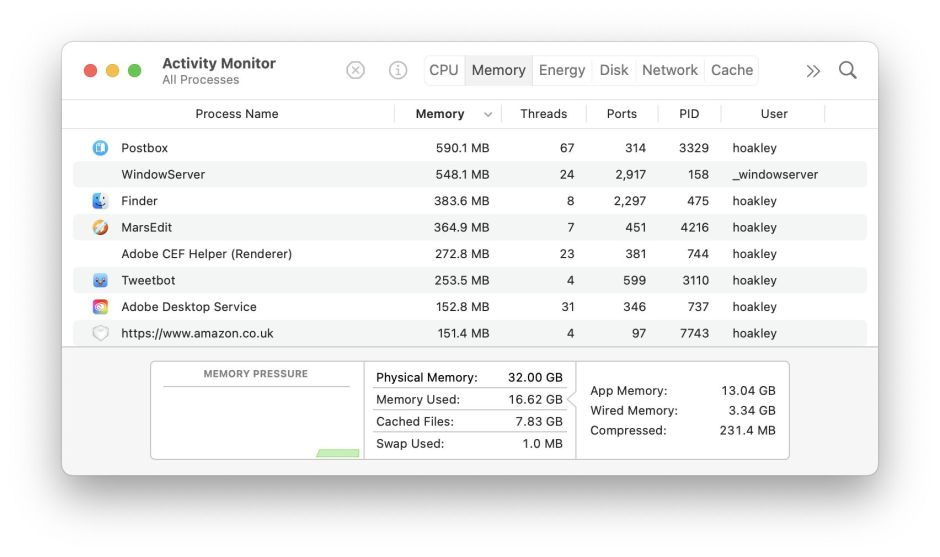
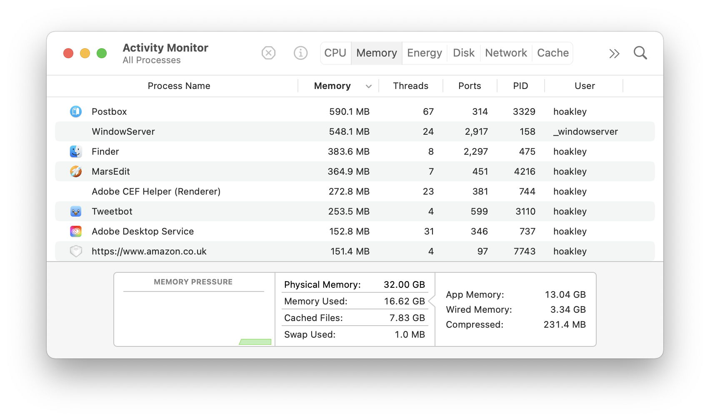
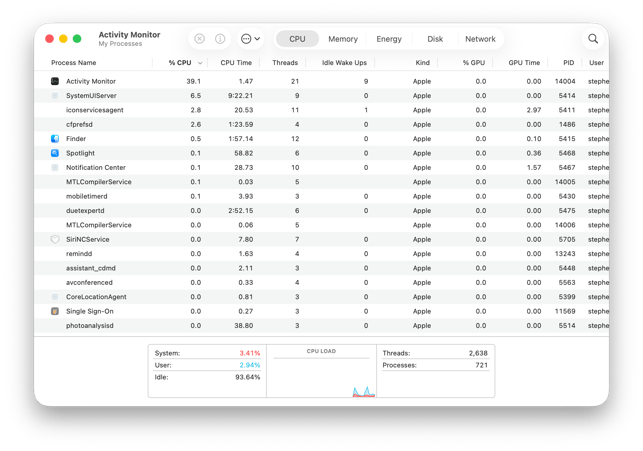
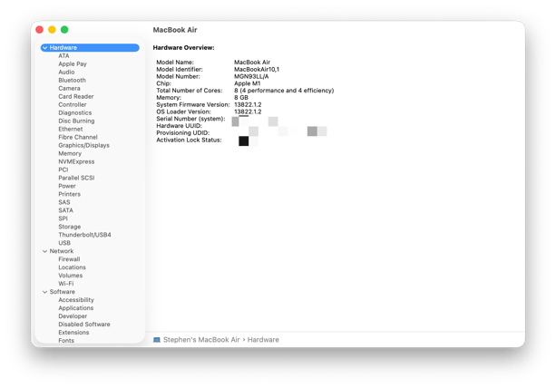

# Lesson 15: Diagnostics
**Learning Guide**

## Overview

<!-- NotebookLM Podcast from Captivate -->

<iframe style="width: 100%; height: 200px;" frameborder="no" scrolling="no" allow="clipboard-write" seamless src="https://player.captivate.fm/episode/1a3db037-3234-40d2-bcb4-7bb56b307bc4/"></iframe>

## Core Concepts & Methodologies

* **Isolation:** Apple's core troubleshooting strategy, aiming to cut the problem in half at every step to isolate the source:
  * **User vs. System:** Creating a new Test User to check if the issue exists only in the specific user's profile (preferences, their LaunchAgents) or if it's a System-wide problem.
  * **Software vs. Hardware:** Booting the computer into macOS Recovery or running Apple Diagnostics to rule out a hardware problem. If the problem doesn't occur in an alternate system, its source is software.
  * **Network vs. Client:** Connecting the Mac to another network (e.g., a phone Hotspot) to check if the issue is related to the organizational Firewall settings or the ISP.
* **Apple Diagnostics:** A firmware-integrated hardware diagnostic tool designed to test physical components such as RAM, fans, battery, and sensors. On Apple Silicon Macs, it's run from the Startup Options menu (long press the power button) and pressing `Command + D`.
* **Verbose Mode:** A boot mode (more relevant on Intel Macs with `Command + V`) that displays startup process text instead of the Apple logo. Today on Apple Silicon, it is mostly replaced by deep log checking after the system boots.
* **Activity Monitor & Console (A short history):** The Activity Monitor app started in 2003 (Mac OS X Panther) as a merger of the Process Viewer and CPU Monitor tools. Previously, the Console worked with simple text files, but starting in macOS Sierra in 2016, the system moved to the Unified Logging System - a binary, uniform log system that shows thousands of events per second.

!!! tip "Deep Dive 🤿: What Activity Monitor Actually Measures"
    On Apple Silicon Macs, the data in Activity Monitor is sometimes misleading and does not represent absolute physical hardware data:

    * **CPU %:** Can cross 100% (each core is counted as 100%), but the measurement doesn't reflect accurate physical load because of the asymmetric architecture (E-cores and P-cores).
    * **Energy Impact:** This is a relative algorithm-based Score, not a physical wattage number.
    * **Conclusion for IT:** Use these numbers only to find "Runaway Processes", not for surgical performance measurements. [Full article by Eclectic Light](https://eclecticlight.co/2026/06/29/what-does-activity-monitor-measure/)
* **App Memory Leaks:** A state where an application continuously consumes more and more memory without releasing it back to the system. This causes severe sluggishness on the Mac (the Beachball effect), but usually without increased fan noise (which characterizes CPU load). The solution is to monitor memory consumption in the Memory tab in Activity Monitor, and completely Quit the application. By contrast, Kernel Memory Leaks are much rarer and more severe, leading to a complete system crash (Kernel Panic). [Read more in Eclectic Light's article](https://eclecticlight.co/2026/06/19/what-can-you-do-when-an-app-uses-too-much-memory/)

## Safe Mode

Safe Mode is a powerful diagnostic tool that often solves problems simply by running it, as it cleans and resets system components.

**What happens when you boot the Mac in Safe Mode?**

* **Disk Check:** The system runs a logical check and repair of the startup disk using the `fsck` (File System Consistency Check) process.
* **Disabling Extensions:** Prevents loading of third-party Kernel Extensions (Kexts).
* **Blocking Background Processes:** Disallows LaunchDaemons and LaunchAgents of third-party apps from running. Only built-in system services are loaded.
* **Blocking Login Items:** Prevents automatic opening of windows and applications configured by the user.
* **Clearing Caches:** Temporarily deletes font caches, the Kernel cache, and System Caches, which often cause sudden software crashes.
* **Disabling Hardware Acceleration:** Disables graphics accelerators, which may cause the screen to flicker, the mouse to lag, or video not to play. This is normal and proves that Safe Mode is active.

**How to enter Safe Mode?**

* **Apple Silicon:** Shut down the Mac. Long press the power button until "Loading startup options" appears. Select the desired startup disk, long press the `Shift` key, and click "Continue in Safe Mode".
* **Intel:** Turn on the Mac and immediately long press the `Shift` key until the login window appears.

## The Terminal Toolkit (CLI Diagnostics)

A useful list of commands for technicians for deep investigation and system diagnostics.

### Comprehensive System Information (`system_profiler`)
This command is the terminal version of the System Information app, allowing you to export full hardware and software info.

* `system_profiler SPSoftwareDataType` - Displays macOS version, Build ID, kernel version, and Uptime.
* `system_profiler SPHardwareDataType` - Displays CPU info, number of cores, memory, Serial Number, and Hardware UUID.
* `system_profiler SPPowerDataType` - Displays battery data, including Cycle Count and Condition.
* `system_profiler > ~/Desktop/MacReport.txt` - Exports the complete and full report to a text file on the desktop to send to support.

### Advanced Network Quality Test (`networkQuality`)
A built-in command (since macOS Monterey) that checks not only download/upload speeds but also the network's ability to remain responsive under load (Responsiveness).

* `networkQuality` - Runs the standard test with parallel connections to Apple servers.
* `networkQuality -v` - Runs the test with Verbose details, including specific Latency metrics.
* `networkQuality -s` - Runs the network test sequentially instead of in parallel, a great tool for isolating data traffic issues.

### Querying the Log System (`log show`)
The Unified Logging System in macOS replaces old text files, requiring the use of the `log` command to pull accurate historical info.

* `log show --last 10m` - Shows all logs recorded in the last 10 minutes.
* `log show --predicate 'process == "kernel"' --last 1h` - Filters and displays only logs belonging to the main kernel process from the last hour.
* `log show --info --debug --last 5m > ~/Desktop/logs.txt` - Pulls temporary logs at the Info and Debug levels (which are not always saved to disk long-term) and exports them to a file for easy analysis.

### Enterprise Identity Diagnostics in Kerberos (`klist`)
In Active Directory-based enterprise environments, the Kerberos system is used for transparent authentication (SSO) to network services. This command helps check if the user actually received a "Ticket" from the server.

* `klist` - Displays the user's active Kerberos tickets list. If the list is empty, the user has no transparent permissions.
* `klist -v` - Displays all the extended (Verbose) information about the ticket, including start dates, expiration dates, and encryption type, to locate an expired ticket.

## Additional Communication Commands for Diagnostics and Isolation

* `ping -c 4 8.8.8.8` - Sends 4 data packets to Google servers to test basic internet connectivity and response times.
* `traceroute google.com` - Displays the packet routing path (Hops) from the Mac to the destination server, allowing you to locate where communication gets stuck within the enterprise network.
* `ifconfig` - Shows low-level technical info on physical network cards (MAC Addresses).
* `networksetup -listallhardwareports` - The easiest and most readable way to identify physical MAC addresses for all connection types on the system.

## Enterprise Seasoning (Enterprise Diagnostics)

* **Diagnosing with MDM Profiles:** Often, MDM security settings conflict with proper operation (e.g., USB block, Wi-Fi restriction). If an issue isn't resolved, an IT technician will consider temporarily removing the specific profile via System Settings > Privacy & Security > Profiles (provided it's not marked as non-removable) to isolate if it's causing the problem.
* **Bypassing Network Filtering:** In organizations using Content Filters / Proxies, isolating the issue is usually done by connecting the Mac to an external cellular network, to test whether the enterprise filter blocks traffic to Apple.
* **Removing Agents:** Disabling third-party security tools (such as Antivirus or DLP) that might crash and cause Kernel Panics or noticeable system slowdowns.

---

## Recommended Links and Further Reading
* [What can you do when an app uses too much memory](https://eclecticlight.co/2026/06/19/what-can-you-do-when-an-app-uses-too-much-memory/) - Diagnostic guide for handling memory-hogging apps (Memory Leaks).

* [Start up your Mac in safe mode](https://support.apple.com/en-us/116946) - Basic user guide on how to enter Safe Mode to check for issues.
* [Use Apple Diagnostics to test your Mac](https://support.apple.com/en-us/102550) - User guide on how to run the built-in diagnostic tool to find hardware faults.
* [Unified Logging (log command line tool)](https://developer.apple.com/documentation/os/logging) - Advanced documentation on Apple's Unified Logging System and reading them from the terminal.
* [If your Mac restarts and a message appears (Kernel Panics)](https://support.apple.com/en-us/102566) - Support guide explaining why the Mac crashes and restarts and how to locate the cause.
* [Identify your Mac hardware (System Information)](https://support.apple.com/en-us/102849) - How to use System Information to get technical data on computer components.

## Summary Video

<!-- Summary Video from YouTube -->

    <iframe width="100%" height="450" src="https://www.youtube.com/embed/DDXfEIRgAxs" frameborder="0" allow="accelerometer; autoplay; clipboard-write; encrypted-media; gyroscope; picture-in-picture" allowfullscreen></iframe>

!!! tip "Presentation Visuals (Student Aid)"
    These images illustrate the interface or mechanism relevant to the lesson topic.

