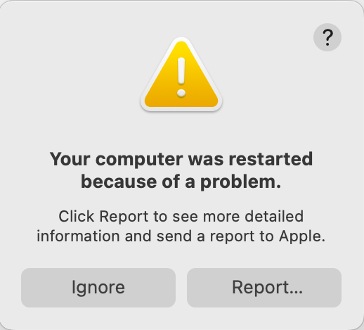
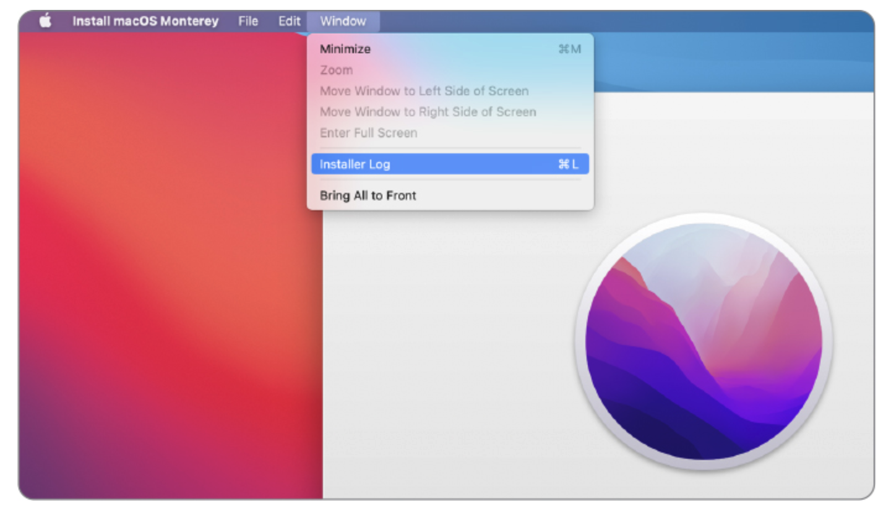
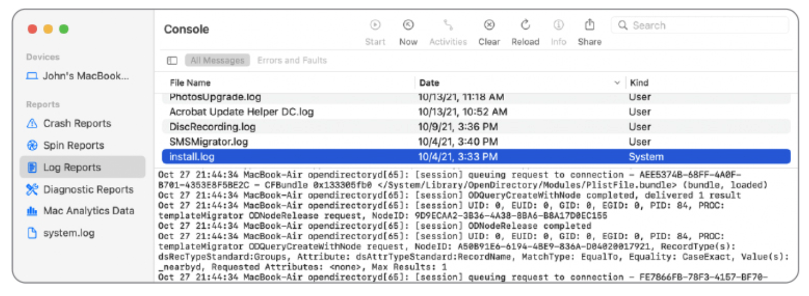

# Lesson 16: Log Analysis
**Student Learning Guide**

## Overview

<!-- NotebookLM Podcast from Captivate -->

<iframe style="width: 100%; height: 200px;" frameborder="no" scrolling="no" allow="clipboard-write" seamless src="https://player.captivate.fm/episode/8c719c94-f488-4b97-8408-77cc77048926/"></iframe>

## Glossary

* **Unified Logging System:** Apple's modern logging architecture that replaces legacy plain-text files (syslog). It stores data in a compressed binary format in memory and on disk, requiring dedicated tools (Console.app or `log`) for access. (Introduced in macOS Sierra 2016 to resolve log flooding and system slowdowns).
* **Console.app:** The built-in native macOS GUI application for viewing logs. Primarily designed for real-time live streaming or opening archive files (`.logarchive`). Many veteran admins feel this tool was "hijacked" since it no longer easily searches deep historical logs natively.
* **Subsystem:** A category or subsystem within an application that generates the log entry (e.g., `com.apple.mdm` or `com.apple.TimeMachine`). Essential for filtering noise during log investigations.
* **Process:** The executable file or daemon responsible for generating the log entry. Usually represented by the process name.
* **Sysdiagnose:** A comprehensive system diagnostic routine that aggregates hundreds of log files, configuration states, and local profiles into a single archive (`.tar.gz`). Critical for deep troubleshooting and vendor escalations (Apple Support or MDM providers).
* **Predicates:** Advanced filtering syntax that allows you to surgically extract specific log events from the thousands of lines written every second.
* **Volatile / Non-Volatile Logs:** Volatile logs reside in RAM and are purged upon reboot, whereas Non-Volatile logs are committed to the hard drive for persistent long-term storage.

---

## The `log` Command: Terminal Log Management & Diagnostics

While the `log` utility is the primary powerhouse for historical querying of the Unified Logging System (since Console.app focuses on live streams by default), we emphasize GUI workflows wherever possible. However, the terminal remains essential for specific log extraction.

!!! important
    Running `log show` without a filter can dump millions of lines and freeze your terminal. Always leverage `--last` or `--predicate` — a raw, unfiltered command is a rookie mistake.

### Basic Viewing & Time Filtering

* **`log show`**
  Dumps all logs persisted on disk (Warning: This can output millions of lines and lock up your session if unfiltered).

* **`log show --last 10m`**
  Retrieves logs generated in the last 10 minutes. (Use `h` for hours or `d` for days).

* **`log show --start "2026-06-18 09:00:00" --end "2026-06-18 09:30:00"`**
  Extracts logs from a precisely defined time window.

### Advanced Filtering with Predicates
The true power of `log show` lies in targeting specific processes, subsystems, or event payloads:

* **`log show --predicate 'process == "kernel"'`**
  Isolates logs generated exclusively by the macOS kernel.

* **`log show --predicate 'subsystem == "com.apple.TimeMachine"' --info`**
  Displays Time Machine backup activities, including informational events.

* **`log show --predicate 'eventMessage CONTAINS "error"'`**
  Searches for the keyword "error" within the body of the log message.

* **`log show --predicate 'processImagePath CONTAINS "mdmclient"'`**
  Locates all logs originating from the enterprise MDM daemon (excellent for diagnosing profile sync failures).

### Archive Management

* **`sudo log collect --last 1h`**
  Packages logs from the past hour into a `.logarchive` file, which can be securely transferred and analyzed on another Mac using Console.app.

* **`log erase`**
  Purges all historical logs stored on disk (requires root privileges).

---

## Generating & Analyzing a Sysdiagnose

> *→ Sysdiagnose was introduced in Lesson 15 (Diagnostics) as the ultimate payload for isolating faults — here we dive into unpacking it and reading its core logs.*

When battling severe system instability (kernel panics, random network drops, or stubborn MDM enrollment failures), capturing a Sysdiagnose is your first escalation step.

* **Generating Sysdiagnose via Terminal:**

  `sudo sysdiagnose -f ~/Desktop`
  Executes a full Sysdiagnose report and outputs the archive directly to your Desktop. This process takes a few minutes.

* **Generating Sysdiagnose via Keyboard Chord (No Terminal):**

  Pressing `Shift-Control-Option-Command-Period (.)` silently triggers a background Sysdiagnose. The screen will briefly flash as confirmation. The resulting file is saved to `/var/tmp/`.

* **Generating Sysdiagnose in macOS Recovery:**

  If the Mac refuses to boot, you can enter macOS Recovery, launch Terminal, and run `sysdiagnose`. The archive will be saved to an attached USB drive or the Data volume if accessible.

* **Getting Help and Flags:**

  `sysdiagnose -h`
  Displays the full manual, revealing flags for targeting specific data collections (e.g., isolating only Wi-Fi or networking telemetry).

---

## Resource Monitoring & Diagnostics (Activity & System Monitoring)

While the native graphical Activity Monitor suffices for typical users, IT engineers rely on advanced command-line tools to monitor real-time telemetry, especially when the GUI becomes unresponsive.

### CPU & Memory Telemetry (`top`)
The `top` command provides a live, continuously updating dashboard of system resource utilization.

* **`top`**
  Displays the process table and overall resource consumption (CPU, memory, load averages).

* **`top -u`**
  Sorts processes by CPU utilization in descending order (ideal for hunting down battery drains or runaway infinite loops).

* **`top -o mem`**
  Sorts processes by Memory Pressure footprint.

* *(Note: Press `q` to gracefully exit the live `top` dashboard).*

### File System Auditing (`fs_usage`)
An exceptionally powerful utility that intercepts and displays real-time system calls to the disk. Crucial when identifying applications triggering massive read/write storms that degrade performance (such as aggressive enterprise endpoint security or AV agents).

* **`sudo fs_usage`**
  Streams all file system I/O in real time (Warning: highly verbose).

* **`sudo fs_usage -w`**
  Expands the output so deep file paths are not truncated by the terminal window width.

* **`sudo fs_usage -f filesys ProcessName`**
  Surgically filters the stream to show only disk I/O from a specific process (Replace `ProcessName` with your target, e.g., `mdmclient`).

---

## Enterprise Spice: Hunting MDM Failures in Console.app

> *→ In Lesson 08 (Terminal) we demonstrated `log stream --predicate 'process == "mdmclient"'` — Console.app provides the exact same visibility natively in a graphical interface.*

When your MDM server pushes a configuration profile (e.g., an 802.1x payload for enterprise Wi-Fi) and it fails, extracting the error in Console.app requires precision.

1. Launch **Console.app**.
2. Click **Start** to initiate the live telemetry stream.
3. In the Search bar, type `apsd` or `mdmclient` and press Enter (ensure the filter tag is set to **Process** or **Any**).
4. Re-push the installation command from your MDM console.
5. Watch the local MDM agent spring into action. Scan for events highlighted in yellow (Fault) or red (Error) indicating Certificate Trust validation failures or firewall drops preventing reachability to Apple Push Notification servers (APNs on port 5223) or the MDM itself.

---

## Recommended Reading & Resources

* [View log messages and reports in Console on Mac](https://support.apple.com/guide/console/welcome/mac) - Apple's official guide for mastering the Console app.
* [A brief history of logs and Console](https://eclecticlight.co/2024/12/21/a-brief-history-of-logs-and-console/) - An excellent retrospective on the evolution of macOS logging from 2016 to the present.
* [How to find what you want in the log](https://eclecticlight.co/2021/11/04/how-to-find-what-you-want-in-the-log/) - A deep-dive professional guide on hunting for the needle in the macOS logging haystack.

## Summary Video

<!-- Summary Video from YouTube -->

    <iframe width="100%" height="450" src="https://www.youtube.com/embed/SYAGmWsJksQ" frameborder="0" allow="accelerometer; autoplay; clipboard-write; encrypted-media; gyroscope; picture-in-picture" allowfullscreen></iframe>

---

## Visual Aids

!!! tip "Visual Demonstration (Student Aid)"
    These images illustrate the relevant interface or mechanism for the lesson topic.

