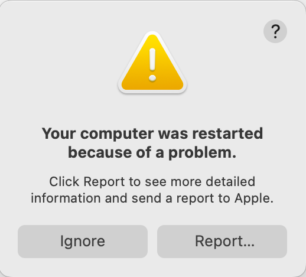

# חלק ג\': מדריך עזר לתלמיד - שיעור 16 (Logs & Sysdiagnose)

## 1. נושאי השיעור

*   **1.** **מערכת הלוגים (Unified Logging):** היכרות עם גישת הלוגים החדשה ב-macOS.
*   **2.** **אפליקציית Console:** סינון רעשים ואיתור שגיאות בזמן אמת.
*   **3.** **הפקת Sysdiagnose:** איסוף לוגים ודיאגנוסטיקה מלאה בממשק.
*   **4.** **חדר הבריחה:** תרגול מעשי באיתור שורת לוג מוסתרת לפתרון בעיות.

מסמך זה מרכז את כל המושגים, הפקודות ושיטות האבחון המתקדמות לניתוח הלוגים המודרניים ב-macOS 26 (Tahoe) ויצירת דוחות Sysdiagnose לפתרון תקלות מורכבות בסביבה הביתית והארגונית.

---

## מילון מושגים (Glossary)

* **Unified Logging System:** מערכת הרישום המודרנית של Apple המחליפה את קבצי הטקסט הישנים (syslog). המערכת שומרת נתונים בפורמט בינארי דחוס בזיכרון ובדיסק, ומחייבת שימוש בכלים ייעודיים (Console.app או `log`) לקריאתם. (הוצגה לראשונה ב-2016 עם macOS Sierra כדי לפתור בעיות של הצפת קובצי לוג והאטת המערכת).
* **Console.app:** האפליקציה הגרפית המובנית ב-macOS לצפייה בלוגים. מיועדת בעיקר לצפייה בזמן אמת (Live Streaming) או לפתיחת קבצי ארכיון של לוגים (`.logarchive`). משתמשים רבים מחשיבים אותה ככלי ש"נחטף" מהם כיוון שאינה מאפשרת יותר חיפוש יעיל אחורה בהיסטוריית הלוגים.
* **Subsystem:** קטגוריה או תת-מערכת של אפליקציה שמייצרת את הלוג (לדוגמה: `com.apple.mdm` או `com.apple.TimeMachine`). חיוני לסינון רעשים בחיפוש לוגים.
* **Process:** התהליך (קובץ ההרצה או ה-Daemon) שייצר בפועל את שורת הלוג. מיוצג לרוב על ידי שם קובץ ההרצה.
* **Sysdiagnose:** תהליך אבחון מערכתי שאוסף מאות קבצי לוג, תצורה, ופרופילים מקומיים אל תוך קובץ ארכיון אחד (tar.gz) לטובת ניתוח עומק של תקלות קריטיות (או לפתיחת כרטיס תמיכה מול Apple/ספק ה-MDM).
* **Predicates:** תחביר סינון מתקדם המאפשר לשלוף לוגים ספציפיים בלבד מתוך אלפי השורות הנכתבות מדי שנייה.
* **Volatile / Non-Volatile Logs:** לוגים רגילים שנשמרים בזיכרון ה-RAM (Volatile) ונמחקים בהפעלה מחדש, לעומת לוגים הנכתבים לדיסק הקשיח (Non-Volatile) לאחסון לטווח ארוך יותר.

---

## פקודות מסוף לניהול ואבחון לוגים (The `log` Command)

הפקודה `log` היא כלי העבודה המרכזי לתחקור היסטורי של ה-Unified Logging System, מכיוון ש-Console.app כברירת מחדל לא מציגה היסטוריה מלאה.

### צפייה בסיסית וסינון זמנים

* **`log show`**
  מציג את כל הלוגים השמורים בדיסק (פקודה זו עשויה להציג מיליוני שורות ולתקוע את המסוף אם לא תסונן).

* **`log show --last 10m`**
  הצגת כל הלוגים שנכתבו ב-10 הדקות האחרונות. (ניתן להשתמש ב-`h` לשעות או `d` לימים).

* **`log show --start "2026-06-18 09:00:00" --end "2026-06-18 09:30:00"`**
  הצגת לוגים מתוך חלון זמן ספציפי במדויק.

### סינון מתקדם באמצעות Predicates
הכוח האמיתי של `log show` הוא היכולת לסנן לפי תהליך, תת-מערכת או תוכן ספציפי:

* **`log show --predicate 'process == "kernel"'`**
  הצגת לוגים שנוצרו אך ורק על ידי הקרנל.

* **`log show --predicate 'subsystem == "com.apple.TimeMachine"' --info`**
  הצגת תהליכי גיבוי של Time Machine, כולל הודעות ברמת Info.

* **`log show --predicate 'eventMessage CONTAINS "error"'`**
  חיפוש של המילה "error" בתוך גוף הודעת הלוג.

* **`log show --predicate 'processImagePath CONTAINS "mdmclient"'`**
  איתור כל הלוגים שנוצרו על ידי תהליך ה-MDM הארגוני (מצוין לזיהוי בעיות סנכרון פרופילים).

### ניהול ארכיונים

* **`sudo log collect --last 1h`**
  איסוף לוגים מהשעה האחרונה אל תוך קובץ `.logarchive` שניתן לפתוח ולנתח במחשב אחר בעזרת Console.app.

* **`log erase`**
  מחיקת כל הלוגים ההיסטוריים שנשמרו בדיסק (דורש הרשאות שורש).

---

## יצירת וניתוח Sysdiagnose

כאשר מתמודדים עם תקלות מערכת עמוקות (קריסות Kernel, ניתוקי רשת רנדומליים, או תקלות התקנת MDM שאינן נפתרות), הפקת Sysdiagnose היא השלב הראשון באסקלציה.

* **יצירת Sysdiagnose דרך המסוף:**

  `sudo sysdiagnose -f ~/Desktop`
  מייצר דוח Sysdiagnose מלא ושומר אותו ישירות לשולחן העבודה. התהליך לוקח מספר דקות.

* **יצירת Sysdiagnose באמצעות מקלדת (ללא מסוף):**

  הקשה על השילוב `Shift-Control-Option-Command-Period (.)` מפעילה יצירת Sysdiagnose ברקע. המסך יהבהב לרגע כאישור. הקובץ יישמר בנתיב: `/var/tmp/`.

* **יצירת Sysdiagnose בתוך macOS Recovery:**

  במידה והמחשב לא עולה, ניתן להיכנס ל-Recovery, לפתוח את ה-Terminal, ולהקיש `sysdiagnose`. הקובץ יישמר על התקן USB מחובר או בכונן ה-Data במידה ויש גישה אליו.

* **קבלת עזרה והגדרות נוספות:**

  `sysdiagnose -h`
  מציג את תפריט העזרה המלא, בו ניתן למצוא דגלים לאיסוף מידע ספציפי (למשל רק מידע הקשור לרשת או ל-Wi-Fi).

---

## פקודות אבחון וניטור משאבים (Activity & System Monitoring)

בעוד ש-Activity Monitor הגרפי מצוין לרוב המשתמשים, אנשי תמיכה משתמשים בכלים מתקדמים בשורת הפקודה כדי לנטר פעילות בזמן אמת, במיוחד כשהממשק הגרפי קופא.

### ניטור מעבד וזיכרון (`top`)
הפקודה `top` מספקת תצוגה חיה ומתעדכנת של ניצול המשאבים.

* **`top`**
  מציג את טבלת התהליכים וניצול המשאבים הכללי (מעבד, זיכרון, עומס מערכת).

* **`top -u`**
  ממיין את התהליכים לפי צריכת ה-CPU שלהם מהגבוה לנמוך (מצוין לאיתור "זוללי סוללה" או תהליכים שתקועים בלולאה אינסופית).

* **`top -o mem`**
  ממיין את התהליכים לפי שימוש בזיכרון (Memory Pressure).

* *(הערה: כדי לצאת מהתצוגה החיה של `top`, יש להקיש על האות `q`).*

### מעקב אחר מערכת הקבצים (`fs_usage`)
כלי חזק במיוחד המציג בזמן אמת את קריאות המערכת (System Calls) לדיסק. מצוין למקרים בהם אפליקציה מבצעת פעולות כתיבה מרובות שגורמות להאטה (כמו אנטי-וירוסים ארגוניים).

* **`sudo fs_usage`**
  מציג את כל הפעילות של מערכת הקבצים בזמן אמת (זהירות - מציג המון מידע רץ).

* **`sudo fs_usage -w`**
  מרחיב את התצוגה כך שהנתיבים יוצגו במלואם מעבר למגבלת רוחב החלון.

* **`sudo fs_usage -f filesys ProcessName`**
  מסנן את הפעילות ומציג אך ורק קריאות דיסק של תהליך ספציפי (החלף את `ProcessName` בשם התהליך, למשל `mdmclient`).

---

## תיבול ארגוני: זיהוי תקלות MDM ב-Console
כאשר שרת ה-MDM דוחף פרופיל הגדרות (למשל הגדרות 802.1x ל-WiFi ארגוני) והתהליך נכשל, חיפוש שגיאות פשוט ב-Console.app דורש מיקוד.

1. פתחו את **Console.app**.
2. התחילו **Start** (איסוף לוגים חי).
3. בשורת החיפוש (Search), הקלידו `mdmclient` ולחצו Enter (וודאו שהוא מוגדר כ-**Process** או **Any**).
4. שלחו מחדש את פקודת ההתקנה מה-MDM.
5. כל הפעולות של סוכן ה-MDM המקומי יופיעו. חפשו שורות המסומנות בצהוב (Fault) או אדום (Error) שמעידות על שגיאת תעודות (Certificate Trust) או חסימת פיירוול שמונעת גישה לשרת.

---

## קישורים מומלצים ולקריאה נוספת

* [View log messages and reports in Console on Mac](https://support.apple.com/guide/console/welcome/mac) - המדריך הרשמי לשימוש באפליקציית ה-Console לקריאת לוגים במק.
* [A brief history of logs and Console](https://eclecticlight.co/2024/12/21/a-brief-history-of-logs-and-console/) - סקירה מעניינת על האבולוציה של הדרך בה נשמרו הלוגים במק מ-2016 ועד היום.
* [How to find what you want in the log](https://eclecticlight.co/2021/11/04/how-to-find-what-you-want-in-the-log/) - מדריך מקצועי למתקדמים שמסביר איך באמת למצוא את מה שמחפשים בתוך ים הלוגים של מערכת ההפעלה.

## 💡 עזרים ויזואליים להרצאה (Presentation Visuals)

> [!TIP]
> **שימוש למדריך:** תמונות אלו ניתנות להקרנה בכיתה בעת הסבר על הנושא, או לשילוב במצגות.

